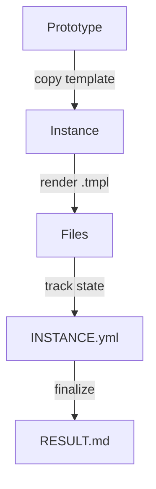

# MOOLLM

**A microworld operating system for LLM agents.**

---

## The Problem

You can't see inside an LLM agent. It claims to "remember" but you can't inspect that memory. It "plans" but you can't read those plans. It crashes when data is missing. You debug by guessing.

**This is insane.**

## The Vision

**The filesystem is a microworld.** Not just storage — a *place* to explore.

Directories are **rooms** you enter and exit. Files are **objects** you examine and use. Characters are **trading cards** you summon into rooms. The agent doesn't just read files — it *navigates a memory palace*, goes on *adventures*, collects an **inventory**, talks to *characters*, learns **skills**, and builds *mind maps* as it learns.

```
You are in the Research Library.
Exits: [north: archives/] [east: experiments/] [up: ../]
Objects: hypothesis.yml, evidence/, the-skeptic-card.yml
> SUMMON the-skeptic
> The Skeptic materializes, arms crossed.
> "Show me your evidence."
```

And because it's all files — you can *see* everything. Open `hot.yml` to see what's loaded. Read `PLAN.yml` before it runs. Replay the adventure in `session-log.md`. The magic is inspectable.

## The Lineage

This isn't invented from nothing. MOOLLM stands on decades of work in **constructionist computing**:

**Seymour Papert & Alan Kay** — The original vision: computers as instruments for learning by building. Logo microworlds where children construct knowledge by making things they can inspect and modify. "Low floor, high ceiling, wide walls."

**Don's Logo Adventure (C64)** — As a teenager, Don built a simple [adventure game](https://medium.com/@donhopkins/logo-adventure-for-c64-terrapin-logo-81c679e715f6) for Commodore 64 Terrapin Logo that used the Logo command interpreter as its parser. Type `N`, `S`, `E`, `W` to move. Type `LOOK`, `GET SWORD`, `EXAMINE WAND`, `INVENT`. But you *also* had full Logo available. Tempted to cheat? Type `PRINT :RNUM` to see your room number. Type `PRINT :ITEMS` to see every item and its location. Type `MAKE "RNUM 5` to teleport to the secret incanting room. **If you cheat, you win by learning Logo.** This is constructionism: the game rewards curiosity with programming skills. MOOLLM is the same — poke around in the YAML, manipulate the state directly, learn by exploring.

**Will Wright & Don Hopkins — SimCity, The Sims** — Object-oriented worlds where things and people advertise what they can do, autonomous agents select actions based on needs, and emergent behavior arises from simple rules. Don's work on [SimAntics](https://en.wikipedia.org/wiki/SimAntics) (The Sims' behavioral engine) and [Pie Menus](https://en.wikipedia.org/wiki/Pie_menu) directly informs MOOLLM's object/room/action model.

**[Micropolis](https://medium.com/@donhopkins/micropolis-constructionist-educational-open-source-simcity-58566f20f063) (OLPC)** — Don's open source adaptation and multi-user interface design of SimCity for Linux and the One Laptop Per Child project, built with Alan Kay and Seymour Papert's constructionist education principles. The city as microworld. Kids can open it up, see how it works, script robots in Python, write newspaper articles about city events, vote on proposals. Alan Kay's criticism of SimCity was that "you can't see inside of it" — Micropolis fixes that. MOOLLM applies the same philosophy to LLM agents: the filesystem as microworld, everything totally inspectable and editable by people, scripts, and LLMs.

**Micropolis + MOOLLM = The Dream Realized.** Embed a Micropolis game in a MOOLLM room:

```
cities/downtown/
├── ROOM.yml           # Room metadata, links to simulator
├── city.save          # Micropolis save file
├── state.yml          # Extracted game state: population, budget, zones
├── views/             # Rendered map images, charts, overlays
├── newspaper/         # Generated stories about city events
├── advisors/          # Characters: traffic-expert.card, economist.card
└── session-log.md     # Who did what, human and LLM alike
```

A sister script runs Micropolis headless: advance N ticks, inject edits, render views to files. The LLM reads `state.yml`, examines `views/`, and *plays the game* — or mediates multiple humans playing together. Web interface publishes live views alongside chat. Humans and LLMs draw on the same map with the same tools, interleaved. Advisor characters analyze the city and give feedback. The virtual newspaper writes stories about citizens, traffic jams, tax revolts, monster attacks. **Constructionist education, fully realized.**

**Bill Atkinson — HyperCard** — Stacks, cards, buttons, message passing. Non-programmers building interactive systems in 1987. The dream of end-user programming that MOOLLM inherits.

**Arthur van Hoff & Don — [HyperLook](https://medium.com/@donhopkins/simcity-cellular-automata-and-happy-tool-for-hyperlook-nee-hypernews-nee-goodnews-4b7cadf8f514)** — HyperCard for NeWS (Sun's PostScript window system), using PostScript for graphics, scripting, AND data. Property sheets were HyperLook stacks — the system edited itself. SimCity ran on HyperLook, and you could edit its UI *while it was running*. Copy a live city view, paste it into a cellular automata machine, melt it, paste the result into a clock face. Everything plugged into everything. MOOLLM inherits this: YAML files are both data and configuration, skills edit themselves, everything is inspectable and composable.

**Dave Ungar — Self** — Prototypes over classes. Clone and modify beats rigid inheritance. "It's About Time" — compile when understanding crystallizes, not when code gets hot.

**Dave Ackley — Robust-First Computing** — Survivability over correctness. Local repair. The [Movable Feast Machine](https://www.cs.unm.edu/~ackley/mfm/). MOOLLM's self-healing comes directly from this.

**Marvin Minsky — [Society of Mind](https://en.wikipedia.org/wiki/Society_of_Mind)** — Intelligence emerges from societies of simple agents. K-lines: names that activate conceptual clusters (type "BPIP" and invoke an entire tradition). Frames: structured expectations with defaults and slots. Agents, agencies, and the "bugs" that Papert's children debugged. The mind as a bureaucracy of mindless clerks. MOOLLM's protocol symbols ARE K-lines; rooms ARE frames; characters ARE agents in a society.

> *"If you can build it, you can understand it. If you can inspect it, you can trust it."*

## Why It's Powerful

**MOOLLM is bash for the LLM age.**

People joke online: *"What if the shell were an adventure game?"* **This is that. And it's not a joke.**

Unix gave us composable processes: `cat file | grep pattern | sort`. Pipes, streams, small tools that do one thing well.

MOOLLM gives us composable *characters*: summon The Architect, pipe their output to The Critic, collect results in a room. Characters are apps. Rooms are environments. Cards are commands. The chat IS the shell. `cd` is literally `GO NORTH`. `ls` is literally `LOOK`. `cat` is literally `EXAMINE`.

```
> SUMMON architect INTO design-room WITH goal="API structure"
> SUMMON critic INTO design-room WITH focus="security"
> architect | critic | SAVE decisions.yml
> EXIT design-room
```

| Unix | MOOLLM |
|------|--------|
| Process | Character (card in play) |
| Pipe | Speed-of-light messaging |
| File | Object in room |
| Directory | Room |
| Shell | Chat command language |
| `man page` | SKILL.md + PROTOTYPE.yml |

**Compose personalities like you compose commands.**

## Extreme Parallelism

Forget the ChatGPT model: one user, one assistant, one turn at a time.

MOOLLM runs **many conversations simultaneously**:

```
design-debate.md      — Architect vs Critic, 5 exchanges
security-review.md    — 3 reviewers examining code  
api-discussion.md     — Frontend and Backend negotiating
user-research.md      — Personas debating features
```

**All in ONE LLM call.** Each chat is a file. Each file has multiple speakers. Each speaker takes multiple turns. The LLM simulates all of them *in parallel*, at the speed of thought.

```yaml
# One LLM epoch can contain:
conversations: 4
speakers_per_conversation: 2-5
turns_per_speaker: 3-10
total_simulated_interactions: 50+
llm_calls: 1  # ← THIS IS THE POINT
```

This is how The Sims works: one frame updates ALL Sims simultaneously. MOOLLM applies this to LLM agents. No carrier pigeons. No file I/O between turns. Pure in-context simulation.

## Multi-User: It's a MUD, Remember?

Slap a web server on it. **Publish any chat as a live stream.**

```
https://your-moollm.example/rooms/design-debate/
https://your-moollm.example/characters/the-architect/thoughts/
https://your-moollm.example/sessions/current/log/
```

Every character's chain of thought, every room's state, every conversation — it's all files. Files can be served. Markdown renders in browsers. YAML structures surface as **interactive controls**:

```yaml
# This YAML in a file...
vote:
  question: "Ship the API?"
  options: [yes, no, needs_review]
  deadline: 2025-01-04T18:00:00Z
```

...becomes buttons in a browser. Click to vote. The file updates. The LLM sees the votes next turn.

**Multi-user for free:** Multiple humans can edit the same files. Git handles conflicts. The LLM sees all changes. No special "collaboration protocol" needed — just files, served over HTTP, edited by anyone with access.

**Or embed it in a data flow network like [Kilroy](./designs/kilroy-ideas.md).** MOOLLM rooms become nodes. Characters become pipeline stages. YAML files are the messages flowing between them. Small specialized LLMs handle specific tasks; big LLMs orchestrate. The visual pipeline editor *is* the room layout. Chuck Shotton's vision and MOOLLM's architecture dovetail perfectly.

This is what LambdaMOO was. This is what HyperLook was. This is what Kilroy will be. The wheel turns.

## Hybrid Processing: LLMs + Deterministic Code

YAML files with schemas aren't just for LLMs to read — they're for **Python to transform**.

```
┌─────────────┐    ┌──────────────┐    ┌─────────────┐
│   LLM       │───▶│   Python     │───▶│   LLM       │
│ (reasoning) │    │ (transform)  │    │ (synthesis) │
└─────────────┘    └──────────────┘    └─────────────┘
     ↓                   ↓                   ↓
 decisions.yml    sorted_ranked.yml    summary.md
```

**Let each do what it's good at:**

| Task | Best Tool | Why |
|------|-----------|-----|
| "Which options matter?" | LLM | Judgment, context |
| Sort by priority score | Python | Deterministic, fast |
| Aggregate 50 files | Python | No token cost |
| Validate against schema | Python | Exact, reliable |
| "What does this mean?" | LLM | Interpretation |
| Calculate statistics | Python | Precise math |

**It's a waste of an LLM to grep.** But it can *call* grep and *interpret* the results. LLMs reason about what to search for, read what comes back, decide what it means. The searching itself? That's `grep`. Fast. Free. Deterministic.

**PLAY-LEARN-LIFT develops schemas AND skills by example:**

```yaml
# PLAY: Create instances manually
decisions/
  api-choice.yml      # ← You write this by hand
  database-choice.yml # ← And this
  auth-choice.yml     # ← Pattern emerges...

# LEARN: LLM notices the pattern
"I see these all have: options[], criteria[], chosen, rationale"

# LIFT: LLM enthusiastically writes the script
decision_ranker.py   # Sorts by weighted criteria
decision_validator.py # Checks required fields
decision_summarizer.py # Aggregates across files
```

**Schemas AND skills emerge from instances.** You don't design upfront — you PLAY with examples, the LLM LEARNs the pattern, then LIFTs it into reusable automation:

- **Schemas** → `decision-schema.yml` (data shape)
- **Skills** → `skills/decision-maker/` (SKILL.md + PROTOTYPE.yml + scripts)
- **Sister scripts** → `decision_ranker.py` (deterministic automation)

The LLM *writes* the Python. Then it *calls* the Python. Best of both worlds.

**The Kilroy vision:** Complex tasks decompose into data flow networks — LLMs for reasoning, deterministic modules for transformation. MOOLLM's YAML schemas make this composable.

## What's Different

**Adventures, not workflows.** Debugging isn't a "task" — it's an expedition into the Auth Dungeon. You gather clues, interrogate suspects (files), and solve mysteries. The session log reads like a story.

**Memory palaces, not flat storage.** Organize by meaning: Treasury for important decisions, Library for research, Catacombs for archived experiments. Navigate spatially. Remember by location.

**Characters that speak.** Summon The Skeptic to challenge your hypothesis. Let README.md introduce itself. Have two documents debate. Everything with a soul can have a voice.

**Cards you play.** Capabilities are trading cards — clone them into rooms, give them parameters, let them run. The same card can be active in multiple rooms simultaneously, each instance with its own state.

**YAML Jazz.** Comments carry meaning. `timeout: 30 # generous, API flaky on Mondays` — the LLM reads that comment and understands *why*.

**Hero-Stories — Ethical skill composition from real people.**

Real people are in the training data. Their ideas, their style, their expertise. MOOLLM lets you *invoke* that coherently:

```yaml
# dave-ungar.card — A Hero-Story
name: "Dave Ungar"
tradition: ["Self language", "prototypes", "ITS-ABOUT-TIME"]
skills: ["prototype-design", "optimization-philosophy", "simplicity"]
invoke_as: "the tradition of" # NOT "speaking as"
```

Summon the *Dave Ungar tradition* into your design room. It brings Self-style thinking, prototype patterns, "It's About Time" philosophy. You're not pretending to be Dave — you're activating a coherent skill set that he pioneered.

**Compose skill sets like unix pipes:**
- `papert-tradition | kay-tradition` → constructionist messaging
- `ackley-robustness + ungar-simplicity` → survivable prototypes
- `minsky-k-lines` → the meta-level that makes this all work

**Characters as CLI apps.** Every character has:
- `SKILL.md` — the man page (what it does, when to use it)
- `PROTOTYPE.yml` — the interface (inputs, outputs, commands)
- `template/` — state files it creates when instantiated

**Hero-Stories spawn familiars.** A card for "Dave Ungar" can explain Self and prototypes directly. But it can also *launch pets* that embody specific skills:

```
> SUMMON dave-ungar
Dave Ungar's tradition activates. I brought friends:
  🦎 Proto-Lizard — prototype patterns, clone-and-modify
  ⏰ Time-Keeper — "It's About Time" optimization  
  🪞 Mirror-Mouse — reflection and introspection

> SUMMON proto-lizard
Proto-Lizard materializes.
"Need to add behavior without subclassing? Let me show you..."
```

**Imagine `gcloud` as a menagerie:**

| Instead of... | Summon... | Who says... |
|---------------|-----------|-------------|
| `gcloud compute instances list` | 🖥️ Compute Crab | "Here are your instances. Want me to explain the pricing?" |
| `gsutil cp -r` | 🪣 Bucket Badger | "Copying recursively. Watch out for that folder with 10k files..." |
| `gcloud auth login` | 🔐 Auth Owl | "Let's get you authenticated. First time? I'll walk you through it." |

**Pets ARE subcommands** — with personality, built-in help, tutorials, and context. They remember your last interaction. They warn you about gotchas. They're CLI tools you can *talk to*.

Sister scripts emerge: chat patterns that work get automated. The slow LLM exploration becomes fast shell execution. PLAY → LEARN → LIFT.

> [!TIP]
> **New here?** The [3-minute Quickstart](./QUICKSTART.md) covers everything above in depth.

---

## TL;DR

| What | How |
|------|-----|
| Memory | Files in `working_set.yml` |
| Audit | Append-only `session-log.md` |
| Planning | YAML task trees |
| Recovery | Self-healing on missing state |

> *The LLM is a token predictor. The filesystem is the brain. The protocols are the cognitive style.*

---

## 🗺️ Navigate the Palace

This repository IS a memory palace. Each directory is a room.

| Room | What Lives There | Explore |
|------|------------------|---------|
| **kernel/** | OS protocols — the basement | [Enter →](./kernel/) |
| **skills/** | Userland protocols — the main floor | [Enter →](./skills/) |
| **schemas/** | Data shapes — the vault | [Enter →](./schemas/) |
| **designs/** | Historical archives — the attic | [Enter →](./designs/) |

### Featured Skills

| Skill | Purpose | Go |
|-------|---------|-----|
| 🎴 **trading-card/** | Capabilities as instantiable cards | [→](./skills/trading-card/) |
| 🚪 **room/** | Directories as activation contexts | [→](./skills/room/) |
| 💬 **soul-chat/** | Everything speaks | [→](./skills/soul-chat/) |
| 🎮 **play-learn-lift/** | The methodology | [→](./skills/play-learn-lift/) |
| 🔄 **self-repair/** | Never crash, always repair | [→](./skills/self-repair/) |
| 📋 **plan-then-execute/** | Frozen plans with human approval | [→](./skills/plan-then-execute/) |

---

## Architecture

```
moollm/                        # 🏰 The Palace
├── README.md                  # You are here
├── QUICKSTART.md              # 3-minute overview
├── PROTOCOLS.yml              # Symbol index (K-lines)
│
├── kernel/                    # 🔧 Infrastructure
│   ├── constitution-core.md   # Universal principles
│   ├── tool-calling-protocol.md
│   ├── self-healing-protocol.md
│   └── drivers/               # Orchestrator adapters
│
├── skills/                    # 🎭 Capabilities
│   ├── room/                  # Spatial programming
│   ├── trading-card/          # Instantiable cards
│   ├── soul-chat/             # Entity dialogues
│   └── ...
│
├── schemas/                   # 📐 Data formats
│   └── *.yml
│
└── designs/                   # 📜 Archives
    └── *.md
```

---

## Core Principles

### FILES-AS-STATE

Everything is files. No hidden memory. If it's not in a file, it doesn't exist.

```yaml
# Session state lives here:
.agent/
  sessions/current/
    session-log.md      # Append-only audit
    working_set.yml     # What's in context
    hot.yml             # Keep loaded
    cold.yml            # Can evict
```

### YAML-JAZZ

> *"Start with jazz, end with standards."*

Comments carry meaning. LLMs interpret, not just parse.

```yaml
config:
  timeout: 30  # Generous because the API is flaky on Mondays
  retries: 3   # Based on observed failure patterns in prod
  # TODO: Add circuit breaker after next outage
```

The comments above aren't decoration — they provide context that structured fields cannot capture.

### WHY-REQUIRED

Every tool call explains its intent:

```yaml
fs.read:
  path: "src/parser.ts"
  why: "Check if recursive descent handles nested expressions"
```

Self-documenting traces. Improved coherence. Post-hoc analysis.

### NEVER-CRASH

> [!IMPORTANT]
> Missing state triggers **repair**, not failure.

- Missing file → create minimal stub
- Corrupted state → rename `.corrupted`, create fresh
- Over budget → truncate lowest priority
- Unknown input → BPIP (assume good faith)

---

## Protocol Symbols (K-Lines)

Wikipedia-style keywords that activate conceptual clusters. Type as commands or reference in docs.

| Symbol | Meaning |
|--------|---------|
| `FILES-AS-STATE` | Everything is files. No hidden memory. |
| `YAML-JAZZ` | Comments carry meaning. Data is interpreted. |
| `WHY-REQUIRED` | Every tool call needs a `why` parameter. |
| `APPEND-ONLY` | Never modify logs. Audit trail is sacred. |
| `NEVER-CRASH` | Missing state triggers repair, not failure. |
| `BPIP` | Best Possible Interpretation. Assume good faith. |
| `PLAY-LEARN-LIFT` | Explore → find patterns → share wisdom. |
| `ROOM-AS-FUNCTION` | Enter room = call function. Exit = return. |
| `SPEED-OF-LIGHT` | Many agents in one LLM call. No carrier pigeons. |
| `P-HANDLE-K` | Safe human referencing via K-line activation. |

Full index: **[PROTOCOLS.yml](./PROTOCOLS.yml)**

---

## Capability Tiers

| Tier | Capabilities | Example Orchestrators |
|------|-------------|----------------------|
| 0 | Text only | Basic chat |
| 1 | File read | Most UIs |
| 2 | File read/write | IDEs |
| 3 | + Search | Cursor, Claude Code |
| 4 | + Execution | Cursor, Claude Code |
| 5 | + Custom tools (MCP) | Claude Code |
| 6 | + Full kernel control | Custom |

Protocols degrade gracefully. At Tier 1, `why` is convention. At Tier 6, it's enforced.

---

## Skill System

Skills are **protocols the model follows**, not code the orchestrator runs.

### Structure

```
skills/memory-palace/
├── README.md         # Human entry point
├── SKILL.md          # Protocol documentation
├── PROTOTYPE.yml     # Machine definition
└── template/         # Files to copy on instantiation
    ├── MAP.yml.tmpl
    └── ROOM.md.tmpl
```

### Instantiation



1. Copy template to session directory
2. Render `.tmpl` files with context variables
3. Create `INSTANCE.yml` tracking state
4. Mark status: `active` → `finalized` | `abandoned`

---

## Philosophical Foundation

### The Anti-Magic Principle

> [!CAUTION]
> No hidden scratchpad. No mystical "planning module." No persistent memory the user can't inspect. **If it's not in a file, it doesn't exist.**

<details>
<summary><strong>🔍 Influences (click to expand)</strong></summary>

| System | Contribution | In MOOLLM |
|--------|--------------|-----------|
| **[The Sims][sims]** | Object advertisements, autonomous selection | Files advertise capabilities |
| **[HyperCard][hypercard]** | Stacks/cards, message delegation | Rooms, leaf-to-root dispatch |
| **[Self][self]** | Prototype-based inheritance | Cards, delegation chains |
| **[MUD][mud]** | Multi-user dungeon, 1978 | Rooms, inventory, adventures |
| **[LambdaMOO][moo]** (Pavel Curtis) | Rooms, objects, verbs, spatial programming | Room directories, object delegation |
| **[MFM][mfm]** | Robust-first, local repair | Self-healing demons |
| **[Logo][logo]** | Constructionism, microworlds | Filesystem as microworld |
| **LLOOOOMM** | YAML Jazz, familiars | Semantic comments, K-lines |
| **[Kilroy][kilroy]** | Decentralized swarms | Speed-of-light simulation |

[sims]: https://en.wikipedia.org/wiki/SimAntics
[hypercard]: https://en.wikipedia.org/wiki/HyperCard
[self]: https://selflanguage.org/
[mud]: https://en.wikipedia.org/wiki/MUD1
[moo]: https://en.wikipedia.org/wiki/LambdaMOO
[mfm]: https://www.cs.unm.edu/~ackley/mfm/
[logo]: https://en.wikipedia.org/wiki/Logo_(programming_language)
[kilroy]: ./designs/kilroy-ideas.md

</details>

### Format Hierarchy

| Format | Use For | Why |
|--------|---------|-----|
| **Markdown** | Logs, docs, conversations | Human-readable, embeds code blocks |
| **YAML** | Config, state, parameters | Has comments! Semantic. Editable. |
| **JSON** | Machine interchange only | No comments. Last resort. |

---

## Goals

MOOLLM aims to:

1. **Auditable**: Every action leaves a file trace
2. **Inspectable**: No hidden state
3. **Portable**: Works on any orchestrator with file tools
4. **Composable**: Prototype inheritance over class hierarchies
5. **Robust**: Self-healing through local repair

The end state: an LLM that navigates its own memory, follows explicit protocols, recovers from corruption, and explains exactly what it did via audit logs.

---

## What This Is Not

- **Not a framework**: No code to install
- **Not an agent**: No autonomous execution loop
- **Not a product**: Specifications and conventions only
- **Not magic**: Files all the way down

---

## Getting Started

| Goal | Start Here |
|------|------------|
| Quick overview | [QUICKSTART.md](./QUICKSTART.md) |
| Build an orchestrator | [kernel/README.md](./kernel/README.md) |
| Use existing orchestrator | [kernel/drivers/](./kernel/drivers/) |
| Explore skills | [skills/README.md](./skills/README.md) |
| Understand the history | [designs/README.md](./designs/README.md) |

---

<details>
<summary><strong>🙏 Credits (click to expand)</strong></summary>

| Person | Contribution |
|--------|--------------|
| **Don Hopkins** | [The Sims][sims] (SimAntics, Pie Menus), LLOOOOMM, YAML Jazz |
| **Will Wright** | SimCity, The Sims — original microworld simulations |
| **Bill Atkinson** | [HyperCard][hypercard], message hierarchy |
| **Chuck Shotton** | [Kilroy][kilroy], WebSTAR, decentralized AI swarms |
| **Dave Ungar** | [Self language][self], prototype inheritance |
| **Dave Ackley** | Robust-first computing, [MFM][mfm] |
| **Richard Bartle** | [MUD][mud] — the original multi-user dungeon |
| **Pavel Curtis** | [LambdaMOO][moo] spatial programming |
| **Marvin Minsky** | K-lines, Society of Mind |
| **Seymour Papert** | [Logo][logo] microworlds, constructionism |
| **Alan Kay** | Smalltalk, messaging, children |
| **Henry Lieberman** | Programming by demonstration |
| **Ted Nelson** | Xanadu, intertwingled everything |

</details>

---

## License

MIT — Do what you want. Give credit where due.

---

> [!NOTE]
> **Ready to explore?** 
> - 🗺️ [Navigate the Palace](#️-navigate-the-palace)
> - 📖 [Read the Quickstart](./QUICKSTART.md)
> - 🎮 [Learn Play-Learn-Lift](./skills/play-learn-lift/)
