# MOOLLM

**A microworld operating system for LLM agents.**

---

## ⚡ [**Start Here → QUICKSTART.md**](./QUICKSTART.md)

**New to MOOLLM?** The Quickstart gets you up and running in Cursor in 5 minutes:

- **Browse on GitHub first** — every directory has a README explaining what's inside with links to artifacts. Explore microworlds, skills, and kernel protocols without installing anything. It's literate programming: markup and data as literature!
- **Clone the repo** — `git clone` or ask Cursor to do it for you
- **Open in Cursor** — start chatting and playing in Cursor
- **Explore a playable adventure** — navigate rooms, examine objects, talk to Cursor
- **Copy & customize a world** — duplicate adventure-3 to a new directory, configure it, make it yours, and play with it
- **Fork & branch** — ask Cursor to fork and create your own branch you control
- **Add, commit, push** — save your narrative to GitHub as a beautifully formatted web page
- **Make PRs** — share your adventures, skills, and mechanics back with the community

No git commands to memorize, no YAML to write by hand. Just chat. Watch what happens. Learn by doing. **This is constructionist education** — you learn programming, file structures, and LLM patterns by playing.

👉 **[QUICKSTART.md](./QUICKSTART.md)** — *then come back for the deep dive below.*

---

## The Problem

You can't see inside an LLM agent. It claims to "remember" but you can't inspect that memory. It "plans" but you can't read those plans. It crashes when data is missing. You debug by guessing.

**This is insane.**

## The Deeper Problem: One Voice is the Wrong Voice

Traditional chat is **one user ↔ one assistant**. The assistant gives you... what, exactly?

**The statistical center of all possible viewpoints.** An averaging. A regression to the mean.

When you ask "Should I take this client?", a single LLM gives you the most *likely* answer given your context — which is often:
- Hedged and cautious (training data rewards safety)
- Genre-conventional (sounds like "business advice")
- Hidden assumptions (who's the stakeholder? what's success?)
- Missing the outlier perspectives that might actually matter

You're getting the **centroid of the cloud**, not the shape of the cloud itself.

**Maya** would say: "This is a trap. Their scope creep reputation is a red flag."
**Frankie** would say: "But the opportunity! The growth potential!"
**Vic** would say: "Show me the financials. What's the evidence?"
**Tammy** would say: "What happens to our other clients if we take this on?"

*But the single-voice LLM smooths all these into one anodyne answer.*

**MOOLLM solves this through SPEED-OF-LIGHT multi-agent simulation.**

Within ONE LLM call, we simulate an *ensemble of perspectives*:
- Committee of characters with **opposing propensities**
- Each inherits from real traditions (hero-stories) but modulates authentically
- They **debate** using parliamentary procedure (Robert's Rules)
- An **independent evaluator** scores their output against explicit rubrics
- Stories that survive cross-examination from multiple angles are more robust

```yaml
# One LLM epoch contains:
characters: 5
debate_rounds: 4
perspectives_explored: all the outliers, not just the center
bias_surfaced: hidden assumptions made visible
llm_calls: 1  # Still just one call!
```

This is Mike Gallaher's insight: *"Everything is a story. No single story is true — but the ensemble approximates actionable wisdom."*

See: [adversarial-committee/](./skills/adversarial-committee/), [designs/mike-gallaher-ideas.md](./designs/mike-gallaher-ideas.md)

## The Vision

**The filesystem is a microworld.** Not just storage — a *place* to explore.

Directories are **rooms** you enter and exit. Files are **objects** you examine and use. Characters are **trading cards** you summon into rooms. The agent doesn't just read files — it *navigates a memory palace*, goes on *adventures*, collects an **inventory**, talks to *characters*, learns **skills**, and builds *mind maps* as it learns.

```
You are in the Research Library.
Exits: [north: archives/] [east: experiments/] [up: ../]
Objects: hypothesis.yml, evidence/, the-skeptic-card.yml
> SUMMON the-skeptic
> The Skeptic materializes, arms crossed.
> "Show me your evidence."
```

And because it's all files — you can *see* everything. Open `hot.yml` to see what's loaded. Read `PLAN.yml` before it runs. Replay the adventure in `session-log.md`. The magic is inspectable.

## The Lineage

This isn't invented from nothing. MOOLLM stands on decades of work in **constructionist computing**:

**Seymour Papert & Alan Kay** — The original vision: computers as instruments for learning by building. Logo microworlds where children construct knowledge by making things they can inspect and modify. "Low floor, high ceiling, wide walls."

**Ken Kahn — [ToonTalk](https://www.toontalk.com/) & AI Blocks for [Snap!](https://snap.berkeley.edu/)** — Animated programming where children build programs by training cartoon characters. Recently pioneering LLM integration in visual programming: Snap! blocks that call GPT for text generation, speech synthesis, image recognition. His book *[The Learner's Apprentice](https://cmkpress.com/product/learners-apprentice/)* shows how generative AI can co-create educational experiences. MOOLLM shares this vision: LLMs as collaborative tools for building things, not just answering questions.

**Don's Logo Adventure (C64)** — As a teenager, Don built a simple [adventure game](https://medium.com/@donhopkins/logo-adventure-for-c64-terrapin-logo-81c679e715f6) for Commodore 64 Terrapin Logo that used the Logo command interpreter as its parser. Type `N`, `S`, `E`, `W` to move. Type `LOOK`, `GET SWORD`, `EXAMINE WAND`, `INVENT`. But you *also* had full Logo available. Tempted to cheat? Type `PRINT :RNUM` to see your room number. Type `PRINT :ITEMS` to see every item and its location. Type `MAKE "RNUM 5` to teleport to the secret incanting room. **If you cheat, you win by learning Logo.** This is constructionism: the game rewards curiosity with programming skills. MOOLLM is the same — poke around in the YAML, manipulate the state directly, learn by exploring.

**Will Wright & Don Hopkins — SimCity, The Sims** — Object-oriented simulated worlds where things and people advertise what they can do, autonomous agents select actions based on needs, and emergent behavior arises from simple rules. Don's work on [SimAntics](https://en.wikipedia.org/wiki/SimAntics) (The Sims' behavioral engine) and [Pie Menus](https://en.wikipedia.org/wiki/Pie_menu) directly informs MOOLLM's object/room/action model.

**[Micropolis](https://medium.com/@donhopkins/micropolis-constructionist-educational-open-source-simcity-58566f20f063) (OLPC)** — Don's open source adaptation and multi-user interface design of SimCity for Linux and the One Laptop Per Child project, built with Alan Kay and Seymour Papert's constructionist education principles. The city as microworld. Kids can open it up, see how it works, script robots in Python, write newspaper articles about city events, vote on proposals. Alan Kay's criticism of SimCity was that "you can't see inside of it" — Micropolis fixes that. MOOLLM applies the same philosophy to LLM agents: the filesystem as microworld, everything totally inspectable and editable by people, scripts, and LLMs.

**Micropolis + MOOLLM = The Dream Realized.** The plan is to embed a Micropolis game in a MOOLLM room:

```
cities/downtown/
├── ROOM.yml           # Room metadata, links to simulator
├── city.save          # Micropolis save file
├── state.yml          # Extracted game state: population, budget, zones
├── views/             # Rendered map images, charts, overlays
├── newspaper/         # Generated stories about city events
├── advisors/          # Characters: traffic-expert.card, economist.card
└── session-log.md     # Who did what, human and LLM alike
```

A sister script will run Micropolis headless: advance N ticks, inject edits, render views to files. The LLM reads `state.yml`, examines `views/`, and *plays the game* — or mediates multiple humans playing together. Web interface publishes live views alongside chat. Humans and LLMs draw on the same map with the same tools, interleaved. Advisor characters analyze the city and give feedback. The virtual newspaper writes stories about citizens, traffic jams, tax revolts, monster attacks. **Constructionist education, fully realized.**

**Bill Atkinson — HyperCard** — Stacks, cards, buttons, message passing. Non-programmers building interactive systems in 1987. The dream of end-user programming that MOOLLM inherits.

**Arthur van Hoff & Don — [HyperLook](https://medium.com/@donhopkins/simcity-cellular-automata-and-happy-tool-for-hyperlook-nee-hypernews-nee-goodnews-4b7cadf8f514)** — HyperCard for NeWS (Sun's PostScript window system), using PostScript for graphics, scripting, AND data. Property sheets were HyperLook stacks — the system edited itself. SimCity ran on HyperLook, and you could edit its UI *while it was running*. Snapshot a live city view, melt it in a cellular automata machine, use the result as a clock face. Everything plugged into everything. MOOLLM inherits this: YAML files are both data and configuration, skills edit themselves, everything is inspectable and composable.

**Semantic Snapshot Streams** — Not a clipboard. A *stream* of semantic snapshots you can edit, mint into your own cards (data AND actions), carry in your inventory, play in rooms, generate images, pass as parameters. Snapshot a conversation → mint it into a "design-decision" card → carry it to another room → play it to invoke that context. The stream is your trail of breadcrumbs AND your bag of tools.

**Dave Ungar — Self** — Prototypes over classes. Clone and modify beats rigid inheritance. "It's About Time" — compile when understanding crystallizes, not when code gets hot.

**Dave Ackley — Robust-First Computing** — Survivability over correctness. Local repair. The [Movable Feast Machine](https://robust.cs.unm.edu/). MOOLLM's self-healing comes directly from this.

**Warren Robinette** — A giant of interactive design:
- **Atari Adventure (1979)** — The first graphical adventure game. Rooms, objects, inventory, dragons, the Holy Grail. And the first Easter egg: find the hidden room with his signature. *Ready Player One* made it legendary.
- **Rocky's Boots (1982)** & **Robot Odyssey (1984)** — The Learning Company games where you navigate rooms, ride around inside machines, wire up logic circuits, and program robots. Go INTO sub-rooms. Navigate room graphs. Edit while exploring. Alan Kay loves these games.

MOOLLM inherits directly: room navigation, turtle riding, nested spaces, and hidden depths that reward the curious explorer.

**Classic Text Adventures** — The original interactive fiction:
- **Colossal Cave Adventure (1976)** — Will Crowther & Don Woods. The first text adventure. "YOU ARE IN A MAZE OF TWISTY LITTLE PASSAGES, ALL ALIKE."
- **MUD (1978)** — Richard Bartle & Roy Trubshaw. The first multi-user dungeon. Players sharing a world, talking, fighting, building together. The ancestor of every MMO.
- **Scott Adams Adventures (1978+)** — Scott Adams. Brought adventures to home computers. Compact, clever, everywhere.
- **Zork (1977-1979)** — Tim Anderson, Marc Blank, Bruce Daniels, Dave Lebling (Infocom). "WEST OF HOUSE." The gold standard for parser-based interaction.
- **TinyMUD (1989)** — Jim Aspnes. Social MUD focused on building and conversation over combat. Users could create rooms, objects, exits. Direct ancestor of LambdaMOO.
- **LambdaMOO (1990)** — Pavel Curtis. Rooms, objects, verbs, spatial programming. Users creating the world while inhabiting it.

**Chip Morningstar & Randy Farmer — [Lucasfilm's Habitat](https://web.stanford.edu/class/history34q/readings/Virtual_Worlds/LucassightHabitat.html) (1986)** — The first large-scale graphical multiplayer environment. Where the term **"avatar"** was coined. Two pioneers who understood something profound: *"A cyberspace is defined more by the interactions among the actors within it than by the technology with which it is implemented."* Their paper "The Lessons of Lucasfilm's Habitat" remains essential reading. Winners of the inaugural **First Penguin Award** (2001, IGDA) for this groundbreaking work. Morningstar's ["How to Deconstruct Almost Anything"](http://www.fudco.com/chip/deconstr.html) is also legendary — a working engineer's hilarious, insightful takedown of postmodern literary criticism that proves you can be clever AND right.

MOOLLM's room navigation, object examination, and inventory management descend directly from these. When you type `LOOK` or `GO NORTH` or `GET SWORD`, you're speaking the language Crowther invented. When multiple users share a MOOLLM world, they're playing in Bartle's tradition. When avatars interact with objects and each other in shared space, we're building on Morningstar and Farmer's foundation.

**Marvin Minsky — [Society of Mind](https://en.wikipedia.org/wiki/Society_of_Mind)** — Intelligence emerges from societies of simple agents. K-lines: names that activate conceptual clusters (type "POSTEL" and invoke an entire tradition). Frames: structured expectations with defaults and slots. Agents, agencies, and the "bugs" that Papert's children debugged. The mind as a bureaucracy of mindless clerks. MOOLLM's protocol symbols ARE K-lines; rooms ARE frames; characters ARE agents in a society.

**Ian Bogost — [Procedural Rhetoric](https://en.wikipedia.org/wiki/Procedural_rhetoric)** — "An unholy blend of Will Wright and Aristotle." Games persuade through **rules and processes**, not just words or visuals. The structure of a simulation IS an argument. When The Sims allows same-sex relationships without comment, that's procedural rhetoric — the rules embody a worldview. MOOLLM's YAML schemas, action advertisements, and protocol constraints are all procedural rhetoric: the structure carries meaning. YAML-JAZZ comments aren't decoration — they're ideology embedded in configuration.

**Scott McCloud — [Understanding Comics](https://en.wikipedia.org/wiki/Understanding_Comics)** — The **masking effect**: abstract characters against realistic backgrounds increase empathy and projective identification. Will Wright applied this to The Sims: simplified characters let players project themselves into detailed worlds. MOOLLM inherits this: characters are abstract YAML templates, but the rooms and objects they inhabit can be richly detailed. The abstraction IS the feature — it creates space for imagination.

**Will Wright — The Simulator Effect** — *"Players imagine your simulation is vastly more detailed, rich, and complex than it actually is — don't talk them out of it."* Games run on two computers: the electronic one on the desk, and the biological one in the player's head. The player's imagination does the heavy lifting. MOOLLM embraces this: sparse YAML descriptions invoke rich mental images, as multisensory experience in the user's mind, and as image generation prompts. The LLM fills gaps. The player's mind completes the world.

> *"If you can build it, you can understand it. If you can inspect it, you can trust it."*

## Why It's Powerful

**MOOLLM is bash, finder, and browser for the LLM age.**

People joke online: *"What if the shell were an adventure game?"* **MOOLLM is that and more. And it's not a joke.**

Unix gave us composable processes: `cat file | grep pattern | sort`. Pipes, streams, small tools that do one thing well.

MOOLLM gives us composable *characters*: summon The Architect, pipe their output to The Critic, collect results in a room. Characters are apps. Rooms are environments. Cards are commands. The chat IS the shell. `cd` is literally `GO NORTH`. `ls` is literally `LOOK`. `cat` is literally `EXAMINE`.

```
> SUMMON architect INTO design-room WITH goal="API structure"
> SUMMON critic INTO design-room WITH focus="security"
> architect | critic | SAVE decisions.yml
> EXIT design-room
```

| Unix | MOOLLM |
|------|--------|
| Process | Character (card in play) |
| Pipe | Speed-of-light messaging |
| File | Object in room |
| Directory | Room |
| Shell | Chat command language |
| `man page` | SKILL.md + PROTOTYPE.yml |

**Compose personalities like you compose commands.**

## Extreme Parallelism

Forget the ChatGPT model: one user, one assistant, one turn at a time.

MOOLLM runs **many conversations simultaneously**:

```
design-debate.md      — Architect vs Critic, 5 exchanges
security-review.md    — 3 reviewers examining code  
api-discussion.md     — Frontend and Backend negotiating
user-research.md      — Personas debating features
```

**All in ONE LLM call.** Each chat is a file. Each file has multiple speakers. Each speaker takes multiple turns. The LLM simulates all of them *in parallel*, at the speed of thought.

```yaml
# One LLM epoch can contain:
conversations: 4
speakers_per_conversation: 2-5
turns_per_speaker: 3-10
total_simulated_interactions: 50+
llm_calls: 1  # ← THIS IS THE POINT
```

This is how The Sims works: one frame updates ALL Sims simultaneously. MOOLLM applies this to LLM agents. No carrier pigeons. No file I/O between turns. Pure in-context simulation.

**The LLM is the Coherence Engine.** Not just a text generator — a *referee and orchestrator*:

- **Computes dependencies** — who needs to speak before whom
- **Cross-checks data** — validates against rules and schemas
- **Referees conflicts** — when characters disagree, resolves or escalates
- **Maintains consistency** — across all parallel conversations at once
- **Resolves ambiguity** — via POSTEL (charitable interpretation)

> *"The orchestrator is the OS. The LLM is the Coherence Engine. The repo is the Microworld."*

## Multi-User: It's a MUD, Remember?

The Plan: Slap a web server on it. **Publish any chat as a live stream.**

```
https://your-moollm.example/rooms/design-debate/
https://your-moollm.example/characters/the-architect/thoughts/
https://your-moollm.example/sessions/current/log/
```

Every character's chain of thought, every room's state, every conversation — it's all files. Files can be served. Markdown renders in browsers. YAML structures surface as **interactive controls**:

```yaml
# This YAML in a file...
vote:
  question: "Ship the API?"
  options: [yes, no, needs_review]
  deadline: 2025-01-04T18:00:00Z
```

...becomes buttons in a browser. Click to vote. The file updates. The LLM sees the votes next turn.

**Multi-user for free:** Multiple humans can edit the same files. Git handles conflicts. The LLM sees all changes. No special "collaboration protocol" needed — just files, served over HTTP, edited by anyone with access.

**Or embed it in a data flow network like [Kilroy](./designs/kilroy-ideas.md).** MOOLLM rooms become nodes. Characters become pipeline stages. YAML files are the messages flowing between them. Small specialized LLMs handle specific tasks; big LLMs orchestrate. The visual pipeline editor *is* the room layout. Chuck Shotton's vision and MOOLLM's architecture dovetail perfectly.

This is what LambdaMOO was. This is what HyperLook was. This is what Kilroy will be. The wheel turns.

## Hybrid Processing: LLMs + Deterministic Code

YAML files with schemas aren't just for LLMs to read — they're for **Python to transform**.


**Let each do what it's good at:**

| Task | Best Tool | Why |
|------|-----------|-----|
| "Which options matter?" | LLM | Judgment, context |
| Sort by priority score | Python | Deterministic, fast |
| Aggregate 50 files | Python | No token cost |
| Validate against schema | Python | Exact, reliable |
| "What does this mean?" | LLM | Interpretation |
| Calculate statistics | Python | Precise math |

**It's a waste of an LLM to grep.** But it can *call* grep and *interpret* the results. LLMs reason about what to search for, read what comes back, decide what it means. The searching itself? That's `grep`. Fast. Free. Deterministic.

**PLAY-LEARN-LIFT is Programming by Demonstration.** Alan Cypher, Brad Myers, Henry Lieberman — they showed that watching someone work is how you learn to automate. The LLM watches you solve problems, notices patterns, extracts reusable procedures. You don't write a script; you *demonstrate* what you want, and the script crystallizes from observation. This is the LEARN phase made concrete.

**PLAY-LEARN-LIFT develops schemas AND skills by example:**

```yaml
# PLAY: Create instances manually
decisions/
  api-choice.yml      # ← You write this by hand
  database-choice.yml # ← And this
  auth-choice.yml     # ← Pattern emerges...

# LEARN: LLM notices the pattern
"I see these all have: options[], criteria[], chosen, rationale"

# LIFT: LLM enthusiastically writes the script
decision_ranker.py   # Sorts by weighted criteria
decision_validator.py # Checks required fields
decision_summarizer.py # Aggregates across files
```

**Schemas AND skills emerge from instances.** You don't design upfront — you PLAY with examples, the LLM LEARNs the pattern, then LIFTs it into reusable automation:

- **Schemas** → `decision-schema.yml` (data shape)
- **Skills** → `skills/decision-maker/` (SKILL.md + PROTOTYPE.yml + scripts)
- **Sister scripts** → `decision_ranker.py` (deterministic automation)

The LLM *writes* the Python. Then it *calls* the Python. Best of both worlds.

**The Kilroy vision:** Complex tasks decompose into data flow networks — LLMs for reasoning, deterministic modules for transformation. MOOLLM's YAML schemas make this composable.

## What's Different

**Adventures, not workflows.** Debugging isn't a "task" — it's an expedition into the Auth Dungeon. You gather clues, interrogate suspects (files), and solve mysteries. The session log reads like a story.

**Memory palaces, not flat storage.** Organize by meaning: Treasury for important decisions, Library for research, Catacombs for archived experiments. Navigate spatially. Remember by location.

**Spatial coordinates.** Rooms have positions in 2D world-space. Objects have positions in 2D room-space. Characters carry inventories. Vehicles are rooms you can embark, drive, and disembark. Higher-dimensional properties? Sure — add whatever axes you need.

**Characters that speak.** Summon The Skeptic to challenge your hypothesis. Let README.md introduce itself. Have two documents debate. Everything with a soul can have a voice.

**Cards you play.** Capabilities are trading cards — clone them into rooms, give them parameters, let them run. The same card can be active in multiple rooms simultaneously, each instance with its own state.

**Inventories.** Characters carry things — cards, tools, snapshots, notes. `GET sword`, `DROP map`, `GIVE torch TO companion`. Your inventory IS a portable room you always carry. A pocket dimension.

**YAML Jazz.** Comments carry meaning. `timeout: 30 # generous, API flaky on Mondays` — the LLM reads that comment and understands *why*.

**Tradition-Oriented Programming.**

We use the word "tradition" deliberately. Not "legacy" (implies dead code). Not "style" (too superficial). **Tradition**: a coherent body of knowledge, practice, and philosophy that transmits across time.

```python
from traditions import minsky, ungar, papert
from traditions.aesthetics import rams, nomi

class MyAgent(Tradition):
    inherits = [minsky.k_lines, ungar.prototypes, papert.debugging_as_learning]
    aesthetics = rams.less_but_better
```

**Tradition is neutral about alive or dead, real or fictional.** Invoke the Minsky tradition — it doesn't matter that Marvin is gone. The tradition lives. Invoke the Ungar tradition — Dave is very much alive, and his tradition keeps evolving. Same mechanism. Same respect.

---

**Hero-Stories — Ethical skill composition from real people.**

Real people are in the training data. Their ideas, their style, their expertise. MOOLLM lets you *invoke* that coherently and respectfully:

```yaml
# dave-ungar.card — A Hero-Story
name: "Dave Ungar"
tradition: ["Self language", "prototypes", "ITS-ABOUT-TIME"]
skills: ["prototype-design", "optimization-philosophy", "simplicity"]
invoke_as: "the tradition of" # NOT "speaking as"
```

Summon the *Dave Ungar tradition* into your design room. It brings Self-style thinking, prototype patterns, "It's About Time" philosophy. You're not pretending to be Dave — you're activating a coherent skill set that he pioneered.

**Compose skill sets like unix pipes:**
- `papert-tradition | kay-tradition` → constructionist messaging
- `ackley-robustness + ungar-simplicity` → survivable prototypes
- `minsky-k-lines` → the meta-level that makes this all work

**Characters as CLI apps.** Every character has:
- `SKILL.md` — the man page (what it does, when to use it)
- `PROTOTYPE.yml` — the interface (inputs, outputs, commands)
- `template/` — state files it creates when instantiated

**Hero-Stories spawn familiars.** A card for "Dave Ungar" can explain Self and prototypes directly. But it can also *launch pets* that embody specific skills:

```
> SUMMON dave-ungar
Dave Ungar's tradition activates. I brought friends:
  🦎 Proto-Lizard — prototype patterns, clone-and-modify
  ⏰ Time-Keeper — "It's About Time" optimization  
  🪞 Mirror-Mouse — reflection and introspection

> SUMMON proto-lizard --help
Proto-Lizard materializes with a tutorial scroll:
  "I teach clone-and-modify. Here's what I can do..."
  COMMANDS: clone, delegate, mirror, slot-add, slot-remove
  EXAMPLES: proto-lizard clone --from parent.yml --to child.yml
  ERRORS: "If you see 'slot not found', I can diagnose..."
```

**This is CLI structure, but alive.** At any point in the command tree you can:
- **Perform** — run the command
- **Help** — get documentation (`--help`)
- **Summon** — pull out the character representation

The character IS the command. It serves as:
- 📖 **Documentation** — explains itself
- 🎓 **Tutorial** — walks you through examples
- ▶️ **Performer** — performs commands on your behalf
- 🔍 **Error analyzer** — diagnoses what went wrong
- 🛠️ **Problem solver** — suggests fixes

```
> proto-lizard clone --from broken.yml
Proto-Lizard winces: "That file has a circular delegation. 
Let me show you where the loop is... here's how to fix it..."
```

**Then compose them into pipelines.**

```
> PIPELINE design-review:
>   architect --generate proposal.yml
>   | critic --review --focus security
>   | economist --cost-analysis
>   | VOTE --quorum 2
>   | IF approved: builder --implement
```

These performers run together at **light speed** — many iterations per LLM epoch. The architect proposes, the critic reviews, the economist analyzes, they vote, and if approved the builder implements — all in ONE LLM call. No file I/O between steps. No waiting. Pure in-context simulation of a design team sprinting through iterations.

**Playing a card = creating an activation record.**

When you play a card in a room, you're instantiating a method with its own state:

```yaml
# design-room/architect-task-001.activation
card: architect.card
method: generate_proposal
state:
  iteration: 3
  current_draft: proposal-v3.yml
  feedback_received: [critic-001, economist-001]
  status: awaiting_vote
```

- **Each activation has its own state** — local variables, progress, history
- **Multiple activations of the same card** — three architects working in parallel, each on different proposals
- **Like threads** — concurrent, independent, can communicate via messages
- **Lifecycle**: runs → finishes → either deletes itself, transforms into an output card, or sends a connection message to another activation
- **Tags for binding** — attach names and properties when you play a card:

```yaml
# Playing a card with tags
> PLAY architect.card AS lead-architect
>   WITH input: requirements.yml
>   WITH output: proposal-draft
>   TAGGED: [design-team, sprint-3, api-work]
```

Other activations can find this by searching: `FIND TAGGED api-work` or `GET output FROM lead-architect`. Tags are like variables in a continuation — inputs, outputs, intermediates that wire activations together into data flows.

A room full of activations is a running program. The cards are the code. The activations are the stack frames. The room is the process with multiple parallel threads.

**Imagine `gcloud` as a menagerie:**

| Instead of... | Summon... | Who says... |
|---------------|-----------|-------------|
| `gcloud compute instances list` | 🖥️ Compute Crab | "Here are your instances. Want me to explain the pricing?" |
| `gsutil cp -r` | 🪣 Bucket Badger | "Copying recursively. Watch out for that folder with 10k files..." |
| `gcloud auth login` | 🔐 Auth Owl | "Let's get you authenticated. First time? I'll walk you through it." |

**Pets ARE subcommands** — with personality, built-in help, tutorials, and context. They remember your last interaction. They warn you about gotchas. They're CLI tools you can *talk to*.

**Summoning a pet is literally "opening a dialog."** Not metaphorically — *literally*. In GUI terms, you're opening a dialog box that:
- Has its own state and controls
- Responds to your input
- Can be dismissed or kept open
- Returns a result when you're done

The chat interface IS the dialog. The pet IS the dialog's personality. We've come full circle from GUIs back to conversation — but now the dialog box talks back.

Sister scripts emerge: chat patterns that work get automated. The slow LLM exploration becomes fast shell execution. PLAY → LEARN → LIFT.

**The Patron Saints of PLAY-LEARN-LIFT:**

| Axis | Patron Saints | What They Invoke |
|------|---------------|------------------|
| **PLAY** | Seymour Papert, Will Wright, Richard Bartle, Bill Atkinson, Alan Kay, Ken Kahn | Exploration, emergence, curiosity, adventure, low floor, children playing with powerful ideas |
| **LEARN** | Marvin Minsky, Ted Nelson, Henry Lieberman, Alan Cypher, Brad Myers, Doug Engelbart | K-lines, intertwingling, programming by demonstration, augmentation, pattern recognition |
| **LIFT** | Dave Ungar, Dave Ackley, Chuck Shotton, Arthur van Hoff, James Gosling | Crystallization, robustness, pipelines, productization, platform-building |

These are Hero-Story cards you can summon. Invoke `papert-tradition` when exploring. Invoke `minsky-tradition` when finding patterns. Invoke `ungar-tradition` when optimizing. The pantheon grows: Kay for messaging, Ackley for robustness, Atkinson for end-user programming, Nelson for intertwingling. Shneiderman, Nielsen, and Victor for web design! **Every skill has patron saints. Every patron saint is a card.**

**Multiple inheritance, Self-style.** Archetypal symbols can inherit from real people, fictional characters, pets, even abstract concepts like Chuck Tingle book covers — all at once. A "Debugger" card might inherit from:
- `papert-tradition` (debugging as learning)
- `sherlock-holmes` (deductive reasoning)
- `rubber-duck` (explain it out loud)
- `NEVER-CRASH` (the protocol symbol itself)

Meaning lifts from all parents. No diamond problem — it's delegation, not copying, using Postel's Law to sendibly resolve ambiguities by context. Ask the Debugger a question; it consults its lineage. **Symbols are first-class objects with prototype chains.**

**Characters as stylesheets.** Mix and match like CSS. Assemble your dream team:

```yaml
# my-design-team.yml — A composite character
name: "The Design Council"
inherits_usability_from:
  - ben-shneiderman    # Direct manipulation, information visualization
  - jakob-nielsen      # Heuristics, "discount usability"
  - bret-victor        # Seeing, understanding, inventing on principle
inherits_aesthetics_from:
  - klaus-nomi         # Avant-garde, otherworldly, bold
  - dieter-rams        # "Less but better", ten principles
  - muriel-cooper      # Information landscapes, MIT Media Lab
inherits_philosophy_from:
  - ted-nelson         # Fight for the user
  - alan-kay           # The best way to predict the future
  - doug-engelbart     # Augmenting human intellect
```

Invoke the Council. It answers with Shneiderman's rigor, Victor's vision, Nomi's audacity, Rams's restraint. **Cascade your influences.** The stylesheet metaphor is exact: later rules override earlier ones, specificity matters, and you can `!important` any tradition you want to dominate.

**Why this matters: LLMs are excellent at generating styled HTML.**

This isn't metaphor — it's implementation strategy. LLMs can generate:
- **Styled Markdown** that renders discussions with character-specific typography, colors, layout
- **YAML → HTML** transforms that visualize data structures as interactive diagrams
- **Room maps** as connected blocks you can click to navigate, drag to rearrange
- **Character portraits** that reflect their inheritance (Nomi-influenced = bold gradients; Rams-influenced = clean minimalism)

```html
<!-- LLM generates this, styled by the active character's aesthetics -->
<div class="room" data-inherits="dieter-rams muriel-cooper">
  <h2>The Design Library</h2>
  <nav class="exits">
    <a href="../workshop/">← Workshop</a>
    <a href="./archives/">Archives →</a>
  </nav>
  <ul class="objects">
    <li class="card" draggable="true">victor-tradition.card</li>
    <li class="document">principles.yml</li>
  </ul>
</div>
```

The web interface isn't a separate concern — **it's generated by the same characters that answer your questions**. Ask the Design Council to show you the room; it renders according to its aesthetic inheritance. Change councils; the room re-renders. **Style IS meaning.**

---

## 🗺️ Navigate the MOOLLM Memory Palace

This repository IS a memory palace. Each directory is a room, and should have a README.md file describing itself.

| Room | What Lives There |
|------|------------------|
| [kernel/](./kernel/) | OS protocols — the basement |
| [skills/](./skills/) | Userland protocols — the main floor |
| [schemas/](./schemas/) | Data shapes — the vault |
| [examples/](./examples/) | Live adventures — 1 (template), 2 (played), 3 (ready!) |
| [designs/](./designs/) | Historical archives — the attic |

### Featured Skills

| Skill | Purpose |
|-------|---------|
| 🏗️ [constructionism/](./skills/constructionism/) | Learn by building — Papert's legacy |
| 🗺️ [adventure/](./skills/adventure/) | Text adventures as CLI architecture |
| 🚪 [room/](./skills/room/) | Directories as cognitive spaces |
| 🎴 [card/](./skills/card/) | Capabilities as instantiable cards |
| 🎮 <nobr>[play‑learn‑lift/](./skills/play-learn-lift/)</nobr> | The methodology: explore → understand → extract |
| 🧩 [skill/](./skills/skill/) | The meta‑skill: how skills work, evolve, compose |
| 🏷️ [protocol/](./skills/protocol/) | Protocol names ARE K‑lines — greppable symbolic activators |
| 💬 <nobr>[soul‑chat/](./skills/soul-chat/)</nobr> | Everything speaks — objects, rooms, concepts |
| 🤝 [postel/](./skills/postel/) | Be liberal in what you accept |
| 🎷 <nobr>[yaml‑jazz/](./skills/yaml-jazz/)</nobr> | Comments carry meaning, data is interpreted |
| 🧠 <nobr>[coherence‑engine/](./skills/coherence-engine/)</nobr> | LLM as referee, orchestrator, simulator, DM |
| ⚡ <nobr>[speed‑of‑light/](./skills/speed-of-light/)</nobr> | Many agents, one LLM call |
| 👥 <nobr>[multi‑presence/](./skills/multi-presence/)</nobr> | Same card active in many rooms |
| 🦸 <nobr>[hero‑story/](./skills/hero-story/)</nobr> | Safe K‑lines to real people's wisdom |
| 📢 [advertisement/](./skills/advertisement/) | Objects advertise affordances (Sims‑style) |
| 📋 <nobr>[action‑queue/](./skills/action-queue/)</nobr> | Agent task queues with priorities |
| ↩️ <nobr>[return‑stack/](./skills/return-stack/)</nobr> | Navigation as continuation passing |
| 🔄 <nobr>[self‑repair/](./skills/self-repair/)</nobr> | Never crash, always repair |
| 💪 <nobr>[robust‑first/](./skills/robust-first/)</nobr> | Survivability over fragile correctness |
| 📊 <nobr>[data‑flow/](./skills/data-flow/)</nobr> | Rooms as pipeline nodes, thrown objects as messages |
| 👯 <nobr>[sister‑script/](./skills/sister-script/)</nobr> | Documents birth automation scripts |
| 🏰 <nobr>[memory‑palace/](./skills/memory-palace/)</nobr> | Filesystem as mnemonic architecture |
| 📋 <nobr>[plan‑then‑execute/](./skills/plan-then-execute/)</nobr> | Frozen plans with human approval |
| 🔬 <nobr>[research‑notebook/](./skills/research-notebook/)</nobr> | Structured exploration and discovery |
| 🐛 [debugging/](./skills/debugging/) | Systematic problem diagnosis |
| 📝 <nobr>[session‑log/](./skills/session-log/)</nobr> | Append‑only audit trail |
| 🧹 [summarize/](./skills/summarize/) | Compress context, preserve meaning |
| 🤫 <nobr>[honest‑forget/](./skills/honest-forget/)</nobr> | Intentional information pruning |
| 👀 <nobr>[code‑review/](./skills/code-review/)</nobr> | Structured code analysis and feedback |
| 📝 [planning/](./skills/planning/) | Goal decomposition and task sequencing |
| 📓 [scratchpad/](./skills/scratchpad/) | Temporary working memory for complex tasks |

---

## Core Principles

### FILES-AS-STATE

Everything is files. No hidden memory. If it's not in a file, it doesn't exist.

```yaml
# Session state lives here:
.agent/
  sessions/current/
    session-log.md      # Append-only audit
    working-set.yml     # What's in context
    hot.yml             # Keep loaded
    cold.yml            # Can evict
```

### YAML-JAZZ

> *"Start with jazz, end with standards."*

Comments carry meaning. LLMs interpret, not just parse.

```yaml
config:
  timeout: 30  # Generous because the API is flaky on Mondays
  retries: 3   # Based on observed failure patterns in prod
  # TODO: Add circuit breaker after next outage
```

The comments above aren't decoration — they provide context that structured fields cannot capture.

### WHY-REQUIRED

Every tool call explains its intent:

```yaml
fs.read:
  path: "src/parser.ts"
  why: "Check if recursive descent handles nested expressions"
```

Self-documenting traces. Improved coherence. Post-hoc analysis.

### NEVER-CRASH

> [!IMPORTANT]
> Missing state triggers **repair**, not failure.

- Missing file → create minimal stub
- Corrupted state → rename `.corrupted`, create fresh
- Over budget → truncate lowest priority
- Unknown input → POSTEL (assume good faith)

---

## Protocol Symbols (K-Lines)

Wikipedia-style keywords that activate conceptual clusters. Type as commands or reference in docs.

| Symbol | Meaning | Explore |
|--------|---------|---------|
| `COHERENCE-ENGINE` | LLM as referee, orchestrator, consistency checker. | [kernel/](./kernel/README.md) |
| `FILES-AS-STATE` | Everything is files. No hidden memory. | [kernel/](./kernel/constitution-core.md) |
| `YAML-JAZZ` | Comments carry meaning. Data is interpreted. | [kernel/](./kernel/constitution-core.md) |
| `WHY-REQUIRED` | Every tool call needs a `why` parameter. | [tool-calling](./kernel/tool-calling-protocol.md) |
| `APPEND-ONLY` | Never modify logs. Audit trail is sacred. | [session-log/](./skills/session-log/) |
| `NEVER-CRASH` | Missing state triggers repair, not failure. | [self-repair/](./skills/self-repair/) |
| `POSTEL` | Be liberal in what you accept. Interpret charitably. | [postel/](./skills/postel/) |
| `PLAY-LEARN-LIFT` | Explore → find patterns → share wisdom. | [play-learn-lift/](./skills/play-learn-lift/) |
| `ROOM-AS-FUNCTION` | Enter room = call function. Exit = return. | [room/](./skills/room/) |
| `SPEED-OF-LIGHT` | Many agents in one LLM call. No carrier pigeons. | [room/](./skills/room/) |
| `P-HANDLE-K` | Safe human referencing via K-line activation. | [card/](./skills/card/) |

Full index: **[PROTOCOLS.yml](./PROTOCOLS.yml)**

---

## Capability Tiers

| Tier | Capabilities | Example Orchestrators |
|------|-------------|----------------------|
| 0 | Text only | Basic chat |
| 1 | File read | Most UIs |
| 2 | File read/write | IDEs |
| 3 | + Search | Cursor, Claude Code |
| 4 | + Execution | Cursor, Claude Code |
| 5 | + Custom tools (MCP) | Claude Code |
| 6 | + Full kernel control | Custom |

Protocols degrade gracefully. At Tier 1, `why` is convention. At Tier 6, it's enforced.

---

## Skill System

Skills are **protocols the model follows**, not code the orchestrator runs.

**Anthropic-compatible** with MOOLLM extensions for self inheritance, k-line activation, human readability, and cognition.

### What's a Skill?

| Type | Example | K-Line |
|------|---------|--------|
| **Capability** | Navigate rooms, manage inventory | `ROOM-AS-FUNCTION` |
| **Methodology** | Play-Learn-Lift, debugging | `PLAY-LEARN-LIFT` |
| **Knowledge** | Constructionism, procedural rhetoric | `CONSTRUCTIONISM` |
| **Protocol** | POSTEL, robust-first | `POSTEL` |
| **Concept** | Speed-of-light, coherence engine | `SPEED-OF-LIGHT` |

**Skills can be pure knowledge.** The `constructionism/` skill has no tools — it's Seymour Papert's philosophy, documented and invokable by name or card.

**K-lines are skill names.** Type `POSTEL` and activate the entire tradition of charitable interpretation. Type `ADVERSARIAL-COMMITTEE` and invoke Mike Gallaher's committee methodology.

### Structure (Anthropic-Compatible)

```
skills/adversarial-committee/
├── README.md              # Human landing page (GitHub renders this)
├── SKILL.md               # Full spec with YAML frontmatter
├── CARD.yml               # Machine-readable interface definition
└── COMMITTEE.yml.tmpl     # Templates at root level (not in subdirectory)
```

Every skill has three required files:
- **README.md** — Quick overview, links (for humans and GitHub)
- **SKILL.md** — Full protocol with YAML frontmatter (name, tier, allowed-tools)
- **CARD.yml** — Interface definition: methods, tools, state, advertisements

### SKILL.md Format

```yaml
---
name: adversarial-committee
description: Committee of opposing personas forcing genuine debate
allowed-tools:
  - read_file
  - write_file
tier: 1
protocol: ADVERSARIAL-COMMITTEE    # K-line name!
tags: [decision, debate, ensemble]
credits: "Mike Gallaher"
related: [roberts-rules, rubric, evaluator, soul-chat]
---

# Adversarial Committee

[Full documentation in Markdown...]
```

The **YAML frontmatter** is machine-readable. The **Markdown body** is llm-and-human-readable. The **protocol field** declares the K-line that invokes this skill.

### Skill Tiers

| Tier | Tools Required | Examples |
|------|----------------|----------|
| 0 | None (pure knowledge) | constructionism, protocol, procedural-rhetoric |
| 1 | File read/write | room, card, adventure, adversarial-committee |
| 2 | + Terminal | debugging, code-review |

**Principle:** Use the lowest tier possible. Knowledge skills need no tools.

### Scripts in Skills

When skills include Python scripts, structure them for both human and LLM consumption:

```python
#!/usr/bin/env python3
"""skill-name: Brief description of what the script does.

This docstring becomes --help output AND is immediately visible to the LLM.
"""

# === IMPORTS (LLM sees dependencies at a glance) ===
import click  # or argparse, typer
from pathlib import Path
import yaml

# === CONSTANTS (LLM understands configuration) ===
DEFAULT_ROOM = "start"
VALID_DIRECTIONS = ["north", "south", "east", "west"]

# === CLI STRUCTURE (LLM reads command tree directly) ===
@click.group()
def cli():
    """Main entry point. Run with --help for subcommands."""
    pass

@cli.command()
@click.argument('direction', type=click.Choice(VALID_DIRECTIONS))
def move(direction):
    """Move the player in a direction."""
    ...

@cli.command()  
@click.option('--verbose', '-v', is_flag=True)
def status(verbose):
    """Show current game state."""
    ...

# === IMPLEMENTATION (LLM can read deeper if needed) ===
def _internal_helper():
    ...
```

**Why this works:**

| Consumer | How They Learn the Tool |
|----------|-------------------------|
| Human user | `./tool.py --help` or `./tool.py move --help` |
| LLM | Reads `tool.py` directly — sees structure in 30 lines |

**DRY principle:** Command structure is written **once** as Python code using standard CLI libraries. The LLM reads the source; users run `--help`. No duplicate documentation.

**For the LLM:** Reading the script file directly is faster and more complete than running `--help` in a terminal. You see:
- All subcommands at once
- Type hints and choices
- Constants and defaults and comments
- The actual implementation logic

### K-Lines Are Skill Invocations

```yaml
# Type a K-line to activate a skill:
ADVERSARIAL-COMMITTEE    # → Invoke committee debate methodology
ROBERTS-RULES            # → Enforce parliamentary procedure
SPEED-OF-LIGHT           # → Simulate many agents in one call
POSTEL                   # → Apply charitable interpretation
CONSTRUCTIONISM          # → Think like Papert

# K-lines are greppable, mnemonic, and tradition-activating
```

See: [PROTOCOLS.yml](./PROTOCOLS.yml) for the full K-line registry.

### MOOLLM-Unique: Skill Instantiation into the Filesystem

**This is where MOOLLM diverges from Anthropic's format.**

Anthropic skills are prompts. MOOLLM skills are **prototypes that instantiate into a YAML state file or directory tree**:

```
skills/adventure/                    # The PROTOTYPE
├── README.md                        # Human readable adventure skill prototype summary
├── SKILL.md                         # Protocol documentation
├── CARD.yml                         # Machine-readable interface definition
├── ADVENTURE.yml.tmpl               # Template with {{variables}}
└── LOG.md.tmpl                      # Template for narrative log

examples/adventure-3/                # An INSTANTIATION
├── README.md                        # Human readable adventure instance summary
├── ADVENTURE.yml                    # Filled-in state (inherits from template)
├── LOG.md                           # Live narrative
└── pub/                             # World state as directory tree
    └── cat-cave/
        └── terpie.yml               # Character state file
```

**The LLM IS the template engine.** Not Mustache. Not Handlebars. The LLM.

```yaml
# skills/adventure/ADVENTURE.yml.tmpl (prototype)
adventure:
  name: "{{adventure_name}}"
  player: "{{player_id}}"
  started: "{{timestamp}}"
  mood: "{{pick a mood that fits the player's recent actions}}"
  theme_color: "{{your favorite color for this adventure}}"
  difficulty: "{{evaluate player.experience_level and suggest appropriate}}"
  
# examples/adventure-3/ADVENTURE.yml (instance)
adventure:
  name: "Don's Excellent Adventure"
  player: "don-hopkins"
  started: "2026-01-05T10:30:00Z"
  mood: "curious and caffeinated"
  theme_color: "#2d5016"  # forest green, felt right
  difficulty: "normal"  # experienced player, standard challenge
```

**Template variables can be:**

| Type | Example | LLM Does |
|------|---------|----------|
| **Property reference** | `{{player.name}}` | Read from context |
| **File reference** | `{{./pub/ROOM.yml:description}}` | Extract from file |
| **Expression** | `{{count(inventory) > 5 ? "heavy" : "light"}}` | Evaluate |
| **Natural language** | `{{pick your favorite color}}` | Interpret creatively |
| **YAML Jazz** | `{{something cozy and warm}}` | Improvise |

**This is POSTEL for templates.** The LLM is liberal in what it accepts — formal variables, file paths, expressions, vibes. It interprets charitably and fills in something reasonable.

**Not Mustache-compatible.** A Python template library can't process `{{pick a window, you're leaving}}`. But the LLM can. The templates are **prompts with structure**, not code with placeholders.

**Multiple inheritance — Self-style:**

```yaml
# A character, room, or object can inherit from multiple skill prototypes, as well as abstract concepts
character:
  inherits:
    - skills/character/CHARACTER.yml.tmpl           # Core character mechanics
    - skills/cat/CAT.yml.tmpl                       # Cat behaviors
    - skills/buff/BUFF.yml.tmpl                     # Buff system
    - "a bouncy sparkley magical unicorn attitude"  # Outlook on life
    
  # Local state overrides and extends
  name: "Terpie"
  location: pub/cat-cave/nap-zone
  buffs: [serenity, laziness]
```

**Why this matters:**

| Anthropic Skills | MOOLLM Skills |
|------------------|---------------|
| Prompts only | Prompts + **state files** |
| Stateless | **Persistent state in filesystem** |
| Single inheritance | **Multiple prototype inheritance** |
| No instantiation | **LLM fills templates at runtime** |
| Knowledge in context | **Knowledge + world state** |
| All state in chat context | **Chat for ephemeral, files for durable** |

**Three tiers of state persistence:**

| Tier | Where | Lifespan | Example |
|------|-------|----------|---------|
| **Platform chat** | Cursor/Claude session | Ephemeral (lost on close) | Tool calls, diffs, thinking |
| **Narrative log** | `TRANSCRIPT.md`, `LOG.md` | Durable (read-mostly) | Data islands, event records |
| **State files** | `*.yml` | Durable (read-write) | Characters, rooms, inventory |

**Data islands in logs:** Objects can be embedded as YAML code blocks directly in the narrative log, given unique addressable IDs. No file needed for objects that don't change:

```markdown
## The Mysterious Key

Bumblewick discovers a strange key under the mat:

```yaml
# LOG.md embedded object — addressable as LOG.md#mysterious-key
id: mysterious-key
type: object
inherits: skills/object/OBJECT.yml.tmpl
properties:
  material: brass
  inscribed: "Terpie's Nap Zone"
  found_by: bumblewick-fantastipants
  found_at: pub/entrance
```

The key glints mysteriously in the lamplight...
```

**Promotion pattern:** If you need to EDIT an object after creation, pop it out to its own `.yml` file and link from the log. This keeps the log read-only (except for retroactive Ninja Edits to pop out object, replace with reference, and update incoming references):

```yaml
# pub/mysterious-key.yml — promoted from LOG.md#mysterious-key
id: mysterious-key
inherits:
  - LOG.md#mysterious-key  # Birth state preserved in log
location: bumblewick-fantastipants/inventory  # Changed! Now in inventory
properties:
  polished: true  # New property added
```

**Inheritance from log entries:** Point to `LOG.md#object-id` to inherit from an object's "birth state" in the narrative, to make a modifiable version of an object in the narrative history. The log preserves the original; differential edits live in separate files. Compact and auditable.

**Placement decisions:** Where should promoted files live?

| Context | Suggested Location |
|---------|-------------------|
| Personal item | `characters/player-name/item.yml` |
| Room fixture | `rooms/room-name/item.yml` |
| Shared resource | `shared/item.yml` or room where generated |
| Organized collection | `characters/player-name/inventory/item.yml` |

The LLM decides by context, or skill initialization can specify placement rules.

The filesystem IS the world model. Skills don't just guide behavior — they **spawn persistent artifacts** that the LLM reads and writes. The adventure state, character sheets, room contents — all files inheriting from skill prototypes.

---

## Philosophical Foundation

### The Anti-Magic Principle

> [!CAUTION]
> No hidden scratchpad. No mystical "planning module." No persistent memory the user can't inspect. **If it's not in a file, it doesn't exist.**

### 🔍 Influences

| System | Contribution | In MOOLLM |
|--------|--------------|-----------|
| **[The Sims][sims]** | Object advertisements, autonomous selection | Files advertise capabilities |
| **[HyperCard][hypercard]** | Stacks/cards, message delegation | Rooms, leaf-to-root dispatch |
| **[Self][self]** | Prototype-based inheritance | Cards, delegation chains |
| **[MUD][mud]** | Multi-user dungeon, 1978 | Rooms, inventory, adventures |
| **[LambdaMOO][moo]** (Pavel Curtis) | Rooms, objects, verbs, spatial programming | Room directories, object delegation |
| **[MFM][mfm]** | Robust-first, local repair | Self-healing demons |
| **[Logo][logo]** | Constructionism, microworlds | Filesystem as microworld |
| **LLOOOOMM** | YAML Jazz, familiars | Semantic comments, K-lines |
| **[Kilroy][kilroy]** | Decentralized swarms | Speed-of-light simulation |

[sims]: https://en.wikipedia.org/wiki/SimAntics
[hypercard]: https://en.wikipedia.org/wiki/HyperCard
[self]: https://selflanguage.org/
[mud]: https://en.wikipedia.org/wiki/MUD1
[moo]: https://en.wikipedia.org/wiki/LambdaMOO
[adventure]: https://en.wikipedia.org/wiki/Adventure_(1980_video_game)
[mfm]: https://robust.cs.unm.edu/
[logo]: https://en.wikipedia.org/wiki/Logo_(programming_language)
[kilroy]: ./designs/kilroy-ideas.md
[getlamp]: http://www.getlamp.com/
[pbd]: https://acypher.com/wwid/

### Format Hierarchy

| Format | Use For | Why |
|--------|---------|-----|
| **Markdown** | Logs, docs, conversations | Human-readable, embeds code blocks |
| **YAML** | Config, state, parameters | Has comments! Semantic. Editable. |
| **JSON** | Machine interchange only | No comments. Last resort. |

---

## Goals

MOOLLM aims to:

1. **Auditable**: Every action leaves a file trace
2. **Inspectable**: No hidden state
3. **Portable**: Works on any orchestrator with file tools
4. **Composable**: Prototype inheritance over class hierarchies
5. **Robust**: Self-healing through local repair

The end state: an LLM that navigates its own memory, follows explicit protocols, recovers from corruption, and explains exactly what it did via audit logs.

---

## What This Is Not

- **Not a framework**: No code to install
- **Not an agent**: No autonomous execution loop
- **Not a product**: Specifications and conventions only
- **Not magic**: Files all the way down

---

## Getting Started

| Goal | Start Here |
|------|------------|
| Quick overview | [QUICKSTART.md](./QUICKSTART.md) |
| Build an orchestrator | [kernel/README.md](./kernel/README.md) |
| Use existing orchestrator | [kernel/drivers/](./kernel/drivers/) |
| Explore skills | [skills/README.md](./skills/README.md) |
| Understand the history | [designs/README.md](./designs/README.md) |

---

## 🎯 Recommended Reading

**Start here. These are the most illustrative and fun.**

### 🎮 Live Adventures: The Progression

| Adventure | Status | What You'll Find |
|-----------|--------|------------------|
| <nobr>**[adventure‑1/](./examples/adventure-1/)**</nobr> | 🌱 Seed | 🏗️ **The seed.** Minimal starting world. 10 maze rooms, kitchen, coatroom, treasury. Clone this for a clean start. |
| <nobr>**[adventure‑2/](./examples/adventure-2/)**</nobr> | ✅ Completed | 🏆 **The legend.** Captain Ashford slew a grue with blue cheese. 8 promises kept. PhD paper. 100+ photos. |
| <nobr>**[adventure‑3/](./examples/adventure-3/)**</nobr> | 🎮 **PLAY ME** | ⭐ **Rich template.** Pub, NPCs, crafting, advanced mechanics. Fresh hero, restocked world. **Start here!** |
| <nobr>**[adventure‑4/](./examples/adventure-4/)**</nobr> | 🔥 Active | 🐵 **Don's run.** Incarnation protocol, Palm the monkey, 33-turn Fluxx marathon, Speed of Light demos. |

**The Lineage:**

```mermaid
graph TD
    A1["<b>adventure‑1</b><br/>🌱 Seed"] --> A2["<b>adventure‑2</b><br/>Captain Ashford"]
    A2 --> A3["<b>adventure‑3</b><br/>🎮 Rich Template"]
    A3 --> A4["<b>adventure‑4</b><br/>🔥 Don's Run"]
    
    A1 -.- N1["Minimal world<br/>Clone for fresh start"]
    A2 -.- N2["Grue slain<br/>PhD paper written"]
    A3 -.- N3["Pub, NPCs<br/>Advanced mechanics"]
    A4 -.- N4["Palm incarnated<br/>Speed of Light"]
    
    style A3 fill:#2d5,stroke:#1a3,color:#fff
    style A4 fill:#f72,stroke:#c50,color:#fff
```



> **Play it:** Open [adventure‑3/](./examples/adventure-3/) to start fresh, or explore [adventure‑4/](./examples/adventure-4/) to see the latest innovations!

### ⭐ The Good Stuff

| README | What You'll Find |
|--------|------------------|
| **[skills/room/](./skills/room/)** | 🏠 **The star of the show.** Rooms, objects, vehicles, Logo turtle, throwing objects through exits, pie menus, snap cursor, data flow pipelines, nested containers, object paths, tags, inventories. This is where MOOLLM comes alive. |
| **[skills/card/](./skills/card/)** | 🃏 Characters, tools, and functions as instantiable cards. Activation records. Multi-presence. |
| <nobr>**[skills/hero‑story/](./skills/hero-story/)**</nobr> | 🦸 Safely invoke real people's traditions and skills. K‑lines, not cosplay. Familiars as fictional embodiments. |
| <nobr>**[skills/data‑flow/](./skills/data-flow/)**</nobr> | 🔀 Rooms as pipeline nodes. THROW objects through exits. Kilroy‑style data flow in the filesystem. |
| <nobr>**[skills/play‑learn‑lift/](./skills/play-learn-lift/)**</nobr> | 🎮 The three‑stage methodology. Play → Learn → Lift. Patron saints. How skills evolve. |
| **[skills/skill/](./skills/skill/)** | 🧩 The meta-skill. How skills work, evolve, compose. Central + local skills. Anthropic Skills parallels. |

### 🧠 Core Concepts

| README | What You'll Find |
|--------|------------------|
| **[skills/constructionism/](./skills/constructionism/)** | 🏗️ **The philosophy.** Learn by building inspectable things. Papert, Kay, Logo, Micropolis. Low floor, high ceiling, wide walls. If you can build it, you can understand it. |
| **[skills/skill/](./skills/skill/)** | 🧩 **The meta-skill.** How skills work, evolve, compose. Central vs. local. Programming by Demonstration. Parallels Anthropic Skills. |
| **[skills/protocol/](./skills/protocol/)** | 🏷️ **Protocol names ARE K-lines.** Minsky's symbolic activators made greppable. Type the name → activate the tradition. |
| <nobr>**[skills/coherence‑engine/](./skills/coherence-engine/)**</nobr> | 🔮 The LLM as consistency maintainer. Cross‑checks, orchestrates, transcribes. Speed‑of‑light simulation. |
| <nobr>**[skills/speed‑of‑light/](./skills/speed-of-light/)**</nobr> | ⚡ Many turns in one LLM call. Instant communication. No round‑trip noise. |
| <nobr>**[skills/yaml‑jazz/](./skills/yaml-jazz/)**</nobr> | 🎷 Semantic YAML where comments matter. The LLM as jazz musician interpreting sheet music. |
| **[skills/postel/](./skills/postel/)** | 🤝 The Robustness Principle. Be liberal in what you accept. Interpret charitably. |
| <nobr>**[skills/soul‑chat/](./skills/soul-chat/)**</nobr> | 💬 Characters talk to each other. Objects narrate themselves. Dialogues as Markdown. |

### 🔧 The Foundations

| README | What You'll Find |
|--------|------------------|
| **[kernel/](./kernel/)** | ⚙️ Core protocols: Constitution, Memory, Context, Tool Calling, Self-Healing. The "OS" layer. |
| **[PROTOCOLS.yml](./PROTOCOLS.yml)** | 📜 Master registry of all K-line symbols. The vocabulary of MOOLLM. |
| **[designs/kilroy-ideas.md](./designs/kilroy-ideas.md)** | 🔗 How MOOLLM synergizes with Chuck Shotton's Kilroy data flow platform. |

### 🎪 More Skills

| README | What You'll Find |
|--------|------------------|
| <nobr>**[skills/memory‑palace/](./skills/memory-palace/)**</nobr> | 🏛️ Spatial knowledge organization. Rooms as cognitive spaces. |
| <nobr>**[skills/sister‑script/](./skills/sister-script/)**</nobr> | 📝 Documents that grow into scripts. BUILD command. Automation. |
| **[skills/adventure/](./skills/adventure/)** | 🗺️ Structured exploration. Goals, discoveries, choices. |
| **[examples/](./examples/)** | 🎮 Three adventures: template (1), legendary playthrough (2), ready to play (3). |

> **TL;DR:** Read [skills/constructionism/](./skills/constructionism/) for philosophy, [skills/room/](./skills/room/) for the fun stuff, then **play** [adventure‑3/](./examples/adventure-3/) — or explore [adventure‑4/](./examples/adventure-4/) for the latest innovations (incarnation, Speed of Light), or read [adventure‑2/](./examples/adventure-2/) for a legendary playthrough!

---

### 🙏 Credits

| Person | Contribution |
|--------|--------------|
| **Don Hopkins** | [The Sims][sims] (SimAntics, Pie Menus), LLOOOOMM, YAML Jazz |
| **Will Wright** | SimCity, The Sims — original microworld simulations |
| **Bill Atkinson** | [HyperCard][hypercard], message hierarchy |
| **Chuck Shotton** | [Kilroy][kilroy], WebSTAR, decentralized AI swarms |
| **Dave Ungar** | [Self language][self], prototype inheritance |
| **Dave Ackley** | Robust-first computing, [MFM][mfm] |
| **Richard Bartle & Roy Trubshaw** | [MUD][mud] — the original multi-user dungeon (1978) |
| **Jim Aspnes** | TinyMUD — social building, users creating worlds (1989) |
| **Pavel Curtis** | [LambdaMOO][moo] — spatial programming, users building the world (1990) |
| **Warren Robinette** | [Atari Adventure][adventure], Rocky's Boots, Robot Odyssey — rooms, circuits, Easter eggs |
| **Will Crowther & Don Woods** | Colossal Cave Adventure — the first text adventure |
| **Scott Adams** | Scott Adams Adventures — adventures on home computers |
| **Infocom** | Zork (Anderson, Blank, Daniels, Lebling) — parser gold standard |
| **Jason Scott** | [Get Lamp][getlamp] documentary — preserving text adventure history |
| **Marvin Minsky** | K-lines, Society of Mind |
| **Seymour Papert** | [Logo][logo] microworlds, constructionism |
| **Alan Kay** | Smalltalk, messaging, children |
| **Ken Kahn** | ToonTalk, AI blocks for Snap!, LLMs in education |
| **Henry Lieberman** | Programming by demonstration |
| **Alan Cypher** | [Watch What I Do][pbd] — programming by demonstration |
| **Brad Myers** | Programming by demonstration, natural programming |
| **Ted Nelson** | Xanadu, intertwingled everything |
| **Chip Morningstar & Randy Farmer** | Habitat, avatars, First Penguin Award |
| **Arthur van Hoff** | HyperLook — HyperCard for NeWS |
| **Doug Engelbart** | NLS, augmented intellect, collaboration |

---

## License

MIT — Do what you want. Give credit where due.

---

> [!NOTE]
> **Ready to explore?** 
> - 🗺️ [Navigate the Palace](#️-navigate-the-palace)
> - 📖 [Read the Quickstart](./QUICKSTART.md)
> - 🎮 [Learn Play-Learn-Lift](./skills/play-learn-lift/)
