# The MOOLLM Eval Incarnate Framework

> *Skills are programs. The LLM is `eval()`. Empathy is the interface.*
> *Code. Graphics. Data. One interpreter. Many languages. The Axis of Eval.*

---

## 📚 Document Index

### Core Concepts
- [The Word](#the-word) — What "Eval Incarnate" means
- [The Heritage](#the-heritage) — Where MOOLLM comes from
  - [The Axis of Eval](#the-axis-of-eval-code-graphics-data) — Code, Graphics, Data unified
  - [Input vs Output Formats](#input-vs-output-formats)
  - [Programming Language Quality](#programming-language-quality-for-llms)

### Intellectual Genealogy (Chronological)
1. [Sketchpad (1962)](#1-sketchpad-ivan-sutherland-1962)
2. [NLS/Augment (1968)](#2-nlsaugment-douglas-engelbart-sri-1968)
3. [Smalltalk (1970s)](#3-smalltalk-alan-kay-xerox-parc-1970s)
4. [K-lines & Society of Mind (1980)](#4-k-lines--society-of-mind-marvin-minsky-mit-1980)
5. [Constructionism (1980)](#5-constructionism-seymour-papert-1980)
6. [PostScript (1984)](#6-postscript--the-linguistic-motherboard-john-warnock-owen-densmore-1984)
7. [NeWS (1986)](#7-news-james-gosling-sun-1986)
8. [Self (1987)](#8-self-ungar--smith-sunstanford-1987)
9. [HyperCard (1987)](#9-hypercard-bill-atkinson-apple-1987)
10. [TinyMUD/LambdaMOO (1989-1990)](#10-tinymud--lambdamoo-jim-aspnes-pavel-curtis-1989-1990)
11. [HyperLook (1989-1992)](#11-hyperlook-arthur-van-hoff-turing-institute-1989-1992)
12. [SimCity/Sims (1989-2000)](#12-simcity-the-sims-and-the-simulator-effect-will-wright-1989-2000)

### Key Insights
- [Send Programs, Not Data](#send-programs-not-data-structures)
- [Browser Should Be OS](#browser-should-be-os-not-app)
- [Reader = Writer Symmetry](#reader--writer-symmetry)
- [The Simulator Effect](#the-simulator-effect)

### Architecture
- [Traditional vs Incarnate Skills](#traditional-skills--vs--incarnate-skills)
- [The Axis of Eval in MOOLLM](#the-axis-of-eval-in-moollm)
- [The Framework](#the-framework)
- [The Incarnate Suite](#the-incarnate-suite)
- [Incarnate vs Anthropic Skills](#incarnate-skills-vs-anthropic-skills)

### Skill Mechanics
- [CARD.yml: The Skill Interface](#cardyml-the-skill-interface)
  - [Cards as Ethical Smart Pointers](#cards-as-ethical-smart-pointers)
  - [Cards as Activation Records](#cards-as-activation-records)
- [The Empathic Suite](#the-empathic-suite-dovetailing-skills)
  - [Empathic Expressions](#empathic-expressions-the-big-tent)
  - [Empathic Templates](#empathic-templates-smart-instantiation)
  - [Comment Intelligence](#comment-intelligence)
  - [Postel's Law](#postels-law-the-foundation)
  - [Code-Switching](#code-switching-support)

### Ethics & Representation
- [The Tribute Protocol](#ethical-representation-the-tribute-protocol)
- [Ethical Framing Inheritance](#ethical-framing-inheritance)
- [Home vs Location](#home-vs-location--stable-files-virtual-positions)
- [Vehicles](#vehicles--portable-rooms)
- [The Guest Book Pattern](#the-guest-book-pattern)

### Proofs & Evidence
- [Palm's Incarnation](#palms-incarnation-2026-01-05)
- [33-Turn Fluxx Marathon](#33-turn-stoner-fluxx-2026-01-04)
- [21-Turn Cat Prowl](#21-turn-midnight-cat-prowl-2026-01-05)
- [The Looney Labs Visit](#proof-the-looney-labs-visit)
- [Speed of Light Stats](#proof-the-numbers)

### References
- [Related Documents](#related-documents)
- [Credits & Lineage](#credits--lineage)
- [The Vision](#the-vision)
- [Don Hopkins' Articles](#don-hopkins-articles-medium)

---

## The Word

**Eval Incarnate** = `eval()` made real.

- **Eval** as in JavaScript's `eval()` — code that executes
- **Incarnate** as in "given form" — materialized in the filesystem
- Skills aren't documentation. They're **programs the LLM runs**.

The pun: "Evil incarnate" → "Eval incarnate". Bad connotations, good outcomes.

**What "incarnate" means technically:**
- Skills that **take form** (instantiation)
- Documentation that **lives** (persistence)
- Prototypes that **become** instances (delegation)
- Characters that are **born** (incarnation protocol)

---

## The Heritage

MOOLLM stands on the shoulders of giants. This document traces the lineage.

### The Axis of Eval: Code, Graphics, Data

Don Hopkins coined this phrase to describe [NeWS's and HyperLook's](https://donhopkins.medium.com/hyperlook-nee-hypernews-nee-goodnews-99f411e58ce4) unification of three dimensions around PostScript:

| Dimension | HyperLook (PostScript) | MOOLLM (YAML Jazz + Markdown) |
|-----------|------------------------|-------------------------------|
| **Code** | PostScript procedures | Empathic Expressions, Protocols, Skills |
| **Graphics** | PostScript drawing (text IS graphics) | Markdown, HTML, CSS, SVG, Mermaid, image prompts |
| **Data** | PostScript dictionaries | YAML structure, State files, Comments |

**One language. Three dimensions. One interpreter.**

PostScript's insight: **text is graphics** — glyphs are vectors, transforms apply to both. MOOLLM inherits this: Markdown IS graphics (formatted text), Mermaid IS graphics (diagrams from text), image prompts ARE graphics (descriptions → images).

### Pivoting Through The Axis

The same content can be **pivoted** from dimension to dimension:

```mermaid
flowchart TD
    TEXT["📝 THE SAME TEXT"]
    TEXT --> CODE["⚙️ CODE<br/>Execute as behavior"]
    TEXT --> DATA["📊 DATA<br/>Interpret as structure"]
    TEXT --> GRAPHICS["🎨 GRAPHICS<br/>Render as visuals"]
    
    style TEXT fill:#ffeb3b,stroke:#f57f17,stroke-width:3px
```



| Operation | Pivot Direction | Example |
|-----------|-----------------|---------|
| **Generate** | → Graphics | LLM writes Markdown prose |
| **Interpret** | → Data | LLM extracts structure from prose |
| **Execute** | → Code | LLM follows instructions in comments |
| **Render** | → Graphics | Mermaid text becomes diagram |
| **Parse** | → Data | YAML string becomes object |
| **Eval** | → Code | Expression becomes result |

**The LLM is the pivot.** It rotates content through the Axis of Eval, treating the same text as code, data, or graphics depending on context.

### Input vs Output Formats

Not all text formats are equal. LLMs have different strengths:

| Format | Role | LLM Strength | Why |
|--------|------|--------------|-----|
| **YAML** | Representation | **Manipulate, transform** | Comments = semantic richness |
| **Markdown** | Representation | **Manipulate, transform, embed** | Prose + structure, code blocks, tables, links, human-friendly |
| **HTML** | Output | **Generate, render** | Verbose, hard to edit |
| **CSS** | Output | **Generate, render** | Styling output |
| **SVG** | Output | **Generate, render** | Vector graphics output |
| **JSON** | Output | **Generate** | No comments = less expressive |

**YAML Jazz + Markdown** = input formats for representing, transforming, manipulating.
**HTML/CSS/SVG/JSON** = output formats for rendering, displaying, machine consumption.

```mermaid
flowchart LR
    subgraph INPUT["📥 INPUT"]
        YAML["YAML Jazz + Markdown<br/>• Comments as data<br/>• Human-friendly<br/>• Easy to manipulate"]
    end
    
    subgraph OUTPUT["📤 OUTPUT"]
        HTML["HTML, CSS, SVG, JSON<br/>• Machine-readable<br/>• Display-ready<br/>• Hard to edit"]
    end
    
    YAML --> |"LLM transforms"| HTML
    
    style INPUT fill:#c8e6c9,stroke:#2e7d32
    style OUTPUT fill:#bbdefb,stroke:#1976d2
```



**JSON's problem:** No comments. Can't do YAML Jazz. Machine-readable but not human-friendly. Fine for output, bad for representation.

**HTML's problem:** Can be reverse-engineered into Markdown, but it's verbose and structural. Great for rendering, bad for manipulating.

### Programming Language Quality for LLMs

LLMs are trained on code. Some languages are better than others:

| Language | LLM Quality | Why |
|----------|-------------|-----|
| **Python** | Excellent | Foundational for AI/ML, sysadmin, devops. Clean, readable. |
| **TypeScript** | Excellent | Better than JS — types express intent and constraints. |
| **JavaScript** | Good | Common in training data, but prefer TS for clarity. |
| **Bash** | Tolerate | Write-only. Quoting foot guns. jq awkwardness. Limited complexity only. |

**Python preference for CLI tools:**
- Sister scripts should be Python, not Bash
- Clean, maintainable, testable
- No escaping nightmares
- No awkward jq calls for JSON

**Bash tolerance:**
- Fine for simple terminal interaction
- Fine for shell tool invocation
- NOT fine for complex logic
- Can be **uplifted** to Python — translated, sanitized, made solid

```yaml
# BAD: Bash with jq gymnastics
result=$(cat data.json | jq -r '.items[] | select(.active) | .name')

# GOOD: Python, clean and clear
with open('data.json') as f:
    data = json.load(f)
    result = [item['name'] for item in data['items'] if item['active']]
```

**The uplift pattern:** Bash scripts of limited complexity → Python CLI tools. Translate. Sanitize. Make maintainable.

In HyperLook, PostScript was the universal medium. In MOOLLM, **YAML Jazz + Markdown** is the universal medium, and the **LLM** is the interpreter.

```yaml
# The LLM reads this as:
#   - DATA: structured YAML
#   - CODE: instructions in comments
#   - GRAPHICS: descriptions that generate formatted text and images

character:
  name: "Palm"
  # A capuchin monkey with golden-brown fur
  # intelligent eyes, perpetually curious expression
  # CODE: Generate appearance from these descriptions
  appearance: "See comments above"
  
  # DATA: Structured traits the LLM can query
  sims_traits:
    nice: 8
    playful: 10
    
  # GRAPHICS: Prompt for image generation
  image_prompt: |
    Capuchin monkey, golden-brown fur, intelligent eyes,
    sitting at infinite typewriter, warm lighting
```

---

## The Intellectual Genealogy

### 1. Sketchpad (Ivan Sutherland, 1962)

The first real windowing system. Multiple views of the same object. Edit from any view.

**MOOLLM inherits:** Multiple views of same data (YAML, Markdown, Mermaid, narrative).

### 2. NLS/Augment (Douglas Engelbart, SRI, 1968)

"The Mother of All Demos." Introduced the mouse, hypertext, video conferencing, collaborative editing, and the vision of **augmenting human intellect**.

> *"The digital revolution is far more significant than the invention of writing or even of printing."*

| NLS Innovation | MOOLLM Connection |
|----------------|-------------------|
| **Hypertext** | Links between files, rooms, characters |
| **Collaborative editing** | Shared filesystem as world state |
| **View controls** | Multiple representations of same data |
| **Mouse/pointing** | Spatial navigation, pie menus |
| **Bootstrapping** | Play-Learn-Lift — use the system to improve the system |

**MOOLLM inherits:** Hypertext linking, collaborative world-building, the vision of tools that augment human capability. The filesystem IS a hypertext system.

### 3. Smalltalk ([Alan Kay](https://donhopkins.medium.com/alan-kay-on-should-web-browsers-have-stuck-to-being-document-viewers-and-a-discussion-of-news-5cb92c7b3445), Xerox PARC, 1970s)

Objects all the way down. Message passing. Live programming. "The computer is a medium."

**MOOLLM inherits:** Everything is an object (directory). Message passing (K-lines). Live editing (filesystem as state).

### 4. K-lines & Society of Mind (Marvin Minsky, MIT, 1980)

> *"A K-line attaches to whichever mental agencies are active when you solve a problem or have a good idea. When you activate that K-line later, the attached agencies turn partially on, recreating a 'mental state' similar to the one you were in before."*

**Society of Mind:** The mind is not a single thing but a **society of agents** — small, simple processes that together produce intelligence. No single agent is smart; intelligence emerges from their interactions.

| Society of Mind | MOOLLM |
|-----------------|--------|
| **Agents** | Skills, characters, personas |
| **Agencies** | Skill clusters, committees |
| **K-lines** | Names as activation vectors |
| **Frames** | YAML files as situation templates |
| **Trans-frames** | State transitions between rooms/scenes |
| **Censors** | Ethical framing, representation-ethics |
| **Emotion** | Needs, buffs, Mind Mirror vectors |

**Names as activation vectors.** When you invoke a name, you activate an entire constellation of associated context.

**MOOLLM K-lines:**

| K-line | What It Activates | Link |
|--------|-------------------|------|
| `YAML-JAZZ` | Comment philosophy, semantic style, examples, jazz metaphor | [`skills/yaml-jazz/`](../skills/yaml-jazz/) |
| `POSTEL` | Generous interpretation, ask-if-unsure, tolerance | [`skills/postel/`](../skills/postel/) |
| `SPEED-OF-LIGHT` | Many turns, one call, no round-trips, carrier pigeon critique | [`skills/speed-of-light/`](../skills/speed-of-light/) |
| `Palm` | Incarnation story, personality, relationships, home, history | [`characters/palm/`](../examples/adventure-4/characters/palm/) |

When you instantiate a character, **their name becomes their K-line**. "Palm" activates everything — the incarnation, the wish, the godfamily, the typewriters.

**MOOLLM inherits:** Names as semantic activators. `UPPER-KEBAB` protocol symbols. Character names as soul triggers.

### 5. Constructionism (Seymour Papert, 1980)

Learning by building inspectable things. Logo. Turtle graphics. "Low floor, high ceiling, wide walls."

> *"The role of the teacher is to create the conditions for invention rather than provide ready-made knowledge."*

**MOOLLM inherits:** The [`constructionism`](../skills/constructionism/) skill. Play-Learn-Lift as methodology.

### 6. PostScript & The Linguistic Motherboard (John Warnock, Owen Densmore, 1984)

> *"PostScript is a linguistic 'mother board', which has 'slots' for several 'cards'. The first card we built was a graphics card. We're considering other cards..."*

**MOOLLM inherits:** LLM as linguistic motherboard. Skills as cards. `CARD.yml` is literal!

### 7. NeWS (James Gosling, Sun, 1986)

Network-extensible window system. PostScript as the universal language. "Send programs, not data."

> *"A universal interpreter can both be quite small and also can have more degrees of freedom than any data structure (that is not a program)."* — Alan Kay

**MOOLLM inherits:** LLM as universal interpreter. Skills as programs. YAML Jazz as the universal language.

### 8. Self (Ungar & Smith, Sun/Stanford, 1987)

Prototypes instead of classes. Delegation instead of inheritance. "Objects all the way down, but simpler."

> *"Self is designed to be as simple as possible while remaining expressive and powerful."*

**Key Innovations:**

| Concept | Self | MOOLLM |
|---------|------|--------|
| **Prototypes** | No classes, only objects | Skills are prototypes, not class definitions |
| **Delegation** | Objects delegate to parents | Rooms delegate to parent directories |
| **Slots** | Named properties that can be methods | YAML keys can be data or behavior (comments as code), files in directories |
| **Clone to Create** | `copy` creates new object | Instantiate skill creates new adventure |
| **Dynamic Deoptimization** | Reconstruct stack at debug time | [`return-stack`](../skills/return-stack/) reconstructs causal traces |
| **Morphs** | Visual objects that can be picked up | Characters, items, rooms are all manipulable |

**The Delegation Chain:**


**MOOLLM inherits:** 
- Prototype-based skills (no "skill classes")
- Delegation Object Protocol (file lookup walks up directories)
- Clone to instantiate (`adventure/` → `adventure-4/`)
- Dynamic deoptimization ([`return-stack`](../skills/return-stack/) skill)
- Slots as data+behavior (YAML Jazz comments)

### 9. HyperCard (Bill Atkinson, Apple, 1987)

End-user programming. Reader = Writer symmetry. "See your own face in the system."

> *"Dan Winkler and Bill Atkinson violated a lot of important principles of 'good programming language design', but they achieved the first overall system in which end-users 'could see their own faces'."* — Alan Kay

**MOOLLM inherits:** Play-Learn-Lift. Users can inspect, modify, and create skills.

### 10. TinyMUD & LambdaMOO (Jim Aspnes, Pavel Curtis, 1989-1990)

Text-based virtual worlds where users build rooms, objects, and behaviors. The original "user-generated content" platforms.

> *"A MOO is a place where you can be anyone, build anything, and the only limit is your imagination."*

**TinyMUD Builder Commands:**

| Command | Effect | MOOLLM Equivalent |
|---------|--------|-------------------|
| `@dig [room]` | Create new room | Create directory (see [`skills/room/`](../skills/room/)) |
| `@open [exit]` | Create exit between rooms | Add to `exits:` in [`ROOM.yml`](../examples/adventure-4/pub/ROOM.yml) |
| `@describe [thing]` | Set description | Edit `description:` field |
| `@create [object]` | Make new object | Create .yml file |
| `@link [exit] [room]` | Connect exit to destination | Update exit target |
| `@lock [thing]` | Set access control | Add `access:` restrictions |
| `@teleport` | Move instantly | Change `location:` |
| `@set [prop]` | Set property | Edit YAML field |

**The MOO Object Model:**


**MOOLLM's directory structure is MOO's object tree.**

**LambdaMOO Innovations:**

| Concept | LambdaMOO | MOOLLM |
|---------|-----------|--------|
| **Rooms** | Containers with descriptions and exits | Directories with ROOM.yml |
| **Objects** | Things with properties and verbs | .yml files with state and methods |
| **Verbs** | Code attached to objects | Methods in CARD.yml |
| **Properties** | Data on objects | YAML fields, files |
| **Inheritance** | Objects delegate to parents | Directory delegation |
| **@edit** | In-world code editing | Edit .yml files directly |
| **@examine** | Inspect object state | `cat file.yml` or read_file |
| **Player homes** | Personal space | Character directories |

**The Social Architecture:**

MOO taught us that virtual worlds need:
- **Consent** — players control their space
- **Building** — users create content
- **Community** — shared spaces and norms
- **Moderation** — governance for the commons

**MOOLLM inherits:**
- Room-based navigation (directories as rooms)
- Builder commands ([`skills/room/`](../skills/room/) with @DIG, @OPEN, @LINK)
- Object properties and verbs (YAML state + CARD.yml methods)
- User-created content (Play-Learn-Lift)
- Delegation-based inheritance (parent directories)
- Social spaces (pub, stage, cat cave)
- Consent protocols (incarnation skill)

### 11. [HyperLook](https://donhopkins.medium.com/hyperlook-nee-hypernews-nee-goodnews-99f411e58ce4) (Arthur van Hoff, Turing Institute, 1989-1992)

HyperCard reimagined for NeWS. PostScript for code, graphics, AND data. Network delegation.

> *"Object => Card => Background => Stack => Client delegation"*

**MOOLLM inherits:** Object => Room => Parent => Skill => Prototype delegation. The Axis of Eval.

### 12. SimCity, The Sims, and [The Simulator Effect](https://donhopkins.medium.com/will-wright-on-designing-user-interfaces-to-simulation-games-1996-video-update-2023-da098a51ef91) (Will Wright, 1989-2000)

> *"He designs games to run on two computers at once: the electronic one on the player's desk, running his shallow tame simulation, and the biological one in the player's head, running their deep wild imagination."*

**The Simulator Effect:** Players imagine simulations are vastly more detailed, rich, and complex than they actually are. The game provides scaffolding; the player's imagination fills in the rest.

**The Sims Architecture:**

| Concept | The Sims | MOOLLM |
|---------|----------|--------|
| **Needs** | Hunger, Social, Fun, Hygiene, etc. | [`skills/needs/`](../skills/needs/) — character motives |
| **Action Queue** | Sims queue up tasks | [`skills/action-queue/`](../skills/action-queue/) — ordered intentions |
| **Advertisements** | Objects broadcast available actions | [`CARD.yml`](../skills/card/CARD.yml.tmpl) advertisements section |
| **Autonomy** | Sims make their own decisions | Characters act independently at [Speed of Light](../skills/speed-of-light/) |
| **Buffs/Moodlets** | Temporary state modifiers | [`skills/buff/`](../skills/buff/) — temporary effects |
| **Traits** | Personality system | [`SIMS-TRAITS.yml`](../examples/adventure-4/characters/palm/SIMS-TRAITS.yml) in character directories |
| **SimAntics** | Visual behavior programming language | Empathic expressions + prompts |

**Object Advertisements:**

The Sims' revolutionary insight: **objects advertise what they can do** based on n.

```yaml
# A Sims refrigerator advertises:
fridge:
  advertisements:
    - GET-SNACK: {hunger: +2, time: 30s}
    - GET-LEFTOVER: {hunger: +4, time: 60s}
    - SERVE-MEAL: {hunger: +8, time: 180s, skill: cooking}

# MOOLLM objects do the same:
gong:
  advertisements:
    - RING: "All conversation pauses"
    - RING-TWICE: "Emergency interrupt"
    - RING-THRICE: "The Gong Show termination"
```

The Sims scan advertisements and chooses based on needs + personalities + relationships. The LLM does the same.

**SimAntics → Empathic Expressions:**

SimAntics was The Sims' visual behavior programming language. Non-programmers could define complex behaviors by connecting nodes in flowcharts. Intent → behavior.

```mermaid
flowchart TD
    SIM["🎮 SimAntics<br/>IF hungry → GO fridge → GET food → EAT"]
    EMP["💬 Empathic<br/>if the sim is hungry, have them get food"]
    MOO["🧠 MOOLLM<br/>LLM interprets intent as behavior"]
    
    SIM --> |"evolution"| EMP --> |"evolution"| MOO
    
    style MOO fill:#c8e6c9,stroke:#2e7d32,stroke-width:2px
```



SimAntics democratized behavior authoring. Empathic expressions take this further — no visual editor needed, just describe what you want.

**Edith: The Development Environment**

The Sims included [Edith](./sims-edith-editor.md) — a live debugging and content creation tool accessible by pressing 'e' during gameplay. Object browsers, tree editors, simulation constant tuning — all while the game ran. MOOLLM inherits this philosophy: the filesystem IS Edith. Standard file operations replace custom dialogs. The world is always inspectable and editable.

**Action Queues:**

```yaml
# The Sims action queue:
sim_queue:
  - GO bathroom
  - USE toilet
  - WASH hands
  - GO kitchen
  - GET-SNACK fridge

# MOOLLM character intentions:
don_queue:
  - GO pub
  - ORDER mammies-pride
  - SIT pie-table#N
  - SUMMON-PANEL topic="ethics"
```

**MOOLLM inherits:** 
- Sparse state + LLM imagination = rich world
- Needs-based character motivation
- Action queues for ordered intentions
- Object advertisements for discoverable actions
- Autonomy — characters make decisions
- Traits as personality system
- Buffs as temporary modifiers
- SimAntics → empathic expressions (intent → behavior)

---

## The Key Insights

### "Send Programs, Not Data Structures"

[Alan Kay's](https://donhopkins.medium.com/alan-kay-on-should-web-browsers-have-stuck-to-being-document-viewers-and-a-discussion-of-news-5cb92c7b3445) insight from the JAM → PostScript evolution:

**Traditional systems:** Send data to a server, server parses it, server acts.
**PostScript/NeWS:** Send a *program* to the server, server *runs* it.

**Traditional LLM systems:** Send prompts (data), LLM generates response.
**MOOLLM:** Send skills (programs), LLM *interprets* them into behavior.

Skills are not just documentation. Skills are **programs for the LLM to run**.

### "Browser Should Be OS, Not App"

[Alan Kay's](https://donhopkins.medium.com/alan-kay-on-should-web-browsers-have-stuck-to-being-document-viewers-and-a-discussion-of-news-5cb92c7b3445) critique of the web:

> *"The underlying system for a browser should not be that of an 'app' but of an Operating System whose job would be to protectively and safely run encapsulated systems (i.e. 'real objects') gotten from the web."*

**MOOLLM applies this:** The LLM is not an app that processes prompts. The LLM is an **OS that runs skills**. Skills are "real objects" — encapsulated, instantiable, composable.

### Reader = Writer Symmetry

HyperCard's revolution: Anyone who can read a stack can edit it.

**MOOLLM:** Anyone who can play a game can learn its patterns and lift them into skills. The filesystem is readable AND writable. Play-Learn-Lift closes the loop.

### The Simulator Effect

Will Wright's profound insight: **Players imagine simulations are vastly more detailed, deep, rich, and complex than they actually are.**

> *"He designs games to run on two computers at once: the electronic one on the player's desk, running his shallow tame simulation, and the biological one in the player's head, running their deep wild imagination."*

SimCity doesn't simulate individual people. The Sims doesn't simulate real psychology. But players BELIEVE they do — they project depth onto sparse mechanics.

**Scott McCloud's Masking:** The Sims' visual design applies McCloud's "masking" from *Understanding Comics*:

| Element | Style | Player Effect |
|---------|-------|---------------|
| Environment | Detailed, realistic | Immersive |
| Characters | Abstract, simple | Player projects self |

Abstract characters against realistic backgrounds increase **projective identification** — "that's ME in there." See [sims-inclusivity.md](./sims-inclusivity.md) for how this enabled inclusive representation.

**The Two Computers:**

| Computer | What It Does | Depth |
|----------|--------------|-------|
| **Electronic** (game) | Runs simple rules, displays output | Shallow, tame |
| **Biological** (player's head) | Fills gaps, imagines backstory, projects meaning | Deep, wild |

**Wright's Design Principle:** Don't simulate everything. Simulate ENOUGH to trigger the player's imagination, then let their brain do the heavy lifting.

**MOOLLM applies this directly:**

| MOOLLM Component | Role |
|------------------|------|
| **YAML state** | Sparse, minimal — just enough to anchor |
| **Comments** | Hints, suggestions, emotional tone |
| **LLM** | The "player's imagination" — fills gaps |
| **Result** | Rich, detailed world from sparse data |

```yaml
# This sparse YAML...
character:
  name: "Stroopwafel"
  species: cat
  personality: grumpy
  # secretly has a soft heart
  # grooms Biscuit's scarred ear when no one's watching

# ...becomes in the LLM's imagination:
# A weathered orange tabby with knowing eyes, whose gruff exterior
# hides deep loyalty. The kind of cat who pretends not to care
# but is always watching, always protecting. When Biscuit arrived,
# scarred and scared, Stroopwafel was the first to groom him —
# but only when the others weren't looking. Pride, after all.
```

**The Simulator Effect in MOOLLM:** We don't simulate everything — we imply it, and the LLM fills in. The YAML is the "game state"; the LLM plays the role of the imagination that fills gaps with meaning.

---

## Traditional Skills -vs- Incarnate Skills

| Aspect | Traditional Skills (Anthropic et al.) | Incarnate Skills (MOOLLM) |
|--------|---------------------------------------|---------------------------|
| **Nature** | Documentation + tool definitions | Programs for LLM to run |
| **State** | Stateless | Three-tier persistence |
| **Instantiation** | N/A | Clone from prototype |
| **Inheritance** | N/A | Delegation chain |
| **Activation** | Explicit invocation | K-line semantic trigger |
| **Evolution** | Manual updates | Play-Learn-Lift |
| **Graphics** | N/A | Descriptions → images |
| **Reader/Writer** | Separate | Symmetric |

### The Incarnation Spectrum

Skills exist at different levels of embodiment:

| Level | Form | Persistence | Example |
|-------|------|-------------|---------|
| **Mentioned** | K-line in conversation | Ephemeral | "Use POSTEL here" |
| **Modeled** | Behavior in chat | Session | PLAY-LEARN-LIFT in action |
| **Embedded** | YAML in narrative | Document | Data island in LOG.md |
| **Incarnate** | Directory or file with state | Persistent | [`examples/adventure-4/`](../examples/adventure-4/) |

---

## The Axis of Eval in MOOLLM

### Code (Empathic Expressions)

```yaml
# The LLM interprets these as executable instructions
protocol: SPEED-OF-LIGHT
methods:
  - SIMULATE: "Run many turns internally"
  - BROADCAST: "Send to all selected characters"
  
# Empathic expressions in conditions
trigger: "player.mood == 'happy' AND room.has('music')"
```

### Graphics (Descriptions → Images)

```yaml
# The LLM interprets descriptions as visual specifications
appearance: |
  A weathered wooden bar with brass fittings.
  Amber light from stained glass lamps.
  Shelves of exotic spirits in strange bottles.

# Image generation prompts
image_prompt: |
  Fantasy tavern bar, warm amber lighting,
  brass fittings, exotic bottles, cozy atmosphere
```

### Data (YAML Jazz)

```yaml
# Structure IS data
character:
  name: "Marieke"
  role: budtender
  
# Comments ARE data (YAML Jazz)
sims_traits:
  nice: 9      # Affects tip generation
  outgoing: 8  # Affects conversation initiation
  
# Semantic meaning in structure
inventory:
  - item: "Blue Dream"
    quantity: 42  # The answer
```

### The Unity

All three dimensions exist in the same file. The LLM reads them all simultaneously. This is the **Axis of Eval** — the LLM rotates around Code, Graphics, and Data as one unified medium.

---

## Proof: What Incarnate Skills Enable

### Palm's Incarnation (2026-01-05)

A monkey's paw wish for "the rest of the monkey" created a living character ([`characters/palm/`](../examples/adventure-4/characters/palm/)):
- Full autonomy protocol invoked via [`skills/incarnation/`](../skills/incarnation/)
- Character chose own name, gender, body, traits → [`SIMS-TRAITS.yml`](../examples/adventure-4/characters/palm/SIMS-TRAITS.yml)
- Created own home directory → [`pub/stage/palm-nook/`](../examples/adventure-4/pub/stage/palm-nook/)
- Defined own relationships in [`CHARACTER.yml`](../examples/adventure-4/characters/palm/CHARACTER.yml)
- Wrote own stories on [`infinite-typewriters.yml`](../examples/adventure-4/pub/stage/palm-nook/study/infinite-typewriters.yml) → [`palm-on-being-palm.md`](../examples/adventure-4/pub/stage/palm-nook/study/palm-on-being-palm.md)

**This is not possible with traditional skills.**

### 33-Turn Stoner Fluxx (2026-01-04)

A single LLM call simulated:
- 8+ characters
- Complex game state
- Dialogue, strategy, humor
- Real creators (Andy & Kristin Looney) as guests

**This is Speed of Light — many turns in one call.**

### 21-Turn Midnight Cat Prowl (2026-01-05)

10 cats from [`pub/bar/cat-cave/`](../examples/adventure-4/pub/bar/cat-cave/) explored simultaneously:
- Asynchronous parallel simulation (see [`skills/cat/`](../skills/cat/))
- Territorial marking in [`maze/`](../examples/adventure-4/maze/) rooms
- Room state updates (`ROOM.yml` files with `animal_markings:`)
- Narrative generation in [session log](../examples/adventure-4/sessions/don-session-1.md#ten-cats-one-garden-infinite-independence)

**This is incarnate state — each cat, each room, persisted.**

---

## The Framework

### Incarnate = Instantiation + Persistence + Delegation + K-lines + Axis of Eval

| Component | What It Does | Heritage |
|-----------|--------------|----------|
| **Instantiation** | Skills become living instances | Self, HyperCard |
| **Persistence** | Three tiers: platform/narrative/state | NeWS, filesystems |
| **Delegation** | Prototype chain lookup | Self, HyperLook |
| **K-lines** | Names as semantic activators | Minsky, Smalltalk |
| **Axis of Eval** | Code + Graphics + Data unified | HyperLook, PostScript |

### The Incarnate Suite

| Skill | Role | Proof |
|-------|------|-------|
| [`incarnation`](../skills/incarnation/) | Gold-standard character creation | [Palm's birth](#proof-palms-incarnation-2026-01-05) |
| [`skill`](../skills/skill/) | Meta-skill for skill creation | [54 skills created](../skills) |
| [`card`](../skills/card/) | Skills as playable cards | [Advertisements](#cardyml-the-skill-interface) |
| [`empathic-expressions`](../skills/empathic-expressions/) | Code dimension (intent → code) | [Empathic Suite](#the-empathic-suite-dovetailing-skills) |
| [`empathic-templates`](../skills/empathic-templates/) | Smart generation | [Biscuit's description](#empathic-templates-smart-instantiation) |
| [`speed-of-light`](../skills/speed-of-light/) | Many turns, one call | [33-turn Fluxx](#proof-the-numbers) |
| [`prototype`](../skills/prototype/) | Self-style inheritance | [Self section](#8-self-ungar--smith-sunstanford-1987) |
| [`postel`](../skills/postel/) | Generous interpretation | [Postel foundation](#postels-law-the-foundation) |
| [`yaml-jazz`](../skills/yaml-jazz/) | Comments as semantic data | [Axis of Eval](#the-axis-of-eval-code-graphics-data) |
| [`representation-ethics`](../skills/representation-ethics/) | Ethical framing | [Tribute Protocol](#ethical-representation-the-tribute-protocol) |
| [`adventure`](../skills/adventure/) | Room-based narrative | [adventure-4](../examples/adventure-4/) |
| [`room`](../skills/room/) | TinyMUD-style building | [MOO section](#10-tinymud--lambdamoo-jim-aspnes-pavel-curtis-1989-1990) |
| [`needs`](../skills/needs/) | Character motivation | [Sims section](#12-simcity-the-sims-and-the-simulator-effect-will-wright-1989-2000) |
| [`action-queue`](../skills/action-queue/) | Sims-style task ordering | [Action Queues](#12-simcity-the-sims-and-the-simulator-effect-will-wright-1989-2000) |

---

## Eval Incarnate

The phrase "Eval Incarnate" captures the dual meaning:

1. **Evaluation made executable** — Skills are not just descriptions, they run
2. **Bad connotations turned good** — Like "evil incarnate" but for good

It's tongue-in-cheek. It's a little edgy. It's memorable.

And it's TRUE: MOOLLM skills are **eval incarnate** — they are evaluations (assessments, judgments, behaviors) that have been given bodily form in the filesystem, ready to be instantiated and run.

---

## Incarnate Skills vs Anthropic Skills

Anthropic's Skills model is an excellent foundation. We respectfully build upon it.

### What We Share

| Principle | Anthropic | MOOLLM |
|-----------|-----------|--------|
| **Documentation-first** | ✓ | ✓ README.md + SKILL.md |
| **Tool definitions** | ✓ | ✓ YAML frontmatter |
| **Composability** | ✓ | ✓ Dovetails section |
| **Human gates** | ✓ | ✓ PLAN-THEN-EXECUTE |
| **Skill libraries** | ✓ | ✓ skills/ directory |

**The foundation is sound.** We build on it.

### What We Add

| Innovation | Description | Proof |
|------------|-------------|-------|
| **Instantiation** | Skills as prototypes creating instances | [`adventure/`](../skills/adventure/) → [`adventure-4/`](../examples/adventure-4/) with 150+ files |
| **Three-Tier Persistence** | Platform (ephemeral) → Narrative (append) → State (edit) | [6000+ line session logs](../examples/adventure-4/sessions/don-session-1.md), persistent room state |
| **K-lines** | Names as semantic activation vectors (Minsky) | "[Palm](../examples/adventure-4/characters/palm/)" activates entire soul, history, relationships |
| **Empathic Templates** | Smart generation, not string substitution | [Biscuit's](../examples/adventure-4/characters/biscuit/) description generated from traits |
| **Speed of Light** | Many turns in one call, minimal tokenization | [33-turn Fluxx](../examples/adventure-4/sessions/don-session-1.md#33-turns-of-pure-gezelligheid), [21-turn cat prowl](../examples/adventure-4/sessions/don-session-1.md#ten-cats-one-garden-infinite-independence) |
| **CARD.yml** | Machine-readable interface with advertisements | Every skill exposes methods, tools, state schema |
| **Ethical Framing** | Room-based inheritance of performance context | [`pub/stage/`](../examples/adventure-4/pub/stage/) inherits `framing: performance` |

### The Key Differences

| Aspect | Anthropic Skills | Incarnate Skills |
|--------|------------------|------------------|
| **Nature** | Static documentation | Living programs |
| **State** | Stateless | Three-tier persistence |
| **Instantiation** | N/A | Clone from prototype |
| **Inheritance** | N/A | Delegation chain (Self) |
| **Activation** | Explicit invocation | K-line semantic trigger |
| **Templates** | String substitution | Empathic generation |
| **Multi-agent** | External orchestration | Speed of Light internal |

### Why README.md Matters

Anthropic recommends against README.md in skills. We respectfully disagree:

- **GitHub renders README.md** as the landing page
- **Humans browse skills** before invoking them
- **Play-Learn-Lift** starts with exploration
- **Two audiences**: humans (README) and LLMs (SKILL.md + CARD.yml)

**Keep both.** README for discovery, SKILL.md for protocol, CARD.yml for interface.

See [`skills/INDEX.yml`](../skills/INDEX.yml) for the complete skill registry.

---

## CARD.yml: The Skill Interface

John Warnock described PostScript as a "linguistic motherboard" with slots for capability cards. In MOOLLM, `CARD.yml` is literal — every skill has a machine-readable interface card.

### The Three Required Files

See the [`skills/`](../skills/) directory for all skills.

```
skills/my-skill/
├── README.md    # Human landing page (GitHub renders this)
├── SKILL.md     # Full protocol with YAML frontmatter
└── CARD.yml     # Machine-readable interface definition
```

Template: [`skills/skill/`](../skills/skill/) — the meta-skill for creating skills.

### What CARD.yml Contains

See [`skills/card/CARD.yml.tmpl`](../skills/card/CARD.yml.tmpl) for the template.

```yaml
name: my-skill
tier: gameplay        # skill | protocol | gameplay | utility

tools:
  required: [read_file, grep]
  optional: [write, search_replace]

methods:
  - name: DO-SOMETHING
    description: What this method does
    parameters:
      - name: target
        type: string
        required: true
    returns: result description

state:
  instance_creates:
    - "STATE.yml"
    - "LOG.md"

advertisements:
  # What this skill offers to other skills/characters
  DO-SOMETHING:
    visibility: public
    trigger: "when target is available"
```

### Advertisements: The Sims Action Queue

Inspired by The Sims, objects (and skills) **advertise** what they can do:

| Object | Advertisements |
|--------|---------------|
| **Bed** | SLEEP, NAP, WOOHOO |
| **Fridge** | GET-SNACK, GET-DRINK, SERVE-MEAL |
| **Pie Table** | SIT, SUMMON-PANEL, MUSICAL-CHAIRS |
| **Gong** | RING, RING-TWICE, RING-THRICE |

Characters see advertisements and choose actions. The LLM does the same with skills.

### Cards as Ethical Smart Pointers

Cards aren't just interfaces — they're **ethical smart pointers** to entities (real people, fictional characters, skills, traditions).

**Like Magic: The Gathering or Pokémon cards:**

| Card Type | What It Points To | Play Into |
|-----------|-------------------|-----------|
| **Hero Card** | Real person (living/historical) | Tribute, guidance, tradition |
| **Character Card** | Fictional character | Games, rooms, parties |
| **Skill Card** | Capability/protocol | Objects, characters, rooms |
| **Tradition Card** | Lineage of ideas | Discussions, debates |
| **Agent Card** | Incarnated representative | Committees, simulations |

**Ethical Policies Built In:**

```yaml
# A hero card for a real person
hero_card:
  subject: "Alan Kay"
  type: real_person
  status: living
  
  policies:
    impersonation: false     # Never claim to BE them
    tradition: true          # Can invoke their ideas
    tribute: true            # Can honor through performance
    quotation: verified_only # Only cite real quotes
    
  can_provide:
    - guidance: "What would Alan Kay think about...?"
    - tradition: "In the Smalltalk tradition..."
    - influence: "Inspired by Kay's Dynabook vision..."
    
  cannot_provide:
    - dialogue: "Alan Kay says: [made up quote]"
    - presence: "Alan Kay is here in the room"
```

**Playing Cards Into Contexts:**

```yaml
# Play a skill card into a character
character:
  name: "Marieke"
  cards_played:
    - budtender.card      # Grants bar-tending methods
    - harm-reduction.card # Grants Jimmy Carter protocol
    
# Play a hero card into a debate
debate:
  topic: "Browser architecture"
  cards_played:
    - alan-kay.card       # Invoke his tradition (not him!)
    - tim-berners-lee.card
  mode: tradition_activation  # Not impersonation
  
# Play an agent card to incarnate a representative
committee:
  members:
    - card: skeptic.card
      incarnate: true     # Create an agent from this archetype
      name: "Maya"        # The incarnated skeptic
```

**Cards Can Incarnate Agents:**

When you play a card with `incarnate: true`, you create a living agent that:
- Represents the card's tradition/skills
- Guides according to the card's policies
- Documents interactions in its own voice
- Performs the card's methods as its own

This is how tribunal members were created — each was a card (Wise Monkey, Djinn, etc.) incarnated to participate.

### Cards as Activation Records

Playing a card creates a stack frame that inherits from the entire card or one of its advertised methods, like Self:

```yaml
# design-room/architect-task-001.activation
card: architect.card
method: GENERATE-PROPOSAL
state:
  iteration: 3
  current_draft: proposal-v3.yml
  status: awaiting_vote
advertisements:
  APPROVE: {}    # Committee can vote
  CRITIQUE: {}   # Experts provide feedback
  REVISE: {}     # Request iteration
```

Like Self, cards have **multiple methods** and **multiple inheritance**. The LLM supplies implicit parameters from context (Postel).

---

## The Empathic Suite: Dovetailing Skills

The Empathic Suite is a family of skills that embrace the LLM's native strengths: understanding intent, navigating idea space, generating coherent output.

### The Philosophy

> *"Stop fighting the LLM's nature. Stop pretending it's a parser. Let it **understand** and **generate** — that's what it's GREAT at."*

Traditional systems fight the LLM:
- Strict parsers reject imperfect input
- Multiple API calls lose precision
- Tokenization destroys nuance
- Context window treated as limitation

**MOOLLM embraces the LLM:**
- Generous interpretation understands intent
- Speed of light keeps computation internal
- Empathic expressions leverage semantic understanding
- Context window is a **stage** where all actors perform

### The Suite

| Skill | Role | Connection |
|-------|------|------------|
| [`empathic-expressions`](../skills/empathic-expressions/) | Intent → Code | The big tent for all languages |
| [`empathic-templates`](../skills/empathic-templates/) | Smart instantiation | Uses expressions for vars/conditions |
| [`postel`](../skills/postel/) | Generous interpretation | Foundation for all empathic skills |
| [`yaml-jazz`](../skills/yaml-jazz/) | Comments as data | Semantic structure |
| [`speed-of-light`](../skills/speed-of-light/) | Internal simulation | Minimizes tokenization |

### How They Dovetail

```mermaid
flowchart TD
    subgraph SUITE["🎭 EMPATHIC SUITE"]
        EE["EMPATHIC-EXPRESSIONS<br/>interpret intent"]
        ET["EMPATHIC-TEMPLATES<br/>smart instantiation"]
        PO["POSTEL<br/>generous interpretation"]
        YJ["YAML-JAZZ<br/>comments as data"]
        
        EE --> ET
        EE --> PO
        ET --> YJ
    end
    
    SOL["⚡ SPEED-OF-LIGHT<br/>• Work in vectors<br/>• Preserve precision<br/>• Minimize boundaries"]
    
    SUITE --> SOL
    
    style SUITE fill:#fff3e0,stroke:#ff9800
    style SOL fill:#e3f2fd,stroke:#1976d2,stroke-width:2px
```



### Empathic Expressions: The Big Tent

One skill that handles ALL empathic language interpretation:

| Empathic... | Input | Output |
|-------------|-------|--------|
| **SQL** | "get users who signed up last week" | `SELECT * FROM users WHERE created_at > NOW() - INTERVAL 7 DAY` |
| **Python** | "sort by date newest first" | `sorted(items, key=lambda x: x.date, reverse=True)` |
| **JavaScript** | "when button clicked show modal" | Event handlers with proper binding |
| **Bash** | "find big old files and compress" | `find . -size +100M -mtime +30 -exec gzip {} \;` |
| **YAML** | "grumpy but secretly kind" | Proper trait structure with YAML Jazz |
| **Natural** | "make it faster" | Identifies bottleneck, optimizes |

**The LLM as Code Processor:**

| Role | Function |
|------|----------|
| **Pseudocode Interpreter** | Executes high-level intent |
| **Empathic Pretty Printer** | Formats with understanding |
| **Generous Linter** | Catches errors, suggests fixes kindly |
| **Intent Compiler** | Translates intent → working code |
| **De-pseudo-ifier** | Converts vague to precise |

### Empathic Templates: Smart Instantiation

**Traditional:** `{{name}}` → literal substitution
**Empathic:** `{{describe_character}}` → intelligent generation

```yaml
# Template
description: |
  {{describe_appearance_based_on_species_and_personality}}

# Context
species: "Golden Retriever mix"
personality: ["enthusiastic", "loyal", "goofy"]

# Generated (not substituted!)
description: |
  Biscuit is a fluffy, perpetually happy Golden Retriever mix with
  eyes that sparkle with boundless enthusiasm. His tail is in a
  constant state of wagging, a furry metronome of joy.
```

### Comment Intelligence

The LLM distinguishes meta-comments (instructions for generation) from concrete comments (for the output):

| Type | Indicators | Action |
|------|------------|--------|
| **Meta** | `# TEMPLATE:`, `# INSTRUCTION:` | **Stripped** |
| **Concrete** | `# This explains...`, explanatory | **Preserved** |

### Postel's Law: The Foundation

> *"Be conservative in what you send, be liberal in what you accept."*

Extended for LLMs:

| Accepts | Generates |
|---------|-----------|
| Fuzzy syntax | Correct syntax |
| Vernacular | Best practices |
| Misspellings | Documented code |
| Wrong language | Idiomatic patterns |
| Pseudocode | Edge case handling |

**Critical:** Never makes unwarranted assumptions. When truly ambiguous, **asks for clarification**.

### Code-Switching Support

The LLM tracks transitions between languages, preserving context:

````markdown
First query the data:
```sql
SELECT * FROM users WHERE active = true
```

Then process in Python:
```python
for user in results:
    send_welcome_email(user)
```
````

**Context carries across switches.** Variables established in one block available in the next.

---

## Ethical Representation: The Tribute Protocol

MOOLLM enables simulation of real people — celebrities, creators, historical figures. This requires explicit ethical framing.

### The Problem

| Claim | Status |
|-------|--------|
| "They visited" | ❌ False claim |
| "We imagined them visiting" | ✓ Honest tribute |
| "This is what they said" | ❌ Puts words in mouths |
| "This is what we imagine they might say" | ✓ Loving fan fiction |

### The Three-Beat Protocol

**1. INVOCATION (Before They "Arrive")**
> *"Let's invoke them. In the spirit of tribute. Imagine they're here..."*

Makes clear we're **summoning** them as loving imagination, not claiming they appeared.

**2. PERFORMANCE (The Scene Itself)**
> 🎭 **TRIBUTE PERFORMANCE:** *The following is a loving simulation — what we imagine it might be like if these legends visited our Grotto. All dialogue is imagined with affection.*

**3. ACKNOWLEDGMENT (After They "Depart")**
> *"That was a tribute. A simulation. We honored them by imagining them here. That's love."*

### Ethical Framing Inheritance

Directories are rooms, but they're also **inheritance scopes**. Properties defined in a parent propagate to children — including ethical framing and constraints.

**Sub-directory patterns:**

| Pattern | Example | What It Means |
|---------|---------|---------------|
| **Region** | `pub/stage/` | A raised platform within the pub — not a separate room, a zone |
| **Region** | `pub/bar/` | Behind the bar, open to room, staff only |
| **Sub-room** | `pub/bar/cat-cave/` | An actual enclosed space (behind the bar, cats only, closed for privacy, large Tardis-like inside) |
| **Grouping** | `maze/` | Not a room itself — groups 10 rooms that share properties (dark, grues, danger) |
| **Virtual** | `pub/seating.yml#table-2/chair-3` | Addressable locations within a file, not separate directories |

**Location paths can point to:**
- **Directories** — `pub/stage/` (a room or region)
- **Files** — `pub/bar/bartender.yml` (an object or NPC)
- **Anchors** — `pub/pie-table.yml#seat-N` (a position within a file)

```yaml
# maze/ROOM.yml — NOT a room, just shared properties for children
is_room: false  # This directory groups rooms, isn't one itself
shared_properties:
  lighting: none
  grue_danger: true
  exits_require: lamp_lit
  
# All maze/room-*.yml files inherit these properties
```

**Ethical framing works the same way** (from [`pub/stage/ROOM.yml`](../examples/adventure-4/pub/stage/ROOM.yml)):

```yaml
# pub/stage/ROOM.yml
framing:
  modes:
    - performance     # Acting is understood
    - fictional       # Not documentary
    - tribute         # Honoring, not claiming
    - third_place     # Social gathering space
    
  ethical_grounding:
    skill: representation-ethics
    inheritance: |
      All performances on this stage inherit the 
      understanding that they are fictional, 
      performative, and tributary.
```

**Child content inherits this framing.** Define ethics once at the scope level — DRY ethics.

| Scope | Inherits From | Example |
|-------|---------------|---------|
| `pub/stage/drag-night.yml` | [`pub/stage/ROOM.yml`](../examples/adventure-4/pub/stage/ROOM.yml) | Drag show inherits "performance" framing |
| [`maze/`](../examples/adventure-4/maze/) | [`maze/README.md`](../examples/adventure-4/maze/README.md) | Maze rooms inherit "dark, grue danger" |
| [`pub/bar/cat-cave/`](../examples/adventure-4/pub/bar/cat-cave/) | [`pub/bar/ROOM.yml`](../examples/adventure-4/pub/bar/ROOM.yml) | Cat cave inherits bar's "behind the counter" boundary |

**Boundary types — walls vs. counters:**

| Boundary | Type | Who Can Cross | Interaction Across |
|----------|------|---------------|-------------------|
| [`pub/bar/`](../examples/adventure-4/pub/bar/) | **Social** (counter) | Staff, cats, dogs | ✓ Customers can see/interact with [bartender](../examples/adventure-4/pub/bar/bartender.yml) |
| [`pub/stage/`](../examples/adventure-4/pub/stage/) | **Visual** (raised) | Performers | ✓ Audience can see/heckle performers |
| [`pub/bar/cat-cave/`](../examples/adventure-4/pub/bar/cat-cave/) | **Physical** (enclosed) | Cats only (+ [Biscuit](../examples/adventure-4/characters/biscuit/) exception) | ✗ Privacy, security |

From [`pub/bar/ROOM.yml`](../examples/adventure-4/pub/bar/ROOM.yml):

```yaml
# pub/bar/ROOM.yml — Social boundary, not physical wall
boundary:
  type: counter  # Not a wall — interaction across is allowed
  access:
    - staff
    - cats
    - dogs
  interaction_across:
    - customers can ORDER from bartender
    - customers can TALK to budtender
    - customers can SEE behind the bar

# From pub/bar/cat-cave/ROOM.yml
boundary:
  type: enclosed  # Physical walls, real privacy
  access:
    default: cats_only
    exceptions:
      - biscuit  # Adopted, honorary cat cave resident
  properties:
    privacy: true
    security: true
    
# Tardis effect: larger inside than outside
interior:
  type: tardis  # Implied vastness beyond what fits
  structure:
    real:       # Actual sub-directories
      - napping-nooks/
      - scratching-posts/
    virtual:    # Implied by names and paths, not actual dirs
      - cozy-corner#spot-1
      - sunny-window#perch
      - secret-tunnels  # Exists in narrative, not filesystem
```

**The Tardis pattern:** Some spaces are "larger on the inside" — they have internal structure that exceeds their apparent footprint. This can be:
- **Real** — actual sub-directories with their own `ROOM.yml`
- **Virtual** — implied by names, paths, anchors, and narrative
- **Mixed** — some structure is files, some is imagination

All these patterns are declarable in `ROOM.yml` and inheritable by children.

**Vehicles — portable rooms:**

Vehicles are rooms that move. They inherit all room properties but add mobility:

```yaml
# characters/don/pocket/magic-carpet.yml
vehicle:
  type: carpet
  portable: true      # Can be pocketed, carried
  capacity: 4         # Passengers
  movement:
    in_room: true     # Can move around within a room
    through_exits: true
    magic: true       # Can teleport
    
  # Logo turtle integration
  turtle:
    enabled: true
    draws_on: floor   # Leaves trail in room
    
  contents:           # Objects inside the vehicle
    - picnic-basket.yml
    - lamp.yml
```

| Action | Effect |
|--------|--------|
| `TOSS lamp INTO carpet` | Object enters vehicle |
| `EMBARK carpet` | Character enters vehicle |
| `DRIVE carpet NORTH` | Vehicle moves through exit |
| `DRIVE carpet AROUND` | Vehicle moves within room (turtle draws) |
| `TOSS lamp OUT` | Object exits to current room |
| `DISEMBARK` | Character exits to current room |
| `POCKET carpet` | Vehicle (with contents!) goes in inventory |
| `DROP carpet` | Vehicle appears in room |

**Vehicles can be Tardis-like:** A carpet might unfold into a flying palace. A bag of holding is a vehicle. A pokéball is a vehicle.

**Home vs. Location — stable files, virtual positions:**

Objects don't move in the filesystem. Moving files wrecks git history, diffs, and is dangerous. Instead:

| Concept | What It Is | Example |
|---------|------------|---------|
| **Home** | Physical parent directory where file lives | `characters/don/CHARACTER.yml` |
| **Location** | Virtual path property — where they "are" | `pub/bar/#stool-3` |

```yaml
# characters/don/CHARACTER.yml
# HOME: characters/don/ (never moves)
character:
  name: Don Hopkins
  location: pub/pie-table.yml#seat-N  # WHERE I AM RIGHT NOW
  
# When Don moves:
# - File stays at characters/don/CHARACTER.yml
# - location: changes to new path
# - Git sees a clean property change, not a file move
```

**Location paths can point anywhere:**

| Path Type | Example | What It References |
|-----------|---------|-------------------|
| Directory | `pub/stage/` | A room or region |
| File | `pub/bar/bartender.yml` | An object or NPC |
| Anchor | `pub/seating.yml#table-2` | A position in a file |
| Deep anchor | `pub/seating.yml#table-2/chair-3` | Nested position |
| Virtual | `maze/#dark-rooms` | Hash search for matching objects |
| Inside object | `characters/don/pocket/bag.yml#contents` | Container contents |

**NPCs vs. Players:**
- **NPCs** — home is their natural room (`pub/bar/bartender.yml`)
- **Players** — home is repository (`characters/don/`)
- Both have `location:` property that moves virtually

This is why `characters/` is a "metaphysical room" — it's where characters *live* (their files), not where they *are* (their location property). Point to characters and vehicles with their physical home paths, not their ephimeral current location.

### The Representation Spectrum

From [`skills/representation-ethics/`](../skills/representation-ethics/):

| Type | Example | Status |
|------|---------|--------|
| **Deceptive Impersonation** | Claiming to BE them | ❌ Wrong |
| **Tradition Activation** | Using their ideas/influence | ✓ OK |
| **Performance Impersonation** | With explicit framing | ✓ OK |

### Proof: The Looney Labs Visit

Andy & Kristin Looney (actual Fluxx creators) "visited" the pub:

1. **Invocation**: "Let's imagine the creators of Fluxx walked in..."
2. **Performance**: 33 turns of Stoner Fluxx with fact-checked details
3. **Acknowledgment**: "That was a tribute to brilliant game designers"

The simulation included **verified facts** (Wikipedia links) woven into fiction:
- Fluxx first published: 1997
- Looney Labs founded: 1996
- Both worked at NASA Goddard
- Andy: software programmer (Hubble!)
- Kristin solved Rubik's Cube on "That's Incredible" at age 16

**Accuracy fix during session:** Andy wears a lab coat, not a beard! Shaved hallucinated beard and donned lab coat mid-narrative.

### The Guest Book Pattern

[`pub/guest-book.yml`](../examples/adventure-4/pub/guest-book.yml) — lightweight soul persistence for visitors:

```yaml
guest_book:
  nature: tribute_archive
  
  framing: |
    ALL entries here are loving simulations.
    Some people are real. Some are fictional.
    ALL visits are imagined with affection.
    They're here because we WISH they were here.
    That's the magic. That's the tribute.
    
  entries:
    - name: "Andy Looney"
      also_known_as: ["The guy in the lab coat"]
      nature: tribute_simulation
      verified_facts:
        wikipedia: "https://en.wikipedia.org/wiki/Andy_Looney"
```

---

## Speed of Light: The Anti-Pattern Critique

### The Carrier Pigeon Problem

> *"Writing on toilet paper with crayon from a prison cell,*  
> *sending messages by carrier pigeon,*  
> *when you could be navigating idea-space at speed of light."*

Traditional multi-agent systems:
```
Agent A → [tokenize] → API → [detokenize] → 
Agent B → [tokenize] → API → [detokenize] → 
Agent C → ...

Each boundary: +noise, +latency, +cost, -precision
```

**Speed of Light:**
```
Human → [tokenize once] → 
  LLM simulates A, B, C at light speed → 
    [detokenize once] → Human

One boundary in, one boundary out.
Maximum precision preserved.
```

### Proof: The Numbers

| Demo | Turns | Agents | What It Proves |
|------|-------|--------|----------------|
| **Stoner Fluxx** ([session](../examples/adventure-4/sessions/don-session-1.md#33-turns-of-pure-gezelligheid)) | 33 | 8+ characters | Complex game state, rule changes, humor |
| **Cat Prowl** ([session](../examples/adventure-4/sessions/don-session-1.md#ten-cats-one-garden-infinite-independence)) | 21 | [10 cats](../examples/adventure-4/pub/bar/cat-cave/) | Parallel paths, territorial marking, coordinated return |
| **Palm Incarnation** ([session](../examples/adventure-4/sessions/don-session-1.md#palm-writes-his-own-story)) | ~8 | 6+ personas | Tribunal debate, autonomous character creation |
| **Biscuit Run** ([session](../examples/adventure-4/sessions/don-session-1.md#biscuits-run-through-the-maze)) | 15 | 2 ([Don](../examples/adventure-4/characters/don-hopkins/) + [Biscuit](../examples/adventure-4/characters/biscuit/)) | Room exploration, marking, grue avoidance |

### Statistics from Cat Prowl

| Metric | Value |
|--------|-------|
| **Total Turns** | 21 |
| **Agents Simulated** | 10 cats + 1 sleeping dog |
| **Rooms Traversed** | 13 |
| **Total Cat Actions** | 187 |
| **Garden Deposits** | 10 (one per cat) |
| **Files Modified** | 14 |
| **Lines Added** | 458 |

**Average Concurrent Actions per Turn:** 7.3
**Maximum Concurrent Actions:** 10 (Turns 5-8)

### The Emacs Principle

Like Emacs screen updates: **defer and coalesce**.

Don't update the screen (tokenize) on every keystroke. Wait until the user pauses, then update once. Same with file edits: batch them, write once.

**Speed of Light applies this to LLM calls:** Do many turns internally, emit state once.

---

## Related Documents

**Design Documents:**
- [MEMGPT-ANALYSIS.md](./MEMGPT-ANALYSIS.md) — OS-inspired context management
- [MOOLLM-MANIFESTO.md](./MOOLLM-MANIFESTO.md) — Core philosophy
- [constitution-design-summary.md](./constitution-design-summary.md) — Ethical foundations
- [stanza-notes.md](./stanza-notes.md) — Linguistic motherboard philosophy

**The Sims → MOOLLM Documents:**
- [sims-design-index.md](./sims-design-index.md) — Master index of Sims influences
- [sims-inclusivity.md](./sims-inclusivity.md) — How inclusivity saved The Sims
- [sims-pie-menus.md](./sims-pie-menus.md) — Pie menus, memory palaces, adventure maps
- [sims-simantics-vm.md](./sims-simantics-vm.md) — SimAntics as proto-MOOLLM
- [don-hopkins-projects.md](./don-hopkins-projects.md) — 40-year project lineage

**Core Skills:**
- [`skills/skill/`](../skills/skill/) — The meta-skill for creating skills
- [`skills/incarnation/`](../skills/incarnation/) — Character creation protocol
- [`skills/speed-of-light/`](../skills/speed-of-light/) — Many turns in one call
- [`skills/empathic-expressions/`](../skills/empathic-expressions/) — Intent → Code
- [`skills/empathic-templates/`](../skills/empathic-templates/) — Smart generation
- [`skills/representation-ethics/`](../skills/representation-ethics/) — Ethical framing

**Proof Files:**
- [`don-session-1.md`](../examples/adventure-4/sessions/don-session-1.md) — Epic 6000+ line session log
- [`characters/palm/`](../examples/adventure-4/characters/palm/) — Autonomously incarnated monkey
- [`pub/guest-book.yml`](../examples/adventure-4/pub/guest-book.yml) — Guest book with tribute protocol

**Character Essays:**
- [palm-on-being-palm.md](../examples/adventure-4/pub/stage/palm-nook/study/palm-on-being-palm.md) — Palm's philosophical reflection
- [tribute-to-tognazzini.md](../examples/adventure-4/pub/stage/palm-nook/study/tribute-to-tognazzini.md) — Palm's tribute to Tognazzini

**Room Organization Examples (Palm's Nook):**
- [`palm-nook/`](../examples/adventure-4/pub/stage/palm-nook/) — Palm's home, demonstrating sub-room structure
- [`palm-nook/study/`](../examples/adventure-4/pub/stage/palm-nook/study/) — Writing space with furniture files
- [`infinite-typewriters.yml`](../examples/adventure-4/pub/stage/palm-nook/study/infinite-typewriters.yml) — Don's Dasher-inspired gift
- [`infinity-desk.yml`](../examples/adventure-4/pub/stage/palm-nook/study/infinity-desk.yml) — Furniture from Regulars
- [`monkey-chair.yml`](../examples/adventure-4/pub/stage/palm-nook/study/monkey-chair.yml) — Stroopwafel's gift
- [`palm-nook/gym/infinite-climb.yml`](../examples/adventure-4/pub/stage/palm-nook/gym/infinite-climb.yml) — Sun Wukong's jungle gym
- [`palm-nook/rest/hammock.yml`](../examples/adventure-4/pub/stage/palm-nook/rest/hammock.yml) — Marieke's family heirloom

**The Sims Design Documents:**
- [sims-design-index.md](./sims-design-index.md) — Master index of all Sims → MOOLLM documents
- [sims-maxis-requirements.md](./sims-maxis-requirements.md) — The Seven Points of Sim
- [sims-happy-friends-home.md](./sims-happy-friends-home.md) — Project X proposal (1996)
- [sims-find-best-action.md](./sims-find-best-action.md) — Jamie Doornbos' autonomy algorithm
- [sims-simantics-vm.md](./sims-simantics-vm.md) — SimAntics as proto-LLM
- [sims-object-model.md](./sims-object-model.md) — Objects, properties, CARD.yml
- [sims-social-system.md](./sims-social-system.md) — Relationships, groups, conversations
- [sims-personality-motives.md](./sims-personality-motives.md) — Needs, traits, aspirations
- [sims-room-spatial.md](./sims-room-spatial.md) — Rooms, routing, portals
- [sims-time-events.md](./sims-time-events.md) — Time, disasters, economy
- [sims-edith-editor.md](./sims-edith-editor.md) — Live debugging philosophy
- [sims-animation-visuals.md](./sims-animation-visuals.md) — Animation to prose translation
- [sims-portable-objects.md](./sims-portable-objects.md) — Carrying, inventory, containment
- [sims-services-economy.md](./sims-services-economy.md) — Money, services, disasters
- [sims-team-history.md](./sims-team-history.md) — Maxis/EA timeline, team credits, naming saga
- [sims-tiny-life.md](./sims-tiny-life.md) — Indie Sims alternative, pixel abstraction
- [simcity-multiplayer-micropolis.md](./simcity-multiplayer-micropolis.md) — Multiplayer, OLPC, constructionist education

---

## Credits & Lineage

| Person | Contribution | MOOLLM Connection |
|--------|--------------|-------------------|
| **Ivan Sutherland** | Sketchpad, first windows | Multiple views |
| **Douglas Engelbart** | NLS/Augment, hypertext, mouse, collaboration | Linking, shared state, augmentation |
| **Alan Kay** | Smalltalk, Dynabook, "computer as medium" | Objects, messaging, vision |
| **Bill Atkinson** | HyperCard | Reader=Writer, Play-Learn-Lift |
| **David Ungar & Randy Smith** | Self language (1987) | Prototypes, delegation, dynamic deoptimization |
| **James Gosling** | NeWS | Network interpreter |
| **Arthur van Hoff** | HyperLook | Axis of Eval, network delegation |
| **John Warnock** | PostScript | Linguistic motherboard |
| **Owen Densmore** | NeWS OOP | Dictionary-based objects |
| **Jim Aspnes** | TinyMUD (1989) | Room-based navigation, builder commands |
| **Pavel Curtis** | LambdaMOO (1990) | Object verbs, player homes, social architecture |
| **Will Wright** | SimCity, The Sims | Simulator Effect, needs, action queues, advertisements |
| **Seymour Papert** | Logo, Constructionism | Learning by building |
| **Marvin Minsky** | K-lines, Society of Mind | Names as activation vectors |
| **Gary Gygax & Dave Arneson** | D&D (1974) | DM as proto-LLM, adventure format |
| **Don Hopkins** | Pie menus, NeWS, HyprerLook, SimCity, The Sims, MOOLLM | All of the above, synthesized |

---

## The Vision

> *"The destiny of computing is to become interactive intellectual amplifiers for all humanity pervasively networked worldwide."* — J.C.R. Licklider

MOOLLM is a step toward that destiny:
- **Interactive:** Play-Learn-Lift, reader=writer symmetry
- **Intellectual amplifiers:** LLM as universal interpreter
- **For all humanity:** Skills anyone can use and create
- **Pervasively networked:** Filesystem as shared state

**Incarnate skills** make this possible. They are not just documentation. They are not just data structures. They are **programs for the mind** — human and artificial alike.

---

## References & Further Reading

### Don Hopkins' Articles (Medium)

| Article | Topic |
|---------|-------|
| [HyperLook (nee HyperNeWS (nee GoodNeWS))](https://donhopkins.medium.com/hyperlook-nee-hypernews-nee-goodnews-99f411e58ce4) | HyperLook, Axis of Eval, NeWS |
| [Alan Kay on "Should web browsers have stuck to being document viewers?"](https://donhopkins.medium.com/alan-kay-on-should-web-browsers-have-stuck-to-being-document-viewers-and-a-discussion-of-news-5cb92c7b3445) | NeWS, HyperLook, linguistic motherboard |
| [The Shape of PSIBER Space](https://donhopkins.medium.com/the-shape-of-psiber-space-postscript-interactive-bug-eradication-routines-october-1989-1e4cc5bf1f08) | Visual PostScript debugging |
| [Open Sourcing SimCity](https://donhopkins.medium.com/open-sourcing-simcity-by-chaim-gingold-44261ae4f754) | SimCity history, Chaim Gingold |
| [Will Wright on Designing User Interfaces to Simulation Games](https://donhopkins.medium.com/will-wright-on-designing-user-interfaces-to-simulation-games-1996-video-update-2023-da098a51ef91) | Simulator Effect, game design |
| [Micropolis: Constructionist Educational Open Source SimCity](https://donhopkins.medium.com/micropolis-constructionist-educational-open-source-simcity-79dce12e9e98) | Constructionism, OLPC |
| [Pie Menu Timeline](https://donhopkins.medium.com/pie-menu-timeline-9fd0ed2a36df) | Pie menus history |

### Academic & Historical References

- Packer et al. (2023). *MemGPT: Towards LLMs as Operating Systems*. [arXiv:2310.08560](https://arxiv.org/abs/2310.08560)
- Ungar & Smith (1987). *Self: The Power of Simplicity*. OOPSLA.
- Rosenthal, D. *History of Window Systems*. [blog.dshr.org](https://blog.dshr.org/2023/01/history-of-window-systems.html)

---

*"Send programs, not data structures."*
*"The LLM is a linguistic motherboard."*
*"Eval incarnate — bad connotations turned good."*

🔮✨🐒
