# MOOLLM MANIFESTO

> *[Skills](../skills/) are programs. The LLM is `eval()`. The filesystem is the world.*

---

## The Problem

You can't see inside your LLM agent.

It claims to "remember" — but where? You can't read that memory. It "plans" — but how? You can't inspect those plans. It crashes when data is missing. You debug by guessing.

**This is insane.**

And there's a deeper problem: **one voice is the wrong voice**.

When you ask "Should I take this client?", a single LLM gives you the statistical center of all possible viewpoints. Hedged. Cautious. Anodyne. The centroid of the cloud, not the shape of the cloud.

**Maya** would say: "Trap. Their scope creep is a red flag."
**Frankie** would say: "The opportunity! The growth!"
**Vic** would say: "Show me the financials."

But the single-voice LLM smooths all these into one bland answer.

---

## The Vision

**The filesystem is a microworld.**

Directories are **[rooms](../skills/room/)** you enter and exit. Files are **objects** you examine and use. Characters are **[cards](../skills/card/)** you summon. The LLM doesn't just read files — it **navigates a [memory palace](../skills/memory-palace/)**, goes on **[adventures](../skills/adventure/)**, talks to **[characters](../skills/character/)**, learns **[skills](../skills/skill/)**.

```mermaid
flowchart LR
    subgraph WORLD["🌍 THE FILESYSTEM IS THE WORLD"]
        DIR[📁 Directories] --> ROOMS[🚪 Rooms]
        FILES[📄 Files] --> OBJECTS[🔮 Objects]
        YAML[📋 YAML] --> STATE[💾 State]
    end
    
    subgraph LLM["🧠 THE LLM IS EVAL()"]
        SKILLS[📚 Skills] --> PROGRAMS[⚡ Programs it runs]
        NAMES[🏷️ Names] --> KLINES[🔗 Activation vectors]
    end
    
    WORLD --> INSPECTABLE[👁️ EVERYTHING IS INSPECTABLE]
    LLM --> INSPECTABLE
    
    style INSPECTABLE fill:#4caf50,stroke:#2e7d32,stroke-width:3px
```



And because it's all [files](../skills/plain-text/) — **you can see everything**. Open `hot.yml` to see what's loaded. Read `PLAN.yml` before it runs. Replay the [adventure](../skills/adventure/) in the [session log](../skills/session-log/). **The magic is inspectable.**

---

## The Seven Innovations

We extend [Anthropic's skill model](https://docs.anthropic.com/en/docs/build-with-claude/prompt-engineering/prompt-library) with seven innovations:

| # | Innovation | What It Means | Proof |
|---|------------|---------------|-------|
| 1 | **[Instantiation](../skills/incarnation/)** | Skills clone into living directories | [`adventure/`](../skills/adventure/) → [`adventure-4/`](../examples/adventure-4/) with 150+ files |
| 2 | **[Three-Tier Persistence](../skills/honest-forget/)** | Platform → Narrative → State | [6000+ line session log](../examples/adventure-4/characters/real-people/don-hopkins/sessions/marathon-session.md) |
| 3 | **[K-lines](../skills/k-lines/)** | Names activate conceptual clusters | "[Palm](../examples/adventure-4/characters/animals/palm/)" activates soul, history, relationships |
| 4 | **[Empathic Templates](../skills/empathic-templates/)** | Smart generation, not string substitution | [Biscuit](../examples/adventure-4/characters/animals/biscuit/) generated from traits |
| 5 | **[Speed of Light](../skills/speed-of-light/)** | Many turns, one call | [33-turn Fluxx](../examples/adventure-4/characters/real-people/don-hopkins/sessions/marathon-session.md#33-turns-of-pure-gezelligheid), [21-turn cat prowl](../examples/adventure-4/characters/real-people/don-hopkins/sessions/marathon-session.md#ten-cats-one-garden-infinite-independence) |
| 6 | **[CARD.yml](../skills/card/)** | Machine-readable skill interface | Every [skill](../skills/) exposes methods, tools, [advertisements](../skills/advertisement/), state |
| 7 | **[Ethical Framing](../skills/representation-ethics/)** | Room-based DRY ethics | [`pub/stage/`](../examples/adventure-4/pub/stage/) inherits performance framing |

> 📚 Deep dive: [MOOLLM-EVAL-INCARNATE-FRAMEWORK.md](./MOOLLM-EVAL-INCARNATE-FRAMEWORK.md)

---

## [Speed of Light](../skills/speed-of-light/): The Core Insight

Traditional multi-agent systems:

```
Agent A → [tokenize] → API → [detokenize] → Agent B → [tokenize] → API → ...
Each boundary: +noise, +latency, +cost, -precision
```

**MOOLLM: [Speed of Light](../skills/speed-of-light/)**

```
Human → [tokenize ONCE] → LLM simulates A, B, C, D at light speed, many turns → [detokenize ONCE] → Human
```

One boundary in. One boundary out. Maximum precision preserved. See [Postel's Law](../skills/postel/) for generous interpretation.

**Proof:** In one LLM call, I simulated 8 characters playing [33 turns of Stoner Fluxx](../examples/adventure-4/characters/real-people/don-hopkins/sessions/marathon-session.md#33-turns-of-pure-gezelligheid). In another, [10 cats prowled 21 turns through the maze](../examples/adventure-4/characters/real-people/don-hopkins/sessions/marathon-session.md#ten-cats-one-garden-infinite-independence).

The context window is a **[stage](../examples/adventure-4/pub/stage/)**, not a limit.

---

## Many-Voiced: Committees, Not Centroids

MOOLLM simulates **ensembles of perspectives** within ONE call using [adversarial-committee](../skills/adversarial-committee/):

```mermaid
flowchart TD
    QUESTION[❓ Should I take this client?] --> COMMITTEE
    
    subgraph COMMITTEE["🎭 ADVERSARIAL COMMITTEE"]
        MAYA[😤 Maya<br/>The Skeptic]
        FRANKIE[🚀 Frankie<br/>The Optimist]
        VIC[📊 Vic<br/>The Analyst]
        TAMMY[🤝 Tammy<br/>The Integrator]
    end
    
    COMMITTEE --> DEBATE[⚔️ Structured Debate]
    DEBATE --> WISDOM[💡 Actionable Wisdom]
    
    style WISDOM fill:#ffeb3b,stroke:#f57f17,stroke-width:3px
```



Each character inherits from real traditions ([hero-story](../skills/hero-story/)) but modulates authentically. They **[debate](../skills/debate/)** using parliamentary procedure. An **independent evaluator** scores output against rubrics.

Stories that survive cross-examination are more robust than the statistical center.

> 📚 See: [adversarial-committee/](../skills/adversarial-committee/), [debate/](../skills/debate/)

---

## The Lineage

MOOLLM stands on decades of work:

```mermaid
flowchart LR
    DND["🎲 D&D 1974"] --> CC["🏔️ Colossal Cave 1976"]
    CC --> MUD["🌐 MUD 1978"]
    MUD --> MOO["🐄 LambdaMOO 1990"]
    MOO --> SIMS["🏠 The Sims 2000"]
    SIMS --> MOOLLM["🌙 MOOLLM 2024"]
    
    SELF["🦎 Self 1987"] --> MOOLLM
    LOGO["🐢 Logo 1967"] --> MOOLLM
    MINSKY["🧠 K-lines 1985"] --> MOOLLM
    
    style MOOLLM fill:#ffeb3b,stroke:#f57f17,stroke-width:3px
```



| Pioneer | Gift to MOOLLM |
|---------|----------------|
| **Marvin Minsky** | [K-lines](../skills/k-lines/) — names as activation vectors |
| **Seymour Papert** | [Constructionism](../skills/constructionism/) — learn by building |
| **Will Wright** | [Needs](../skills/needs/), [advertisements](../skills/advertisement/) — The Sims DNA |
| **Dave Ungar** | [Prototypes](../skills/prototype/) — clone, don't instantiate |
| **Pavel Curtis** | [Rooms](../skills/room/) — directories as spaces |

> 📚 Full genealogy: [MOOLLM-EVAL-INCARNATE-FRAMEWORK.md#the-intellectual-genealogy](./MOOLLM-EVAL-INCARNATE-FRAMEWORK.md#the-intellectual-genealogy)

---

## The Proof: It Works

| Session | What Happened | Highlights |
|---------|---------------|------------|
| [Marathon Session](../examples/adventure-4/characters/real-people/don-hopkins/sessions/marathon-session.md) | 6000+ lines of collaborative literature | [Palm's incarnation](../examples/adventure-4/characters/real-people/don-hopkins/sessions/marathon-session.md#-the-wish-is-spoken--the-monkey-is-free), [33-turn Fluxx](../examples/adventure-4/characters/real-people/don-hopkins/sessions/marathon-session.md#33-turns-of-pure-gezelligheid), [Looney Labs tribute](../examples/adventure-4/characters/real-people/don-hopkins/sessions/marathon-session.md#the-creators-themselves-drop-in) |
| [K-Line Safari](../examples/adventure-4/characters/real-people/don-hopkins/sessions/k-line-connections.md) | Familiars walk the skill network | [Minsky's maze](../examples/adventure-4/characters/real-people/don-hopkins/sessions/k-line-connections.md#-entering-the-skill-nexus), [Palm's tour](../examples/adventure-4/characters/real-people/don-hopkins/sessions/k-line-connections.md#-palm-takes-the-lead), [7 stages of soul](../examples/adventure-4/characters/real-people/don-hopkins/sessions/k-line-connections.md#don-explains-the-7-stages-of-palms-soul) |
| [Palm's Philosophy](../examples/adventure-4/pub/stage/palm-nook/study/palm-on-being-palm.md) | A character who wrote his own soul | Autonomous reflection |

---

## The Vocabulary

MOOLLM coins memorable terms as [skill](../skills/skill/) names and [k-lines](../skills/k-lines/). This is intentional — a domain-specific language for computational AI:

| Term | Meaning |
|------|---------|
| **[play-learn-lift](../skills/play-learn-lift/)** | Explore → Notice → Share. The methodology. |
| **[yaml-jazz](../skills/yaml-jazz/)** | Comments carry meaning. LLMs interpret, not parse. |
| **[speed-of-light](../skills/speed-of-light/)** | Many agents, many turns, one LLM call. |
| **[sniffable-python](../skills/sniffable-python/)** | Structure for first-50-lines comprehension. |
| **[empathic-templates](../skills/empathic-templates/)** | Smart generation, not string substitution. |
| **[files-as-state](../skills/plain-text/)** | Everything persists. No hidden memory. |
| **[k-lines](../skills/k-lines/)** | Names that activate conceptual clusters. |

The [K-lines](../skills/k-lines/) table at the top of each [skill](../skills/skill/) isn't just navigation — it's the vocabulary in action. **The terms ARE the API.**

---

## Call to Action

**MOOLLM is open source.** Clone it. Play it. Break it. Extend it.

```mermaid
flowchart LR
    PLAY["🎮 PLAY<br/>Clone adventure-4<br/>Explore freely"] --> LEARN["📚 LEARN<br/>Read the sessions<br/>Notice patterns"]
    LEARN --> LIFT["🚀 LIFT<br/>Create skills<br/>PR back"]
    LIFT -.-> PLAY
    
    style PLAY fill:#4caf50,stroke:#2e7d32
    style LEARN fill:#2196f3,stroke:#1565c0
    style LIFT fill:#ff9800,stroke:#ef6c00
```



| Step | Do This |
|------|---------|
| **1. Browse** | [examples/adventure-4/](../examples/adventure-4/) — the richest microworld |
| **2. Clone** | `git clone git@github.com:SimHacker/moollm.git` |
| **3. Play** | Open in Cursor, start chatting |
| **4. Read** | [Session logs](../examples/adventure-4/characters/real-people/don-hopkins/sessions/) — see mechanics in action |
| **5. Build** | [skills/skill/](../skills/skill/) — the meta-skill for making skills |
| **6. Share** | PR back your skills, adventures, characters |

---

## The Mantra

> *The LLM is the Coherence Engine.*
> *The filesystem is the world.*
> *The chat is the adventure.*
> *Everything is inspectable.*
> *Many voices, one call.*

**Now go GET LAMP.** 🪔

---

## Navigation

| Document | What It Covers |
|----------|----------------|
| [MOOLLM-EVAL-INCARNATE-FRAMEWORK.md](./MOOLLM-EVAL-INCARNATE-FRAMEWORK.md) | Deep architecture, intellectual genealogy |
| [skills/moollm/](../skills/moollm/) | MOOLLM explaining itself |
| [skills/](../skills/) | ~80 skills — all the building blocks |
| [QUICKSTART.md](../QUICKSTART.md) | Get playing in 2 minutes |
| [CHANGES.md](./CHANGES.md) | 500+ commits, James Burke style |

---

*"MOOLLM is a new paradigm: a simulated, bounded, transparent, many-voiced microworld where thought takes place in space."*

🐒🚉✨
