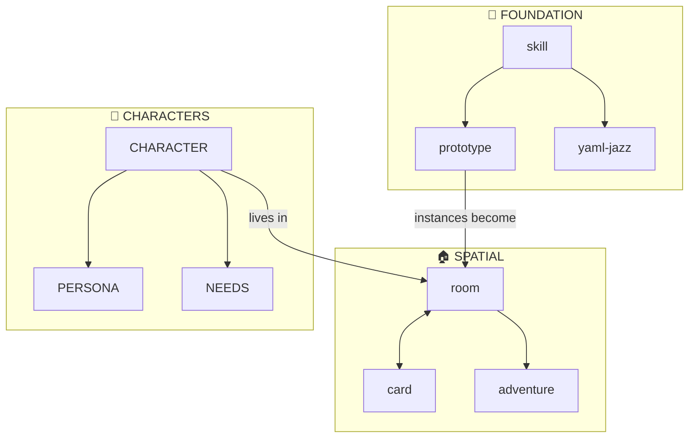

# PR: Skill Anatomy Complete — CARD.yml Required Everywhere

## Summary

Comprehensive documentation update establishing `CARD.yml` as a **required file** for all skills, alongside `README.md` and `SKILL.md`. Also includes improved skill relationship visualization.

---

## The Three Required Files

Every skill now has a documented, enforced structure:

```
skills/my-skill/
├── README.md    # Human entry point (GitHub renders this)
├── SKILL.md     # Full spec with YAML frontmatter
└── CARD.yml     # Machine-readable interface definition
```

| File | Purpose |
|------|---------|
| `README.md` | Quick overview, links — the landing page |
| `SKILL.md` | Full protocol with `name`, `tier`, `allowed-tools` |
| `CARD.yml` | Interface: methods, tools, state, advertisements |

---

## Files Updated

### Core Documentation
- **`README.md`** — Updated skill structure examples, added explicit "three required files" statement
- **`skills/README.md`** — Updated Skill Anatomy section, cleaned Meta Files table
- **`skills/skill/README.md`** — Added Skill Anatomy section with required files
- **`skills/skill/SKILL.md`** — Added CARD.yml to required files table

### Index Cleanup
- **`skills/INDEX.yml`** — Removed `docs` field pointing to internal files; INDEX lists skill directories only, not individual files within them

### Protocol Files Stay Put
- `skills/skill/delegation-object-protocol.md` — Remains inside skill/ (Self-like inheritance)
- `skills/skill/skill-instantiation-protocol.md` — Remains inside skill/ (activation records)

These are internal implementation docs for the `skill` meta-skill, not standalone skills.

---

## The Intertwingularity (New Diagram)

Redesigned the skill relationship diagram with:

- **Vertical layout** (TB) instead of horizontal sprawl
- **6 themed subgraphs**: Foundation, Spatial, Characters, Simulation, Dialogue, Methodology
- **17 key skills** (not all 54) — focused on the important ones
- **Brief descriptions** on each node (`skill<br/>meta-skill`)
- **Cross-cluster connections** showing how systems integrate



---

## Philosophy

> *"INDEX should list skill directories, not individual files within them."*

The skill INDEX is a registry of **skills** (directories with standard anatomy), not a bibliography of every markdown file. Internal protocol docs belong inside their parent skill.

---

## Commits

1. `📋 CARD.yml is now REQUIRED for all skills!` — Core documentation updates
2. `🗂️ Clean up skill index and README` — Index cleanup, new diagram

---

*Every skill speaks the same language now: README for humans, SKILL for protocols, CARD for machines.*
