# Designs

> *Raw source material and historical archives.*

Where ideas are born before they crystallize.

> [!NOTE]
> **This is the PLAY archive.** Raw material that crystallized into kernel and skills. Read for context, not for current specs.

---

## 🗺️ You Are Here

```
moollm/
├── README.md           ← Project entrance
├── PROTOCOLS.yml       ← Symbol index
├── kernel/             ← Core protocols (refined)
├── skills/             ← Userland protocols (refined)
├── schemas/            ← Data formats (refined)
└── designs/            ← YOU ARE HERE (the archives)
    ├── README.md       ← This file
    └── *.md, *.txt     ← Raw material
```

---

## 📚 Document Index

### Core Framework Documents

| Document | Description |
|----------|-------------|
| [MOOLLM-EVAL-INCARNATE-FRAMEWORK.md](./MOOLLM-EVAL-INCARNATE-FRAMEWORK.md) | **The master document.** Incarnate philosophy, Axis of Eval, intellectual genealogy, proof of innovations |
| [MOOLLM-MANIFESTO.md](./MOOLLM-MANIFESTO.md) | Original philosophical vision and core principles |
| [MOOLLM-PROTOCOLS.md](./MOOLLM-PROTOCOLS.md) | Early protocol experiments and specifications |
| [MEMGPT-ANALYSIS.md](./MEMGPT-ANALYSIS.md) | OS-inspired context management, comparison with MemGPT paper |
| [stanza-notes.md](./stanza-notes.md) | Linguistic motherboard philosophy, HN discussion synthesis |

### The Sims → MOOLLM Documents

**Master Index:**
| Document | Description |
|----------|-------------|
| [sims-design-index.md](./sims-design-index.md) | **Start here.** Master index of all Sims influences with quick reference |

**Core Sims Design:**
| Document | Sims Concept | MOOLLM Application |
|----------|--------------|-------------------|
| [sims-maxis-requirements.md](./sims-maxis-requirements.md) | Seven Points of Sim | Core design principles |
| [sims-happy-friends-home.md](./sims-happy-friends-home.md) | Project X proposal (1996) | Three Pillars, plug-ins |
| [sims-find-best-action.md](./sims-find-best-action.md) | Jamie Doornbos' algorithm | Action queue, advertisements |

**System-Specific:**
| Document | Covers |
|----------|--------|
| [sims-simantics-vm.md](./sims-simantics-vm.md) | SimAntics programming → Skills as programs |
| [sims-object-model.md](./sims-object-model.md) | Objects, properties → YAML files, CARD.yml |
| [sims-social-system.md](./sims-social-system.md) | Relationships, groups → Guest book, party skill |
| [sims-personality-motives.md](./sims-personality-motives.md) | Needs, traits → CHARACTER.yml, SIMS-TRAITS |
| [sims-astrology.md](./sims-astrology.md) | **Astrillogical Effect** → K-lines, Simulator Effect, implication over simulation |
| [sims-room-spatial.md](./sims-room-spatial.md) | Rooms, routing → ROOM.yml, exits |
| [sims-time-events.md](./sims-time-events.md) | Time, disasters → Speed of Light, economy |
| [sims-edith-editor.md](./sims-edith-editor.md) | Live debugging → Files as inspectable state |
| [sims-animation-visuals.md](./sims-animation-visuals.md) | Animation, balloons → Prose description |
| [sims-portable-objects.md](./sims-portable-objects.md) | Carrying, inventory → File containment |
| [sims-services-economy.md](./sims-services-economy.md) | Money, bills, disasters → economy skill |
| [sims-pie-menus.md](./sims-pie-menus.md) | Pie menus, memory palaces → CARD.yml navigation |

**History & Context:**
| Document | Covers |
|----------|--------|
| [sims-team-history.md](./sims-team-history.md) | Maxis/EA timeline, team credits, naming saga, BBC documentary |
| [sims-inclusivity.md](./sims-inclusivity.md) | LGBTQ+, gender, The Sims' progressive evolution |
| [sims-tiny-life.md](./sims-tiny-life.md) | Indie Sims alternative, pixel abstraction |

**SimCity & Micropolis:**
| Document | Covers |
|----------|--------|
| [simcity-multiplayer-micropolis.md](./simcity-multiplayer-micropolis.md) | SimCityNet, OLPC, Sugar, What-If branching |

### Project Lineage

| Document | Description |
|----------|-------------|
| [don-hopkins-projects.md](./don-hopkins-projects.md) | 40-year project history: NeWS, PSIBER, HyperTIES, SimCity, iLoci |

### PR Summaries (Session Logs)

These document specific development sessions and feature additions:

| Document | What It Documents |
|----------|-------------------|
| [PR-COMPLETE-DON-ADVENTURE-RUN-1.md](./PR-COMPLETE-DON-ADVENTURE-RUN-1.md) | Epic 33-turn adventure session |
| [PR-PALM-INCARNATION-SPEED-OF-LIGHT.md](./PR-PALM-INCARNATION-SPEED-OF-LIGHT.md) | Palm the monkey's autonomous incarnation |
| [PR-PALM-ESSAYS-VERIFIED.md](./PR-PALM-ESSAYS-VERIFIED.md) | Palm's philosophical essays verification |
| [PR-PALM-HOUSEWARMING.md](./PR-PALM-HOUSEWARMING.md) | Palm's nook furniture and gifts |
| [PR-INFINITE-TYPEWRITERS-DASHER.md](./PR-INFINITE-TYPEWRITERS-DASHER.md) | Infinite Typewriters object, Dasher philosophy |
| [PR-TRIBUTE-FRAMING-ETHICS.md](./PR-TRIBUTE-FRAMING-ETHICS.md) | Three-beat tribute protocol for real people |
| [PR-PUB-STAGE-MENUS-PERSONAS.md](./PR-PUB-STAGE-MENUS-PERSONAS.md) | Pub refactoring, stage, menus, personas |
| [PR-MESSAGE-PIE-TABLE-DEBATES.md](./PR-MESSAGE-PIE-TABLE-DEBATES.md) | Pie table debates system |
| [PR-MESSAGE-MANY-VOICES.md](./PR-MESSAGE-MANY-VOICES.md) | Multi-voice character system |
| [PR-MIDNIGHT-PROWL-SPEED-OF-LIGHT.md](./PR-MIDNIGHT-PROWL-SPEED-OF-LIGHT.md) | Cat midnight prowl speed-of-light demo |
| [PR-BISCUIT-DOG-REVOLUTION.md](./PR-BISCUIT-DOG-REVOLUTION.md) | Biscuit the dog, dog skill |
| [PR-EMPATHIC-SUITE-SPEED-OF-LIGHT.md](./PR-EMPATHIC-SUITE-SPEED-OF-LIGHT.md) | Empathic suite integration |
| [PR-GODFAMILY-COMPLETE.md](./PR-GODFAMILY-COMPLETE.md) | Godfamily concept implementation |
| [PR-SKILL-ANATOMY-COMPLETE.md](./PR-SKILL-ANATOMY-COMPLETE.md) | Skill structure standardization |
| [PR-SKILL-META-SKILL-UPGRADE.md](./PR-SKILL-META-SKILL-UPGRADE.md) | Meta-skill improvements |
| [PR-CHARACTER-CATALOG-EXPANSION.md](./PR-CHARACTER-CATALOG-EXPANSION.md) | Character catalog expansion |
| [PR-ADVENTURE-COMPILER-VISION.md](./PR-ADVENTURE-COMPILER-VISION.md) | Adventure compilation vision |

### Ideas & Correspondence

| Document | Description |
|----------|-------------|
| [kilroy-ideas.md](./kilroy-ideas.md) | Synergy with Chuck Shotton's Kilroy project |
| [chuck-shotton-chat.txt](./chuck-shotton-chat.txt) | Raw conversation transcript |
| [mike-gallaher-ideas.md](./mike-gallaher-ideas.md) | Ideas from Mike Gallaher correspondence |
| [letter-to-scott-adams.md](./letter-to-scott-adams.md) | Letter to Scott Adams (Dilbert creator) |

### Constitution & Design Notes

| Document | Description |
|----------|-------------|
| [constitution-design-summary.md](./constitution-design-summary.md) | Constitution evolution summary |
| [constitution-design.txt](./constitution-design.txt) | Raw constitution notes |
| [moollm-design.txt](./moollm-design.txt) | Original design scratchpad |

---

## Purpose

This directory contains:

- **Early drafts** before crystallization
- **Chat transcripts** with valuable ideas
- **Design explorations** that informed the system
- **Historical context** for archaeology
- **PR summaries** documenting development sessions

These files are **not polished documentation**.  
They're the messy workshop where ideas are forged.

---

## The PLAY-LEARN-LIFT Journey

```
PLAY (here, in designs/)
  ↓
LEARN (extract patterns)
  ↓
LIFT (crystallize into kernel/, skills/)
```

These files are the **PLAY** phase — messy exploration.

The refined results live in [kernel/](../kernel/) and [skills/](../skills/).

---

## Mining for Ideas

When you find something valuable here:

1. **Don't delete it** — preserve the journey
2. **Extract the insight** — what's the core idea?
3. **Crystallize it** — add to appropriate kernel/ or skills/
4. **Link back** — reference the origin for archaeology

Per [PRESERVE-JOURNEY](../PROTOCOLS.yml): the path to the solution IS the value.

---

## Key Insights Extracted

| From | Became |
|------|--------|
| MOOLLM-MANIFESTO.md | [PROTOCOLS.yml](../PROTOCOLS.yml) symbols |
| kilroy-ideas.md | [ITS-ABOUT-TIME](../PROTOCOLS.yml), [PLAY-LEARN-LIFT](../PROTOCOLS.yml) |
| constitution-design | [kernel/constitution-core.md](../kernel/constitution-core.md) |
| sims-* documents | [sims-design-index.md](./sims-design-index.md) master index |
| PR-* documents | Session logs, feature documentation |

---

## Reading Order

**For newcomers:**
1. [MOOLLM-EVAL-INCARNATE-FRAMEWORK.md](./MOOLLM-EVAL-INCARNATE-FRAMEWORK.md) — The master document
2. [sims-design-index.md](./sims-design-index.md) — Sims → MOOLLM mappings
3. [don-hopkins-projects.md](./don-hopkins-projects.md) — Project lineage

**For Sims archaeology:**
1. [sims-maxis-requirements.md](./sims-maxis-requirements.md) — Philosophy
2. [sims-happy-friends-home.md](./sims-happy-friends-home.md) — Original vision
3. [sims-team-history.md](./sims-team-history.md) — Team and timeline

**For session history:**
1. [PR-COMPLETE-DON-ADVENTURE-RUN-1.md](./PR-COMPLETE-DON-ADVENTURE-RUN-1.md) — Epic session
2. [PR-PALM-INCARNATION-SPEED-OF-LIGHT.md](./PR-PALM-INCARNATION-SPEED-OF-LIGHT.md) — Character creation
3. [PR-TRIBUTE-FRAMING-ETHICS.md](./PR-TRIBUTE-FRAMING-ETHICS.md) — Ethical framing

---

## The Intertwingularity

Designs are the attic. Raw material before crystallization.

```mermaid
graph LR
    D[designs/] -->|crystallizes into| K[kernel/]
    D -->|crystallizes into| S[skills/]
    D -->|shapes into| SC[schemas/]
    
    PLAY[🎮 PLAY] -->|happens in| D
    LEARN[📚 LEARN] -->|extracts to| K
    LIFT[🚀 LIFT] -->|refines into| S
```



---

## Navigation

| Direction | Destination |
|-----------|-------------|
| ⬆️ Up | [Project Root](../) |
| 📖 Quick | [QUICKSTART.md](../QUICKSTART.md) |
| 🔧 Sibling | [kernel/](../kernel/) — Where ideas crystallize |
| 🎭 Sibling | [skills/](../skills/) — Where ideas become usable |
| 📐 Sibling | [schemas/](../schemas/) — Where shapes are defined |
| 📋 Symbols | [PROTOCOLS.yml](../PROTOCOLS.yml) — K-line index |
| 🎮 Examples | [examples/](../examples/) — Where ideas become adventures |

---

*"The path to the solution IS the value."*