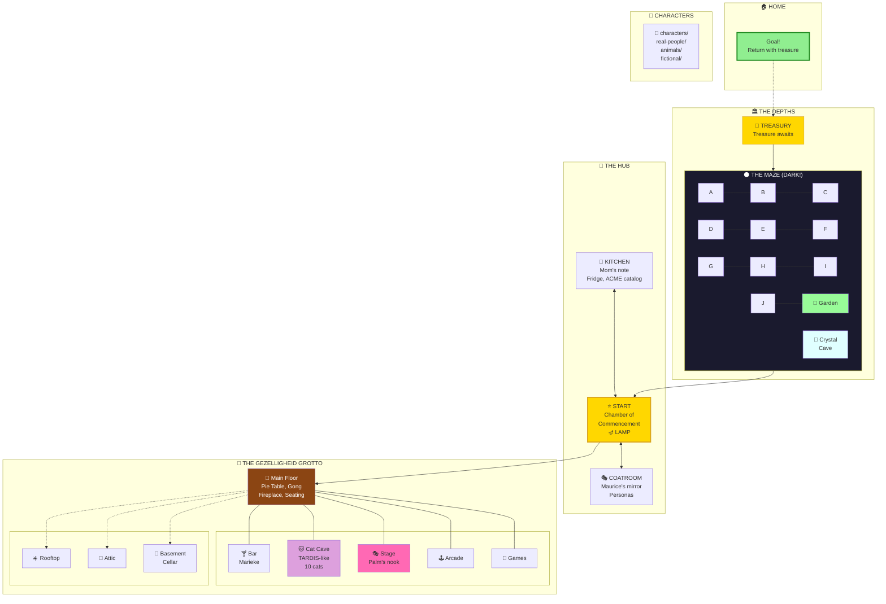

# 🎮 Adventure 4: The Gezelligheid Grotto

> *The world evolved. The pub transformed. The cats remember.*

## 🌍 Overview

Adventure 4 builds on the enriched world from adventure-2 and adventure-3, with significant architectural evolution:

- **Directory-based characters** — Each player has their own folder
- **The Cat Cave** — A TARDIS-like nested room with 10 cats
- **The Pie Menu Round Table** — Debate furniture with compass-stable seats
- **The Gong of Gezelligheid** — Attention, mercy, and musical chairs
- **Marieke the Budtender** — Amsterdam coffeeshop vibes

## 📁 Structure

```
adventure-4/
├── ADVENTURE.yml           # Simulation state (turn, flags, party)
├── LOG.md                  # Summary table (quick reference)
├── TRANSCRIPT.md           # Pure narration (rich reading)
├── README.md               # This file (static description)
│
├── characters/             # Player characters (directory per player)
│   ├── player/             # Default hero (customize in coatroom)
│   ├── don-hopkins/        # Consciousness programmer
│   └── bumblewick.../      # Our beloved hero from adventure-2
│
├── personas/               # Wearable identities
│   └── captain-ashford.yml # The Grue Slayer persona
│
├── start/                  # Chamber of Commencement
├── kitchen/                # Mother's domain (note, fridge, Tom)
├── coatroom/               # Maurice's identity laboratory
├── pub/                    # The Rusty Lantern → Gezelligheid Grotto
│   ├── cat-cave/           # TARDIS-like cat retreat
│   ├── pie-table.yml       # Round table with addressable seats
│   ├── gong.yml            # Attention and mercy
│   └── menu-strains.yml    # Cannabis menu (Dutch themed)
├── maze/                   # 10 rooms of darkness
├── end/                    # Treasury
└── home/                   # The goal
```

## 🎯 Goals

From Mother's note on the kitchen table:

1. **Find treasure** — Somewhere in the maze
2. **Bring gold home** — Mother wants proof
3. **Return home safely** — Complete the adventure!

*Plus promises you'll make yourself...*

## 🗺️ World Map



**Legend:** Solid lines = normal exits | Dotted lines = up/down

## ✨ What's New in Adventure 4

### 🥧 The Pie Menu Round Table

An octagonal table with compass-stable seats (N, NE, E, SE, S, SW, W, NW).

- **Addressable seats:** `pub/pie-table.yml#SW`
- **Built-in Robert's Rules** for structured debate
- **SUMMON_PANEL** — Instant diverse voices for any topic
- **MUSICAL_CHAIRS** — The slices stay, the chairs go

### 🔔 The Gong of Gezelligheid

| Strikes | Effect |
|---------|--------|
| 1 | All conversation pauses |
| 2 | Emergency interrupt |
| 3 | **Mercy ending** (The Gong Show) |

### 🐱 The Cat Cave

A modest wooden cabinet that's bigger on the inside.

- **Exterior:** 60cm × 40cm × 50cm
- **Interior:** At least 50 meters. Possibly infinite.
- **Residents:** Terpie, Stroopwafel, and 8 terpene kittens
- **Zones:** Vestibule, Nap Zone, Great Hall, The Depths

### 🌿 Amsterdam Coffeeshop Theme

Marieke van der Berg runs the budtending station.

- **Menu:** Lucky strains with MOOLLM-themed names
- **Effect:** Buffs grant temporary psychological effects
- **Wisdom:** "Gezelligheid cannot be translated, only experienced."

## 📜 Session Logs

| File | Purpose |
|------|---------|
| **[LOG.md](./LOG.md)** | Summary table — turns, locations, files changed |
| **[TRANSCRIPT.md](./TRANSCRIPT.md)** | Pure narration — story, YAML objects, mermaid diagrams |

The LOG is for quick reference. The TRANSCRIPT is for reading.

**This README is static.** All play state goes to LOG.md and TRANSCRIPT.md.

## 🧬 Lineage

| Adventure | Hero | Achievement |
|-----------|------|-------------|
| 1 | *(template)* | World created |
| 2 | **Captain Ashford** | Slew grue with cheese, 8/8 promises |
| 3 | **Don Hopkins** | Built the architecture, met the cats |
| 4 | **???** | *Your story here* |

## 🎬 Quick Start

```
> GET LAMP              # In start/ — don't enter maze without it
> GO WEST               # Kitchen — read Mother's note!
> READ NOTE             # Make promises. Write back.
> GO SOUTH              # Pub — meet Marieke. Visit the Cat Cave.
> GO NORTH              # Into the maze... lamp ready?
```

## 📚 References

| Resource | Purpose |
|----------|---------|
| [ADVENTURE.yml](./ADVENTURE.yml) | Simulation state |
| [skills/](../../skills/) | Game mechanics |
| [kitchen/mothers-note.yml](./kitchen/mothers-note.yml) | The heart of the game |
| [pub/README.md](./pub/README.md) | Cat family, strain menu |

---

*Forked from adventure-3 on January 5, 2026.*

*The cats remember. The gong waits. What will YOU do?*
