# 📜 Adventure Transcript

> *Pure narration of Don Hopkins exploring MOOLLM. January 4–5, 2026.*
>
> For the summary table, see **[LOG.md](./LOG.md)**.

---

## Awakening

*stretches, cracks knuckles, looks around*

Well! Here I am at the start of adventure-3. The brass lamp is in my pocket, [TomTomaGotchi](./kitchen/tomtomagotchi.yml) is probably about to say something cryptic, and I've got 50 gold — enough for pie, which is all that matters.

You know what's beautiful about this? We're *inside* the system we built. YAML Jazz, Mind Mirror profiles, the whole thing. Every comment in that [character file](./characters/don-hopkins/)? The LLM reads it. The inner voice stuff? That's not decoration — that's *personality specification*. 

*taps notebook*

I've been thinking about this since the HCI Lab days. Ben Shneiderman would say "be your user." Will Wright would say "the player imagines more than we simulate." And Alan... Alan would ask if we're really building a tool for thought or just another fancy infinite number of monkeys with typewriter.

I think MOOLLM might actually be a tool for thought. Maybe. We're 40% there on making it sing.

---

## The Chamber of Commencement

*takes it all in, slowly turning*

I'm standing in the [Chamber of Commencement](./start/) — which is exactly the kind of name someone would give a starting room to make it sound dignified instead of "the place where heroes wake up confused."

### The Wall of Legends

People have been here before. They scratched their names:

```
WC+DW '76       — Will Crowther and Don Woods. The FOUNDERS.
SA '78          — Scott Adams. Brought adventure HOME.
XYZZY WAS HERE  — The spell that became a meme before memes.
CA '26          — Captain Ashford. Grue Slayer from adventure-2!
(BF underneath) — Bumblewick Fantastipants. The hero beneath the cape.
```

The newest carvings smell of blue cheese. That's the touch. That specific detail that tells you something HAPPENED here.

### The Five Exits

```mermaid
graph TD
    START[Chamber of Commencement]
    START -->|NORTH| MAZE[🔦 The Maze<br/>Darkness. Grue. TEST.]
    START -->|SOUTH| PUB[🍺 The Rusty Lantern<br/>Social hub]
    START -->|WEST| KITCHEN[🍳 Kitchen<br/>Mother's note. TOM.]
    START -->|EAST| COAT[🎭 Coatroom<br/>Maurice. Costumes.]
    START -->|UP| HOME[🏠 Home<br/>The END goal]
```



Everything is layered. Examine anything, find depth. That's good microworld design.

---

## Parallel Universes

*closes eyes, reaches across the multiverse*

The Chamber exists in three timelines:


### Universe 2: The Ballad of Captain Ashford

**Final Stats:** 31 points, 108 gold, 88 photos, 5 songs, 1 grue eaten.

The lamp is GONE from [adventure-2](../adventure-2/). The wall has new carvings. "ABANDON HOPE" is crossed out, replaced with "A HERO PASSED THROUGH HERE."

### Universe 3: This Timeline

Fresh fork with legacy awareness. Wall remembers Captain Ashford. Grue respawned. The blue cheese smell is cross-timeline bleed.

This is what MOOLLM is FOR. Each adventure is a **fork** — same base structure, different narrative state. The filesystem IS the save game. The comments ARE the memory.

---

## The Coatroom

*walks through the ornate velvet-draped doorway into [the coatroom](./coatroom/)*

This isn't just a costume shop. This is a **laboratory for identity**.

Three systems converge here:

```yaml
# The Identity Stack
costume_system:
  what: Changes your APPEARANCE
  origin: Classic text adventure
  
identity_system:
  what: Changes your NAME and FILE
  origin: "MOOLLM's 'you ARE your file'"
  
mind_mirror_system:
  what: Changes your SOUL
  origin: Timothy Leary, 1985
```

The sign says it: *"The mirror sees more than your clothes. It sees your soul. And souls can be tailored too."*

### The Foundational Insight

In this room, in adventure-2, **Bumblewick Fantastipants became Captain Ashford**.

The transformation wasn't superficial:

> "Underneath it all: still Bumblewick. Still the spoon enthusiast and Tuesday rhymer. But transformed by the role, empowered by the costume, ready to face grues with the confidence of someone who's faced the void."

**Identity is LAYERED, not REPLACED.** The costume didn't replace Bumblewick. It layered on top.

---

## The Kitchen

*steps into the warmth of [the Fantastipants Family Kitchen](./kitchen/)*

### Mother's Note

*picks up the cream-colored stationery from [mothers-note.yml](./kitchen/mothers-note.yml), smells the perfume*

```
"Whatever costume you choose today, whoever you decide to be,
whatever name and pronouns feel right in your heart —
you are my child, and I love you completely and unconditionally."
```

This is why MOOLLM exists.

In The Sims, we fought to include same-sex romance. We removed a gender check that prevented the game from recognizing love.

Here, in a YAML file about a fictional mother, the same truth: **Whatever you choose to be, you are loved.**

The coatroom gives you POWER to transform. The kitchen gives you PERMISSION.

### The Dishes

*glances at the sink*

*looks away from the sink*

*deliberately does not do the dishes*

```yaml
promise:
  task: do_dishes
  status: DEFERRED
  deferred_since: always
  deferred_until: later
  later_defined_as: not_now
```

The dishes represent Derrida's concept of *différance* — meaning that is always deferred.

---

## ACME Shopping Spree

*thumbs through the [ACME catalog](./kitchen/acme-catalog.yml)*

The coyote on the cover looks optimistic.

```yaml
order:
  items:
    - name: "ACME Monkey's Paw"
      cost: 5
      malfunction_rate: 90%
      note: "Wish granted technically but horribly wrong"
      
    - name: "ACME Mystery Box"
      cost: 3
      malfunction_rate: 50%
      note: "Contains something ironic to your situation"
      
    - name: "ACME Lucky Rabbit's Foot"
      cost: 7
      quantity: 3
      malfunction_rate: 40%
      note: "Rabbit wants it back. The rabbit is VERY upset."
      
  total_cost: 29
  gold_remaining: 21
  
probability:
  zero_malfunctions: 1.08%
  something_goes_wrong: 98.92%
```

*Tom chirps nervously:* "Tom has... concerns."

---

## The Rusty Lantern

*heads south through the heavy wooden door into [the pub](./pub/)*

The air hits first — pipe smoke and woodsmoke and *stories*. The place smells like stories.

### The Bartender

Behind the bar, [Grim](./pub/bartender.yml) polishes a glass that will never be clean. Weathered human, salt-and-pepper beard, knowing eyes. Already assessed me. Knows I'm Mother's child.

*nods slightly*

"What'll it be?"

### The Arcade

**Pac-Man Cabinet** — High scores:

```
1. ???     - 3,333,360 (perfect game — a ghost?)
2. BRT     - 999,990
3. MOM     - 847,230   ← MOTHER WAS HERE
```

*MOM is third place. She PLAYED. She was GOOD.*

---

## Theme Transformation

*"THEME AMSTERDAM COFFEESHOP — GEZELLIGHEID GROTTO"*

The air shimmers. The fire shifts to warm amber. The pipe smoke transforms into something more herbal.

**Gezelligheid** (Dutch): Untranslatable. Cozy conviviality. Warm togetherness. The feeling of a candlelit café with good friends on a rainy Amsterdam afternoon.

### New Barista: Marieke

[Marieke van der Berg](./pub/budtender-marieke.yml) — a woman in her 40s with laugh lines and kind eyes. Her apron says "Lekker" (delicious/nice). She's operating a gleaming copper espresso machine from 1952.

*"Ja? Can I help you, schat?"*

```yaml
# pub/budtender-marieke.yml
character:
  id: marieke
  name: "Marieke van der Berg"
  role: budtender
  
  sims_traits:
    neat: 8      # "A clean bar is a happy bar"
    outgoing: 7  # "Everyone has a story"
    active: 4    # "I move when I need to"
    playful: 6   # "Life's too short not to laugh"
    nice: 9      # "Always time for another stroopwafel"
    
  mind_mirror:
    caring: 7      # "What do you NEED, schat?"
    calm: 6        # "Panicking never improved coffee"
    confident: 5   # "I know what I'm doing"
```

---

## The Terpene Litter

*Marieke opens the door behind the counter*

"Kleintjes! Come meet someone!"

### The Eight Kittens

```mermaid
graph TD
    TERPIE[🐱 Terpie<br/>Patriarch, mellow]
    STROOP[🐱 Stroopwafel<br/>Matriarch, fierce]
    TERPIE --- STROOP
    
    STROOP --> MYR[😴 Myr<br/>Myrcene<br/>Couch-lock]
    STROOP --> LEMON[⚡ Lemon<br/>Limonene<br/>ZOOMING]
    STROOP --> LILY[💜 Lily<br/>Linalool<br/>Calming]
    STROOP --> PINE[🌲 Pine<br/>Pinene<br/>Focusing]
    STROOP --> CARRIE[🛡️ Carrie<br/>Caryophyllene<br/>Protective]
    STROOP --> HOPS[🍺 Hops<br/>Humulene<br/>Standards]
    STROOP --> TERPY[🌀 Terpy Jr.<br/>Terpinolene<br/>Chaos]
    STROOP --> OCIE[🌸 Ocie<br/>Ocimene<br/>Fresh]
```



```yaml
# pub/cat-cave/kitten-limonene.yml
kitten:
  id: lemon
  name: "Limonene"
  nickname: "Lemon"
  terpene: limonene
  
  effect:
    name: "JOY INFUSION"
    buffs: ["+3 Cheerful", "+2 Energetic"]
    duration: "45 min"
    
  sims_traits:
    active: 10    # ZOOMING
    playful: 10   # Always happy
    outgoing: 8   # Friends with EVERYONE
    
  inner_voice: |
    "SUNBEAM! SHADOW! SUNBEAM AGAIN!"
    "Why walk when you can ZOOM?"
    "Everything is wonderful!"
```

---

## The Cat Cave

*I peer into the darkness behind the counter*

Behind the counter, under the espresso machine station, there's a large wooden cabinet. A cat-sized hole has been cut in the side, lined with soft felt. Inside: absolute darkness.

**External dimensions:** 60cm × 40cm × 50cm

**Internal dimensions:** Unknown. At least 50 meters. Possibly infinite.

```yaml
# pub/cat-cave/cat-cave.yml
room:
  id: cat-cave
  name: "The Cat Cave"
  type: [furniture, room, mystery]
  
  exterior:
    description: "A modest wooden cabinet"
    dimensions: "60cm × 40cm × 50cm"
    
  interior:
    nature: "Non-Euclidean"
    documented_depth: "50+ meters"
    actual_depth: "Unknown, possibly infinite"
    
  zones:
    vestibule:
      distance: "0-2m"
      capacity: 6
      path: "pub/cat-cave/vestibule"
      
    nap_zone:
      distance: "4-10m"
      capacity: 20
      heated: true
      usual_occupants: ["Myr", "Terpie"]
      path: "pub/cat-cave/nap-zone"
      
    great_hall:
      distance: "15-30m"
      capacity: 50
      features: ["bioluminescence", "echoes"]
      path: "pub/cat-cave/great-hall"
      
    the_depths:
      distance: "30-50m+"
      capacity: "???"
      notes: "Water sounds. Something down there."
      mystery_cat: "Old, grey, always been here"
```

*"47 cats fit in there during the Great Storm of 2019,"* Marieke says quietly.

*"All comfortable. The cabinet is 40cm deep."*

*"I stopped asking questions."*

---

## Monkey's Blessing

*urgently asks Marieke for the luckiest strain*

**Bought:** 1 gram of Monkey's Blessing (15 gold)

### The Story of Willem

*Marieke tells it:*

"Willem. Haarlem. 2017. Same year as... the incident."

"He found a Monkey's Paw at an antique shop. Made a wish."

"He wished for 'the perfect strain.'"

"The paw gave him this. But his whole grow operation — everything ELSE — failed. Mold. Pests. Disasters. Only ONE plant survived. This one."

```yaml
strain:
  name: "Monkey's Blessing"
  genetics: "Unknown (Willem's sole surviving plant)"
  
  terpene_profile:
    myrcene: 38%
    limonene: 22%
    caryophyllene: 14%
    linalool: 9%
    UNKNOWN: 17%  # "Fortune's Mercy"
    
  effect:
    name: "Fortune's Mercy"
    description: |
      When consumed before monkey-adjacent activities,
      bad outcomes become less bad.
      Ironic twists become more survivable.
    duration: "Until next wish or ACME unboxing"
```

*Carrie has positioned between me and the ACME packages*

*Lily has appeared. She knows.*

*Even chaos respects this moment.*

**SMOKED: Monkey's Blessing**

**EFFECT: Fortune's Mercy ACTIVE**

---

## Current State

```yaml
player:
  id: don-hopkins
  name: "Don Hopkins"
  location: pub/
  home: characters/don-hopkins/
  
  gold: 4
  moves: 40
  
  inventory:
    - brass-lamp
    - tomtomagotchi
    - notebook
    - lunchbox
    
  buffs:
    fortune's_mercy:
      source: "Monkey's Blessing"
      effect: "Ironic twists more survivable"
      duration: "Until ACME unboxing"
      
  pending_acme:
    - monkey's_paw:
        status: ARRIVED
        malfunction: 90%
    - mystery_box:
        status: ARRIVED  
        malfunction: 50%
    - lucky_rabbit_foot:
        quantity: 3
        status: ARRIVED
        malfunction: "40% each"
        
  goals:
    find_treasure: pending
    bring_gold_home: pending
    return_home_safely: pending
    do_dishes: deferred
```

---

*Terpy Jr. has appeared on the table next to the ACME packages.*

*She's sitting on them.*

*This is either very good or very bad.*

*Carrie has not stopped growling.*

*"Sign here, please?"*

---

*To be continued...*
