# 📜 Adventure Transcript

> *Pure narration of your journey. [Date TBD].*
>
> For the summary table, see **[LOG.md](./LOG.md)**.

---

## Awakening

_Your story begins..._

---

## The Chamber of Commencement

*You are in [start/](./start/) — the Chamber of Commencement.*

```mermaid
graph TD
    START[🏛️ Chamber of Commencement]
    
    START -->|NORTH| MAZE[🔦 The Maze<br/>Darkness. Grue. TEST.]
    START -->|SOUTH| PUB[🌿 Gezelligheid Grotto<br/>Coffeeshop. Cats. Chill.]
    START -->|WEST| KITCHEN[🍳 Kitchen<br/>Mother's note. TOM.]
    START -->|EAST| COAT[🎭 Coatroom<br/>Maurice. Costumes.]
    START -->|UP| HOME[🏠 Home<br/>The END goal]
    START -.->|INWARD| HALL[🧬 Hall of Bodies<br/>Who you ARE]
    
    COAT -.->|DEEPER| WARD[🎭 Wardrobe of Masks<br/>Who you PLAY]
    
    PUB -->|INSIDE| CAVE[🐱 Cat Cave<br/>TARDIS-like. 10 cats.]
    
    click START "start/" "Chamber of Commencement"
    click MAZE "maze/" "The Maze"
    click PUB "pub/" "The Gezelligheid Grotto"
    click KITCHEN "kitchen/" "Kitchen"
    click COAT "coatroom/" "Coatroom"
    click HOME "home/" "Home"
    click HALL "characters/" "Hall of Bodies"
    click WARD "personas/" "Wardrobe of Masks"
    click CAVE "pub/cat-cave/" "The Cat Cave"
    
    classDef physical fill:#2d5a27,stroke:#333,color:#fff
    classDef metaphysical fill:#4a2d5a,stroke:#333,color:#fff
    classDef nested fill:#5a4a2d,stroke:#333,color:#fff
    
    class START,MAZE,PUB,KITCHEN,COAT,HOME physical
    class HALL,WARD metaphysical
    class CAVE nested
```



### The Exits

| Direction | Destination | What Awaits |
|-----------|-------------|-------------|
| **NORTH** | [maze/](./maze/) | Darkness. The grue has respawned. |
| **SOUTH** | [pub/](./pub/) | The Gezelligheid Grotto — coffeeshop vibes |
| **WEST** | [kitchen/](./kitchen/) | Mother's note. TomTomagotchi. Food. |
| **EAST** | [coatroom/](./coatroom/) | Maurice. The mirror. Identity. |
| **UP** | [home/](./home/) | The goal. Return with treasure. |
| **INWARD** | [characters/](./characters/) | The Hall of Bodies (metaphysical) |

### The Pub Has Changed

The **Rusty Lantern** is now the **Gezelligheid Grotto** — an Amsterdam-style coffeeshop with:

- 🌿 **Marieke** the budtender
- 🐱 **The Cat Cave** with 10 cats (Terpie, Stroopwafel, and the Terpene Litter)
- 🥧 **The Pie Menu Round Table** for structured debates
- 🔔 **The Gong of Gezelligheid** for attention and mercy

---

## Current State

```yaml
player:
  id: player
  name: "The Hero"
  location: start/
  home: characters/player/
  
  gold: 50
  moves: 0
  
  inventory: []
    
  buffs: []
        
  goals:
    find_treasure: pending
    bring_gold_home: pending
    return_home_safely: pending
```

---

*Your story awaits...*
