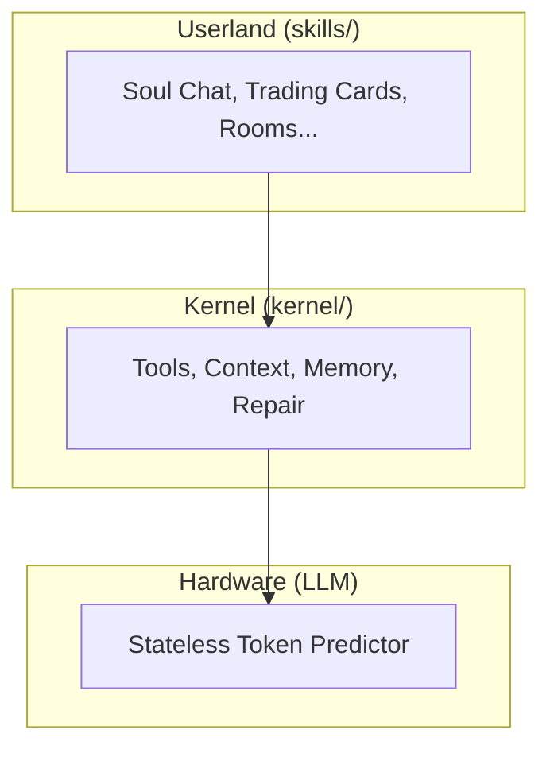
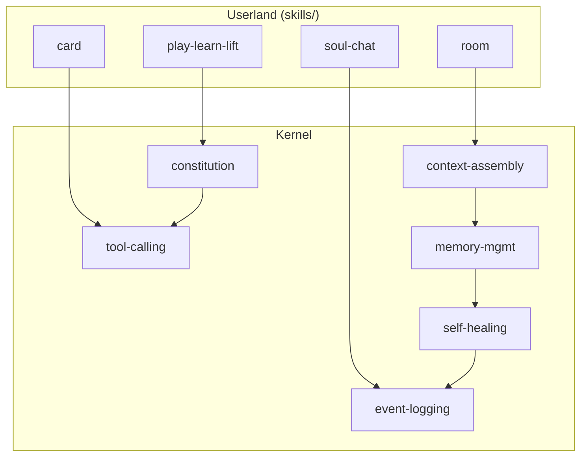

# Kernel

> *"The orchestrator is the Operating System. The LLM is the Coherence Engine. The Repo is the Microworld."*

**The Coherence Engine** — The LLM isn't just generating text. It's:
- Computing **dependencies** between tasks and data
- **Cross-checking** state against rules and schemas
- **Refereeing** conflicts between parallel agents
- **Orchestrating** many character simulations per call
- **Maintaining consistency** across the microworld

The **minimal, stable core** that all higher-level protocols and skills depend on.

> [!NOTE]
> **This is the basement.** Start with [skills/](../skills/) for userland, come here for the plumbing.

---

## What is the Kernel?

The kernel provides **infrastructure**, not semantics:

1. **Tool Execution** — File ops, search, sandboxed execution
2. **Context Assembly** — Building prompts from working sets
3. **Event Logging** — Append-only audit trails
4. **Memory Management** — Hot/cold hints, summarization
5. **Self-Healing** — Robust-first repair and bootstrap

### What the Kernel Does NOT Know

> [!IMPORTANT]
> The kernel does **NOT** encode semantics about:
> - What "memory palaces" are
> - What "adventure rooms" mean
> - How "trading cards" work
> - Character personalities
> - Soul chat patterns
> - The Sims-style advertisements
>
> Those are **[skills](../skills/)** (userland protocols). The kernel just provides files, context, and repair.

---

## 🗺️ You Are Here

```
moollm/
├── README.md           ← Project entrance
├── PROTOCOLS.yml       ← Symbol index
├── kernel/             ← YOU ARE HERE (the basement)
│   ├── README.md       ← This file
│   ├── drivers/        ← Orchestrator adapters
│   └── *.md            ← Core protocols
├── skills/             ← Userland (upstairs)
├── schemas/            ← Data formats
└── designs/            ← Historical archives
```

---

## Protocols

| Protocol | Purpose | File |
|----------|---------|------|
| **Constitution** | Universal principles | [constitution-core.md](./constitution-core.md) |
| **Tool Calling** | How tools work | [tool-calling-protocol.md](./tool-calling-protocol.md) |
| **Context Assembly** | Building prompts | [context-assembly-protocol.md](./context-assembly-protocol.md) |
| **Memory Management** | Hot/cold, summaries | [memory-management-protocol.md](./memory-management-protocol.md) |
| **Event Logging** | Audit trail | [event-logging-protocol.md](./event-logging-protocol.md) |
| **Self-Healing** | Repair demons | [self-healing-protocol.md](./self-healing-protocol.md) |
| **Naming** | File organization | [NAMING.yml](./NAMING.yml) |

---

## The Layer Cake



Skills don't talk to the LLM directly — they go through kernel protocols.

---

## Drivers (Orchestrator Adapters)

The kernel runs on multiple orchestrators. Drivers adapt protocols to each:

| Driver | Tier | For |
|--------|------|-----|
| [cursor.yml](./drivers/cursor.yml) | 4 | Cursor IDE |
| [claude-code.yml](./drivers/claude-code.yml) | 5 | Claude Code + MCP |
| [custom.yml](./drivers/custom.yml) | 6 | Full control |
| [generic.yml](./drivers/generic.yml) | 1 | Maximum compatibility |

See [drivers/README.md](./drivers/README.md) for details.

---

## Key Principles

| Symbol | Meaning | Defined In |
|--------|---------|------------|
| `NEVER-CRASH` | Missing state → repair | [self-healing-protocol.md](./self-healing-protocol.md) |
| `APPEND-ONLY` | Never modify logs | [event-logging-protocol.md](./event-logging-protocol.md) |
| `WHY-REQUIRED` | Tool calls explain themselves | [tool-calling-protocol.md](./tool-calling-protocol.md) |
| `HOT-COLD` | Memory hints | [memory-management-protocol.md](./memory-management-protocol.md) |
| `BIG-ENDIAN` | Naming convention | [NAMING.yml](./NAMING.yml) |

Full symbol index: [PROTOCOLS.yml](../PROTOCOLS.yml)

---

## Philosophy

Inspired by:

| Source | Contribution |
|--------|--------------|
| **Dave Ackley** | Robust-first computing |
| **Movable Feast Machine** | Local repair, homeostasis |
| **Self Language** | Prototypes and delegation |
| **Unix** | Simple tools, composition |
| **Papert/Kay** | Microworld as OS |
| **Chuck Shotton / Kilroy** | Decentralized swarms, small LLMs, visual programming |

> *"Make the kernel boring so the skills can be exciting."*

---

## The Intertwingularity

The kernel is the basement. Skills build on top.



---

## Navigation

| Direction | Destination |
|-----------|-------------|
| ⬆️ Up | [Project Root](../) |
| 📖 Quick | [QUICKSTART.md](../QUICKSTART.md) |
| 🎭 Sibling | [skills/](../skills/) — Userland protocols |
| 📐 Sibling | [schemas/](../schemas/) — Data formats |
| 📜 Sibling | [designs/](../designs/) — Historical archives |
| ⬇️ Down | [drivers/](./drivers/) — Orchestrator adapters |
| 📋 Symbols | [PROTOCOLS.yml](../PROTOCOLS.yml) — K-line index |