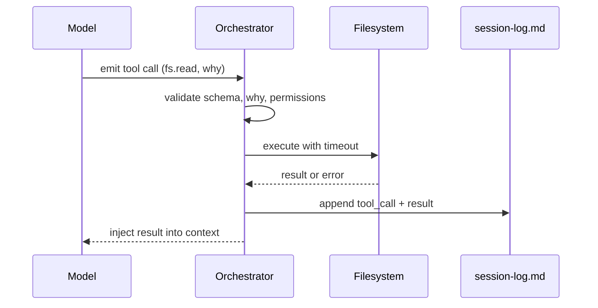

# Tool Calling Protocol
## How MOOLLM Tools Are Defined and Invoked

---

## 1. Overview

Tools are the interface between the LLM (stateless token predictor) and
the world (files, terminals, search, execution). This protocol defines
how tools are specified, called, and their results handled.

---

## 2. Tool Definition Schema

Every tool has a canonical definition:

```yaml
tool:
  name: string           # Unique identifier (e.g., "fs.read")
  description: string    # Human-readable purpose
  category: string       # fs | search | exec | memory | custom
  
  input_schema:
    type: object
    properties:
      # ... tool-specific parameters
      why:
        type: string
        description: "Single sentence explaining intent"
    required: ["why", ...]  # why is ALWAYS required
    
  output_schema:
    # ... what the tool returns
    
  sandbox:
    network: boolean      # Does it need network?
    filesystem: string[]  # Allowed path patterns
    timeout_ms: int       # Max execution time
    
  examples:
    - input: { ... }
      output: { ... }
      why: "Example of typical usage"
```

---

## 3. Core Tool Categories

### 3.1 Filesystem Tools (`fs.*`)

```yaml
fs.ls:
  description: "List directory contents"
  input_schema:
    properties:
      path:
        type: string
        description: "Directory to list"
      why:
        type: string
    required: [path, why]
  output_schema:
    type: array
    items:
      type: object
      properties:
        name: string
        type: "file" | "directory"
        size: int
        modified: string  # ISO timestamp

fs.read:
  description: "Read file contents"
  input_schema:
    properties:
      path:
        type: string
      range:
        type: object
        properties:
          start: int  # line number (1-indexed)
          end: int
      why:
        type: string
    required: [path, why]
  output_schema:
    type: object
    properties:
      content: string
      lines: int
      truncated: boolean

fs.append:
  description: "Append text to file (creates if missing)"
  input_schema:
    properties:
      path:
        type: string
      text:
        type: string
      why:
        type: string
    required: [path, text, why]

fs.patch:
  description: "Apply unified diff to file"
  input_schema:
    properties:
      path:
        type: string
      diff:
        type: string
        description: "Unified diff format"
      why:
        type: string
    required: [path, diff, why]

fs.write:
  description: "Write/overwrite file (use with caution)"
  input_schema:
    properties:
      path:
        type: string
      content:
        type: string
      why:
        type: string
    required: [path, content, why]
  notes: "Prefer append or patch when possible"

fs.mkdir:
  description: "Create directory (and parents)"
  input_schema:
    properties:
      path:
        type: string
      why:
        type: string
    required: [path, why]

fs.copy:
  description: "Copy file or directory"
  input_schema:
    properties:
      src:
        type: string
      dst:
        type: string
      why:
        type: string
    required: [src, dst, why]
```

### 3.2 Search Tools (`search.*`)

```yaml
search.lexical:
  description: "Full-text search with regex support"
  input_schema:
    properties:
      query:
        type: string
        description: "Search pattern (regex supported)"
      scope:
        type: string
        description: "Directory to search in"
      glob:
        type: string
        description: "File pattern (e.g., '*.md')"
      why:
        type: string
    required: [query, why]
  output_schema:
    type: array
    items:
      type: object
      properties:
        path: string
        line: int
        content: string
        context: string[]

search.vector:
  description: "Semantic similarity search"
  input_schema:
    properties:
      query:
        type: string
        description: "Natural language query"
      scope:
        type: string
      k:
        type: int
        default: 10
      why:
        type: string
    required: [query, why]
  output_schema:
    type: array
    items:
      type: object
      properties:
        path: string
        score: float
        snippet: string
```

### 3.3 Execution Tools (`exec.*`)

```yaml
terminal.run:
  description: "Execute shell command (sandboxed)"
  input_schema:
    properties:
      cmd:
        type: array
        items: string
        description: "Command and arguments"
      cwd:
        type: string
        description: "Working directory"
      timeout_ms:
        type: int
        default: 30000
      why:
        type: string
    required: [cmd, why]
  output_schema:
    type: object
    properties:
      stdout: string
      stderr: string
      exit_code: int
      duration_ms: int
  sandbox:
    network: false
    timeout_ms: 30000

python.exec:
  description: "Execute Python code (sandboxed)"
  input_schema:
    properties:
      code:
        type: string
      files:
        type: object
        description: "Virtual files available to script"
      timeout_ms:
        type: int
        default: 60000
      why:
        type: string
    required: [code, why]
  output_schema:
    type: object
    properties:
      stdout: string
      stderr: string
      return_value: any
      artifacts: array  # Generated files

js.exec:
  description: "Execute JavaScript (isolate)"
  input_schema:
    properties:
      code:
        type: string
      input_json:
        type: object
      timeout_ms:
        type: int
        default: 10000
      why:
        type: string
    required: [code, why]
  output_schema:
    type: object
    properties:
      result: any
      logs: array
```

### 3.4 Memory Tools (`memory.*`)

```yaml
memory.summarize:
  description: "Create summary of files"
  input_schema:
    properties:
      target_paths:
        type: array
        items: string
      into_path:
        type: string
        description: "Where to write summary"
      style:
        type: string
        enum: [bullet, narrative, schema]
      keep_refs:
        type: boolean
        default: true
      why:
        type: string
    required: [target_paths, into_path, why]

memory.advise:
  description: "Update hot/cold cache hints"
  input_schema:
    properties:
      hot:
        type: array
        items:
          type: object
          properties:
            path: string
            why: string
      cold:
        type: array
        items:
          type: object
          properties:
            path: string
            why: string
      why:
        type: string
    required: [why]
```

---

## 4. The `why` Parameter

**Every tool call MUST include `why`.**

### Purpose

1. **Self-documentation**: Creates readable traces
2. **Intentionality**: Forces the model to articulate goals
3. **Audit**: Enables post-hoc analysis
4. **Coherence**: Improves model's trajectory planning

### Format

- Single sentence
- States intent, not mechanics
- Should answer "What are you trying to accomplish?"

### Examples

```yaml
# Good - intent is clear, context provided
why: "Find where YAML Jazz is defined to understand its principles"
why: "Create summary of tool outputs to reduce context size"
why: "Run tests to verify the patch works"

# Bad - mechanical, uninformative
why: "read the file"        # Too mechanical - WHY read it?
why: "because I need it"    # Circular, not informative
why: ""                     # Empty (will be rejected)
```

### YAML Comments in Tool Calls

When logging tool calls, include YAML comments for additional context:

```yaml
type: tool_call
tool: fs.read
args:
  path: src/parser.ts
  # Part of the expression parser audit
  # Previous read showed parseAtom, now checking parseExpression
  why: "Check if recursive descent handles nested expressions"
```

**Comments are semantic**. They provide context that structured fields cannot.
The `why` parameter is required; comments are optional but valuable.

### Enforcement

Tool calls without `why` MUST be rejected by the orchestrator.

---

## 5. Tool Call Flow



### Flow Details

1. **Model emits**: Tool name, args, and required `why`
2. **Orchestrator validates**: Schema, `why` present, permissions, sandbox
3. **Orchestrator executes**: Apply timeout, capture output, handle errors
4. **Log**: Append to `session-log.md` (YAML block in markdown)
5. **Inject**: Add result to conversation, update working set if needed

---

## 6. Error Handling

### Error Response Schema

```yaml
error:
  code: string        # Machine-readable (e.g., "NOT_FOUND")
  message: string     # Human-readable
  recoverable: boolean
  suggestion: string?  # How to fix
```

### Common Error Codes

| Code | Meaning | Recovery |
|------|---------|----------|
| `NOT_FOUND` | File/path doesn't exist | Check path, create file |
| `PERMISSION_DENIED` | Outside sandbox | Use allowed paths |
| `TIMEOUT` | Execution too slow | Simplify operation |
| `INVALID_ARGS` | Schema violation | Fix arguments |
| `MISSING_WHY` | No why parameter | Add why |
| `QUOTA_EXCEEDED` | Resource limit hit | Reduce scope |

---

## 7. Tool Extensions

New tools can be added via MCP or custom definitions:

```yaml
# Custom tool registration
custom_tools:
  - name: "video.extract_frames"
    mcp_server: "video-tools"
    description: "Extract frames from video"
    input_schema:
      properties:
        video_path: string
        timestamps: array
        why: string
      required: [video_path, timestamps, why]
```

Tools MUST:
1. Follow the schema format
2. Include `why` in required params
3. Document sandbox requirements
4. Provide error handling

---

## 8. Dovetails With

- **Constitution** (§3): Tool schemas reference
- **Context Assembly Protocol**: Tool results affect working set
- **Event Logging Protocol**: All calls logged
- **Memory Management**: memory.* tools
- **FlowMap Protocol**: Tool operations tracked

---

*Tools are just tokens to the LLM.*
*The orchestrator makes them real.*
*`why` makes them meaningful.*
