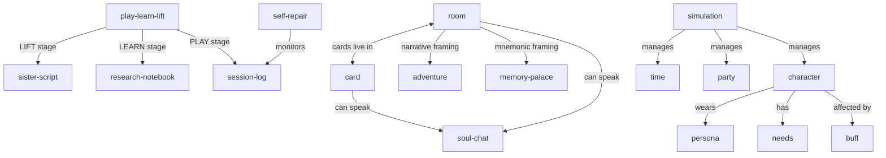

# MOOLLM Skills

> *"Skills are conventions the model follows, not code the orchestrator runs."*

Userland protocols over files.

> [!TIP]
> **New here?** Start with [constructionism/](./constructionism/) — the philosophy. Then [skill/](./skill/) — the meta-skill explaining how skills work. Then explore [room/](./room/) — it has everything!

---

## Skill Index (50 skills)

### 🧠 Philosophy & Core Concepts

| Skill | One-liner |
|-------|-----------|
| [constructionism/](./constructionism/) | Learn by building inspectable things (Papert, Kay, Logo) |
| [skill/](./skill/) | **The meta-skill.** How skills work, evolve, compose |
| [protocol/](./protocol/) | UPPER-CASE-HYPHENATED symbols as greppable K-lines |
| [yaml-jazz/](./yaml-jazz/) | Semantic YAML where comments are data |
| [postel/](./postel/) | The Robustness Principle — be liberal in acceptance |
| [robust-first/](./robust-first/) | Survive first, be correct later (Dave Ackley) |
| [coherence-engine/](./coherence-engine/) | LLM as consistency maintainer & orchestrator |
| [speed-of-light/](./speed-of-light/) | Many turns in one call — instant telepathy |

### 🎮 Methodology (How to Work)

| Skill | One-liner |
|-------|-----------|
| [play-learn-lift/](./play-learn-lift/) | Explore → Learn → Share wisdom |
| [planning/](./planning/) | Flexible task decomposition |
| [plan-then-execute/](./plan-then-execute/) | Frozen plans with human approval gates |
| [sister-script/](./sister-script/) | Document-first automation |
| [research-notebook/](./research-notebook/) | Structured investigation with sources |
| [debugging/](./debugging/) | Hypothesis-driven bug hunting |
| [code-review/](./code-review/) | Systematic code analysis |

### 🏠 Spatial (Room/Card System)

| Skill | One-liner |
|-------|-----------|
| [room/](./room/) | Directories as activation contexts |
| [card/](./card/) | Capabilities as portable, playable cards |
| [adventure/](./adventure/) | Narrative room exploration |
| [memory-palace/](./memory-palace/) | Spatial knowledge organization |
| [data-flow/](./data-flow/) | Rooms as pipeline nodes (THROW/INBOX) |
| [return-stack/](./return-stack/) | Navigation history as continuation |
| [multi-presence/](./multi-presence/) | Same card active in multiple rooms |

### 👤 Characters & Identity

| Skill | One-liner |
|-------|-----------|
| [character/](./character/) | Core patterns — home, location, relationships |
| [persona/](./persona/) | Identity layers (WHO vs WHAT) |
| [soul-chat/](./soul-chat/) | Everything speaks — multi-voice dialogues |
| [mind-mirror/](./mind-mirror/) | Personality via four Thought Planes (Leary) |
| [hero-story/](./hero-story/) | Safe K-line references to real people |
| [representation-ethics/](./representation-ethics/) | Ethics of simulating people |
| [visualizer/](./visualizer/) | Semantic image generation with metadata |

### 🎲 Game Mechanics (Sims-style)

| Skill | One-liner |
|-------|-----------|
| [simulation/](./simulation/) | Central hub — turns, party, selection, world |
| [time/](./time/) | Simulation turns vs LLM iterations |
| [buff/](./buff/) | Temporary effects (curses = negative buffs) |
| [needs/](./needs/) | Dynamic motivations — hunger, energy, fun |
| [party/](./party/) | Companions and group dynamics |
| [action-queue/](./action-queue/) | Sims-style task queue |
| [advertisement/](./advertisement/) | Objects announce what they can do |
| [world-generation/](./world-generation/) | Questions create places |
| [cat/](./cat/) | Cat behavior patterns |

### 💰 Economy & Scoring

| Skill | One-liner |
|-------|-----------|
| [economy/](./economy/) | Currency, trade, gold flow |
| [probability/](./probability/) | Success calculation from stats |
| [scoring/](./scoring/) | Achievement valuation |
| [reward/](./reward/) | Dynamic achievement rewards |

### 🧠 Memory & Context

| Skill | One-liner |
|-------|-----------|
| [summarize/](./summarize/) | Compress without losing truth |
| [honest-forget/](./honest-forget/) | Graceful memory decay |
| [session-log/](./session-log/) | Human-readable audit trail |
| [scratchpad/](./scratchpad/) | Working memory |

### 🔧 System & Recovery

| Skill | One-liner |
|-------|-----------|
| [self-repair/](./self-repair/) | Checklist-based healing |
| [storytelling-tools/](./storytelling-tools/) | Narrative capture — notebooks, letters, photos |
| [procedural-rhetoric/](./procedural-rhetoric/) | Design with intentional ideology (Bogost) |

### 📦 Templates

| Skill | One-liner |
|-------|-----------|
| [templates/](./templates/) | Starter templates for new skills |
| [templates/basic-skill/](./templates/basic-skill/) | Minimal skill template |

---

## Skill Tiers

| Tier | Tools Required | Examples |
|------|----------------|----------|
| 0 | None (pure prompt) | Writing styles, reasoning patterns |
| 1 | File read/write | Most skills |
| 2 | + Terminal | Debugging, code-review |

**Principle:** Use the lowest tier possible.

---

## Skill Anatomy (New Structure)

```
skills/
  my-skill/
    README.md         # Human entry point (GitHub renders this)
    SKILL.md          # Full spec with YAML frontmatter
    *.tmpl            # Templates at root level
```

Every skill has:
- `README.md` — Quick overview, links
- `SKILL.md` — Full protocol with YAML frontmatter defining `name`, `tier`, `allowed-tools`

---

## Quick Start

### Use a Skill

1. Read the skill's `README.md`
2. Read `SKILL.md` for full protocol
3. Copy `*.tmpl` files to your working directory
4. Follow the documented protocol

### Create a New Skill

1. Copy `skills/templates/basic-skill/` to `skills/my-skill/`
2. Edit `SKILL.md` (YAML frontmatter + documentation)
3. Edit `README.md` (human overview)
4. Create `*.tmpl` templates as needed
5. Register in `INDEX.yml`

---

## Meta Files

| File | Purpose |
|------|---------|
| [INDEX.yml](./INDEX.yml) | Machine-readable skill registry |
| [skill-instantiation-protocol.md](./skill-instantiation-protocol.md) | How skills are invoked |
| [delegation-object-protocol.md](./delegation-object-protocol.md) | Self-like inheritance |

---

## Navigation

| Direction | Destination |
|-----------|-------------|
| ⬆️ Up | [Project Root](../) |
| ➡️ Sibling | [kernel/](../kernel/) — Low-level protocols |
| ➡️ Sibling | [schemas/](../schemas/) — Data formats |
| ➡️ Sibling | [designs/](../designs/) — Historical archives |

---

## The Intertwingularity

> *"Everything is deeply intertwingled."* — Ted Nelson



Every skill connects to others. Navigate freely.

---

<details>
<summary><strong>📚 See Also</strong></summary>

### Protocols & Symbols
- [PROTOCOLS.yml](../PROTOCOLS.yml) — Full symbol index (K-lines)
- [QUICKSTART.md](../QUICKSTART.md) — 3-minute overview

### Kernel (Infrastructure)
- [kernel/](../kernel/) — The basement
- [kernel/NAMING.yml](../kernel/NAMING.yml) — File naming conventions

### Schemas (Shapes)
- [schemas/](../schemas/) — Data format definitions

</details>
