# MOOLLM Skills

> *"Skills are conventions the model follows, not code the orchestrator runs."*

Userland protocols over files.

> [!TIP]
> **New here?** Start with [constructionism/](./constructionism/) — the philosophy. Then [skill/](./skill/) — the meta-skill explaining how skills work. Then explore [room/](./room/) — it has everything!

---

## Seven Architectural Improvements

MOOLLM extends [Anthropic's skill model](https://docs.anthropic.com/en/docs/build-with-claude/prompt-engineering/prompt-library) with seven innovations:

| # | Extension | What It Adds | Proof |
|---|-----------|--------------|-------|
| 1 | **Instantiation** | Skills as prototypes creating instances. Not just prompts — living programs. | [`adventure/`](./adventure/) → [`adventure-4/`](../examples/adventure-4/) with 150+ files |
| 2 | **Three-Tier Persistence** | Platform (ephemeral) → Narrative (append) → State (edit). | [6000+ line session logs](../examples/adventure-4/characters/real-people/don-hopkins/sessions/marathon-session.md), persistent room state |
| 3 | **K-lines** | Names as semantic activation vectors (Minsky). | "[Palm](../examples/adventure-4/characters/animals/palm/)" activates entire soul, history, relationships |
| 4 | **Empathic Templates** | Smart generation, not string substitution. | [Biscuit's](../examples/adventure-4/characters/animals/biscuit/) description generated from traits |
| 5 | **Speed of Light** | Many turns in one call, minimal tokenization. | [33-turn Fluxx](../examples/adventure-4/characters/real-people/don-hopkins/sessions/marathon-session.md), [21-turn cat prowl](../examples/adventure-4/characters/real-people/don-hopkins/sessions/marathon-session.md) |
| 6 | **CARD.yml** | Machine-readable interface with advertisements. | Every skill exposes methods, tools, state schema — see [card/](./card/) |
| 7 | **Ethical Framing** | Room-based inheritance of performance context. | [`pub/stage/`](../examples/adventure-4/pub/stage/) inherits `framing: performance` |

**The key insight:** Skills aren't documentation. They're programs. The LLM is `eval()`.

> 📚 Full explanation: [MOOLLM Eval Incarnate Framework](../designs/MOOLLM-EVAL-INCARNATE-FRAMEWORK.md)

---

## Skill Index (~80 skills)

### 🧠 Philosophy & Core Concepts

| Skill | One-liner |
|-------|-----------|
| [moollm/](./moollm/) | **The soul of MOOLLM.** Self-explanation, help, navigation |
| [skill/](./skill/) | **The meta-skill.** How skills work, evolve, compose |
| [k-lines/](./k-lines/) | Minsky's K-lines — names that activate conceptual clusters |
| [constructionism/](./constructionism/) | Learn by building inspectable things (Papert, Kay, Logo) |
| [prototype/](./prototype/) | Self-language philosophy — clone, don't instantiate |
| [yaml-jazz/](./yaml-jazz/) | Semantic YAML where comments are data |
| [postel/](./postel/) | The Robustness Principle — be liberal in acceptance |
| [robust-first/](./robust-first/) | Survive first, be correct later (Dave Ackley) |
| [coherence-engine/](./coherence-engine/) | LLM as consistency maintainer & orchestrator |
| [speed-of-light/](./speed-of-light/) | Many turns in one call — instant telepathy |
| [procedural-rhetoric/](./procedural-rhetoric/) | Rules persuade, structure IS argument (Bogost) |
| [schema-mechanism/](./schema-mechanism/) | Drescher's causal learning extended with LLM semantics |

### 📝 Formats & Structure

| Skill | One-liner |
|-------|-----------|
| [plain-text/](./plain-text/) | Text files are forever — no lock-in, no corruption |
| [markdown/](./markdown/) | Readable raw AND rendered |
| [format-design/](./format-design/) | How to design formats that succeed |
| [sniffable-python/](./sniffable-python/) | Structure Python so LLMs understand in 50 lines |
| [naming/](./naming/) | Big-endian file naming as semantic binding |
| [empathic-expressions/](./empathic-expressions/) | Intent-based code interpretation |
| [empathic-templates/](./empathic-templates/) | Smart templates with semantic understanding |

### 🎮 Methodology (How to Work)

| Skill | One-liner |
|-------|-----------|
| [bootstrap/](./bootstrap/) | Wake up, orient, warm the context |
| [play-learn-lift/](./play-learn-lift/) | Explore → Learn → Share wisdom |
| [planning/](./planning/) | Flexible task decomposition |
| [plan-then-execute/](./plan-then-execute/) | Frozen plans with human approval gates |
| [sister-script/](./sister-script/) | Document-first automation |
| [research-notebook/](./research-notebook/) | Structured investigation with sources |
| [debugging/](./debugging/) | Hypothesis-driven bug hunting |
| [code-review/](./code-review/) | Systematic code analysis |

### 🏠 Spatial (Room/Card System)

| Skill | One-liner |
|-------|-----------|
| [room/](./room/) | Directories as activation contexts |
| [card/](./card/) | Capabilities as portable, playable cards |
| [container/](./container/) | Intermediate scopes — inheritance without navigation |
| [logistic-container/](./logistic-container/) | Factorio-style logistics boxes |
| [adventure/](./adventure/) | Narrative room exploration |
| [memory-palace/](./memory-palace/) | Spatial knowledge organization |
| [data-flow/](./data-flow/) | Rooms as pipeline nodes (THROW/INBOX) |
| [return-stack/](./return-stack/) | Navigation history as continuation |
| [multi-presence/](./multi-presence/) | Same card active in multiple rooms |
| [exit/](./exit/) | Connections between rooms |
| [object/](./object/) | Things in the world |
| [context/](./context/) | Activation environment |

### 👤 Characters & Identity

| Skill | One-liner |
|-------|-----------|
| [character/](./character/) | Core patterns — home, location, relationships |
| [incarnation/](./incarnation/) | Gold-standard creation — characters write their own souls |
| [persona/](./persona/) | Identity layers (WHO vs WHAT) |
| [soul-chat/](./soul-chat/) | Everything speaks — multi-voice dialogues |
| [mind-mirror/](./mind-mirror/) | Personality via four Thought Planes (Leary) |
| [hero-story/](./hero-story/) | Safe K-line references to real people |
| [representation-ethics/](./representation-ethics/) | Ethics of simulating people |
| [visualizer/](./visualizer/) | Semantic image generation with metadata |

### 🐾 Animal Characters

| Skill | One-liner |
|-------|-----------|
| [cat/](./cat/) | Feline behavior — trust earned, charms, the forbidden belly |
| [dog/](./dog/) | Canine behavior — loyalty, pack dynamics, unconditional love |

### 🍺 Role Skills (Professions)

| Skill | One-liner |
|-------|-----------|
| [bartender/](./bartender/) | Pour drinks, manage tabs, know everyone's secrets |
| [budtender/](./budtender/) | Cannabis-specialized — strains, terpenes, responsible service |

### 🎲 Game Mechanics (Sims-style)

| Skill | One-liner |
|-------|-----------|
| [simulation/](./simulation/) | Central hub — turns, party, selection, world |
| [time/](./time/) | Simulation turns vs LLM iterations |
| [buff/](./buff/) | Temporary effects (curses = negative buffs) |
| [needs/](./needs/) | Dynamic motivations — hunger, energy, fun |
| [party/](./party/) | Companions and group dynamics |
| [action-queue/](./action-queue/) | Sims-style task queue |
| [advertisement/](./advertisement/) | Objects announce what they can do |
| [world-generation/](./world-generation/) | Questions create places |

### 💰 Economy & Scoring

| Skill | One-liner |
|-------|-----------|
| [economy/](./economy/) | Currency, trade, gold flow |
| [probability/](./probability/) | Success calculation from stats |
| [scoring/](./scoring/) | Achievement valuation |
| [reward/](./reward/) | Dynamic achievement rewards |

### 🗳️ Decision & Deliberation (Mike Gallaher's Methodology)

| Skill | One-liner |
|-------|-----------|
| [adversarial-committee/](./adversarial-committee/) | Committee of opposing personas force genuine debate |
| [debate/](./debate/) | Structured multi-perspective deliberation |
| [roberts-rules/](./roberts-rules/) | Parliamentary procedure prevents short-circuiting |
| [rubric/](./rubric/) | Measurable criteria for scoring decisions |
| [evaluator/](./evaluator/) | Independent assessment without debate context |

> *"Everything is a story. No single story is true — but the ensemble approximates actionable wisdom."*
> 
> See: [designs/mike-gallaher-ideas.md](../designs/mike-gallaher-ideas.md)

### 🧠 Memory & Context

| Skill | One-liner |
|-------|-----------|
| [summarize/](./summarize/) | Compress without losing truth |
| [honest-forget/](./honest-forget/) | Graceful memory decay |
| [session-log/](./session-log/) | Human-readable audit trail |
| [scratchpad/](./scratchpad/) | Working memory |

### 📮 Communication

| Skill | One-liner |
|-------|-----------|
| [postal/](./postal/) | Intra-world mail system — letters, packages, THROW |
| [mail/](./mail/) | Mail templates |

### 🔧 System & Recovery

| Skill | One-liner |
|-------|-----------|
| [self-repair/](./self-repair/) | Checklist-based healing |
| [storytelling-tools/](./storytelling-tools/) | Narrative capture — notebooks, letters, photos |
| [runtime/](./runtime/) | Execution environment |
| [image-mining/](./image-mining/) | Extract resources from images |

### 🎯 Goals & Subjective

| Skill | One-liner |
|-------|-----------|
| [goal/](./goal/) | Objectives and quests |
| [subjective/](./subjective/) | First-person experience |

---

## Skill Tiers

| Tier | Tools Required | Examples |
|------|----------------|----------|
| 0 | None (pure prompt) | Writing styles, reasoning patterns |
| 1 | File read/write | Most skills |
| 2 | + Terminal | Debugging, code-review |

**Principle:** Use the lowest tier possible.

---

## Skill Anatomy (Required Structure)

```
skills/
  my-skill/
    README.md         # Human entry point (GitHub renders this)
    SKILL.md          # Full spec with YAML frontmatter
    CARD.yml          # Machine-readable interface definition
    *.tmpl            # Optional: templates at root level
```

Every skill has **three required files**:

| File | Purpose |
|------|---------|
| `README.md` | Quick overview, links (GitHub renders this) |
| `SKILL.md` | Full protocol with YAML frontmatter (`name`, `tier`, `allowed-tools`) |
| `CARD.yml` | Interface definition: methods, tools, state, advertisements |

---

## Quick Start

### Use a Skill

1. Read the skill's `README.md`
2. Read `SKILL.md` for full protocol
3. Copy `*.tmpl` files to your working directory
4. Follow the documented protocol

### Create a New Skill

1. Create `skills/my-skill/` directory
2. Copy templates from `skills/skill/`:
   - `README.md.tmpl` → `README.md`
   - `SKILL.md.tmpl` → `SKILL.md`
3. Create `CARD.yml` with methods, tools, state
4. Fill in template variables
5. Register in `INDEX.yml`

Or just tell the LLM: "Create a new skill called 'my-skill' using the skill skill."

---

## Meta Files

| File | Purpose |
|------|---------|
| [INDEX.yml](./INDEX.yml) | Machine-readable skill registry |
| [ROOM.yml](./ROOM.yml) | The Skill Nexus — this directory as a metaphysical room |
| [skill/](./skill/) | The meta-skill with templates and protocols |

---

## 🚪 The Skill Nexus as Shared Space

This `skills/` directory is a **shared room** accessible from any adventure. Unlike adventure-specific rooms, it lives at the repo root and connects to ALL adventures.

### Path Variables

Instead of counting `../../../` levels, use **path variables** that resolve at runtime. See [kernel/NAMING.yml](../kernel/NAMING.yml) for the full specification.

| Variable | Resolves To | Use Case |
|----------|-------------|----------|
| `$REPO/` | `moollm/` | Repository root |
| `$SKILLS/` | `moollm/skills/` | This directory |
| `$KERNEL/` | `moollm/kernel/` | Core protocols |
| `$ADVENTURE/` | Current adventure | From startup.yml |
| `$CHARACTERS/` | `$ADVENTURE/characters/` | Character alcoves |
| `$PERSONAS/` | `$ADVENTURE/personas/` | Mask wardrobe |
| `$PUB/` | `$ADVENTURE/pub/` | The gathering place |
| `$COATROOM/` | `$ADVENTURE/coatroom/` | Transformation room |
| `$START/` | `$ADVENTURE/start/` | Origin point |

### Example Usage

```yaml
# In skills/ROOM.yml — back-links to adventure
exits:
  coatroom:
    destination: $COATROOM/
    
relationships:
  maurice:
    location: $COATROOM/mannequin.yml
    
# In adventure YAML — forward-links to skills
exits:
  east:
    destination: $SKILLS/
```

### Concrete Resolution (when adventure-4 is active)

| Path Variable | Resolves To |
|---------------|-------------|
| `$COATROOM/mirror.yml` | `examples/adventure-4/coatroom/mirror.yml` |
| `$CHARACTERS/animals/palm/` | `examples/adventure-4/characters/animals/palm/` |
| `$SKILLS/character/` | `skills/character/` |

---

## Navigation

| Direction | Destination |
|-----------|-------------|
| ⬆️ Up | [Project Root](../) |
| ➡️ Sibling | [kernel/](../kernel/) — Low-level protocols |
| ➡️ Sibling | [schemas/](../schemas/) — Data formats |
| ➡️ Sibling | [designs/](../designs/) — Historical archives |

---

## The Intertwingularity

> *"Everything is deeply intertwingled."* — Ted Nelson

```mermaid
graph TB
    subgraph CORE["🧠 FOUNDATION"]
        direction TB
        SKILL[skill<br/>meta-skill]
        PROTO[prototype<br/>Self inheritance]
        YAML[yaml-jazz<br/>comments = data]
        SKILL --> PROTO
        SKILL --> YAML
    end
    
    subgraph SPACE["🏠 SPATIAL SYSTEM"]
        direction TB
        ROOM[room<br/>directories = contexts]
        CARD[card<br/>portable capabilities]
        ADV[adventure<br/>narrative exploration]
        MP[memory-palace<br/>spatial knowledge]
        ROOM <-->|"contain"| CARD
        ROOM --> ADV
        ROOM --> MP
    end
    
    subgraph CHAR["👤 CHARACTERS"]
        direction TB
        CHARACTER[character<br/>body + home]
        PERSONA[persona<br/>masks + voices]
        NEEDS[needs<br/>hunger, fun, energy]
        MM[mind-mirror<br/>Leary vectors]
        CHARACTER -->|"wears"| PERSONA
        CHARACTER -->|"driven by"| NEEDS
        CHARACTER -->|"shaped by"| MM
    end
    
    subgraph SIM["🎲 SIMULATION"]
        direction TB
        SIMULATION[simulation<br/>world engine]
        TIME[time<br/>turns ≠ iterations]
        PARTY[party<br/>companions]
        AQ[action-queue<br/>Sims tasks]
        SIMULATION --> TIME
        SIMULATION --> PARTY
        SIMULATION --> AQ
    end
    
    subgraph VOICE["💬 DIALOGUE"]
        direction TB
        SC[soul-chat<br/>everything speaks]
        AC[adversarial-committee<br/>force debate]
        RR[roberts-rules<br/>procedure]
        AC -->|"follows"| RR
    end
    
    subgraph WORK["🔧 METHODOLOGY"]
        direction TB
        PLL[play-learn-lift<br/>explore → share]
        PLAN[planning<br/>decomposition]
        LOG[session-log<br/>audit trail]
    end
    
    %% Cross-cluster connections
    PROTO -->|"instances become"| ROOM
    CARD -->|"speaks via"| SC
    CHARACTER -->|"lives in"| ROOM
    SIMULATION -->|"manages"| CHARACTER
    ADV -->|"uses"| SIMULATION
    PLL -->|"records to"| LOG
```



Every skill connects to others. Navigate freely.

---

## 📚 See Also

### Protocols & Symbols
- [PROTOCOLS.yml](../PROTOCOLS.yml) — Full symbol index (K-lines)
- [QUICKSTART.md](../QUICKSTART.md) — 3-minute overview

### Kernel (Infrastructure)
- [kernel/](../kernel/) — The basement
- [kernel/NAMING.yml](../kernel/NAMING.yml) — File naming conventions

### Schemas (Shapes)
- [schemas/](../schemas/) — Data format definitions
