# Adventure Protocol

> *"Every directory is a room. Every file is a clue. Navigation is investigation."*

Turn exploration into a quest.

> [!TIP]
> **Perfect for codebase archaeology.** "Find where the auth bug was introduced" — that's a quest!

---

## The Premise

You're an **adventurer** exploring unknown territory:

- **Directories** = Rooms to enter
- **Files** = Clues, artifacts, characters
- **Navigation** = Quest progress
- **Log** = Your adventure journal

This is [Memory Palace](../memory-palace/) with **narrative framing**.

---

## Quest Structure

```mermaid
graph TD
    START[🎯 Quest Objective] --> R1[Enter Room]
    R1 --> LOOK[👀 Look Around]
    LOOK --> EXAMINE[🔍 Examine Objects]
    EXAMINE --> COLLECT[📝 Collect Evidence]
    COLLECT --> DECIDE{What next?}
    DECIDE -->|New room| R1
    DECIDE -->|Solved| END[🏆 Quest Complete]
```



---

## When to Use

Perfect for:
- **Codebase archaeology** — "Find where the auth bug was introduced"
- **Onboarding** — "Understand this project's structure"
- **Documentation diving** — "What does this system actually do?"
- **Bug hunting** — "Follow the evidence trail"

---

## The Files

```
quest/
├── ADVENTURE.yml     # Quest state
├── LOG.md            # Narrative journal
├── EVIDENCE/         # Collected clues
└── MAP.yml           # Explored territory
```

### ADVENTURE.yml

```yaml
adventure:
  quest: "Find the authentication bug"
  status: in_progress
  
  current_room: "src/auth/"
  rooms_explored: 5
  clues_found: 3
  
  hypothesis: "Session cookie not being set"
  confidence: 0.7
```

### LOG.md

```markdown
# Adventure Log

## Day 1: Entering the Auth Dungeon

I stepped into `src/auth/` — a maze of middleware.

**Clues found:**
- `session.ts` — handles cookie creation
- `middleware.ts` — checks auth state

**Suspicion:** The cookie is created but never sent...

## Day 2: The Cookie Mystery Deepens
...
```

---

## Commands

| Command | Action |
|---------|--------|
| `QUEST [objective]` | Start new adventure |
| `ENTER [room]` | Go to directory |
| `LOOK` | Describe current room |
| `EXAMINE [object]` | Study a file |
| `COLLECT [clue]` | Add to evidence |
| `DEDUCE` | Form/update hypothesis |

---

## Integration with Cards

[Trading cards](../card/) can be your adventure companions:

```yaml
# Activate helpers for this quest
cards_in_play:
  - card: "Index Owl 🦉"
    goal: "Search for cookie-related code"
    
  - card: "Git Goblin 🧌"
    goal: "Find when session handling changed"
```

---

## Contents

| File | Purpose |
|------|---------|
| [SKILL.md](./SKILL.md) | Full protocol documentation |
| [PROTOTYPE.yml](./PROTOTYPE.yml) | Machine-readable definition |
| [template/](./template/) | Adventure templates |

---

## TODO: Python Sister Script CLI

> [!NOTE]
> **Future work:** Generate a Python CLI simulator that handles deterministic operations, freeing the LLM to focus on narrative and reasoning.

### What It Would Do

```bash
# Navigate characters around rooms
$ adventure move alice north

# Trigger simulation events
$ adventure event "door creaks open"

# Validate YAML schemas
$ adventure lint quest/

# Generate suggestions for LLM
$ adventure suggest --repair
```

### Architecture

```
adventure-cli/
├── adventure.py          # Main CLI
├── schemas/              # YAML schema definitions
├── commands/             # Command implementations
│   ├── move.py           # Character navigation
│   ├── look.py           # Room description
│   ├── event.py          # Event generation
│   └── lint.py           # Validation & suggestions
└── output/
    ├── events.yml        # Events for LLM to narrate
    └── suggestions.md    # Repair suggestions for LLM
```

### Why Sister Script?

Many operations are **deterministic and easy in Python**:

| Operation | Python Does | LLM Does |
|-----------|-------------|----------|
| Parse YAML | ✓ Fast, accurate | Slow, may hallucinate |
| Validate schemas | ✓ Deterministic | Approximate |
| Move character | ✓ Update coordinates | Narrate the journey |
| Check room contents | ✓ List files | Describe atmosphere |
| Detect inconsistencies | ✓ Cross-reference | Explain and repair |

### Event Generation

The CLI writes events for the LLM to perform:

```yaml
# output/events.yml
events:
  - type: movement
    character: alice
    from: workshop
    to: library
    narrate: true
    
  - type: discovery
    character: alice
    object: ancient-tome.yml
    suggest: "Describe the tome's appearance"
    
  - type: inconsistency
    issue: "Bob's location doesn't match room occupants"
    suggestion: "Reconcile bob.yml with library/ROOM.yml"
```

The LLM reads `events.yml`, narrates them beautifully, repairs issues creatively.

### Linting & Suggestions

```bash
$ adventure lint quest/

Issues found:
  ⚠️  quest/ADVENTURE.yml:15 — hypothesis missing confidence
  ⚠️  quest/evidence/clue-3.yml — orphaned (not referenced)
  ❌  quest/MAP.yml — room "treasury" not found in filesystem

Suggestions written to: output/suggestions.md
```

The LLM reads suggestions.md and generates repairs with context and creativity.

### The Hybrid Pattern

```
User: "Move Alice to the library"
  ↓
Python CLI: Updates coordinates, checks validity, writes event
  ↓
LLM: "Alice pushes open the heavy oak door. Dust motes 
      dance in shafts of light from high windows..."
```

**Python for precision. LLM for poetry.**

See: [sister-script/](../sister-script/) for the document-first automation pattern.

---

## The Intertwingularity

Adventure is Room with **narrative quest framing**.

```mermaid
graph LR
    AP[⚔️ adventure] -->|IS-A| R[🚪 room]
    AP -->|companions| TC[🎴 card]
    AP -->|logs to| SL[📜 session-log]
    AP -->|similar to| DB[🔧 debugging]
    
    MP[🏛️ memory-palace] -->|sibling of| AP
    R -->|+ quest framing| AP
```



---

## Dovetails With

### Sister Skills
| Skill | Relationship |
|-------|--------------|
| [room/](../room/) | Adventure IS Room + narrative quest framing |
| [memory-palace/](../memory-palace/) | Memory Palace IS Room + mnemonic framing |
| [card/](../card/) | Cards are your **companions** on the quest |
| [debugging/](../debugging/) | Debugging IS investigation quest |
| [research-notebook/](../research-notebook/) | Evidence collection |
| [session-log/](../session-log/) | Adventure LOG.md is session-log variant |

### Protocol Symbols
| Symbol | Link |
|--------|------|
| `ROOM-AS-FUNCTION` | [PROTOCOLS.yml](../../PROTOCOLS.yml#ROOM-AS-FUNCTION) |
| `PLAY-LEARN-LIFT` | [PROTOCOLS.yml](../../PROTOCOLS.yml#PLAY-LEARN-LIFT) — Questing IS playing |

### Narrative Mapping
| Adventure | Investigation | MOOLLM |
|-----------|--------------|--------|
| Quest | Bug hunt | Objective |
| Room | Directory | Context |
| Clue | Evidence | File content |
| Companion | Tool | Card in play |
| Journal | Log | session-log.md |

### Navigation
| Direction | Destination |
|-----------|-------------|
| ⬆️ Up | [skills/](../) |
| ⬆️⬆️ Root | [Project Root](../../) |
| 🚪 Sister | [room/](../room/) |
| 🏛️ Sister | [memory-palace/](../memory-palace/) |
| 🔧 Sister | [debugging/](../debugging/) |
