# Adventure

> *"Every directory is a room. Every file is a clue. Navigation is investigation."*

Turn exploration into a quest — or **any simulation** into a hybrid LLM/deterministic CLI.

**Lineage:** Colossal Cave (Crowther & Woods), Scott Adams Adventures, Zork (Infocom), MUD (Bartle), LambdaMOO (Curtis).

> [!TIP]
> **This is a general pattern.** Text adventure is the reference implementation, but the same architecture powers city sims, cloud management tools, board games, ecosystem models — anything where deterministic transforms meet creative narration.

> [!TIP]
> **Perfect for codebase archaeology.** "Find where the auth bug was introduced" — that's a quest!

---

## The Premise

An adventure creates a **player** with state, places them in a **room**, and the LLM **dungeon masters** them around under user control via chat.

```yaml
# player.yml — your character in the world
name: Alice
location: entrance-hall
inventory:
  - torch
  - rope
  - notebook
health: 100
notes: "Looking for the lost artifact"
```

**The core loop:**

```
User: "go north"
  ↓
DM (LLM): Updates player.location, describes the new room
  ↓
User: "look around"
  ↓
DM: Reads room YAML, narrates contents atmospherically
  ↓
User: "take the rusty key"
  ↓
DM: Moves key to player.inventory, narrates the action
```

**The mapping:**

- **Directories** = Rooms to enter
- **Files** = Clues, artifacts, characters
- **player.yml** = Your state (location, inventory, health)
- **Chat** = How you control your character
- **LLM** = Dungeon Master (narrates, adjudicates, surprises)

This is [Memory Palace](../memory-palace/) with **narrative framing** and a **player character**.

**The LLM as Dungeon Master:**

- Describes rooms vividly based on YAML structure
- Responds to player commands ("go", "take", "use", "talk")
- Maintains world consistency (can't take what isn't there)
- Surprises you (random encounters, hidden passages, NPC dialogue)
- Adjudicates ambiguity ("try to pick the lock" → skill check)
- Keeps the adventure log updated
### Multi-User, Multi-Agent (Engelbart NLS tradition)

Naturally supports **multiple simultaneous participants**:

```yaml
# characters/
├── alice.yml        # Human player 1
├── bob.yml          # Human player 2  
├── merchant.yml     # NPC (DM-controlled)
├── guard-bot.yml    # Autonomous bot (action queue)
└── oracle.yml       # LLM agent with own goals
```

**Character types:**

| Type | Controlled By | Example |
|------|---------------|---------|
| **Player Character** | Human via chat | Alice exploring the dungeon |
| **NPC** | DM (LLM) responds when addressed | Merchant sells items |
| **Bot** | Action queue runs autonomously | Guard patrols on schedule |
| **Agent** | LLM with own goals & initiative | Oracle pursues prophecies |

**All coexist in the same world:**

```yaml
# library/ROOM.yml
occupants:
  - alice          # Player exploring
  - bob            # Another player
  - librarian      # NPC who answers questions
  - dust-sprite    # Bot that cleans autonomously
  - sage           # Agent researching ancient texts
```

### Selection: Current Character or Swarm (Sims/Populous tradition)

Like The Sims and Populous, you have a **selection** — who you're controlling right now:

```yaml
# session/selection.yml
selection:
  mode: single          # or: group, swarm
  current: alice        # commands go to Alice
  
# Or control multiple at once:
selection:
  mode: group
  current: [alice, bob, charlie]  # "go north" moves all three
  
# Or a whole swarm (Populous/Dungeon Keeper style):
selection:
  mode: swarm
  current: imps         # all imps in the world
  filter: { type: imp, location: mines }
```

**Selection commands:**

| Command | Effect |
|---------|--------|
| `SELECT alice` | Control Alice |
| `SELECT alice, bob` | Control both |
| `SELECT ALL imps` | Swarm control |
| `SELECT NEAR torch` | Select by proximity |
| `DESELECT bob` | Remove from selection |
| `CYCLE` | Next character in rotation |

**Commands apply to selection:**

```
> SELECT alice, bob, charlie
Selected: [alice, bob, charlie]

> go north
Alice goes north.
Bob goes north.  
Charlie goes north.

> SELECT ALL workers WHERE location = mines
Selected: 12 workers

> dig east
12 workers begin digging east...
```

**The Sims-style switching:**

```
> CYCLE
Now controlling: Bob

> look
Bob surveys the library. The ancient tomes call to him...

> CYCLE  
Now controlling: Charlie
```

**The coherence engine orchestrates all:**
- Players get chat turns
- NPCs respond when spoken to
- Bots execute their action queues
- Agents pursue goals in background
- All see each other, can interact
- **Selection determines who receives your commands**

See: [multi-presence/](../multi-presence/) for same character in multiple rooms.
See: [speed-of-light/](../speed-of-light/) for agents communicating instantly.

---

## Quest Structure

```mermaid
graph TD
    START[🎯 Quest Objective] --> R1[Enter Room]
    R1 --> LOOK[👀 Look Around]
    LOOK --> EXAMINE[🔍 Examine Objects]
    EXAMINE --> COLLECT[📝 Collect Evidence]
    COLLECT --> DECIDE{What next?}
    DECIDE -->|New room| R1
    DECIDE -->|Solved| END[🏆 Quest Complete]
```



---

## When to Use

Perfect for:
- **Codebase archaeology** — "Find where the auth bug was introduced"
- **Onboarding** — "Understand this project's structure"
- **Documentation diving** — "What does this system actually do?"
- **Bug hunting** — "Follow the evidence trail"

---

## The Files

```
quest/
├── ADVENTURE.yml     # Quest state
├── LOG.md            # Narrative journal
├── EVIDENCE/         # Collected clues
└── MAP.yml           # Explored territory
```

### ADVENTURE.yml

```yaml
adventure:
  quest: "Find the authentication bug"
  status: in_progress
  
  current_room: "src/auth/"
  rooms_explored: 5
  clues_found: 3
  
  hypothesis: "Session cookie not being set"
  confidence: 0.7
```

### LOG.md

```markdown
# Adventure Log

## Day 1: Entering the Auth Dungeon

I stepped into `src/auth/` — a maze of middleware.

**Clues found:**
- `session.ts` — handles cookie creation
- `middleware.ts` — checks auth state

**Suspicion:** The cookie is created but never sent...

## Day 2: The Cookie Mystery Deepens
...
```

---

## Commands

| Command | Action |
|---------|--------|
| `QUEST [objective]` | Start new adventure |
| `ENTER [room]` | Go to directory |
| `LOOK` | Describe current room |
| `EXAMINE [object]` | Study a file |
| `COLLECT [clue]` | Add to evidence |
| `DEDUCE` | Form/update hypothesis |

---

## Integration with Cards

[Trading cards](../card/) can be your adventure companions:

```yaml
# Activate helpers for this quest
cards_in_play:
  - card: "Index Owl 🦉"
    goal: "Search for cookie-related code"
    
  - card: "Git Goblin 🧌"
    goal: "Find when session handling changed"
```

---

## Contents

| File | Purpose |
|------|---------|
| [SKILL.md](./SKILL.md) | Full protocol documentation |
| [PROTOTYPE.yml](./PROTOTYPE.yml) | Machine-readable definition |
| [template/](./template/) | Adventure templates |

---

## TODO: Python Sister Script CLI

> [!NOTE]
> **Future work:** Generate a Python CLI simulator that handles deterministic operations, freeing the LLM to focus on narrative and reasoning.

### What It Would Do

```bash
# Navigate characters around rooms
$ adventure move alice north

# Trigger simulation events
$ adventure event "door creaks open"

# Validate YAML schemas
$ adventure lint quest/

# Generate suggestions for LLM
$ adventure suggest --repair
```

### Architecture

```
adventure-cli/
├── adventure.py          # Main CLI
├── schemas/              # YAML schema definitions
├── commands/             # Command implementations
│   ├── move.py           # Character navigation
│   ├── look.py           # Room description
│   ├── event.py          # Event generation
│   └── lint.py           # Validation & suggestions
└── output/
    ├── events.yml        # Events for LLM to narrate
    └── suggestions.md    # Repair suggestions for LLM
```

### Why Sister Script?

Many operations are **deterministic and easy in Python**:

| Operation | Python Does | LLM Does |
|-----------|-------------|----------|
| Parse YAML | ✓ Fast, accurate | Slow, may hallucinate |
| Validate schemas | ✓ Deterministic | Approximate |
| Move character | ✓ Update coordinates | Narrate the journey |
| Check room contents | ✓ List files | Describe atmosphere |
| Detect inconsistencies | ✓ Cross-reference | Explain and repair |

### Event Generation

The CLI writes events for the LLM to perform:

```yaml
# output/events.yml
events:
  - type: movement
    character: alice
    from: workshop
    to: library
    narrate: true
    
  - type: discovery
    character: alice
    object: ancient-tome.yml
    suggest: "Describe the tome's appearance"
    
  - type: inconsistency
    issue: "Bob's location doesn't match room occupants"
    suggestion: "Reconcile bob.yml with library/ROOM.yml"
```

The LLM reads `events.yml`, narrates them beautifully, repairs issues creatively.

### Linting & Suggestions

```bash
$ adventure lint quest/

Issues found:
  ⚠️  quest/ADVENTURE.yml:15 — hypothesis missing confidence
  ⚠️  quest/evidence/clue-3.yml — orphaned (not referenced)
  ❌  quest/MAP.yml — room "treasury" not found in filesystem

Suggestions written to: output/suggestions.md
```

The LLM reads suggestions.md and generates repairs with context and creativity.

### The Hybrid Pattern

```
User: "Move Alice to the library"
  ↓
Python CLI: Updates coordinates, checks validity, writes event
  ↓
LLM: "Alice pushes open the heavy oak door. Dust motes 
      dance in shafts of light from high windows..."
```

**Python for precision. LLM for poetry.**

### XSLT for YAML: Pattern-Triggered Transformations

The CLI works like **XSLT but for YAML and filesystem structure**:

```yaml
# transforms/move-character.yml
trigger:
  pattern:
    file: "*/characters/*.yml"
    has:
      action_queue:
        - action: MOVE
          destination: "*"
          
recognize: "Character wants to move"
consume: "Remove MOVE from action_queue"
transform:
  - update: "character.location = destination"
  - update: "destination/ROOM.yml occupants += character"
  - update: "source/ROOM.yml occupants -= character"
emit:
  - event: movement
    character: "${character.name}"
    from: "${source}"
    to: "${destination}"
    for_llm: "Narrate the journey"
```

**The transformation pipeline:**

```
1. SCAN    — Walk directory tree, load YAML files
2. MATCH   — Find patterns that trigger transforms
3. CONSUME — Extract data from matched structures
4. TRANSFORM — Apply deterministic changes
5. EMIT    — Write events for LLM to narrate
6. EDIT    — Update files with new state
```

**Pattern types:**

| Pattern | Matches |
|---------|---------|
| `file: "*/ROOM.yml"` | Any room definition |
| `has: { type: character }` | YAML with type field |
| `missing: advertisements` | Objects without ads |
| `inconsistent: location` | Cross-file mismatch |
| `stale: "> 1 hour"` | Old timestamps |

**Ping-pong with LLM:**

```
CLI: [deterministic scan, transform, emit events.yml]
  ↓
LLM: [read events, narrate, decide, write decisions.yml]
  ↓
CLI: [read decisions, validate, apply, emit more events]
  ↓
LLM: [continue narration...]
```

As much as possible happens deterministically. The LLM handles:
- Creative narration
- Ambiguous decisions
- Repair strategies
- Character dialogue

**Example transform library:**

```
transforms/
├── move-character.yml      # Location changes
├── take-object.yml         # Inventory transfers
├── trigger-advertisement.yml # Object interactions
├── check-consistency.yml   # Cross-reference validation
├── advance-time.yml        # Tick the simulation
└── process-inbox.yml       # Data flow processing
```

### Attention Scheduling: What to Do Next

The CLI acts as an **attention scheduler** — scanning the world for pending work and focusing the LLM on what matters:

```yaml
# output/attention.yml — "Here's what needs your attention"
focus:
  priority: high
  items:
    - type: inbox
      location: workshop/inbox/
      count: 3
      oldest: "message-from-alice.yml"
      suggest: "Process incoming messages"
      
    - type: action_queue
      character: bob
      next_action: "COOK dinner"
      blocked: false
      suggest: "Execute Bob's next action"
      
    - type: advertisement
      object: magic-lamp
      trigger: "RUB"
      score: 0.95
      suggest: "High-relevance interaction available"
      
    - type: stale
      file: "treasury/guard.yml"
      last_updated: "2 hours ago"
      suggest: "Guard hasn't acted in a while"
```

**Input sources the CLI monitors:**

| Source | What It Finds |
|--------|---------------|
| `*/inbox/` | Thrown objects waiting to be processed |
| `*/outbox/` | Objects staged for throwing |
| `characters/*.yml` | Action queues with pending work |
| `*/ROOM.yml` | Advertisements ready to trigger |
| `events/*.yml` | Unprocessed events |
| `*.yml (stale)` | Objects that haven't updated |

**Scheduling run events:**

```bash
# Find all pending work
$ adventure scan --pending

Pending work found:
  📥 workshop/inbox/        — 3 items waiting
  🎬 bob.yml               — action_queue has 2 items
  🎬 alice.yml             — action_queue has 1 item
  ⏰ treasury/guard.yml    — stale (2h)
  
# Generate focused attention file
$ adventure focus --top 5

Written: output/attention.yml
  → 5 highest-priority items for LLM attention
```

**The attention loop:**

```
CLI: Scan world → Find pending work → Rank by priority
  ↓
CLI: Write attention.yml with top items
  ↓
LLM: Read attention.yml → Process items → Write results
  ↓
CLI: Apply results → Rescan → Find new pending work
  ↓
[repeat]
```

The CLI handles the **bookkeeping**: finding inboxes, checking queues, detecting staleness. The LLM handles the **decisions**: what should Bob cook? How does Alice respond to the message?

### Async Tool Responses: Waking Up Blocked Frames

When a card activation issues an async tool call, it blocks. The CLI tracks these and routes responses back:

```yaml
# state/blocked-frames.yml — frames waiting for tool responses
blocked:
  - frame_id: "alice-research-42"
    card: researcher
    room: library
    waiting_for:
      tool: web_search
      call_id: "ws-7a3f"
      issued: "2025-01-03T10:15:00Z"
    resume_with: "search_results"
    
  - frame_id: "bob-cooking-17"
    card: chef
    room: kitchen
    waiting_for:
      tool: read_file
      call_id: "rf-9b2c"
      issued: "2025-01-03T10:14:55Z"
    resume_with: "recipe_contents"
```

**When tool responses arrive:**

```yaml
# input/tool-responses.yml — responses to route
responses:
  - call_id: "ws-7a3f"
    status: success
    result:
      query: "sourdough fermentation times"
      hits: 12
      top_result: "..."
      
  - call_id: "rf-9b2c"
    status: success
    result: |
      # Grandmother's Bread Recipe
      ...
```

**The CLI matches and wakes:**

```bash
$ adventure wake

Routing tool responses:
  ✓ ws-7a3f → alice-research-42 (library/researcher)
  ✓ rf-9b2c → bob-cooking-17 (kitchen/chef)
  
Written: output/wakeups.yml
```

```yaml
# output/wakeups.yml — frames ready to resume
wakeups:
  - frame_id: "alice-research-42"
    card: researcher
    room: library
    message: WAKE
    params:
      search_results:
        query: "sourdough fermentation times"
        hits: 12
        top_result: "..."
    suggest: "Alice's research continues with new data"
    
  - frame_id: "bob-cooking-17"
    card: chef  
    room: kitchen
    message: WAKE
    params:
      recipe_contents: |
        # Grandmother's Bread Recipe
        ...
    suggest: "Bob can now follow the recipe"
```

**The async lifecycle:**

```
Frame issues tool call → CLI records in blocked-frames.yml
  ↓
Frame status: blocked (coherence engine skips it)
  ↓
Tool response arrives → CLI matches call_id to frame
  ↓
CLI writes wakeup.yml with result as param
  ↓
LLM processes wakeup → Frame resumes with data
  ↓
Frame status: active (back in rotation)
```

**Timeout handling:**

```yaml
# Stale blocked frames get timeout wakeups
- frame_id: "charlie-api-99"
  message: WAKE
  params:
    error: "timeout"
    waited: "5 minutes"
  suggest: "Handle API timeout gracefully"
```

### A General Pattern: Any Simulation CLI

This architecture isn't specific to text adventures — it's a **general pattern for building any CLI simulator** with hybrid LLM/deterministic processing:

**Example: Micropolis City Simulator**

```yaml
# micropolis/transforms/tick.yml
trigger:
  pattern:
    file: "city/SAVE.yml"
    stale: "> 1 tick"
    
transform:
  - run: "micropolis-engine tick city/SAVE.yml"
  - update: "city/population.yml"
  - update: "city/budget.yml"
emit:
  - event: city_update
    for_llm: "Summarize changes, write newspaper article"
```

```yaml
# micropolis/attention.yml
focus:
  items:
    - type: disaster
      location: downtown
      event: "fire spreading"
      suggest: "Describe the fire, citizens' reactions"
      
    - type: milestone  
      event: "population hit 50,000"
      suggest: "Write celebration article"
```

**Example: Google Cloud Zoo**

```yaml
# gcloud/transforms/check-instances.yml
trigger:
  pattern:
    file: "zoo/animals/*.yml"
    has: { type: compute_instance }
    
transform:
  - run: "gcloud compute instances describe ${name}"
  - update: "status, metrics"
emit:
  - event: health_check
    for_llm: "Have the animal character report on their wellbeing"
```

```yaml
# gcloud/attention.yml  
focus:
  items:
    - type: action_queue
      character: elephant  # (a big VM)
      next_action: "SCALE up"
      suggest: "Elephant needs more memory, narrate the growth"
      
    - type: inbox
      location: zoo/alerts/
      count: 5
      suggest: "Process monitoring alerts as animal concerns"
```

**Example: Dungeon Crawler**

```yaml
# dungeon/transforms/combat-round.yml
trigger:
  pattern:
    has: { in_combat: true }
    
transform:
  - run: "dice-roller attack ${attacker} ${defender}"
  - update: "health, status effects"
emit:
  - event: combat
    damage: 12
    for_llm: "Narrate the sword strike dramatically"
```

**The pattern generalizes:**

| Domain | Deterministic CLI | LLM Handles |
|--------|-------------------|-------------|
| Text Adventure | Movement, inventory, triggers | Narration, dialogue, puzzles |
| City Sim | Physics, economy, disasters | Newspaper, citizen stories |
| Cloud Ops | API calls, metrics, scaling | Character personas, explanations |
| Dungeon Crawl | Dice rolls, damage, loot | Combat narration, NPC personality |
| Board Game | Rules, valid moves, scoring | Strategy discussion, trash talk |
| Ecosystem | Population dynamics, resources | Nature documentary narration |

**Build your own:**

```bash
# Create a new simulation
$ moollm new-sim my-game

my-game/
├── transforms/          # XSLT-for-YAML rules
├── schemas/             # What objects look like
├── world/               # Initial state
├── attention.yml        # Focus priorities
└── engine.py            # Domain-specific logic
```

The adventure CLI is the **reference implementation** — fork it for your domain, keep the attention scheduling and async wakeup patterns, swap the transforms and schemas.

See: [sister-script/](../sister-script/) for the document-first automation pattern.
See: [action-queue/](../action-queue/) for the Sims-inspired queue pattern.
See: [multi-presence/](../multi-presence/) for blocked activation states.
See: [coherence-engine/](../coherence-engine/) for frame orchestration.
See: [constructionism/](../constructionism/) for embedding Micropolis.

---

## The Intertwingularity

Adventure is Room with **narrative quest framing**.

```mermaid
graph LR
    AP[⚔️ adventure] -->|IS-A| R[🚪 room]
    AP -->|companions| TC[🎴 card]
    AP -->|logs to| SL[📜 session-log]
    AP -->|similar to| DB[🔧 debugging]
    
    MP[🏛️ memory-palace] -->|sibling of| AP
    R -->|+ quest framing| AP
```



---

## Dovetails With

### Sister Skills
| Skill | Relationship |
|-------|--------------|
| [room/](../room/) | Adventure IS Room + narrative quest framing |
| [memory-palace/](../memory-palace/) | Memory Palace IS Room + mnemonic framing |
| [card/](../card/) | Cards are your **companions** on the quest |
| [debugging/](../debugging/) | Debugging IS investigation quest |
| [research-notebook/](../research-notebook/) | Evidence collection |
| [session-log/](../session-log/) | Adventure LOG.md is session-log variant |

### Protocol Symbols
| Symbol | Link |
|--------|------|
| `ROOM-AS-FUNCTION` | [PROTOCOLS.yml](../../PROTOCOLS.yml#ROOM-AS-FUNCTION) |
| `PLAY-LEARN-LIFT` | [PROTOCOLS.yml](../../PROTOCOLS.yml#PLAY-LEARN-LIFT) — Questing IS playing |

### Narrative Mapping
| Adventure | Investigation | MOOLLM |
|-----------|--------------|--------|
| Quest | Bug hunt | Objective |
| Room | Directory | Context |
| Clue | Evidence | File content |
| Companion | Tool | Card in play |
| Journal | Log | session-log.md |

### Navigation
| Direction | Destination |
|-----------|-------------|
| ⬆️ Up | [skills/](../) |
| ⬆️⬆️ Root | [Project Root](../../) |
| 🚪 Sister | [room/](../room/) |
| 🏛️ Sister | [memory-palace/](../memory-palace/) |
| 🔧 Sister | [debugging/](../debugging/) |
