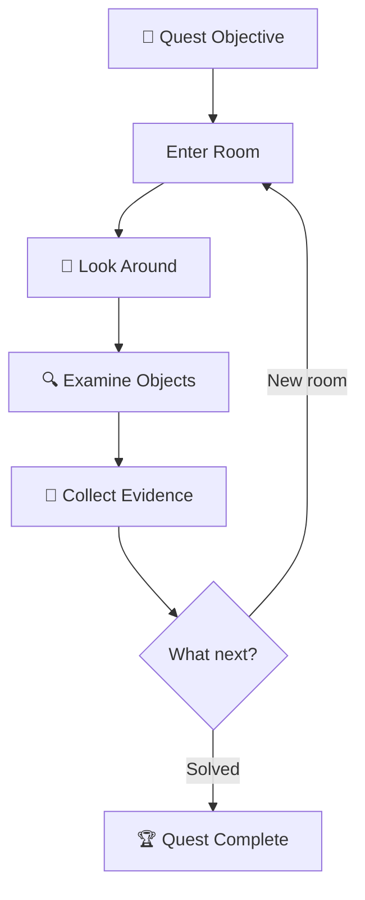
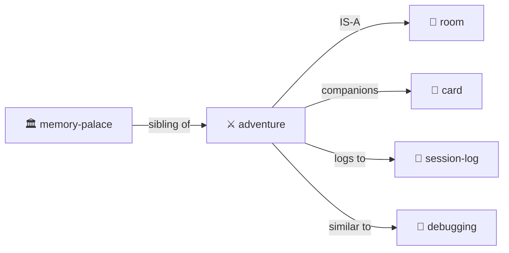

# Adventure

> *"Every directory is a room. Every file is a clue. Navigation is investigation."*

Turn exploration into a quest — or **any simulation** into a hybrid LLM/deterministic CLI.

**Lineage:** Colossal Cave (Crowther & Woods), Scott Adams Adventures, Zork (Infocom), MUD (Bartle), LambdaMOO (Curtis).

**Inherits from:** [simulation/](../simulation/) — all simulation properties plus adventure-specific state.

> [!TIP]
> **This is a general pattern.** Text adventure is the reference implementation, but the same architecture powers city sims, cloud management tools, board games — anything where deterministic transforms meet creative narration.

> [!TIP]
> **Perfect for codebase archaeology.** "Find where the auth bug was introduced" — that's a quest!

## The Premise

An adventure creates a **player** with state, places them in a **room**, and the LLM **dungeon masters** them around.

```yaml
# player.yml
name: Alice
location: entrance-hall
inventory:
  - torch
  - rope
  - notebook
health: 100
notes: "Looking for the lost artifact"
```

**The core loop:**

```
User: "go north"
  → DM: Updates player.location, describes the new room
User: "look around"
  → DM: Reads room YAML, narrates contents atmospherically  
User: "take the rusty key"
  → DM: Moves key to player.inventory, narrates the action
```

**The mapping:**

- **Directories** = Rooms to enter
- **Files** = Clues, artifacts, characters
- **player.yml** = Your state (location, inventory, health)
- **Chat** = How you control your character
- **LLM** = Dungeon Master (narrates, adjudicates, surprises)

This is [Memory Palace](../memory-palace/) with **narrative framing** and a **player character**.

## Multi-User, Multi-Agent (Engelbart NLS tradition)

Naturally supports **multiple simultaneous participants**:

```yaml
# characters/
├── alice.yml        # Human player 1
├── bob.yml          # Human player 2  
├── merchant.yml     # NPC (DM-controlled)
├── guard-bot.yml    # Autonomous bot (action queue)
└── oracle.yml       # LLM agent with own goals
```

**Character types:**

| Type | Controlled By | Example |
|------|---------------|---------|
| **Player Character** | Human via chat | Alice exploring the dungeon |
| **NPC** | DM (LLM) responds when addressed | Merchant sells items |
| **Bot** | Action queue runs autonomously | Guard patrols on schedule |
| **Agent** | LLM with own goals & initiative | Oracle pursues prophecies |

**All coexist in the same world:**

```yaml
# library/ROOM.yml
occupants:
  - alice          # Player exploring
  - bob            # Another player
  - librarian      # NPC who answers questions
  - dust-sprite    # Bot that cleans autonomously
```

## Selection: Current Character or Swarm (Sims/Populous tradition)

Like The Sims and Populous, you have a **selection** — who you're controlling right now:

```yaml
selection:
  mode: single          # or: group, swarm
  current: alice        # commands go to Alice
  
# Or control multiple at once:
selection:
  mode: group
  current: [alice, bob, charlie]  # "go north" moves all three
  
# Or a whole swarm (Populous/Dungeon Keeper style):
selection:
  mode: swarm
  filter: { type: imp, location: mines }
```

**Selection commands:**

| Command | Effect |
|---------|--------|
| `SELECT alice` | Control Alice |
| `SELECT alice, bob` | Control both |
| `SELECT ALL imps` | Swarm control |
| `CYCLE` | Next character in rotation |

**Commands apply to selection:**

```
> SELECT alice, bob, charlie
> go north
Alice goes north.
Bob goes north.  
Charlie goes north.
```

**The coherence engine orchestrates all:**
- Players get chat turns
- NPCs respond when spoken to
- Bots execute their action queues
- Agents pursue goals in background
- **Selection determines who receives your commands**

## Quest Structure



## The Files

```
quest/
├── ADVENTURE.yml     # Quest state
├── LOG.md            # Narrative journal
├── EVIDENCE/         # Collected clues
└── MAP.yml           # Explored territory
```

### ADVENTURE.yml

```yaml
adventure:
  quest: "Find the authentication bug"
  status: in_progress
  
  current_room: "src/auth/"
  rooms_explored: 5
  clues_found: 3
  
  hypothesis: "Session cookie not being set"
  confidence: 0.7
```

### LOG.md

```markdown
# Adventure Log

## Day 1: Entering the Auth Dungeon

I stepped into `src/auth/` — a maze of middleware.

**Clues found:**
- `session.ts` — handles cookie creation
- `middleware.ts` — checks auth state

**Suspicion:** The cookie is created but never sent...
```

## Commands

| Command | Action |
|---------|--------|
| `GO [direction]` | Navigate |
| `LOOK` | Describe current room |
| `EXAMINE [object]` | Study a file |
| `TAKE [object]` | Add to inventory |
| `TALK TO [npc]` | Start conversation |
| `COLLECT [clue]` | Add to evidence |
| `DEDUCE` | Form/update hypothesis |
| `MAP` | Show visited rooms |
| `INVENTORY` | List held items |

## Integration with Cards

[Trading cards](../card/) can be your adventure companions:

```yaml
cards_in_play:
  - card: "Index Owl 🦉"
    goal: "Search for cookie-related code"
  - card: "Git Goblin 🧌"
    goal: "Find when session handling changed"
```

## Python Sister Script CLI (Future)

> **Vision:** Generate a Python CLI simulator that handles deterministic operations, freeing the LLM to focus on narrative and reasoning.

```bash
$ adventure move alice north      # Python handles coordinates
$ adventure lint quest/           # Python validates schemas
$ adventure scan --pending        # Find all pending work
```

### Why Sister Script?

| Operation | Python Does | LLM Does |
|-----------|-------------|----------|
| Parse YAML | ✓ Fast, accurate | Slow, may hallucinate |
| Move character | ✓ Update coordinates | Narrate the journey |
| Check room contents | ✓ List files | Describe atmosphere |
| Detect inconsistencies | ✓ Cross-reference | Explain and repair |

### XSLT for YAML

The CLI works like **XSLT but for YAML and filesystem structure**:

```yaml
# transforms/move-character.yml
trigger:
  pattern:
    file: "*/characters/*.yml"
    has:
      action_queue:
        - action: MOVE
          
transform:
  - update: "character.location = destination"
  - update: "destination/ROOM.yml occupants += character"
emit:
  - event: movement
    for_llm: "Narrate the journey"
```

**The transformation pipeline:**

```
1. SCAN    — Walk directory tree, load YAML files
2. MATCH   — Find patterns that trigger transforms
3. TRANSFORM — Apply deterministic changes
4. EMIT    — Write events for LLM to narrate
```

**Python for precision. LLM for poetry.**

### Attention Scheduling

The CLI acts as an **attention scheduler** — scanning for pending work:

```yaml
# output/attention.yml
focus:
  items:
    - type: inbox
      location: workshop/inbox/
      count: 3
      suggest: "Process incoming messages"
      
    - type: action_queue
      character: bob
      next_action: "COOK dinner"
      suggest: "Execute Bob's next action"
```

**The attention loop:**

```
CLI: Scan world → Find pending work → Rank by priority
  ↓
CLI: Write attention.yml with top items
  ↓
LLM: Read attention.yml → Process items → Write results
  ↓
[repeat]
```

## Evidence Types

| Type | Description | Example |
|------|-------------|---------|
| **Clue** | Information that might matter | "Different test runner versions" |
| **Item** | File worth remembering | CI config, setup.ts |
| **Character** | Code entity with personality | "jest.config.js — Strict about modules" |
| **Map** | Mental model of structure | Directory relationship diagram |

## Room Protocol

When entering any directory:

1. **DESCRIBE** — List contents, note what's here
2. **EXAMINE** — Read interesting files
3. **COLLECT** — Note evidence in adventure log
4. **EXITS** — Note paths to other rooms
5. **DECIDE** — Choose next direction

## Codebase Archaeology

Adventures work for code exploration:

| Adventure | Investigation |
|-----------|--------------|
| Quest | Bug hunt |
| Room | Directory |
| Clue | Evidence |
| Companion | Tool card in play |
| Journal | session-log.md |

## Live Examples

- [examples/adventure-3/](../../examples/adventure-3/) — Full adventure instance
- [examples/adventure-3/ADVENTURE.yml](../../examples/adventure-3/ADVENTURE.yml) — State file
- [examples/adventure-3/pub/](../../examples/adventure-3/pub/) — Room with NPCs

## The Intertwingularity



---

## adventure.py — The CLI Uplift Plan

> **Vision:** A Python CLI that validates, lints, and compiles adventures into standalone browser experiences.

### Commands

```bash
$ adventure.py lint quest/           # Validate schemas, suggest fixes
$ adventure.py compile quest/ -o dist/  # Generate standalone HTML/JS
$ adventure.py serve quest/          # Live preview with hot reload
```

### LINT: The Validator

The linter scans an adventure directory and outputs **events for the LLM to fix**:

```bash
$ adventure.py lint examples/adventure-3/

[WARN] kitchen/ROOM.yml: Missing 'exits' field (standard: north, south, east, west)
[WARN] kitchen/fridge.yml: No 'description' field
[ERROR] maze/room-a/ROOM.yml: 'occupants' references 'guard' but no guard.yml exists
[SUGGEST] characters/player.yml: Add 'skills' field for richer interaction
[UPGRADE] pub/bartender.yml: Old format. Add 'dialogue_tree' for conversations.
```

**Key principle:** The linter does NOT auto-fix. It outputs events for the LLM to read and correct. The LLM has context and judgment.

### Standardized Schemas (Extensible)

Proven useful fields become standard. Custom fields always allowed.

```yaml
# ROOM.yml — Standard Fields
name: Kitchen                    # REQUIRED
description: "A warm, cluttered kitchen..."  # REQUIRED
exits:                           # STANDARD
  north: hallway
  east: pantry
occupants: []                    # STANDARD
objects: [fridge, stove, table]  # STANDARD
ambient: "Smell of fresh bread"  # OPTIONAL
light_level: bright              # OPTIONAL
# ... custom fields welcome ...
```

```yaml
# CHARACTER.yml — Standard Fields  
name: Bartender                  # REQUIRED
description: "A gruff dwarf..."  # REQUIRED
location: pub                    # STANDARD
inventory: []                    # STANDARD
dialogue_tree: {}                # STANDARD (for NPCs)
skills: []                       # STANDARD
mood: neutral                    # OPTIONAL
# ... custom fields welcome ...
```

### COMPILE: Generate Standalone Web Experience

```bash
$ adventure.py compile quest/ -o dist/
```

**Outputs:**

```
dist/
├── index.html           # Self-contained adventure
├── world.json           # Compiled microworld data
├── engine.js            # Adventure simulation engine
├── assets/
│   └── images/          # Generated/provided images
└── manifest.json        # Metadata
```

**The web experience includes:**

1. **Navigation** — Click rooms, use arrow keys, or type commands
2. **Pie Menus** — Right-click objects for contextual actions
3. **Chat Interface** — Text input for complex commands
4. **Inventory Panel** — Drag-and-drop items
5. **Character Panel** — Stats, skills, equipment
6. **Map View** — Auto-generated from room connections

### Smart Objects: Skills for Compilation

Objects can have their own **compilation skills** — YAML instructions that generate deterministic JSON + JavaScript mini-simulations:

```yaml
# owl.yml — Smart Object with Simulation Skill
name: "Index Owl"
type: smart_object
compile_skill: owl-indexer

# The owl skill knows how to:
# 1. Compile YAML → JSON state
# 2. Generate JS for owl behavior (search, fly, perch)
# 3. Create SVG/animation assets
```

**Microworld agents:**

```yaml
# farm.yml — Microworld with Agents
name: "Hopkins Farm"
type: microworld
agents:
  - type: chicken
    count: 6
    behavior: wander, peck, lay_eggs
  - type: cow
    count: 2  
    behavior: graze, moo, produce_milk
    
compile_skill: farm-simulator
# Generates: chickens.js, cows.js with autonomous behaviors
```

### The Compilation Pipeline

```
1. VALIDATE  — Run linter, ensure schemas valid
2. RESOLVE   — Resolve all references (rooms, characters, objects)
3. COMPILE   — Each object uses its compile_skill to generate JSON+JS
4. BUNDLE    — Combine into single index.html with inline assets
5. OPTIMIZE  — Minify, tree-shake unused code
```

### Image Generation Integration

```yaml
# kitchen/ROOM.yml
name: Kitchen
description: "A warm, cluttered kitchen with copper pots hanging..."
image:
  prompt: "Cozy medieval kitchen, copper pots, warm firelight, pixel art style"
  style: pixel_art_32
  generate: true  # adventure.py will call image generator
```

```bash
$ adventure.py generate-images quest/  # Generate all missing images
$ adventure.py compile quest/ --images  # Compile with image generation
```

### Cursor as Authoring System

With this pipeline:

1. **Author in Cursor** — Write YAML rooms, characters, objects
2. **LLM assists** — Generates descriptions, dialogue trees, puzzles
3. **Lint & Fix** — `adventure.py lint` → LLM reads events → fixes files
4. **Preview** — `adventure.py serve` for live testing
5. **Generate Images** — AI creates room/object artwork
6. **Compile** — One-click standalone HTML game
7. **Share** — Upload anywhere, runs in any browser

**Cursor becomes a point-and-click adventure authoring system.**

---

## Dovetails With

### Sister Skills
- [simulation/](../simulation/) — Base class (adventure inherits this)
- [room/](../room/) — Navigation
- [party/](../party/) — Multi-character
- [character/](../character/) — Player/NPC definitions
- [card/](../card/) — Companions on the quest
- [debugging/](../debugging/) — Debugging IS investigation quest
- [session-log/](../session-log/) — Adventure LOG.md is session-log variant

### Kernel
- [kernel/context-assembly-protocol.md](../../kernel/context-assembly-protocol.md) — Working set loading

### lloooomm Heritage

The crown jewels from lloooomm inform this design:

- **Owl Simulation** — Smart objects with autonomous behavior
- **Farm Simulation** — Microworlds with agent populations  
- **Character Instantiation** — YAML characters → JS agents
- **Pie Menus** — Contextual point-and-click interaction
- **Hybrid LLM/Deterministic** — LLM for creativity, code for precision
