# Adventure

> *"Every directory is a room. Every file is a clue. Navigation is investigation."*

Turn exploration into a quest — or **any simulation** into a hybrid LLM/deterministic CLI.

**Lineage:** Colossal Cave (Crowther & Woods), Scott Adams Adventures, Zork (Infocom), MUD (Bartle), LambdaMOO (Curtis).

**Inherits from:** [simulation/](../simulation/) — all simulation properties plus adventure-specific state.

> [!TIP]
> **This is a general pattern.** Text adventure is the reference implementation, but the same architecture powers city sims, cloud management tools, board games — anything where deterministic transforms meet creative narration.

> [!TIP]
> **Perfect for codebase archaeology.** "Find where the auth bug was introduced" — that's a quest!

## The Premise

An adventure creates a **player** with state, places them in a **room**, and the LLM **dungeon masters** them around.

```yaml
# player.yml
name: Alice
location: entrance-hall
inventory:
  - torch
  - rope
  - notebook
health: 100
notes: "Looking for the lost artifact"
```

**The core loop:**

```
User: "go north"
  → DM: Updates player.location, describes the new room
User: "look around"
  → DM: Reads room YAML, narrates contents atmospherically  
User: "take the rusty key"
  → DM: Moves key to player.inventory, narrates the action
```

**The mapping:**

- **Directories** = Rooms to enter
- **Files** = Clues, artifacts, characters
- **player.yml** = Your state (location, inventory, health)
- **Chat** = How you control your character
- **LLM** = Dungeon Master (narrates, adjudicates, surprises)

This is [Memory Palace](../memory-palace/) with **narrative framing** and a **player character**.

## Multi-User, Multi-Agent (Engelbart NLS tradition)

Naturally supports **multiple simultaneous participants**:

```yaml
# characters/
├── alice.yml        # Human player 1
├── bob.yml          # Human player 2  
├── merchant.yml     # NPC (DM-controlled)
├── guard-bot.yml    # Autonomous bot (action queue)
└── oracle.yml       # LLM agent with own goals
```

**Character types:**

| Type | Controlled By | Example |
|------|---------------|---------|
| **Player Character** | Human via chat | Alice exploring the dungeon |
| **NPC** | DM (LLM) responds when addressed | Merchant sells items |
| **Bot** | Action queue runs autonomously | Guard patrols on schedule |
| **Agent** | LLM with own goals & initiative | Oracle pursues prophecies |

**All coexist in the same world:**

```yaml
# library/ROOM.yml
occupants:
  - alice          # Player exploring
  - bob            # Another player
  - librarian      # NPC who answers questions
  - dust-sprite    # Bot that cleans autonomously
```

## Selection: Current Character or Swarm (Sims/Populous tradition)

Like The Sims and Populous, you have a **selection** — who you're controlling right now:

```yaml
selection:
  mode: single          # or: group, swarm
  current: alice        # commands go to Alice
  
# Or control multiple at once:
selection:
  mode: group
  current: [alice, bob, charlie]  # "go north" moves all three
  
# Or a whole swarm (Populous/Dungeon Keeper style):
selection:
  mode: swarm
  filter: { type: imp, location: mines }
```

**Selection commands:**

| Command | Effect |
|---------|--------|
| `SELECT alice` | Control Alice |
| `SELECT alice, bob` | Control both |
| `SELECT ALL imps` | Swarm control |
| `CYCLE` | Next character in rotation |

**Commands apply to selection:**

```
> SELECT alice, bob, charlie
> go north
Alice goes north.
Bob goes north.  
Charlie goes north.
```

**The coherence engine orchestrates all:**
- Players get chat turns
- NPCs respond when spoken to
- Bots execute their action queues
- Agents pursue goals in background
- **Selection determines who receives your commands**

## Quest Structure

```mermaid
graph TD
    START[🎯 Quest Objective] --> R1[Enter Room]
    R1 --> LOOK[👀 Look Around]
    LOOK --> EXAMINE[🔍 Examine Objects]
    EXAMINE --> COLLECT[📝 Collect Evidence]
    COLLECT --> DECIDE{What next?}
    DECIDE -->|New room| R1
    DECIDE -->|Solved| END[🏆 Quest Complete]
```



## The Files

```
quest/
├── ADVENTURE.yml     # Quest state
├── LOG.md            # Narrative journal
├── EVIDENCE/         # Collected clues
└── MAP.yml           # Explored territory
```

### ADVENTURE.yml

```yaml
adventure:
  quest: "Find the authentication bug"
  status: in_progress
  
  current_room: "src/auth/"
  rooms_explored: 5
  clues_found: 3
  
  hypothesis: "Session cookie not being set"
  confidence: 0.7
```

### LOG.md

```markdown
# Adventure Log

## Day 1: Entering the Auth Dungeon

I stepped into `src/auth/` — a maze of middleware.

**Clues found:**
- `session.ts` — handles cookie creation
- `middleware.ts` — checks auth state

**Suspicion:** The cookie is created but never sent...
```

## Commands

| Command | Action |
|---------|--------|
| `GO [direction]` | Navigate |
| `LOOK` | Describe current room |
| `EXAMINE [object]` | Study a file |
| `TAKE [object]` | Add to inventory |
| `TALK TO [npc]` | Start conversation |
| `COLLECT [clue]` | Add to evidence |
| `DEDUCE` | Form/update hypothesis |
| `MAP` | Show visited rooms |
| `INVENTORY` | List held items |
| `DEBUG` / `DEBUG-ON` | Enable debug mode |
| `DEBUG-OFF` | Disable debug mode |

## Debug Mode

Toggle technical output with `DEBUG-ON` and `DEBUG-OFF`.

**When debug is ON**, logs include collapsible sections showing:
- File operations (creates, edits, deletes, moves)
- State changes with before/after values
- YAML data islands with abbreviated data
- Markdown links to all referenced files
- Technical narrative explaining HOW and WHY

**Example debug output:**

```html
<details>
<summary>📂 <strong>Editing CHARACTER.yml to update player location from start/ to coatroom/</strong></summary>

```yaml
# State change (CHARACTER.yml is canonical)
player:
  location: start/  →  coatroom/  # Character owns their location
```

The character file owns location state. ADVENTURE.yml mirrors it for convenience.

**Files affected:**
- [CHARACTER.yml](./CHARACTER.yml) — canonical location updated
- [ADVENTURE.yml](../../ADVENTURE.yml) — mirror updated

</details>
```

**When debug is OFF**, output is clean narrative without technical sections.

**Customize with natural language:**
```
> DEBUG-FORMAT Show only file operations, skip YAML, use 🔧 emoji
```

The `format` field in ADVENTURE.yml accepts natural language instructions for how to format debug output.

## Integration with Cards

[Trading cards](../card/) can be your adventure companions:

```yaml
cards_in_play:
  - card: "Index Owl 🦉"
    goal: "Search for cookie-related code"
  - card: "Git Goblin 🧌"
    goal: "Find when session handling changed"
```

## Python Sister Script CLI (Future)

> **Vision:** Generate a Python CLI simulator that handles deterministic operations, freeing the LLM to focus on narrative and reasoning.

```bash
$ adventure move alice north      # Python handles coordinates
$ adventure lint quest/           # Python validates schemas
$ adventure scan --pending        # Find all pending work
```

### Why Sister Script?

| Operation | Python Does | LLM Does |
|-----------|-------------|----------|
| Parse YAML | ✓ Fast, accurate | Slow, may hallucinate |
| Move character | ✓ Update coordinates | Narrate the journey |
| Check room contents | ✓ List files | Describe atmosphere |
| Detect inconsistencies | ✓ Cross-reference | Explain and repair |

### XSLT for YAML

The CLI works like **XSLT but for YAML and filesystem structure**:

```yaml
# transforms/move-character.yml
trigger:
  pattern:
    file: "*/characters/*.yml"
    has:
      action_queue:
        - action: MOVE
          
transform:
  - update: "character.location = destination"
  - update: "destination/ROOM.yml occupants += character"
emit:
  - event: movement
    for_llm: "Narrate the journey"
```

**The transformation pipeline:**

```
1. SCAN    — Walk directory tree, load YAML files
2. MATCH   — Find patterns that trigger transforms
3. TRANSFORM — Apply deterministic changes
4. EMIT    — Write events for LLM to narrate
```

**Python for precision. LLM for poetry.**

### Attention Scheduling

The CLI acts as an **attention scheduler** — scanning for pending work:

```yaml
# output/attention.yml
focus:
  items:
    - type: inbox
      location: workshop/inbox/
      count: 3
      suggest: "Process incoming messages"
      
    - type: action_queue
      character: bob
      next_action: "COOK dinner"
      suggest: "Execute Bob's next action"
```

**The attention loop:**

```
CLI: Scan world → Find pending work → Rank by priority
  ↓
CLI: Write attention.yml with top items
  ↓
LLM: Read attention.yml → Process items → Write results
  ↓
[repeat]
```

## Evidence Types

| Type | Description | Example |
|------|-------------|---------|
| **Clue** | Information that might matter | "Different test runner versions" |
| **Item** | File worth remembering | CI config, setup.ts |
| **Character** | Code entity with personality | "jest.config.js — Strict about modules" |
| **Map** | Mental model of structure | Directory relationship diagram |

## Room Protocol

When entering any directory:

1. **DESCRIBE** — List contents, note what's here
2. **EXAMINE** — Read interesting files
3. **COLLECT** — Note evidence in adventure log
4. **EXITS** — Note paths to other rooms
5. **DECIDE** — Choose next direction

## Codebase Archaeology

Adventures work for code exploration:

| Adventure | Investigation |
|-----------|--------------|
| Quest | Bug hunt |
| Room | Directory |
| Clue | Evidence |
| Companion | Tool card in play |
| Journal | session-log.md |

## Live Examples

**Best example: [examples/adventure-4/](../../examples/adventure-4/)** — The gold standard.

### The Pub (Crown Jewel)

[examples/adventure-4/pub/](../../examples/adventure-4/pub/) — A complete social space:

```
pub/
├── ROOM.yml              # Themeable tavern (6 themes!)
├── bartender.yml         # NPC with 6 identity variants
├── pie-table.yml         # Octagonal debate table
├── gong.yml              # Gong of Gezelligheid
├── bar/
│   ├── bartender.yml     # The omniscient bartender
│   ├── budtender-marieke.yml
│   └── cat-cave/         # TARDIS-like cat sanctuary
│       ├── ROOM.yml
│       └── 10 cats (Terpie, Stroopwafel, kittens...)
├── arcade/               # Pacman, Pong, Pinball, Fruit Machine
├── games/                # Chess, Darts, Cards
├── stage/
│   └── palm-nook/        # Multi-room character space
│       ├── study/        # Infinite typewriters, infinity desk
│       ├── gym/          # Infinite climb
│       ├── play/
│       └── rest/         # Hammock, silence cushion
└── menus/                # Drinks, snacks, buds, games
```

### Key Patterns from adventure-4

**Themeable NPCs** (bartender.yml):
```yaml
identity:
  classic_adventure:
    name: Grim
    appearance: "Weathered human, salt-and-pepper beard..."
  space_cantina:
    name: Z-4RT
    appearance: "Multi-armed service droid..."
  cyberpunk_bar:
    name: Nyx
    appearance: "Chrome-implanted bartender..."
```

**Themeable Rooms** (pub/ROOM.yml):
```yaml
theme:
  current: classic_adventure
  themes:
    classic_adventure:
      name: "The Rusty Lantern"
      bartender: "Grim, a weathered human"
      menu: ["Ale (1 gold)", "Mystery meat pie (3 gold)"]
    space_cantina:
      name: "The Rusty Hyperdrive"
      bartender: "Z-4RT, a droid with too many arms"
      menu: ["Blue milk (1 credit)", "Bantha burger"]
```

**Rich Activities**:
```yaml
activities:
  PERFORM: { venue: stage, effects: [tips, drinks_thrown] }
  DEBATE: { venue: pie_table, rules: roberts_rules }
  RING-GONG: { protocols: [once: attention, twice: emergency, thrice: mercy] }
  CELEBRATE: { effects: [free_round, +morale, everyone_toasts] }
```

**Framing Protocol** (for tribute performances):
```yaml
framing:
  mode: [performance, celebration, tribute]
  tribute_protocol:
    invocation: "Before they arrive, acknowledge we're summoning them"
    performance: "Depicting them as we imagine their best selves"
    acknowledgment: "After they depart, note this was a tribute"
```

### Other Examples

- [examples/adventure-3/](../../examples/adventure-3/) — Earlier version, still useful
- [examples/adventure-1/](../../examples/adventure-1/) — Minimal starting point
- [examples/adventure-2/](../../examples/adventure-2/) — Extended exploration

## The Intertwingularity

```mermaid
graph LR
    AP[⚔️ adventure] -->|IS-A| R[🚪 room]
    AP -->|companions| TC[🎴 card]
    AP -->|logs to| SL[📜 session-log]
    AP -->|similar to| DB[🔧 debugging]
    MP[🏛️ memory-palace] -->|sibling of| AP
```



---

## adventure.py — The CLI Uplift Plan

> **Vision:** A Python CLI that validates, lints, and compiles adventures into standalone browser experiences.

### Commands

```bash
$ adventure.py lint quest/           # Validate schemas, suggest fixes
$ adventure.py compile quest/ -o dist/  # Generate standalone HTML/JS
$ adventure.py serve quest/          # Live preview with hot reload
```

### LINT: The Validator

The linter scans an adventure directory and outputs **events for the LLM to fix**:

```bash
$ adventure.py lint examples/adventure-3/

[WARN] kitchen/ROOM.yml: Missing 'exits' field (standard: north, south, east, west)
[WARN] kitchen/fridge.yml: No 'description' field
[ERROR] maze/room-a/ROOM.yml: 'occupants' references 'guard' but no guard.yml exists
[SUGGEST] characters/player.yml: Add 'skills' field for richer interaction
[UPGRADE] pub/bartender.yml: Old format. Add 'dialogue_tree' for conversations.
```

**Key principle:** The linter does NOT auto-fix. It outputs events for the LLM to read and correct. The LLM has context and judgment.

### Empathic Expressions → Static Execution Data

**Key insight:** The linter can ask the LLM to generate **static data** that the compiled JavaScript knows how to execute.

**Empathic expressions** are high-level behavioral intentions that make sense to an LLM reading them empathically:

```yaml
# In YAML (empathic, readable)
behavior:
  mood: curious
  patrol_pattern: "wander between rooms, investigate sounds"
  when_startled: "freeze, then flee to nearest hiding spot"
  preferred_hiding: [under_furniture, dark_corners, behind_curtains]
```

The linter asks the LLM to compile this into **static execution data**:

```yaml
# Generated by LLM, executable by JS engine
compiled_behavior:
  patrol_waypoints: [room_a, room_b, room_c, room_a]  # Concrete path
  patrol_speed: 0.5
  sound_response:
    type: investigate
    radius: 3
    delay_turns: 1
  startle_response:
    freeze_duration: 2
    flee_targets: ["under_bed", "corner_shadow", "curtain_3"]
    flee_speed: 2.0
```

**The bidirectional flow:**

```
┌─────────────────────────────────────────────────────────────────┐
│ CURSOR / LLM ENVIRONMENT                                        │
│                                                                 │
│   Empathic YAML ──→ LLM reads with understanding                │
│        ↓                                                        │
│   LINT asks: "Compile this to execution data"                   │
│        ↓                                                        │
│   LLM generates: Static JSON/YAML the JS can execute            │
│                                                                 │
└─────────────────────────────────────────────────────────────────┘
                              ↓
┌─────────────────────────────────────────────────────────────────┐
│ COMPILED BROWSER EXPERIENCE                                     │
│                                                                 │
│   engine.js reads compiled_behavior                             │
│   Executes deterministically: waypoint → waypoint → waypoint    │
│   No LLM needed at runtime!                                     │
│                                                                 │
│   Complex situations → escalate to LLM (if available)           │
│                                                                 │
└─────────────────────────────────────────────────────────────────┘
```

**Lint event for missing execution data:**

```bash
$ adventure.py lint quest/

[COMPILE] creatures/cat.yml: Has 'behavior' (empathic) but no 'compiled_behavior'
          → LLM: Please generate static execution data for this creature.
          
[COMPILE] objects/music-box.yml: Has 'when_played' but no 'play_sequence'
          → LLM: Compile the musical behavior to a note sequence.
```

**The LLM's job:** Transform empathic descriptions into deterministic parameters and data (like in character dialog), and to generate runtime JavaScript code to bring that data to life.

### Runtime Expressions: JavaScript and JSON in YAML

**Even cooler:** The LLM can generate YAML with **embedded JavaScript expressions** for runtime evaluation in the browser! 
As well as the entire JavaScript runtime adventure engine.

```yaml
# creature.yml — With runtime expressions
compiled_behavior:
  patrol_waypoints: [room_a, room_b, room_c]
  patrol_speed: 0.5
  
  # JavaScript expressions for runtime randomness!
  expressions:
    wander_delay: "2 + Math.random() * 3"           # 2-5 turns
    flee_chance: "player.intimidation > 5 ? 0.8 : 0.3"
    damage_roll: "roll('1d6') + this.strength"      # Dice!
    greeting: "pick_random(this.greetings)"         # Variation
    mood_shift: "this.hunger > 50 ? 'aggressive' : 'curious'"
```

**The browser JS engine evaluates these at runtime:**

```javascript
// engine.js — Expression evaluator
function evalExpr(expr, context) {
  const { player, this: self, roll, pick_random } = context;
  return eval(expr);  // Safe in sandboxed adventure context
}

// Dice roller
function roll(dice) {
  const [count, sides] = dice.split('d').map(Number);
  return Array(count).fill().reduce(sum => 
    sum + Math.floor(Math.random() * sides) + 1, 0);
}
```

**What expressions enable:**

| Expression Type | Example | Purpose |
|-----------------|---------|---------|
| **Dice** | `roll('2d6+3')` | Combat, skill checks |
| **Random pick** | `pick_random(responses)` | Dialogue variation |
| **Conditionals** | `hp < 10 ? 'wounded' : 'healthy'` | State-based behavior |
| **Math** | `base_price * (1 - haggle_skill/100)` | Economy |
| **Time** | `turn % 10 === 0` | Periodic events |
| **Proximity** | `distance(player, this) < 3` | Spatial triggers |

---

## The Full Pipeline

```
┌─────────────────────────────────────────────────────────────────┐
│  1. AUTHOR                                                      │
│     Write empathic YAML in Cursor                               │
│     (readable, expressive, human/LLM-friendly)                  │
└─────────────────────────────────────────────────────────────────┘
                              ↓
┌─────────────────────────────────────────────────────────────────┐
│  2. LINT                                                        │
│     $ adventure.py lint quest/                                  │
│                                                                 │
│     Validates schemas, cross-references, consistency            │
│     Outputs events for LLM to fix:                              │
│       [WARN] Missing description                                │
│       [ERROR] Broken reference                                  │
│       [COMPILE] Needs execution data                            │
│       [HINT] Consider adding dialogue tree                      │
└─────────────────────────────────────────────────────────────────┘
                              ↓
┌─────────────────────────────────────────────────────────────────┐
│  3. LLM COMPILES                                                │
│     The LLM acts as the compiler!                               │
│                                                                 │
│     Linted YAML  ──→  HTML + CSS + JSON + JavaScript            │
│                                                                 │
│     - Generates compiled_behavior with JS expressions           │
│     - Creates navigation structure                              │
│     - Builds dialogue trees                                     │
│     - Produces image generation prompts                         │
└─────────────────────────────────────────────────────────────────┘
                              ↓
┌─────────────────────────────────────────────────────────────────┐
│  4. BROWSER RUNTIME                                             │
│                                                                 │
│  ┌──────────────────────────────────────────────────────────┐   │
│  │  ┌─────────────┐  ┌────────────────────────────────────┐ │   │
│  │  │             │  │  💬 SCROLLING CHAT                  │ │   │
│  │  │  🖼️ IMAGE   │  │                                     │ │   │
│  │  │  (generated)│  │  You enter the pub. A fire          │ │   │
│  │  │             │  │  crackles in the hearth...          │ │   │
│  │  │             │  │                                     │ │   │
│  │  │             │  │  > The bartender nods at you.       │ │   │
│  │  │             │  │                                     │ │   │
│  │  └─────────────┘  └─────────────────────────────────────┘ │   │
│  │                                                           │   │
│  │  ┌──────────────────────────────────────────────────────┐ │   │
│  │  │  🎯 POINT-AND-CLICK COMMANDS                         │ │   │
│  │  │                                                      │ │   │
│  │  │  [Bartender] [Fireplace] [Notice Board] [Door→]      │ │   │
│  │  │                                                      │ │   │
│  │  │  Right-click → PIE MENU                              │ │   │
│  │  │       ╭─────╮                                        │ │   │
│  │  │      ╱ TALK  ╲                                       │ │   │
│  │  │     │   TO    │                                      │ │   │
│  │  │  ASK ●───────● ORDER                                 │ │   │
│  │  │     │ ABOUT  │                                       │ │   │
│  │  │      ╲       ╱                                       │ │   │
│  │  │       ╰─────╯                                        │ │   │
│  │  └──────────────────────────────────────────────────────┘ │   │
│  │                                                           │   │
│  │  ┌──────────────────────────────────────────────────────┐ │   │
│  │  │  ⌨️ TEXT INPUT                                       │ │   │
│  │  │  > _                                                 │ │   │
│  │  └──────────────────────────────────────────────────────┘ │   │
│  └───────────────────────────────────────────────────────────┘   │
│                                                                  │
│  engine.js evaluates expressions:                                │
│    - roll('1d20') for skill checks                               │
│    - pick_random() for dialogue variation                        │
│    - Conditional state changes                                   │
│                                                                  │
│  Complex situations → escalate to LLM API (optional)             │
└──────────────────────────────────────────────────────────────────┘
```

### adventure.py — The Linter & Hinter

```bash
$ adventure.py lint quest/

# Schema validation
[ERROR] maze/room-x/ROOM.yml: Missing required 'name' field
[WARN]  pub/drunk.yml: No 'description' — add for atmosphere

# Cross-reference checking  
[ERROR] start/ROOM.yml: Exit 'north' points to 'hallway/' which doesn't exist
[WARN]  characters/guard.yml: 'patrol_route' references rooms not in map

# Compilation hints
[COMPILE] creatures/cat.yml: Has 'behavior' but no 'compiled_behavior'
          → LLM: Generate static execution data with JS expressions

[COMPILE] objects/dice.yml: Needs 'roll_expression' for runtime evaluation
          → LLM: Add expressions like "roll('2d6')"

# Improvement suggestions
[HINT] pub/bartender.yml: Rich NPC — consider adding 'dialogue_tree'
[HINT] maze/: 12 rooms but no 'ambient' fields — add atmosphere!
[UPGRADE] quest/ADVENTURE.yml: Old format — add 'theme' support

# Image generation prompts
[IMAGE] pub/ROOM.yml: No 'image_prompt' — generate one for visual mode
        → LLM: Write prompt for "warm tavern with crackling fire"
```

### Standardized Schemas (Extensible)

Proven useful fields become standard. Custom fields always allowed.

```yaml
# ROOM.yml — Standard Fields
name: Kitchen                    # REQUIRED
description: "A warm, cluttered kitchen..."  # REQUIRED
exits:                           # STANDARD
  north: hallway
  east: pantry
occupants: []                    # STANDARD
objects: [fridge, stove, table]  # STANDARD
ambient: "Smell of fresh bread"  # OPTIONAL
light_level: bright              # OPTIONAL
# ... custom fields welcome ...
```

```yaml
# CHARACTER.yml — Standard Fields  
name: Bartender                  # REQUIRED
description: "A gruff dwarf..."  # REQUIRED
location: pub                    # STANDARD
inventory: []                    # STANDARD
dialogue_tree: {}                # STANDARD (for NPCs)
skills: []                       # STANDARD
mood: neutral                    # OPTIONAL
# ... custom fields welcome ...
```

### COMPILE: Generate Standalone Web Experience

```bash
$ adventure.py compile quest/ -o dist/
```

**Outputs:**

```
dist/
├── index.html           # Self-contained adventure
├── world.json           # Compiled microworld data
├── engine.js            # Adventure simulation engine
├── assets/
│   └── images/          # Generated/provided images
└── manifest.json        # Metadata
```

**The web experience includes:**

1. **Navigation** — Click rooms, use arrow keys, or type commands
2. **Pie Menus** — Right-click objects for contextual actions
3. **Chat Interface** — Text input for complex commands
4. **Inventory Panel** — Drag-and-drop items
5. **Character Panel** — Stats, skills, equipment
6. **Map View** — Auto-generated from room connections

### Smart Objects: Skills for Compilation

Objects can have their own **compilation skills** — YAML instructions that generate deterministic JSON + JavaScript mini-simulations:

```yaml
# owl.yml — Smart Object with Simulation Skill
name: "Index Owl"
type: smart_object
compile_skill: owl-indexer

# The owl skill knows how to:
# 1. Compile YAML → JSON state
# 2. Generate JS for owl behavior (search, fly, perch)
# 3. Create SVG/animation assets
```

**Microworld agents:**

```yaml
# farm.yml — Microworld with Agents
name: "Hopkins Farm"
type: microworld
agents:
  - type: chicken
    count: 6
    behavior: wander, peck, lay_eggs
  - type: cow
    count: 2  
    behavior: graze, moo, produce_milk
    
compile_skill: farm-simulator
# Generates: chickens.js, cows.js with autonomous behaviors
```

### The Compilation Pipeline

```
1. VALIDATE  — Run linter, ensure schemas valid
2. RESOLVE   — Resolve all references (rooms, characters, objects)
3. COMPILE   — Each object uses its compile_skill to generate JSON+JS
4. BUNDLE    — Combine into single index.html with inline assets
5. OPTIMIZE  — Minify, tree-shake unused code
```

### Image Generation Integration

```yaml
# kitchen/ROOM.yml
name: Kitchen
description: "A warm, cluttered kitchen with copper pots hanging..."
image:
  prompt: "Cozy medieval kitchen, copper pots, warm firelight, pixel art style"
  style: pixel_art_32
  generate: true  # adventure.py will call image generator
```

```bash
$ adventure.py generate-images quest/  # Generate all missing images
$ adventure.py compile quest/ --images  # Compile with image generation
```

### Cursor as Authoring System

With this pipeline:

1. **Author in Cursor** — Write YAML rooms, characters, objects
2. **LLM assists** — Generates descriptions, dialogue trees, puzzles
3. **Lint & Fix** — `adventure.py lint` → LLM reads events → fixes files
4. **Preview** — `adventure.py serve` for live testing
5. **Generate Images** — AI creates room/object artwork
6. **Compile** — One-click standalone HTML game
7. **Share** — Upload anywhere, runs in any browser

**Cursor becomes a point-and-click adventure authoring system.**

---

## Inspiration: Scott Adams, Don Hopkins & Memory Palaces

This system is directly inspired by a [Hacker News conversation (Nov 2021)](https://news.ycombinator.com/item?id=29316066) between **Scott Adams** (creator of *Adventureland*, the first commercial text adventure, 1978) and **Don Hopkins** (SimCity, The Sims, pie menus).

### The Method of Loci Connection

Don Hopkins asked Scott Adams:

> *"How do you think Adventure games are like the Method of Loci, or Memory Palaces, in that they can help you remember and retrieve vast amounts of information geographically?"*

The [Method of Loci](https://en.wikipedia.org/wiki/Method_of_loci) is an ancient memory technique — you imagine walking through a building, placing items to remember at different locations. When you need to recall them, you mentally walk the same path.

**Adventure games ARE memory palaces.** The rooms, objects, and spatial relationships create lasting mental maps.

### Pie Menus = Room Navigation

Don Hopkins realized:

> *"Eventually I realized that 4-item and 8-item pie menus are the essential elements of an Adventure map, as long as you think of 'menus' as rooms in a map with two-way links that you can move back and forth through, instead of a hierarchal tree of menus with one-way exits!"*

```
      N
      ↑
  NW ↖ ↗ NE
 W ←  ●  → E     Pie menu = Room exits = Memory palace navigation
  SW ↙ ↘ SE
      ↓
      S
```

This is why our compiled adventures use pie menus — they're not just UI, they're **spatial memory**.

### Code as Buildings

Don Hopkins visualizes code as memory palaces:

> *"Each function is a little building like an office or a shop, which has a sign out front telling what services or products it sells, and contains everything inside you need to solve some kind of problem.*
> 
> *You're standing behind the front counter, just about to receive a customer though the front entrance door with the parameters you need for one particular instance of that problem.*
> 
> *You go into the back room, solve the problem, then deliver the results out the exit door at the back of the building."*

See: [Nassi-Shneiderman diagrams](https://en.wikipedia.org/wiki/Nassi%E2%80%93Shneiderman_diagram) — structured flowcharts that look like building floor plans.

### The Vision: Archives as Adventures

Both Scott Adams and Don Hopkins want to publish their **papers, articles, emails, and biographies as interactive adventures**:

```yaml
# scott-adams-archive/
archive:
  name: "Scott Adams Interactive Archive"
  
  rooms:
    office_1978/:
      description: "The room where Adventureland was born"
      objects:
        - trs80.yml              # The original machine
        - yellow_legal_pad.yml   # Early puzzle designs
        - cassette_tapes.yml     # First distribution medium
      papers:
        - "Cramming a world into 16K"
        
    correspondence/:
      description: "Letters across decades"
      characters:
        - infocom_founders.yml   # The friendly rivalry
        - fans.yml               # Letters from players
        
# don-hopkins-archive/
archive:
  name: "Don Hopkins Interactive Archive"
  
  rooms:
    pie_menu_lab/:
      description: "Where pie menus were invented"
      objects:
        - pie_menu_demo.yml      # Working demo!
        - dr_dobbs_article.yml   # 1991 paper, explorable
        
    cellular_automata/:
      objects:
        - conway_life.yml        # Playable Game of Life
        - wireworld.yml          # Circuit simulation
        - langtons_ant.yml       # Emergent behavior
        
    sims_archaeology/:
      description: "The Sims object system"
      objects:
        - simantics.yml          # The behavior engine
        - edith.yml              # The editor
```

### What This Enables

| Traditional Archive | Adventure Archive |
|---------------------|-------------------|
| Read papers linearly | Explore rooms of ideas |
| Static biography | Talk to younger/older selves |
| Download files | Interact with objects |
| Search text | Ask characters questions |
| Passive consumption | Active discovery |

**The archive becomes alive.** You don't just read about the TRS-80 — you examine it, poke at it, hear Scott's voice explaining what each part meant.

### The Lineage

Don Hopkins built multiple iterations of this vision:

1. **DreamScape** (1995, WWDC) — ScriptX implementation
2. **MediaGraph** (Unity3D) — Music navigation for Will Wright's Stupid Fun Club  
3. **iLoci** (2008, iPhone) — Memory palace app

Each iteration: *"a little different and a little better, as technology advanced."*

**Now it's our turn.** Cursor + LLM + this adventure system = the next iteration.

### The Banned Magic

The Method of Loci was **banned by the Puritans in 1584** for evoking "bizarre and irrelevant" imagery. 

Don Hopkins notes:

> *"Mnemonics was seen as dangerous and magical and heretical back in the Medieval world... And they were right, fortunately: Dangerous magic that works by evoking bizarre and irrelevant imagery can be quite useful as well as entertaining!"*

We're bringing it back. 🏰✨

---

## Dovetails With

### Sister Skills
- [simulation/](../simulation/) — Base class (adventure inherits this)
- [room/](../room/) — Navigation
- [party/](../party/) — Multi-character
- [character/](../character/) — Player/NPC definitions
- [card/](../card/) — Companions on the quest
- [debugging/](../debugging/) — Debugging IS investigation quest
- [session-log/](../session-log/) — Adventure LOG.md is session-log variant

### Kernel
- [kernel/context-assembly-protocol.md](../../kernel/context-assembly-protocol.md) — Working set loading

### lloooomm Heritage — The Crown Jewels

The Shneiderman Owl Simulation demonstrates the architecture:

**Entity Classes (YAML → JavaScript):**

```yaml
# owl.yml (YAML definition)
name: "Nightwatch-7"
type: owl
timezone: "America/Los_Angeles"
behaviors: [patrol, hunt, drone]
stats:
  energy: 100
  catches: 0
  altitude: 50
```

↓ **Compiles to** ↓

```javascript
// owl.js (Generated JavaScript)
class Owl {
    constructor(id, timezone) {
        this.id = id;
        this.wizzy = generateWizzyId(id);  // Unique identifier
        this.position = { x: 0, y: 0, z: 50 };
        this.velocity = { x: 0, y: 0, z: 0 };
        this.energy = 100;
        this.status = 'patrolling';
    }
    
    patrol(owls) {
        // 3D flocking behavior (boids algorithm)
        const alignment = this.calculateAlignment(owls);
        const cohesion = this.calculateCohesion(owls);
        const separation = this.calculateSeparation(owls);
        // ...
    }
    
    hunt(mice) {
        // Predator-prey behavior
        const nearest = this.findNearestMouse(mice);
        if (nearest && this.canCatch(nearest)) {
            return this.attemptCatch(nearest);
        }
    }
}
```

**Key Patterns:**

| Pattern | YAML | JavaScript |
|---------|------|------------|
| **Position** | `location: forest-clearing` | `{ x, y, z }` + pathfinding |
| **Behaviors** | `behaviors: [patrol, hunt]` | Methods with state machines |
| **Stats** | `energy: 100` | Properties with update loops |
| **Flocking** | `flock_with: owls` | Boids: alignment, cohesion, separation |
| **Prey/Predator** | `hunts: mice` | Nearest-neighbor detection |

**The Projection:**

```
┌─────────────────────────────────────────────────────────────┐
│  LLM SIMULATION (Full Context)                              │
│  - Rich dialogue, emergent stories                          │
│  - Creative problem solving                                 │
│  - Ambiguous situation handling                             │
└──────────────────────┬──────────────────────────────────────┘
                       │ COMPILE
                       ▼
┌─────────────────────────────────────────────────────────────┐
│  BROWSER PROJECTION (Deterministic)                         │
│  - Point-and-click navigation                               │
│  - Pie menus for actions                                    │
│  - Real-time entity simulation (60 FPS)                     │
│  - Chat interface for complex commands                      │
└─────────────────────────────────────────────────────────────┘
```

The browser version is a **projection** — a deterministic shadow of the full LLM-powered simulation. Simple interactions run locally in JavaScript. Complex situations escalate to the LLM.

**Pie Menu Integration:**

```javascript
// Right-click on entity → contextual actions
showPieMenu(entity, [
    { label: "Examine", action: () => examine(entity) },
    { label: "Talk", action: () => startDialogue(entity) },
    { label: "Take", action: () => addToInventory(entity) },
    { label: "Use", action: () => useItem(entity) },
]);
```

**Microworld Populations:**

```yaml
# farm-microworld.yml
entities:
  chickens:
    count: 6
    behaviors: [wander, peck, lay_eggs]
    spawn_area: barnyard
    
  cows:
    count: 2
    behaviors: [graze, moo, produce_milk]
    spawn_area: pasture
    
  farmer:
    type: npc
    behaviors: [collect_eggs, milk_cows, feed_animals]
    schedule:
      06:00: wake_up
      07:00: collect_eggs
      08:00: milk_cows
```

The compiler instantiates these as autonomous JavaScript agents with behavior loops.
