# Adventure

> *"Every directory is a room. Every file is a clue. Navigation is investigation."*

Turn exploration into a quest — or **any simulation** into a hybrid LLM/deterministic CLI.

**Lineage:** Colossal Cave (Crowther & Woods), Scott Adams Adventures, Zork (Infocom), MUD (Bartle), LambdaMOO (Curtis).

**Inherits from:** [simulation/](../simulation/) — all simulation properties plus adventure-specific state.

> [!TIP]
> **This is a general pattern.** Text adventure is the reference implementation, but the same architecture powers city sims, cloud management tools, board games — anything where deterministic transforms meet creative narration.

> [!TIP]
> **Perfect for codebase archaeology.** "Find where the auth bug was introduced" — that's a quest!

## The Premise

An adventure creates a **player** with state, places them in a **room**, and the LLM **dungeon masters** them around.

```yaml
# player.yml
name: Alice
location: entrance-hall
inventory:
  - torch
  - rope
  - notebook
health: 100
notes: "Looking for the lost artifact"
```

**The core loop:**

```
User: "go north"
  → DM: Updates player.location, describes the new room
User: "look around"
  → DM: Reads room YAML, narrates contents atmospherically  
User: "take the rusty key"
  → DM: Moves key to player.inventory, narrates the action
```

**The mapping:**

- **Directories** = Rooms to enter
- **Files** = Clues, artifacts, characters
- **player.yml** = Your state (location, inventory, health)
- **Chat** = How you control your character
- **LLM** = Dungeon Master (narrates, adjudicates, surprises)

This is [Memory Palace](../memory-palace/) with **narrative framing** and a **player character**.

## Multi-User, Multi-Agent (Engelbart NLS tradition)

Naturally supports **multiple simultaneous participants**:

```yaml
# characters/
├── alice.yml        # Human player 1
├── bob.yml          # Human player 2  
├── merchant.yml     # NPC (DM-controlled)
├── guard-bot.yml    # Autonomous bot (action queue)
└── oracle.yml       # LLM agent with own goals
```

**Character types:**

| Type | Controlled By | Example |
|------|---------------|---------|
| **Player Character** | Human via chat | Alice exploring the dungeon |
| **NPC** | DM (LLM) responds when addressed | Merchant sells items |
| **Bot** | Action queue runs autonomously | Guard patrols on schedule |
| **Agent** | LLM with own goals & initiative | Oracle pursues prophecies |

**All coexist in the same world:**

```yaml
# library/ROOM.yml
occupants:
  - alice          # Player exploring
  - bob            # Another player
  - librarian      # NPC who answers questions
  - dust-sprite    # Bot that cleans autonomously
```

## Selection: Current Character or Swarm (Sims/Populous tradition)

Like The Sims and Populous, you have a **selection** — who you're controlling right now:

```yaml
selection:
  mode: single          # or: group, swarm
  current: alice        # commands go to Alice
  
# Or control multiple at once:
selection:
  mode: group
  current: [alice, bob, charlie]  # "go north" moves all three
  
# Or a whole swarm (Populous/Dungeon Keeper style):
selection:
  mode: swarm
  filter: { type: imp, location: mines }
```

**Selection commands:**

| Command | Effect |
|---------|--------|
| `SELECT alice` | Control Alice |
| `SELECT alice, bob` | Control both |
| `SELECT ALL imps` | Swarm control |
| `CYCLE` | Next character in rotation |

**Commands apply to selection:**

```
> SELECT alice, bob, charlie
> go north
Alice goes north.
Bob goes north.  
Charlie goes north.
```

**The coherence engine orchestrates all:**
- Players get chat turns
- NPCs respond when spoken to
- Bots execute their action queues
- Agents pursue goals in background
- **Selection determines who receives your commands**

## Quest Structure

```mermaid
graph TD
    START[🎯 Quest Objective] --> R1[Enter Room]
    R1 --> LOOK[👀 Look Around]
    LOOK --> EXAMINE[🔍 Examine Objects]
    EXAMINE --> COLLECT[📝 Collect Evidence]
    COLLECT --> DECIDE{What next?}
    DECIDE -->|New room| R1
    DECIDE -->|Solved| END[🏆 Quest Complete]
```



## The Files

```
quest/
├── ADVENTURE.yml     # Quest state
├── LOG.md            # Narrative journal
├── EVIDENCE/         # Collected clues
└── MAP.yml           # Explored territory
```

### ADVENTURE.yml

```yaml
adventure:
  quest: "Find the authentication bug"
  status: in_progress
  
  current_room: "src/auth/"
  rooms_explored: 5
  clues_found: 3
  
  hypothesis: "Session cookie not being set"
  confidence: 0.7
```

### LOG.md

```markdown
# Adventure Log

## Day 1: Entering the Auth Dungeon

I stepped into `src/auth/` — a maze of middleware.

**Clues found:**
- `session.ts` — handles cookie creation
- `middleware.ts` — checks auth state

**Suspicion:** The cookie is created but never sent...
```

## Commands

| Command | Action |
|---------|--------|
| `GO [direction]` | Navigate |
| `LOOK` | Describe current room |
| `EXAMINE [object]` | Study a file |
| `TAKE [object]` | Add to inventory |
| `TALK TO [npc]` | Start conversation |
| `COLLECT [clue]` | Add to evidence |
| `DEDUCE` | Form/update hypothesis |
| `MAP` | Show visited rooms |
| `INVENTORY` | List held items |

## Integration with Cards

[Trading cards](../card/) can be your adventure companions:

```yaml
cards_in_play:
  - card: "Index Owl 🦉"
    goal: "Search for cookie-related code"
  - card: "Git Goblin 🧌"
    goal: "Find when session handling changed"
```

## Python Sister Script CLI (Future)

> **Vision:** Generate a Python CLI simulator that handles deterministic operations, freeing the LLM to focus on narrative and reasoning.

```bash
$ adventure move alice north      # Python handles coordinates
$ adventure lint quest/           # Python validates schemas
$ adventure scan --pending        # Find all pending work
```

### Why Sister Script?

| Operation | Python Does | LLM Does |
|-----------|-------------|----------|
| Parse YAML | ✓ Fast, accurate | Slow, may hallucinate |
| Move character | ✓ Update coordinates | Narrate the journey |
| Check room contents | ✓ List files | Describe atmosphere |
| Detect inconsistencies | ✓ Cross-reference | Explain and repair |

### XSLT for YAML

The CLI works like **XSLT but for YAML and filesystem structure**:

```yaml
# transforms/move-character.yml
trigger:
  pattern:
    file: "*/characters/*.yml"
    has:
      action_queue:
        - action: MOVE
          
transform:
  - update: "character.location = destination"
  - update: "destination/ROOM.yml occupants += character"
emit:
  - event: movement
    for_llm: "Narrate the journey"
```

**The transformation pipeline:**

```
1. SCAN    — Walk directory tree, load YAML files
2. MATCH   — Find patterns that trigger transforms
3. TRANSFORM — Apply deterministic changes
4. EMIT    — Write events for LLM to narrate
```

**Python for precision. LLM for poetry.**

### Attention Scheduling

The CLI acts as an **attention scheduler** — scanning for pending work:

```yaml
# output/attention.yml
focus:
  items:
    - type: inbox
      location: workshop/inbox/
      count: 3
      suggest: "Process incoming messages"
      
    - type: action_queue
      character: bob
      next_action: "COOK dinner"
      suggest: "Execute Bob's next action"
```

**The attention loop:**

```
CLI: Scan world → Find pending work → Rank by priority
  ↓
CLI: Write attention.yml with top items
  ↓
LLM: Read attention.yml → Process items → Write results
  ↓
[repeat]
```

## Evidence Types

| Type | Description | Example |
|------|-------------|---------|
| **Clue** | Information that might matter | "Different test runner versions" |
| **Item** | File worth remembering | CI config, setup.ts |
| **Character** | Code entity with personality | "jest.config.js — Strict about modules" |
| **Map** | Mental model of structure | Directory relationship diagram |

## Room Protocol

When entering any directory:

1. **DESCRIBE** — List contents, note what's here
2. **EXAMINE** — Read interesting files
3. **COLLECT** — Note evidence in adventure log
4. **EXITS** — Note paths to other rooms
5. **DECIDE** — Choose next direction

## Codebase Archaeology

Adventures work for code exploration:

| Adventure | Investigation |
|-----------|--------------|
| Quest | Bug hunt |
| Room | Directory |
| Clue | Evidence |
| Companion | Tool card in play |
| Journal | session-log.md |

## Live Examples

- [examples/adventure-3/](../../examples/adventure-3/) — Full adventure instance
- [examples/adventure-3/ADVENTURE.yml](../../examples/adventure-3/ADVENTURE.yml) — State file
- [examples/adventure-3/pub/](../../examples/adventure-3/pub/) — Room with NPCs

## The Intertwingularity

```mermaid
graph LR
    AP[⚔️ adventure] -->|IS-A| R[🚪 room]
    AP -->|companions| TC[🎴 card]
    AP -->|logs to| SL[📜 session-log]
    AP -->|similar to| DB[🔧 debugging]
    MP[🏛️ memory-palace] -->|sibling of| AP
```



## Dovetails With

### Sister Skills
- [simulation/](../simulation/) — Base class (adventure inherits this)
- [room/](../room/) — Navigation
- [party/](../party/) — Multi-character
- [character/](../character/) — Player/NPC definitions
- [card/](../card/) — Companions on the quest
- [debugging/](../debugging/) — Debugging IS investigation quest
- [session-log/](../session-log/) — Adventure LOG.md is session-log variant

### Kernel
- [kernel/context-assembly-protocol.md](../../kernel/context-assembly-protocol.md) — Working set loading
