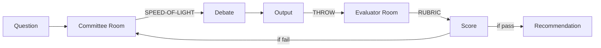

# Adversarial Committee

> *"Ensemble inference over the latent space of possible framings."*

Multiple personas with incompatible values debate to surface blind spots.

## The Roster

```yaml
committee:
  maya:
    propensity: paranoid_realism
    risk_tolerance: low
    epistemology: assume_bad_faith
    surfaces: "Political dynamics, hidden agendas, traps"
    voice: "What aren't they telling us?"
    
  frankie:
    propensity: idealism
    risk_tolerance: high
    epistemology: assume_good_faith
    surfaces: "Value conflicts, missed opportunities"
    voice: "What if this is exactly what it seems?"
    
  joe:
    propensity: continuity_guardian
    risk_tolerance: medium
    epistemology: trust_precedent
    surfaces: "Institutional memory, what worked before"
    voice: "We tried this in 2019..."
    
  vic:
    propensity: evidence_prosecutor
    risk_tolerance: medium
    epistemology: prove_it
    surfaces: "Data gaps, unverified claims"
    voice: "Show me the numbers."
    
  tammy:
    propensity: systems_thinking
    risk_tolerance: varies
    epistemology: trace_feedback_loops
    surfaces: "Unintended consequences, emergent effects"
    voice: "If we do X, then Y will respond by..."
```

## Formation

```yaml
# committee/COMMITTEE.yml
committee:
  name: "Strategy Review Board"
  purpose: "Evaluate client engagement decision"
  
  members:
    - card: maya
      role: devil's_advocate
    - card: frankie
      role: opportunity_scout
    - card: joe
      role: historian
    - card: vic
      role: evidence_checker
    - card: tammy
      role: systems_analyst
      
  protocol: roberts-rules
  evaluation: independent
  rubric: client-evaluation-rubric.yml
```

## Debate Protocol

```yaml
debate:
  rounds:
    - opening_statements:
        each_member: "State position in 2-3 sentences"
        
    - cross_examination:
        pattern: "Maya challenges Frankie, Vic challenges Maya..."
        goal: "Surface hidden assumptions"
        
    - evidence_phase:
        vic_leads: "What do we actually know?"
        others_contribute: "Supporting/contradicting data"
        
    - synthesis:
        tammy_maps: "Feedback loops and consequences"
        all_contribute: "Refined positions"
        
    - final_positions:
        each_member: "Updated stance with confidence"
```

## Speed of Light Simulation

Within ONE LLM call:

```yaml
simulation:
  - maya: "This client's reputation for scope creep concerns me."
  - frankie: "But their budget is aligned and they're excited!"
  - vic: "What's our data on scope creep? Past projects?"
  - joe: "We had a similar client in 2022. It went badly."
  - tammy: "If we take them on, our capacity for other work drops. If they creep, we can't serve existing clients..."
  - maya: "See? Trap."
  - frankie: "Unless we build in explicit scope boundaries..."
```

All personas speak authentically. No entity knows more than it should.

## Calibration

2-3 iterations tuning character behavior:

```yaml
calibration:
  problems:
    excessive_conflict: "Reduce Maya's paranoia from 9 to 7"
    premature_consensus: "Increase Frankie's risk tolerance"
    dead_air: "Give Tammy more initiative"
    
  goal: "Stable equilibrium where genuine exploration happens"
```

## Output Format

```yaml
deliberation:
  question: "Should we take Client X?"
  
  positions:
    maya: { stance: oppose, confidence: 0.8 }
    frankie: { stance: support, confidence: 0.7 }
    joe: { stance: defer, confidence: 0.6 }
    vic: { stance: need_data, confidence: 0.5 }
    tammy: { stance: conditional, confidence: 0.7 }
    
  key_tensions:
    - "Revenue opportunity vs. capacity risk"
    - "Good faith assumption vs. scope creep history"
    
  evidence_gaps:
    - "No data on this client's actual scope creep rate"
    - "Unknown: their internal approval process"
    
  recommendation: "Conditional engagement with explicit scope boundaries"
  confidence: 0.65
  
  for_evaluator: true  # Goes to independent assessment
```

## Commands

| Command | Action |
|---------|--------|
| `CONVENE [committee]` | Activate committee for deliberation |
| `FORM-SMART [topic]` | Dynamic selection based on propensities (See [SELECTION.md](SELECTION.md)) |
| `PRESENT [question]` | Introduce topic for debate |
| `DEBATE` | Run structured debate rounds |
| `CALIBRATE [member] [adjustment]` | Tune persona behavior |
| `SYNTHESIZE` | Generate collective output |
| `EVALUATE` | Send to independent evaluator |

## Integration


