# Card

> **Portable tokens of capability, identity, and access.**

Cards are templates. Put them "in play" in a [room](../room/) to activate them.

> [!TIP]
> **Hero-stories.** Actors. Safe pointers to wisdom. No risks of impersonation, just tribute, storytelling, skill sharing and composing.

---

## What's a Card?

Cards are **portable tokens** you can carry, give, play, and activate:

| Type | Examples |
|------|----------|
| **Trading cards** | Hero-Story cards for real people's traditions |
| **Playing cards** | Actions, abilities, spells to play |
| **Magic: The Gathering** | Complex cards with costs, effects, combos |
| **Pokémon cards** | Characters with stats, moves, evolution |
| **Tarot cards** | Archetypal symbols, prompts for reflection |
| **Business cards** | Contact info, credentials, introductions |
| **Pleasure cards** | Memberships, VIP access, perks |
| **Key cards** | Access tokens for rooms and resources |
| **Receipts** | Proof of transaction, claim tickets |
| **Tickets** | Entry passes, reservations, permissions |
| **Coupons** | Redeemable capabilities, discounts |
| **Hollerith cards** | Punch cards — data as physical holes! |
| **QR codes** | Scannable data, links, actions |
| **Wallet cards** | Apple/Google Pay — phone as card carrier |

A card is anything you can **carry in your inventory** and **play when needed**.

---

## The Big Idea

```mermaid
graph TD
    C[📇 Card Template] -->|clone + parameterize| I[🎴 Instance in Room]
    I -->|has| S[State: goals, vars, stack]
    I -->|lives in| R[🚪 Room]
    R -->|can hold| M[Multiple instances]
```



A **card** is a capability template — a tool, character, function, familiar, key, receipt.

A **card in play** is an instance with:
- Local variables
- Parameters
- Goal stack (what it's trying to do)
- Return value (when done)
- Room it lives in

You can have **multiple activations** of the same card, in the same or different rooms. They're independent task instances.

---

## Cards Advertise

Just like [objects in rooms](../advertisement/), cards **advertise what they can do**:

```yaml
# Git Goblin card
advertisements:
  - action: BISECT
    description: "Binary search for bug introduction"
    score_if: "debugging AND has_git_repo"
    score: 90
    
  - action: BLAME
    description: "Find who changed this line"  
    score_if: "examining_code"
    score: 70
    
  - action: LOG
    description: "Show commit history"
    score: 50
```

**In inventory:** Advertisements visible but lower priority.

**Played in room:** Card's advertisements merge with room objects. Best action wins regardless of source.

**Multiple cards:** All advertisements compete. The right tool for the moment rises to top.

---

## Why K-Lines Are Safe

> [!IMPORTANT]
> **Cards for real people don't need proxy abstractions.**

A "Dave Ungar" card doesn't impersonate Dave Ungar. It **activates the tradition**:
- Self language, prototype-based inheritance
- "It's About Time" compilation philosophy
- Message-not-class thinking

This is like citing someone's work, not pretending to be them.

```yaml
card:
  name: "Dave Ungar"
  type: person
  # NOT impersonation — K-line activation
  
  invokes:
    - "Self language"
    - "Prototype-based inheritance"
    - "ITS-ABOUT-TIME compilation"
    - "Message-passing purity"
    
  wisdom: |
    "Programming should be about the experience
    of programming, not fighting the language."
```

When you "play" this card, you invoke the tradition — not simulate the person.

---

## Card Types

| Type | What It Is | Examples |
|------|------------|----------|
| `person` | Real human's wisdom | Dave Ungar, Seymour Papert |
| `character` | Fictional persona | The Gardener, The Archivist |
| `tool` | A capability | fs.read, search.vector |
| `function` | A procedure | summarize, repair |
| `familiar` | Helper spirit | Git Goblin 🧌, Index Owl 🦉 |
| `concept` | An idea | BPIP, YAML-JAZZ |
| `place` | A location link | kernel/, skills/ |

---

## Card Anatomy

### Hero-Story (Real Person)

```yaml
card:
  name: "Dave Ungar"
  type: person
  
  # K-line activation — what tradition this invokes
  invokes:
    - "Self language"
    - "Prototype-based inheritance"
    - "ITS-ABOUT-TIME compilation"
    - "Message-not-class thinking"
    
  wisdom: |
    "Programming should be about the experience
    of programming, not fighting the language."
    
  contributions:
    - "Self programming language"
    - "Morphic UI framework"
    - "Optimistic compilation"
    
  stats:
    wisdom: 10
    influence: 9
    domain_expertise: ["languages", "VMs", "UI"]
```

### Familiar (Tool Spirit Animal)

```yaml
card:
  name: "Git Goblin"
  type: familiar
  emoji: "🧌"
  
  abilities:
    - "Track changes"
    - "Commit with message"
    - "Navigate history"
    
  parameters:
    repo_path: { type: string, required: true }
    
  stats:
    power: 7
    reliability: 9
    learning_curve: 4
    
  synergizes_with:
    - "Session Log"
    - "Plan Then Execute"
```

---

## Putting Cards in Play

When you **activate** a card in a room:

```yaml
# Instance in room: .agent/rooms/debug-session/

activation:
  card: "Git Goblin"
  instance_id: "goblin-001"
  room: ".agent/rooms/debug-session/"
  
  # Instance-specific state
  parameters:
    repo_path: "/path/to/repo"
    
  state:
    current_branch: "main"
    uncommitted_changes: 3
    
  goals:
    - "Find when bug was introduced"
    - "Bisect to culprit commit"
    
  subgoals: []
  
  return_value: null  # Filled when done
```

---

## Multiple Instances

Same card, different activations:

```
.agent/rooms/
  debug-session/
    goblin-001.yml      # Git Goblin hunting a bug
    goblin-002.yml      # Git Goblin checking history
  feature-work/
    goblin-003.yml      # Git Goblin managing commits
```

Each instance has its own state, goals, and lifecycle.

---

## Contents

| File | Purpose |
|------|---------|
| [SKILL.md](./SKILL.md) | Full protocol documentation |
| [PROTOTYPE.yml](./PROTOTYPE.yml) | Machine-readable definition |
| [template/CARD.yml.tmpl](./template/CARD.yml.tmpl) | Template for new cards |
| [template/COLLECTION.yml.tmpl](./template/COLLECTION.yml.tmpl) | Template for card collections |

---

## Familiars (Special Cards)

Cards that embody tool capabilities as helpful spirits:

| Familiar | Emoji | Domain |
|----------|-------|--------|
| Git Goblin | 🧌 | Version control |
| Index Owl | 🦉 | Search and lookup |
| Memory Moth | 🦋 | Context management |
| Repair Imp | 🔧 | Self-healing |
| Session Scribe | 📜 | Logging |

See [P-HANDLE-K](../../PROTOCOLS.yml) — familiars are safe K-line wrappers.

---

## Actor Lineage

Cards-in-play ARE actors in the classic sense:

| Tradition | Contribution | In MOOLLM |
|-----------|--------------|-----------|
| **Hewitt (1973)** | Independent concurrent agents | Cards have independent state |
| **Simula (1967)** | Coroutines with state | Cards persist between messages |
| **Smalltalk (1972)** | Everything is message passing | Goals and returns are messages |
| **Self (1987)** | Prototypes, no classes | Cards are cloned, not instantiated |

> **Cards are prototypes. Activation clones them into actors.**

The microworld (filesystem) is the stage. Rooms are the scenes. Cards are the performers.

---

## The Intertwingularity

```mermaid
graph LR
    TC[🎴 card] -->|activates in| R[🚪 room]
    TC -->|can speak via| SC[💬 soul-chat]
    TC -->|logged by| SL[📜 session-log]
    TC -->|composes via| DOP[delegation-object-protocol]
    
    R -->|holds instances of| TC
    SC -->|voices for| TC
```



---

## Dovetails With

### Sister Skills
| Skill | Relationship |
|-------|--------------|
| [room/](../room/) | Cards **activate** in rooms. Rooms hold card instances. |
| [soul-chat/](../soul-chat/) | Cards can **speak** — hero-stories, familiars, all have voice |
| [adventure/](../adventure/) | Cards are your **companions** on quests |
| [play-learn-lift/](../play-learn-lift/) | Card creation follows PLL — play with ideas, learn patterns, lift into cards |

### Protocol Symbols
| Symbol | Meaning | Link |
|--------|---------|------|
| `TRADING-CARD` | Capabilities as cards | [PROTOCOLS.yml](../../PROTOCOLS.yml#TRADING-CARD) |
| `HERO-STORY` | Real person cards (safe) | [PROTOCOLS.yml](../../PROTOCOLS.yml#HERO-STORY) |
| `FAMILIAR` | Tool spirit animals | [PROTOCOLS.yml](../../PROTOCOLS.yml#FAMILIAR) |
| `P-HANDLE-K` | Why K-lines are safe | [PROTOCOLS.yml](../../PROTOCOLS.yml#P-HANDLE-K) |
| `ACTOR` | Cards-in-play are actors | [PROTOCOLS.yml](../../PROTOCOLS.yml#ACTOR) |
| `CARD-IN-PLAY` | Activated instance | [PROTOCOLS.yml](../../PROTOCOLS.yml#CARD-IN-PLAY) |
| `INVENTORY` | Things characters carry | [PROTOCOLS.yml](../../PROTOCOLS.yml#INVENTORY) |

### Meta
- [delegation-object-protocol.md](../delegation-object-protocol.md) — How cards inherit from prototypes
- [skill-instantiation-protocol.md](../skill-instantiation-protocol.md) — Card activation is skill instantiation

### Navigation
| Direction | Destination |
|-----------|-------------|
| ⬆️ Up | [skills/](../) |
| ⬆️⬆️ Root | [Project Root](../../) |
| 🚪 Sister | [room/](../room/) |
| 💬 Sister | [soul-chat/](../soul-chat/) |
