# Card

> **Portable tokens of capability, identity, and access.**

Cards are templates. Put them "in play" in a [room](../room/) to activate them.

> [!TIP]
> **Hero-stories.** Actors. Safe pointers to wisdom. No risks of impersonation, just tribute, storytelling, skill sharing and composing.

---

## What's a Card?

Cards are **portable tokens** you can carry, give, play, and activate:

| Type | Examples |
|------|----------|
| **Trading cards** | Hero-Story cards for real people's traditions |
| **Playing cards** | Actions, abilities, spells to play |
| **Magic: The Gathering** | Complex cards with costs, effects, combos |
| **Pokémon cards** | Characters with stats, moves, evolution |
| **Fluxx cards** | Rule-changing cards — play to modify the game itself |
| **Tarot cards** | Archetypal symbols, prompts for reflection |
| **Business cards** | Contact info, credentials, introductions |
| **Pleasure cards** | Memberships, VIP access, perks |
| **Key cards** | Access tokens for rooms and resources |
| **Receipts** | Proof of transaction, claim tickets |
| **Tickets** | Entry passes, reservations, permissions |
| **Coupons** | Redeemable capabilities, discounts |
| **Hollerith cards** | Punch cards — data as physical holes! |
| **QR codes** | Scannable data, links, actions |
| **Wallet cards** | Apple/Google Pay — phone as card carrier |

A card is anything you can **carry in your inventory** and **play when needed**.

---

## Sidecar CARD.yml Pattern

Any entity that lives in a directory can have a **sidecar `CARD.yml`** file that makes it card-playable:

```
pub/
├── ROOM.yml           # The room definition
├── CARD.yml           # Makes the pub a playable card!
└── ...

characters/don-hopkins/
├── CHARACTER.yml      # Character definition
├── CARD.yml           # Don's trading card representation
└── ...

objects/magic-lamp/
├── OBJECT.yml         # Lamp definition
├── CARD.yml           # Card for summoning/playing the lamp
└── ...
```

### Why Sidecars?

- **Separation of concerns** — Entity definition vs. card representation
- **Optional** — Not everything needs to be a card
- **Composable** — Same entity, multiple views
- **Portable** — Card data can reference the entity by path

### Sidecar Card Schema

```yaml
# pub/CARD.yml — makes the pub a playable card
card:
  for: ./ROOM.yml           # What this card represents
  type: location-card       # Card type
  
  # Card-specific presentation
  name: "Gezelligheid Grotto"
  art: "cozy-coffeeshop.png"
  flavor: "Where good vibes flow like espresso"
  
  # What playing this card does
  advertisements:
    VISIT:
      description: "Teleport party to this location"
      effect: "Set party.location = pub/"
      
    SUMMON:
      description: "Bring the pub's vibe to current room"
      effect: "Apply pub buffs to current location"
```

### Character Cards

Characters automatically become tradeable/playable:

```yaml
# characters/don-hopkins/CARD.yml
card:
  for: ./CHARACTER.yml
  type: hero-story        # Real person tradition
  
  # K-line activation
  tradition: "HyperCard, SimCity, OLPC, procedural rhetoric, Maxis"
  concepts:
    - pie_menus
    - constructionist_games
    - micropolis
    
  # Playing the card
  summon: |
    Activate Don's documented ideas:
    - Pie menu interaction patterns
    - Constructionist game design
    - Urban simulation philosophy
```

---

## The Big Idea

```mermaid
graph TD
    C[📇 Card Template] -->|clone + parameterize| I[🎴 Instance in Room]
    I -->|has| S[State: goals, vars, stack]
    I -->|lives in| R[🚪 Room]
    R -->|can hold| M[Multiple instances]
```



A **card** is a capability template — a tool, character, function, familiar, key, receipt.

A **card in play** is an instance with:
- Local variables
- Parameters
- Goal stack (what it's trying to do)
- Return value (when done)
- Room it lives in

You can have **multiple activations** of the same card, in the same or different rooms. They're independent task instances.

---

## Activation Records

**Playing a card = creating an activation record.**

When you play a card in a room, you're instantiating a method with its own persistent state:

```yaml
# design-room/architect-task-001.activation
card: architect.card
method: generate_proposal
state:
  iteration: 3
  current_draft: proposal-v3.yml
  feedback_received: [critic-001, economist-001]
  status: awaiting_vote
  
# Parameters supplied when played
params:
  project: "cat-cave-expansion"
  budget: 50000
  constraints: "must be cozy, TARDIS-like"
```

### Cards Have Multiple Methods

Like Self objects, a card can have **any number of methods**:

```yaml
# architect.card
card:
  name: Architect
  type: professional
  
  methods:
    generate_proposal:
      description: "Create a design proposal"
      params:
        project: required
        budget: optional
        constraints: optional
      creates: proposal.yml
      
    review_proposal:
      description: "Critique an existing proposal"
      params:
        proposal: required   # LLM supplies from context
      creates: review.yml
      
    revise_proposal:
      description: "Update proposal based on feedback"
      params:
        proposal: required
        feedback: required   # List of review activations
      creates: proposal-revised.yml
      
    finalize:
      description: "Lock in the final design"
      params:
        proposal: required
        approvals: "all committee members"
```

### Implicit Parameter Resolution

Methods can request **named parameters** — the LLM supplies them from context:

```yaml
# Playing architect.review_proposal without explicit params:
> PLAY architect.review_proposal

# LLM infers from context:
params:
  proposal: ./proposal-v3.yml  # Only proposal file in room
```

The LLM applies POSTEL — be liberal in what you accept. If the context makes the parameter obvious, fill it in.

### Pure State Cards

Cards don't need methods at all. They can be **pure state containers**:

```yaml
# image-prompt-cluster.card
card:
  name: "Cozy Coffeeshop Vibe"
  type: prompt-cluster
  
  # No methods — just state for other cards to reference
  state:
    style: "warm lighting, exposed brick, jazz atmosphere"
    palette: ["#8B4513", "#D2691E", "#F4A460", "#FFDEAD"]
    textures: ["worn leather", "reclaimed wood", "steam"]
    mood: "gezelligheid"
    artists: ["Edward Hopper", "Vilhelm Hammershøi"]
    
  # Other cards can inherit or reference this cluster
  use_as: "visualizer prompt context"
```

When the `visualizer` card generates an image, it can **inherit from** or **compose with** prompt clusters:

```yaml
# visualizer activation
card: visualizer.card
method: generate_image
params:
  subject: "Terpie the cat napping"
  context: [image-prompt-cluster.card]  # Inherit the vibe
```

### Activation Lifecycle

```
PLAY card.method      → Create activation file in room
                      → State: pending
                      
LLM executes method   → State: in_progress
                      → State evolves with each iteration
                      
Method completes      → State: completed
                      → Return value written
                      → Activation archived or deleted
                      
Multiple activations  → Same card, different states
                      → Independent execution contexts
```

### Activation Advertisements

**Activation records advertise buttons that others can press.**

When a card is in play, its activation exposes advertisements to the room:

```yaml
# design-room/architect-task-001.activation
card: architect.card
method: generate_proposal
state:
  iteration: 3
  status: awaiting_feedback

# These buttons are visible to everyone in the room
advertisements:
  APPROVE:
    description: "Vote to approve this proposal"
    score_if: "character.role == 'committee_member'"
    score: 80
    effect: "Add self to state.approvals"
    
  CRITIQUE:
    description: "Provide critical feedback"
    score_if: "character.has_expertise"
    score: 70
    effect: "Append to state.feedback_received"
    
  REVISE:
    description: "Request another iteration"
    score_if: "state.feedback_received.length > 0"
    score: 60
    effect: "Increment state.iteration, reset status"
    
  FINALIZE:
    description: "Lock in the design"
    score_if: "state.approvals.length >= quorum"
    score: 90
    effect: "Set status = 'finalized'"
```

### Room-Driven Activation

**The room itself can press buttons on cards in play.**

Rooms aren't passive containers — they're participants:

```yaml
# design-room/ROOM.yml
room:
  name: "Design Chamber"
  
  # Room behavior toward activations
  on_tick:
    - scan: activations
      condition: "activation.status == 'awaiting_feedback' AND time_since_last_feedback > 1h"
      action: "NUDGE activation  # Room prods for attention"
      
    - scan: activations
      condition: "activation.status == 'stalled'"
      action: "ESCALATE activation  # Room alerts supervisor"
      
  # Room can vote on proposals!
  advertisements:
    ROOM_VETO:
      description: "Room rejects proposals that violate zoning"
      score_if: "proposal.violates_room_constraints"
      score: 100  # Highest priority
      effect: "Add 'room' to activation.rejections"
```

### Emergent Collaboration

This creates rich emergent behavior:

```
┌─────────────────────────────────────────────────────┐
│ design-room/                                        │
│                                                     │
│  ┌─────────────────────┐  ┌─────────────────────┐  │
│  │ architect-001       │  │ critic-001          │  │
│  │ status: awaiting    │  │ status: reviewing   │  │
│  │ [APPROVE] [CRITIQUE]│  │ [SUBMIT] [ABSTAIN]  │  │
│  └─────────────────────┘  └─────────────────────┘  │
│                                                     │
│  Characters see buttons, press them:                │
│  - Maya: CRITIQUE (paranoid)                        │
│  - Frankie: APPROVE (optimist)                      │
│  - Room: NUDGE (timeout)                            │
│                                                     │
│  Buttons trigger state changes, cascade effects     │
└─────────────────────────────────────────────────────┘
```

### Cross-Card Interaction

Cards in play can press each other's buttons:

```yaml
# When evaluator-001 completes scoring...
on_complete:
  if: score < threshold
  then: 
    - find: architect-001.activation
    - press: REVISE
    - with: { feedback: self.critique }
```

This is **The Sims meets Magic: The Gathering** — autonomous agents with triggered abilities interacting through advertised actions.

---

## Flux Cards: Rules That Change Rules

Inspired by [Fluxx](https://en.wikipedia.org/wiki/Fluxx), some cards **modify the game itself**:

```yaml
# flux/double-time.card
card:
  name: "Double Time"
  type: flux
  
  # When played, modifies room rules
  on_play:
    modify: room.rules
    changes:
      ticks_per_turn: 2  # Everything moves twice as fast
      
  # Visible effect
  description: "All actions in this room happen twice per turn"
  
  # Can be countered or removed
  advertisements:
    DISPEL:
      description: "Remove this rule change"
      score_if: "has_dispel_ability"
```

### Rule Modification Examples

```yaml
# flux/chaos-mode.card
on_play:
  modify: room.rules
  changes:
    action_order: random        # No turn order
    advertisement_scoring: inverted  # Worst scores win!

# flux/silence.card  
on_play:
  modify: room.rules
  changes:
    allowed_actions: [LOOK, MOVE]  # No talking, no playing cards

# flux/abundance.card
on_play:
  modify: room.rules
  changes:
    inventory_limit: unlimited
    dispenser_cooldown: 0  # Everything dispenses freely

# flux/hardcore.card
on_play:
  modify: room.rules  
  changes:
    permadeath: true
    save_disabled: true
    undo_disabled: true
```

### Stacking and Interaction

Multiple flux cards can be in play — they stack:

```yaml
# Room has active flux cards
room:
  active_flux:
    - double-time.card      # 2x speed
    - chaos-mode.card       # Random order
    - abundance.card        # No limits
    
  # Computed effective rules
  effective_rules:
    ticks_per_turn: 2
    action_order: random
    inventory_limit: unlimited
```

### Meta-Flux: Rules About Rules

```yaml
# flux/immutable.card
card:
  name: "Immutable"
  type: meta-flux
  
  on_play:
    modify: room.meta_rules
    changes:
      flux_cards_allowed: false  # No more rule changes!
      
  # This card itself is protected
  protected: true
  cannot_be_dispelled: true
```

Flux cards make MOOLLM a **self-modifying game** — the rules are part of the game state.

---

## Data Flow Ensembles

Cards can contain **coordinated ensembles** of generators, transformers, and consumers that automatically bind into data flow networks:

```yaml
# debate.card
card:
  name: "Structured Debate"
  type: ensemble
  
  # Components this card can spawn
  components:
    generators:
      CREATE_SIDE:
        description: "Create a debate side with position"
        params: { name: required, position: required }
        outputs: [arguments, rebuttals]
        
      CREATE_TOPIC:
        description: "Define the debate topic"
        params: { question: required, context: optional }
        outputs: [topic_stream]
        
    transformers:
      CREATE_MODERATOR:
        description: "Create moderator to route and time"
        inputs: [arguments, rebuttals]
        outputs: [moderated_stream]
        behavior: "interleave fairly, enforce time limits"
        
      CREATE_CLOCK:
        description: "Timing control for rounds"
        inputs: [any]
        outputs: [timed_stream]
        params: { round_duration: "2 minutes" }
        
    consumers:
      CREATE_AUDIENCE:
        description: "Audience members who react and score"
        inputs: [moderated_stream]
        outputs: [reactions, scores]
        
      CREATE_TRANSCRIPT:
        description: "Record everything for posterity"
        inputs: [all_streams]
        outputs: [transcript.md]
        
  # How components wire together (natural language!)
  wiring: |
    Topic feeds into both Sides.
    Sides produce Arguments that flow to Moderator.
    Moderator interleaves and routes to Audience.
    Clock controls round transitions.
    Transcript captures everything.
```

### Automatic Binding with POSTEL

Components **self-wire** based on compatible inputs/outputs:

```yaml
# When you create components...
> CREATE_SIDE "Pro" position="AI is beneficial"
> CREATE_SIDE "Con" position="AI is dangerous"
> CREATE_MODERATOR
> CREATE_AUDIENCE count=5
> CREATE_TRANSCRIPT

# The LLM applies POSTEL to wire them:
data_flow:
  pro.arguments → moderator.inputs
  con.arguments → moderator.inputs
  moderator.moderated_stream → audience.inputs
  moderator.moderated_stream → transcript.inputs
  audience.reactions → moderator.feedback  # Implicit loop!
```

**Natural language routing:** If the wiring is ambiguous, the LLM infers from context. "Arguments flow to Moderator" — which arguments? All of them, obviously.

### Factorio-Style Assembly

Build complex processing factories:

```yaml
# research-factory.card
card:
  name: "Research Pipeline"
  type: ensemble
  
  components:
    generators:
      SPAWN_CRAWLER:
        description: "Web crawler for sources"
        outputs: [raw_documents]
        
      SPAWN_READER:
        description: "PDF/paper reader"
        outputs: [parsed_content]
        
    transformers:
      SPAWN_SUMMARIZER:
        inputs: [parsed_content]
        outputs: [summaries]
        
      SPAWN_FACT_CHECKER:
        inputs: [summaries]
        outputs: [verified_claims, disputed_claims]
        
      SPAWN_SYNTHESIZER:
        inputs: [verified_claims]
        outputs: [synthesis]
        
    consumers:
      SPAWN_NOTEBOOK:
        inputs: [synthesis, disputed_claims]
        outputs: [research_notebook.yml]
        
    queues:
      # Factorio-style buffers between stages
      raw_queue:
        capacity: 100
        overflow: drop_oldest
        
      verified_queue:
        capacity: 50
        overflow: backpressure  # Slow down upstream
```

### Queue-Based Logistics

```yaml
# Components connect through queues
data_flow:
  crawler → raw_queue → reader
  reader → parsed_queue → summarizer
  summarizer → summary_queue → fact_checker
  fact_checker.verified → verified_queue → synthesizer
  fact_checker.disputed → disputed_queue → notebook
  synthesizer → notebook

# Queues provide buffering, backpressure, overflow handling
queues:
  raw_queue:
    current: 47
    capacity: 100
    producers: [crawler-1, crawler-2, crawler-3]
    consumers: [reader-1]
    
  verified_queue:
    current: 12
    status: backpressure  # Synthesizer is slow
```

### Ensemble Orchestration

The card tracks the ensemble state:

```yaml
# debate-session-001.activation
card: debate.card
ensemble:
  components:
    - id: pro-side
      type: generator
      status: producing
      output_rate: "3 arguments/round"
      
    - id: con-side
      type: generator
      status: producing
      output_rate: "2 arguments/round"
      
    - id: moderator
      type: transformer
      status: routing
      queue_depth: 5
      
    - id: audience
      type: consumer
      status: scoring
      
  flows:
    pro-side.arguments → moderator: 12 messages
    con-side.arguments → moderator: 8 messages
    moderator → audience: 20 messages
    
  health: nominal
  bottleneck: none
```

### Natural Language Assembly

You can describe ensembles in plain English:

```
> PLAY debate.card
> "Set up a debate about AI safety with three sides: 
>  optimists, pessimists, and pragmatists. 
>  Add a moderator who enforces Robert's Rules.
>  Audience of 7 with different expertise levels.
>  10-minute rounds with 2-minute rebuttals."

# LLM interprets, creates components, wires data flow
# POSTEL handles the ambiguity gracefully
```

This is **Factorio meets Dataflow meets Natural Language** — complex processing pipelines assembled from card components, wired by intent.

---

## Cards Advertise

Just like [objects in rooms](../advertisement/), cards **advertise what they can do**:

```yaml
# Git Goblin card
advertisements:
  - action: BISECT
    description: "Binary search for bug introduction"
    score_if: "debugging AND has_git_repo"
    score: 90
    
  - action: BLAME
    description: "Find who changed this line"  
    score_if: "examining_code"
    score: 70
    
  - action: LOG
    description: "Show commit history"
    score: 50
```

**In inventory:** Advertisements visible but lower priority.

**Played in room:** Card's advertisements merge with room objects. Best action wins regardless of source.

**Multiple cards:** All advertisements compete. The right tool for the moment rises to top.

---

## Why K-Lines Are Safe

> [!IMPORTANT]
> **Cards for real people don't need proxy abstractions.**

A "Dave Ungar" card doesn't impersonate Dave Ungar. It **activates the tradition**:
- Self language, prototype-based inheritance
- "It's About Time" compilation philosophy
- Message-not-class thinking

This is like citing someone's work, not pretending to be them.

```yaml
card:
  name: "Dave Ungar"
  type: person
  # NOT impersonation — K-line activation
  
  invokes:
    - "Self language"
    - "Prototype-based inheritance"
    - "ITS-ABOUT-TIME compilation"
    - "Message-passing purity"
    
  wisdom: |
    "Programming should be about the experience
    of programming, not fighting the language."
```

When you "play" this card, you invoke the tradition — not simulate the person.

---

## Card Types

| Type | What It Is | Examples |
|------|------------|----------|
| `person` | Real human's wisdom | Dave Ungar, Seymour Papert |
| `character` | Fictional persona | The Gardener, The Archivist |
| `tool` | A capability | fs.read, search.vector |
| `function` | A procedure | summarize, repair |
| `familiar` | Helper spirit | Git Goblin 🧌, Index Owl 🦉 |
| `concept` | An idea | POSTEL, YAML-JAZZ |
| `place` | A location link | kernel/, skills/ |

---

## Card Anatomy

### Hero-Story (Real Person)

```yaml
card:
  name: "Dave Ungar"
  type: person
  
  # K-line activation — what tradition this invokes
  invokes:
    - "Self language"
    - "Prototype-based inheritance"
    - "ITS-ABOUT-TIME compilation"
    - "Message-not-class thinking"
    
  wisdom: |
    "Programming should be about the experience
    of programming, not fighting the language."
    
  contributions:
    - "Self programming language"
    - "Morphic UI framework"
    - "Optimistic compilation"
    
  stats:
    wisdom: 10
    influence: 9
    domain_expertise: ["languages", "VMs", "UI"]
```

### Familiar (Tool Spirit Animal)

```yaml
card:
  name: "Git Goblin"
  type: familiar
  emoji: "🧌"
  
  abilities:
    - "Track changes"
    - "Commit with message"
    - "Navigate history"
    
  parameters:
    repo_path: { type: string, required: true }
    
  stats:
    power: 7
    reliability: 9
    learning_curve: 4
    
  synergizes_with:
    - "Session Log"
    - "Plan Then Execute"
```

---

## Putting Cards in Play

When you **activate** a card in a room:

```yaml
# Instance in room: .agent/rooms/debug-session/

activation:
  card: "Git Goblin"
  instance_id: "goblin-001"
  room: ".agent/rooms/debug-session/"
  
  # Instance-specific state
  parameters:
    repo_path: "/path/to/repo"
    
  state:
    current_branch: "main"
    uncommitted_changes: 3
    
  goals:
    - "Find when bug was introduced"
    - "Bisect to culprit commit"
    
  subgoals: []
  
  return_value: null  # Filled when done
```

---

## Multiple Instances

Same card, different activations:

```
.agent/rooms/
  debug-session/
    goblin-001.yml      # Git Goblin hunting a bug
    goblin-002.yml      # Git Goblin checking history
  feature-work/
    goblin-003.yml      # Git Goblin managing commits
```

Each instance has its own state, goals, and lifecycle.

---

## Contents

| File | Purpose |
|------|---------|
| [SKILL.md](./SKILL.md) | Full protocol documentation |
| [CARD.yml.tmpl](./CARD.yml.tmpl) | Template for new cards |
| [COLLECTION.yml.tmpl](./COLLECTION.yml.tmpl) | Template for card collections |

---

## Familiars (Special Cards)

Cards that embody tool capabilities as helpful spirits:

| Familiar | Emoji | Domain |
|----------|-------|--------|
| Git Goblin | 🧌 | Version control |
| Index Owl | 🦉 | Search and lookup |
| Memory Moth | 🦋 | Context management |
| Repair Imp | 🔧 | Self-healing |
| Session Scribe | 📜 | Logging |

See [P-HANDLE-K](../../PROTOCOLS.yml) — familiars are safe K-line wrappers.

---

## Actor Lineage

Cards-in-play ARE actors in the classic sense:

| Tradition | Contribution | In MOOLLM |
|-----------|--------------|-----------|
| **Hewitt (1973)** | Independent concurrent agents | Cards have independent state |
| **Simula (1967)** | Coroutines with state | Cards persist between messages |
| **Smalltalk (1972)** | Everything is message passing | Goals and returns are messages |
| **Self (1987)** | Prototypes, no classes | Cards are cloned, not instantiated |

> **Cards are prototypes. Activation clones them into actors.**

The microworld (filesystem) is the stage. Rooms are the scenes. Cards are the performers.

---

## The Intertwingularity

```mermaid
graph LR
    TC[🎴 card] -->|activates in| R[🚪 room]
    TC -->|can speak via| SC[💬 soul-chat]
    TC -->|logged by| SL[📜 session-log]
    TC -->|composes via| DOP[delegation-object-protocol]
    
    R -->|holds instances of| TC
    SC -->|voices for| TC
```



---

## Dovetails With

### Sister Skills
| Skill | Relationship |
|-------|--------------|
| [room/](../room/) | Cards **activate** in rooms. Rooms hold card instances. |
| [soul-chat/](../soul-chat/) | Cards can **speak** — hero-stories, familiars, all have voice |
| [adventure/](../adventure/) | Cards are your **companions** on quests |
| [play-learn-lift/](../play-learn-lift/) | Card creation follows PLL — play with ideas, learn patterns, lift into cards |

### Protocol Symbols
| Symbol | Meaning | Link |
|--------|---------|------|
| `TRADING-CARD` | Capabilities as cards | [PROTOCOLS.yml](../../PROTOCOLS.yml#TRADING-CARD) |
| `HERO-STORY` | Real person cards (safe) | [PROTOCOLS.yml](../../PROTOCOLS.yml#HERO-STORY) |
| `FAMILIAR` | Tool spirit animals | [PROTOCOLS.yml](../../PROTOCOLS.yml#FAMILIAR) |
| `P-HANDLE-K` | Why K-lines are safe | [PROTOCOLS.yml](../../PROTOCOLS.yml#P-HANDLE-K) |
| `ACTOR` | Cards-in-play are actors | [PROTOCOLS.yml](../../PROTOCOLS.yml#ACTOR) |
| `CARD-IN-PLAY` | Activated instance | [PROTOCOLS.yml](../../PROTOCOLS.yml#CARD-IN-PLAY) |
| `INVENTORY` | Things characters carry | [PROTOCOLS.yml](../../PROTOCOLS.yml#INVENTORY) |

### Meta
- [delegation-object-protocol.md](../delegation-object-protocol.md) — How cards inherit from prototypes
- [skill-instantiation-protocol.md](../skill-instantiation-protocol.md) — Card activation is skill instantiation

### Navigation
| Direction | Destination |
|-----------|-------------|
| ⬆️ Up | [skills/](../) |
| ⬆️⬆️ Root | [Project Root](../../) |
| 🚪 Sister | [room/](../room/) |
| 💬 Sister | [soul-chat/](../soul-chat/) |
