# Code Review

> *Systematic code analysis with evidence collection.*

Review code like an investigator.

> [!TIP]
> **Code review IS an [adventure](../adventure-protocol/).** The codebase is the dungeon. Findings are clues.

---

## The Approach

```mermaid
graph LR
    READ[📖 Read] --> NOTE[📝 Note Issues]
    NOTE --> CLASSIFY[🏷️ Classify]
    CLASSIFY --> REPORT[📋 Report]
```



Not just "looks fine" — structured evidence.

---

## What Gets Captured

| Category | Examples |
|----------|----------|
| **Bugs** | Logic errors, edge cases |
| **Style** | Naming, formatting |
| **Security** | Injection, auth issues |
| **Performance** | N+1 queries, memory leaks |
| **Design** | Architecture concerns |

---

## Review Structure

```yaml
# REVIEW.yml
review:
  target: "src/auth/login.ts"
  reviewer: "agent"
  status: complete
  
  findings:
    - id: 1
      severity: high
      category: security
      line: 45
      issue: "Password compared with == instead of constant-time compare"
      suggestion: "Use crypto.timingSafeEqual()"
      
    - id: 2
      severity: low
      category: style
      line: 12
      issue: "Magic number 30"
      suggestion: "Extract to SESSION_TIMEOUT constant"
      
  summary:
    total_findings: 2
    critical: 0
    high: 1
    medium: 0
    low: 1
```

---

## Integration with Adventure

Code review IS an adventure:
- The codebase is the dungeon
- Findings are clues
- The report is your evidence collection

Use [adventure-protocol/](../adventure-protocol/) for narrative framing.

---

## Contents

| File | Purpose |
|------|---------|
| [SKILL.md](./SKILL.md) | Full protocol documentation |
| [PROTOTYPE.yml](./PROTOTYPE.yml) | Machine-readable definition |
| [template/](./template/) | Review templates |

---

## The Intertwingularity

Code review is [adventure](../adventure-protocol/) applied to code quality.

```mermaid
graph LR
    CR[🔍 code-review] -->|variant of| AP[⚔️ adventure]
    CR -->|findings feed| DB[🔧 debugging]
    CR -->|notes in| RN[📓 research-notebook]
    CR -->|logs to| SL[📜 session-log]
```



---

## Dovetails With

### Sister Skills
| Skill | Relationship |
|-------|--------------|
| [adventure-protocol/](../adventure-protocol/) | Code review IS adventure |
| [debugging/](../debugging/) | Fix what you find |
| [research-notebook/](../research-notebook/) | Deep investigation |
| [session-log/](../session-log/) | Track review process |

### Protocol Symbols
| Symbol | Link |
|--------|------|
| `PLAY-LEARN-LIFT` | [PROTOCOLS.yml](../../PROTOCOLS.yml#PLAY-LEARN-LIFT) — Review IS playing |

### Navigation
| Direction | Destination |
|-----------|-------------|
| ⬆️ Up | [skills/](../) |
| ⬆️⬆️ Root | [Project Root](../../) |
| ⚔️ Sister | [adventure-protocol/](../adventure-protocol/) |
| 🔧 Sister | [debugging/](../debugging/) |
