# Debugging

> **Systematic bug investigation with hypothesis tracking.**

Structured approach to finding and fixing problems.

> [!TIP]
> **Use [adventure](../adventure/) for narrative framing.** Debugging IS a quest.

## The Process

1. **Reproduce** — Confirm the bug exists
2. **Hypothesize** — What might cause it?
3. **Test** — Validate or invalidate each hypothesis
4. **Fix** — Apply the solution
5. **Verify** — Confirm the fix works

## Contents

| File | Purpose |
|------|---------|
| [SKILL.md](./SKILL.md) | Full protocol documentation |
| [PROTOTYPE.yml](./PROTOTYPE.yml) | Machine-readable definition |
| [template/](./template/) | Debug session templates |

## Example Session

```yaml
debug:
  bug: "Login fails with valid credentials"
  
  hypotheses:
    - id: 1
      claim: "Password hashing mismatch"
      status: invalidated
      evidence: "Hashes match in logs"
      
    - id: 2
      claim: "Session cookie not set"
      status: validated
      evidence: "Cookie missing in response headers"
      
  fix: "Add Set-Cookie header to auth response"
  verified: true
```

## The Intertwingularity

Debugging is [adventure](../adventure/) with hypothesis tracking.

```mermaid
graph LR
    DB[🔧 debugging] -->|variant of| AP[⚔️ adventure]
    DB -->|logs to| SL[📜 session-log]
    DB -->|notes in| RN[📓 research-notebook]
    DB -->|companions| TC[🎴 card]
    
    AP -->|+ hypotheses| DB
```



---

## Dovetails With

### Sister Skills
| Skill | Relationship |
|-------|--------------|
| [adventure/](../adventure/) | Debugging IS adventure + hypothesis tracking |
| [research-notebook/](../research-notebook/) | Investigation notes |
| [session-log/](../session-log/) | Track all debug steps |
| [room/](../room/) | Debug sessions are rooms |
| [card/](../card/) | Git Goblin 🧌, Index Owl 🦉 companions |

### Protocol Symbols
| Symbol | Link |
|--------|------|
| `PLAY-LEARN-LIFT` | [PROTOCOLS.yml](../../PROTOCOLS.yml#PLAY-LEARN-LIFT) — Debugging IS playing |
| `NEVER-CRASH` | [PROTOCOLS.yml](../../PROTOCOLS.yml#NEVER-CRASH) — Self-healing |

### Navigation
| Direction | Destination |
|-----------|-------------|
| ⬆️ Up | [skills/](../) |
| ⬆️⬆️ Root | [Project Root](../../) |
| ⚔️ Sister | [adventure/](../adventure/) |
| 📓 Sister | [research-notebook/](../research-notebook/) |
