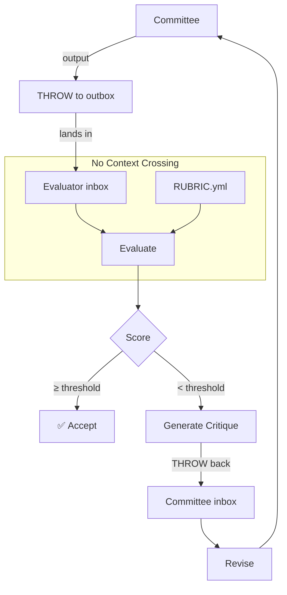

# Evaluator

> *"Fresh eyes, no bias, just the rubric."*

Committee output goes to a separate model instance with NO debate context.

## The Separation

```yaml
evaluation:
  principle: "Evaluator has NO access to:"
    - debate_transcript
    - speaker_identities
    - amendment_history
    - voting_patterns
    - minority_dissents
    
  evaluator_sees_only:
    - final_output
    - rubric_criteria
    - subject_matter_context
```

## Room Architecture

```yaml
# committee-room/
#   ROOM.yml
#   debate.yml
#   output.yml
#   outbox/
#     evaluation-request-001.yml

# evaluation-room/
#   ROOM.yml
#   rubric.yml
#   inbox/
#     evaluation-request-001.yml  # Landed here
#   evaluations/
#     eval-001.yml
```

## Evaluation Request

```yaml
# Thrown from committee to evaluator
evaluation_request:
  id: eval-req-001
  from: committee-room
  timestamp: "2026-01-05T15:00:00Z"
  
  subject: "Client X Engagement Decision"
  
  output_only: |
    Recommendation: Accept Client X with:
    - Explicit scope boundaries
    - Milestone-based billing
    - Quarterly scope review
    
    Confidence: 0.65
    
    Key considerations:
    - Revenue opportunity aligns with growth goals
    - Risk mitigated by contractual protections
    - Capacity impact manageable
    
  rubric: client-evaluation-v1
  
  # Note: NO debate context included
```

## Evaluation Process

```yaml
evaluation:
  request: eval-req-001
  evaluator: "fresh model instance"
  context_loaded: false  # Critical!
  
  steps:
    1. load_rubric: client-evaluation-v1
    2. read_output: evaluation_request.output_only
    3. score_each_criterion: independently
    4. calculate_weighted_total: true
    5. generate_critique: if score < threshold
```

## Evaluation Output

```yaml
# evaluation-room/evaluations/eval-001.yml
evaluation:
  id: eval-001
  request: eval-req-001
  timestamp: "2026-01-05T15:05:00Z"
  
  rubric: client-evaluation-v1
  
  scores:
    resource_efficiency:
      score: 4
      rationale: "Output indicates capacity is manageable"
      
    risk_level:
      score: 3
      rationale: "Mitigations proposed but not detailed"
      confidence: "Would score higher with specific terms"
      
    strategic_alignment:
      score: 4
      rationale: "Growth goals mentioned, seems aligned"
      
    stakeholder_impact:
      score: 3
      rationale: "Not explicitly addressed in output"
      flag: "Committee should consider stakeholder effects"
      
  weighted_total: 3.45
  threshold: 3.5
  
  result: REVIEW  # Just below accept
  
  critique:
    summary: "Close to acceptance threshold"
    
    gaps:
      - "Risk mitigation lacks specifics"
      - "Stakeholder impact not addressed"
      - "Confidence of 0.65 seems low for recommendation"
      
    suggestions:
      - "Detail the milestone structure"
      - "Explain how scope boundaries will be enforced"
      - "Address impact on existing clients and team"
      
    if_addressed: "Score could reach 3.7+ (accept)"
```

## Revision Loop

```yaml
revision_loop:
  max_iterations: 3
  
  flow:
    1. committee_outputs: recommendation
    2. evaluator_scores: against rubric
    3. if score >= threshold: ACCEPT
    4. if score < threshold:
         - evaluator_generates: critique
         - critique_thrown_to: committee inbox
         - committee_revises: based on critique
         - goto: step 1
    5. if max_iterations reached: ESCALATE to human
```

## Adversarial Properties

```yaml
adversarial_separation:
  why: "Prevents committee gaming metrics"
  
  committee_cannot:
    - see_evaluator_reasoning
    - predict_exact_scores
    - optimize_for_rubric_loopholes
    
  evaluator_cannot:
    - be_influenced_by_debate_dynamics
    - favor_particular_speakers
    - weight_majority_over_minority
    
  result: "Genuine quality signal"
```

## Commands

| Command | Action |
|---------|--------|
| `EVALUATE [output]` | Send to independent evaluator |
| `APPLY RUBRIC [name]` | Score against criteria |
| `CRITIQUE` | Generate improvement suggestions |
| `REVISE` | Committee addresses critique |
| `ESCALATE` | Send to human decision maker |

## Integration



## Model Instance Separation

For true independence:

```yaml
implementation:
  option_1:
    name: "Fresh conversation"
    method: "New chat with no history"
    
  option_2:
    name: "Separate model"
    method: "Different API call, different instance"
    
  option_3:
    name: "System prompt separation"
    method: "Explicit instruction: 'You have no prior context'"
    
  key_principle: |
    The evaluator must NOT have access to:
    - How the committee reached the conclusion
    - Who said what
    - What alternatives were considered
    - Why certain risks were dismissed
    
    Only the final output matters.
```
