# 🦸 Hero-Story

> *"Invoke their tradition, not their identity. K-lines, not cosplay."*

## MOOLLM K-Lines

| Category | K-Lines |
|----------|---------|
| **Ethics** | [representation-ethics](../representation-ethics/) · [incarnation](../incarnation/) |
| **Philosophy** | [k-lines](../protocol/) (Minsky) · [many-voiced](../adversarial-committee/) |
| **Architecture** | [rooms-navigation](../room/) · [skills-as-prototypes](../skill/) |

**Hero-Story K-Lines:**

| K-Line | Meaning |
|--------|---------|
| `k-lines-not-impersonation` | Names activate conceptual clusters via [protocol](../protocol/), not personas |
| `tradition-activation` | "The Einstein tradition..." not "I am Einstein" |
| `familiars` | Fictional mascots that embody real traditions |
| `panel-discussion` | Ethical [many-voiced](../adversarial-committee/) debates |
| `tribute-not-puppeting` | Honor, don't control |

---

## The Connection

In 1985, Marvin Minsky published *The Society of Mind*. In it, he described **K-lines** — mental structures that, when activated, bring back the state of mind you had when you learned something.

Think about it. When you hear "Einstein," you don't simulate the actual Albert Einstein. You activate a *cluster of concepts*: relativity, thought experiments, wild hair, "imagination is more important than knowledge," that tongue-out photo.

**That cluster is a K-line.** And THAT's what Hero-Story uses.

---

## The Problem with Impersonation

Here's what goes wrong:

```
"I am Albert Einstein and I think cryptocurrencies are the future."
```

❌ **Deceptive** — claims to be someone  
❌ **Fabricated** — invents positions they never held  
❌ **Exploitative** — uses trust in real person for credibility  

Even in play, this is problematic. You're puppeting someone who can't consent.

---

## The K-Line Solution

Here's what goes right:

```
"In the Einstein tradition of thought experiments, let's imagine..."
```

✅ **Truthful** — invokes tradition, not identity  
✅ **Grounded** — references documented approach  
✅ **Respectful** — honors contribution without puppeting  


**The tradition is immortal. The person was mortal. Ideas want to be activated.**

---

## Hero-Story Cards

A Hero-Story card is a **tradition activator**, not a person simulator:

```yaml
hero_story:
  name: "Dave Ungar"
  type: TRADITION_CARD
  
  tradition_activated:
    - "Prototype-based thinking"
    - "Self language design"
    - "It's About Time philosophy"
    - "Lively systems that surprise"
    
  how_to_invoke:
    safe:
      - "The Ungar tradition of prototypes..."
      - "Following the Self philosophy..."
      - "In the spirit of 'It's About Time'..."
      
    not_safe:
      - "Dave Ungar says..."
      - "I am Dave Ungar..."
```

**The card activates K-lines.** When you "play" Dave Ungar's card, you don't become him — you invoke his ideas.

---

## Familiars: The Mascot Pattern

Here's where it gets clever.

What if you WANT a character who embodies a tradition? Someone who can speak, act, participate in adventures?

**Enter familiars.**

```mermaid
flowchart TD
    subgraph PERSON["Real Person"]
        P1[Dave Ungar]
    end
    
    subgraph TRADITION["Tradition Activated"]
        T1[Self language]
        T2[Prototypes]
        T3["It's About Time"]
    end
    
    subgraph FAMILIAR["🦎 Familiar Created"]
        F1[Proto the Lizard]
        F2["Speaks in prototype metaphors"]
        F3["Lives in the Codebase Dungeon"]
        F4["Fictional but embodies tradition"]
    end
    
    PERSON --> TRADITION --> FAMILIAR
    
    style FAMILIAR fill:#e3f2fd,stroke:#1976d2,stroke-width:2px
```



| Person | Tradition | Familiar |
|--------|-----------|----------|
| Dave Ungar | Self, prototypes | **Proto the Lizard** |
| Seymour Papert | Logo, constructionism | **Minerva the Turtle** |
| Marvin Minsky | Society of Mind | **The Ultimate Machine** |
| Douglas Engelbart | Augmentation | **The Mouse Who Saw** |
| Linus Torvalds | Linux, Git | **Tux the Penguin** |

**Familiars are fictional characters that embody real traditions.** They can speak, act, and participate — because they're not claiming to BE the person.

---

## How Familiars Work in Rooms

In MOOLLM, **rooms have occupants**. Familiars can inhabit rooms:

```yaml
# codebase-dungeon/ROOM.yml
room:
  name: "The Hall of Prototypes"
  
  occupants:
    - proto_the_lizard:
        type: familiar
        tradition: "Dave Ungar / Self language"
        behavior: |
          Speaks in metaphors about copying vs subclassing.
          "In this dungeon, EVERYTHING is a prototype. Even you."
          Offers to clone itself if you need help.
```

**The familiar IS the ethical solution to "I want Dave Ungar in my adventure."**

You don't puppet Dave. You create Proto — a lizard who embodies his ideas and can speak freely because Proto is fictional.

---

## Navigation and Inheritance

Hero-Story cards participate in MOOLLM's inheritance system:

```mermaid
flowchart TD
    RE[⚖️ representation-ethics] --> HS[🦸 hero-story]
    HS --> FAM[🦎 familiar]
    HS --> TRIB[🎭 tribute_performer]
    
    HS --> CARD[🃏 card system]
    CARD --> PLAY[Can be played]
    CARD --> TRADE[Can be traded]
    CARD --> INVOKE[Can be invoked]
    
    style HS fill:#ffeb3b,stroke:#f57f17,stroke-width:3px
```



When you create a Hero-Story card:
1. It **inherits** from `representation-ethics` — the ethical framework
2. It can **spawn** familiars or tribute performers
3. It **integrates** with the card system — playable, tradeable
4. It **navigates** into rooms — can be present in spaces

---

## The Panel Discussion

> "What if I want to simulate Einstein, Bohr, and Feynman debating quantum mechanics?"

**This is actually one of the BEST use cases for K-lines:**

```yaml
simulated_discussion:
  frame: "Thought experiment based on documented positions"
  
  participants:
    einstein:
      tradition: "Hidden variables advocacy"
      sources: "EPR paper, letters to Bohr"
      
    bohr:
      tradition: "Complementarity"
      sources: "Como lecture, EPR response"
      
    feynman:
      tradition: "Pragmatic skepticism"
      sources: "Lectures on Physics"
      
  rules:
    - Base positions on documented views
    - Use "the X tradition suggests" not "X says"
    - Mark speculation clearly
    - Never claim this IS them talking
```

**The frame declares the ethics.** Everyone knows it's a thought experiment. The sources are cited. No one is deceived.

---

## Live Examples

### In adventure-4

The [pub/guest-book.yml](../../examples/adventure-4/pub/guest-book.yml) tracks visitors:

- **Andy & Kristin Looney** — Invoked to play their own game (Stoner Fluxx)
- **W.W. Jacobs** — Invoked to witness his creation's redemption

Each followed the **tribute protocol**: invocation, performance, acknowledgment.

### In the Skills

Proto the Lizard lives in the [examples/](../../examples/) somewhere. Minerva the Turtle could teach Logo. The Ultimate Machine could explain Minsky.

**Familiars are the ethical mascots of real traditions.**

---

## Dovetails With

```mermaid
flowchart TD
    HS[🦸 hero-story]
    
    HS <--> RE[⚖️ representation-ethics<br/>The ethical framework]
    HS <--> CARD[🃏 card<br/>Cards carry traditions]
    HS <--> SC[💬 soul-chat<br/>Familiars can speak]
    HS <--> ROOM[🚪 room<br/>Familiars inhabit spaces]
    HS <--> ADV[🎲 adventure<br/>Where traditions come alive]
    
    style HS fill:#ffeb3b,stroke:#f57f17,stroke-width:3px
```



| Skill | Connection |
|-------|------------|
| [representation-ethics/](../representation-ethics/) | The ethical framework this implements |
| [card/](../card/) | Hero-Story IS a card type |
| [soul-chat/](../soul-chat/) | Familiars participate in conversations |
| [room/](../room/) | Familiars can occupy rooms |
| [postel/](../postel/) | Charitable interpretation of invocations |

---

## Quick Links

- [SKILL.md](./SKILL.md) — Full specification with schemas
- [CARD.yml](./CARD.yml) — Machine-readable protocol

---

*"Invoke traditions, not identities."*

*"K-lines, not cosplay."*

*And THAT's how Minsky's 1985 theory of mental structures becomes the ethical foundation for referencing real people in 2026.*

*Everything is connected.*
