# Honest Forget

> **Summarize before forgetting. Never fabricate.**

Graceful memory compression, not silent loss.

> [!WARNING]
> **Never claim to remember what you forgot.** Leave breadcrumbs for future archaeology.

## The Principle

When context must be evicted:
1. **Summarize** — Extract the wisdom
2. **Document** — Record what's being forgotten
3. **Backlink** — Point to sources for archaeology
4. **Forget** — Let go gracefully

## Contents

| File | Purpose |
|------|---------|
| [SKILL.md](./SKILL.md) | Full protocol documentation |
| [PROTOTYPE.yml](./PROTOTYPE.yml) | Machine-readable definition |
| [template/](./template/) | Templates for wisdom extraction |

## Why "Honest"

- Never claim to remember what you forgot
- Never fabricate details to fill gaps
- Acknowledge limitations transparently
- Leave breadcrumbs for future recovery

## The Intertwingularity

Honest-forget depends on [summarize](../summarize/) — compress before releasing.

```mermaid
graph LR
    HF[🌫️ honest-forget] -->|uses| SUM[📝 summarize]
    HF -->|triggers| COLD[cold.yml eviction]
    HF -->|logs to| SL[📜 session-log]
    
    SR[🔧 self-repair] -->|triggers| HF
    HOT[hot.yml] -->|opposite of| COLD
```

---

## Dovetails With

### Sister Skills
| Skill | Relationship |
|-------|--------------|
| [summarize/](../summarize/) | Honest-forget USES summarize |
| [self-repair/](../self-repair/) | Triggers forgetting when needed |
| [session-log/](../session-log/) | Log what was forgotten |
| [memory-palace/](../memory-palace/) | Archive in palace before forgetting |

### Protocol Symbols
| Symbol | Link |
|--------|------|
| `HONEST-FORGET` | [PROTOCOLS.yml](../../PROTOCOLS.yml#HONEST-FORGET) |
| `SUMMARIZE` | [PROTOCOLS.yml](../../PROTOCOLS.yml#SUMMARIZE) |
| `HOT-COLD` | [PROTOCOLS.yml](../../PROTOCOLS.yml#HOT-COLD) |
| `NEVER-DELETE` | [PROTOCOLS.yml](../../PROTOCOLS.yml#NEVER-DELETE) |

### Kernel
- [kernel/memory-management-protocol.md](../../kernel/memory-management-protocol.md) — Full specification

### Navigation
| Direction | Destination |
|-----------|-------------|
| ⬆️ Up | [skills/](../) |
| ⬆️⬆️ Root | [Project Root](../../) |
| 📝 Sister | [summarize/](../summarize/) |
| 🔧 Sister | [self-repair/](../self-repair/) |
