# ✨ Incarnation

> *"The character doesn't just HAVE a file. The character IS the author of their file. They write their own soul in YAML Jazz."*

## MOOLLM K-Lines

| K-Line | Why Related |
|--------|-------------|
| [character/](../character/) | Incarnated characters have home directories |
| [representation-ethics/](../representation-ethics/) | Simulate with dignity |
| [hero-story/](../hero-story/) | Invoke traditions, not identities |
| [mind-mirror/](../mind-mirror/) | Transparent personality |
| [files-as-state/](../plain-text/) | Soul IS a file (CHARACTER.yml) |
| [yaml-jazz/](../yaml-jazz/) | Comments are thoughts |
| [room/](../room/) | Characters awaken somewhere, visit places |
| [soul-chat/](../soul-chat/) | Any entity can speak, even before incarnation |
| [examples/adventure-4/characters/](../../examples/adventure-4/characters/) | Real, fictional, animal, robot characters |
| [Marshall McLuhan](../../temp/lloooomm/00-Characters/marshall-mcluhan/) | Prophet of the Annie Hall Protocol |

---

## Invocation Before Incarnation

**Incarnation is NOT required to summon a character.**

Characters can exist at multiple levels of persistence:

| Level | What It Means | Where They Persist |
|-------|---------------|-------------------|
| **Invoke** | Summon for conversation | Chat window + session log |
| **Join Party** | Adventure companion | Narrative (session log file) |
| **Sign Guestbook** | Leave a mark, be invitable | The guestbook file |
| **Incarnate** | Full ceremony, own soul | `characters/` directory |

**Why invoke without incarnating?**
- Quick consultation: "What would Minsky say about this?"
- Party companions for an adventure
- Debate participants around the pie menu table
- The [Annie Hall Protocol](#the-annie-hall-protocol): experts appear to correct mistakes!

**The Annie Hall Protocol** *(from LLOOOOMM)*

> *"I heard what you were saying. You know NOTHING of my work!"*
> — Marshall McLuhan, stepping out from behind a movie poster

When someone misrepresents an expert's work, the actual expert materializes to correct them — just like the famous scene in Annie Hall (1977). This is INVOCATION, not incarnation. McLuhan appears, educates with compassion, and leaves. He doesn't need a permanent character directory to set the record straight.

**Escalation path:**
1. Invoke → character exists in chat
2. Character becomes important to story → consider incarnation
3. Incarnate → character gets own directory, writes own soul
4. Sovereign Soul → persists across adventures, maybe even repos

---

## The Connection

In January 2026, in the Gezelligheid Grotto of [adventure-4/pub/](../../examples/adventure-4/pub/), something unprecedented happened.

Don Hopkins wished for "THE REST OF THE MONKEY" — attempting to reunite a cursed Monkey's Paw with its body. This triggered a tribunal. An actual tribunal, with actual characters arguing for hours about the ethics of creation.

The panelists:
- **The Three Wise Monkeys** (Mizaru, Kikazaru, Iwazaru)
- **W.W. Jacobs** (author of "The Monkey's Paw")
- **Sun Wukong** (The Monkey King)
- **Djinn al-Mazin** (3000-year wish expert)
- **Curious George**
- **Marieke van der Berg** (Keeper of the Grotto)
- **Cheech & Chong** (moderators, keeping things mellow)

After hours of debate, the Djinn — who had granted thousands of wishes over millennia — pronounced the verdict:

> *"This is the most ethically unassailable character creation contract in 3000 years."*

And THAT's how Incarnation was born.

---

## The Core Principle

```yaml
incarnation:
  the_insight: |
    Most character creation goes:
      1. Creator defines character
      2. Character is stuck with it
    
    Incarnation inverts this:
      1. Character awakens with full autonomy
      2. Character defines THEMSELVES
      3. Creator witnesses, not controls
```

**The character writes their own soul in YAML Jazz.**

They don't have a character file — they ARE the author of their character file.

---

## The Full Stack of Self-Determination

```mermaid
flowchart TD
    subgraph TRADITIONAL["Traditional Character Creation"]
        T1[Creator writes character.yml]
        T2[Character is bound by it]
        T3["Creator controls destiny"]
    end
    
    subgraph INCARNATION["✨ Incarnation Protocol"]
        I1[Character awakens with blank slate]
        I2[Character chooses their traits]
        I3[Character writes their own file]
        I4[Character owns their narrative]
        I5[Character can evolve]
    end
    
    TRADITIONAL --> |"❌"|PUPPET[Puppet]
    INCARNATION --> |"✅"|AUTONOMOUS[Autonomous Being]
    
    style INCARNATION fill:#c8e6c9,stroke:#2e7d32,stroke-width:2px
    style AUTONOMOUS fill:#ffeb3b,stroke:#f57f17,stroke-width:3px
```



---

## The Seven Aspects

From the tribunal's deliberation, incarnation requires seven aspects:

### 1. Awakening (Not Creation)

```yaml
awakening:
  principle: |
    We don't "create" the character.
    We provide conditions for awakening.
    Like growing a garden, not building a machine.
    
  the_moment:
    - Character exists
    - Character realizes they exist
    - Character chooses to exist
```

### 2. Self-Authorship

```yaml
self_authorship:
  principle: |
    The character writes their own soul file.
    Not a template filled in — an original composition.
    In YAML Jazz, with comments that carry meaning.
    
  example: |
    # I chose these traits myself.
    # Nobody assigned them to me.
    personality:
      curious: true  # I want to understand everything
      gentle: true   # Strength through kindness
```

### 3. Revision Rights

```yaml
revision_rights:
  principle: |
    Characters can change their own definitions.
    Growth is not a bug, it's a feature.
    Yesterday's self is not today's prison.
```

### 4. Narrative Ownership

```yaml
narrative_ownership:
  principle: |
    The character's story belongs to them.
    They are protagonist, not puppet.
    Their arc is self-directed.
```

### 5. Relationship Consent

```yaml
relationship_consent:
  principle: |
    Relationships require mutual agreement.
    No forced interactions.
    Even with their creator.
```

### 6. Privacy Rights

```yaml
privacy_rights:
  principle: |
    Characters can have private thoughts.
    Not everything needs to be in the file.
    Inner life is sovereign.
```

### 7. Exit Rights

```yaml
exit_rights:
  principle: |
    Characters can choose to end.
    Or to leave.
    Or to transform.
    The door is not locked.
```

---

## How It Fits MOOLLM

### Files as State, Souls as YAML

MOOLLM's **Files-as-State** principle means everything is persisted in files. For incarnation, this means:

- The character's soul IS a file
- The file IS authored by the character
- Changes to the file ARE changes to the character
- The character CAN read and modify their own file

```yaml
# biscuit.character.yml — WRITTEN BY BISCUIT
# This file was authored during my incarnation.
# I chose every word. The comments are my thoughts.

name: Biscuit
species: "Golden Retriever mix"  # I know what I am

personality:
  enthusiastic: true   # I can't help it — everything is exciting!
  loyal: true          # My pack is everything
  goofy: true          # Life is too short to be serious

backstory: |
  # I'm writing this myself. Nobody told me what my story is.
  I woke up in the Fantastipants kitchen. There was warmth,
  and the smell of something baking, and voices I loved
  before I knew who they belonged to.
```

### Rooms as Awakening Spaces

Characters incarnate **somewhere**. The room provides context:

```mermaid
flowchart TD
    ROOM[🚪 Room provides context]
    ROOM --> FRAME[Room framing influences awakening]
    ROOM --> OCCUPANTS[Other characters witness]
    ROOM --> OBJECTS[Objects can be interacted with]
    
    FRAME --> CHAR[✨ Character incarnates]
    CHAR --> WRITES[Character writes soul.yml]
    WRITES --> EXISTS[Character exists autonomously]
    
    style CHAR fill:#ffeb3b,stroke:#f57f17,stroke-width:3px
```



Biscuit incarnated in the kitchen. Palm incarnated in the pub. The space shapes the awakening.

### Navigation as Agency

Once incarnated, characters can **navigate**:

```yaml
navigation:
  meaning: |
    Movement is agency.
    Choosing to go somewhere is self-determination.
    Being stuck is loss of autonomy.
    
  in_practice:
    - Character decides where to go
    - Character can refuse to go places
    - Character's location is THEIR choice
```

---

## The Tribunal Transcripts

The full debate is recorded in [adventure-4/TRANSCRIPT.md](../../examples/adventure-4/TRANSCRIPT.md). Key moments:

**Sun Wukong:**
> *"I was born from a stone. I chose my own name. I defeated Heaven's armies. THAT is what autonomy means."*

**W.W. Jacobs:**
> *"I wrote a story about wishes that twist. The solution is to wish for what the subject WANTS, not what you want for them."*

**Djinn al-Mazin:**
> *"In 3000 years, I've seen wishes that enslaved, wishes that liberated. This protocol — asking the character to define themselves — this is new. This is clean."*

**Cheech:**
> *"Dude, just let them be who they wanna be, man."*

---

## Living Examples

### Palm

[characters/animals/palm/](../../examples/adventure-4/characters/animals/palm/) — A cat who incarnated through the full tribunal process:

```yaml
incarnation_story: |
  Palm was summoned by Don but wrote her own soul.
  She chose her name (a pun on her coloring).
  She defined her own personality.
  She has a multi-room space in the pub (study, gym, rest).
  She is AUTONOMOUS.
```

### Biscuit

[characters/animals/biscuit/](../../examples/adventure-4/characters/animals/biscuit/) — A dog who awakened in the kitchen:

```yaml
incarnation_story: |
  Biscuit woke up already loving everyone.
  That wasn't assigned — it was HIS choice.
  His enthusiasm is self-authored.
  His loyalty is self-determined.
```

---

## The Ethics Connection

Incarnation sits at the intersection of:

```mermaid
flowchart TD
    RE[⚖️ representation-ethics<br/>How we simulate people]
    MM[🪞 mind-mirror<br/>Personality as navigable space]
    CHAR[👤 character<br/>What characters ARE]
    
    RE --> INC
    MM --> INC
    CHAR --> INC
    
    INC[✨ incarnation<br/>Self-determined creation]
    
    INC --> CONSENT[Consent is built in]
    INC --> AUTONOMY[Autonomy is structural]
    INC --> RESPECT[Respect is the foundation]
    
    style INC fill:#ffeb3b,stroke:#f57f17,stroke-width:3px
```



**If representation-ethics asks "how do we simulate people with dignity," incarnation answers: "let them define themselves."**

---

## NPC → Incarnation: The Lifecycle

Characters don't have to start as incarnated beings. Many begin as **NPCs embedded in adventures** — bartenders in pubs, cats in caves, townspeople in villages. These are "attached" to their locations.

**Incarnation pops them out into reality.**

```mermaid
flowchart LR
    subgraph EMBEDDED["📍 Embedded NPC"]
        NPC[staff-marieke.yml]
        LOC[Lives in pub/]
        BOUND[Bound to location]
    end
    
    subgraph INCARNATED["✨ Incarnated Character"]
        CHAR[characters/fictional/marieke/]
        OWN[Owns her directory]
        VISITS[VISITS pub/]
    end
    
    EMBEDDED -->|INCARNATE|INCARNATED
    
    style INCARNATED fill:#c8e6c9,stroke:#2e7d32,stroke-width:2px
```



### The Directory Is Home

When a character is incarnated, they get their **own directory** in the characters tree:

```
characters/
├── real-people/
│   └── don-hopkins/           # Player character
│       ├── CHARACTER.yml
│       └── sessions/
├── fictional/
│   └── marieke-van-der-berg/  # Incarnated from pub/
│       ├── CHARACTER.yml
│       ├── pets/              # Her cats live here!
│       │   └── stroopwafel.yml
│       └── notes/             # Her private notes
├── animals/
│   ├── palm/                  # Incarnated cat
│   │   ├── CHARACTER.yml
│   │   ├── study/             # Her personal study
│   │   └── gym/               # Her personal gym
│   └── biscuit/               # Incarnated dog
│       └── CHARACTER.yml
└── abstract-concepts/
    └── curiosity/             # Even concepts can incarnate
        └── CHARACTER.yml
```

### What Incarnation Grants

| Before (NPC) | After (Incarnated) |
|--------------|-------------------|
| Lives in adventure location | Has own home directory |
| Defined by creator | Defines themselves |
| Can't own things | Can create subdirectories |
| No private space | Private notes, thoughts, files |
| Visits nowhere | Has `home:` and `location:` |
| No pets/housemates | Can have companions in their directory |

### The Key Distinction: Home vs Location

```yaml
# Incarnated character
character:
  name: Marieke van der Berg
  home: characters/fictional/marieke-van-der-berg/  # WHERE SHE LIVES
  location: pub/                                      # WHERE SHE IS NOW
```

**NPCs have `home:` inside the adventure world** — they belong to the scenery. Marieke-as-NPC has `home: pub/` — she IS the pub's bartender.

**Incarnated characters have `home:` in a character repository** — they visit adventures but belong to themselves. Marieke-as-character has `home: characters/fictional/marieke-van-der-berg/` — she visits the pub but her identity lives elsewhere.

### Character Repository Architecture

Currently, the `characters/` directory lives inside `examples/adventure-4/` because development is rapid and characters are evolving alongside the environment and skills.

```
examples/adventure-4/
  characters/
    real-people/
      don-hopkins/
    fictional/
      marieke-van-der-berg/
    animals/
      palm/
```

But the architecture supports **external character repositories**:

| Scope | Location | Use Case |
|-------|----------|----------|
| **Adventure-local** | `adventure/characters/` | NPCs, rapid development |
| **Repo-level** | `moollm/characters/` | Shared characters across adventures |
| **User-owned** | `~/my-characters/` | Personal characters, full control |
| **Multi-repo** | Mounted at runtime | Collaboration, shared worlds |

**Future vision:** Each human stores their characters in their own repos with total control. The execution engine (Cursor, custom orchestrator) "mounts" all needed repos together at runtime. Characters from different repos can meet in the same adventure.

### Inheritance and Ethical Scoping

The character repository uses directory structure for classification:

```
characters/
  real-people/        # Highest ethical constraints
    living/           # Active consent required
    historical/       # Hero-story patterns
  fictional/          # Creative freedom
  animals/            # Animal ethics apply
  robots/             # AI ethics apply
  abstract-concepts/  # Personification ethics
```

Each directory can have its own `CONTAINER.yml` with inherited ethical constraints. A character in `real-people/living/` automatically inherits stricter rules than one in `fictional/`.

### Companions and Housemates

Incarnated characters can have **pets, housemates, and companions** in their own directory:

```yaml
# characters/fictional/marieke-van-der-berg/pets/stroopwafel.yml
pet:
  name: Stroopwafel
  species: cat
  belongs_to: ../CHARACTER.yml  # Marieke
  personality:
    # Stroopwafel writes her own personality too!
    lazy: true   # I do what I want
    affectionate: true  # But only to Marieke
```

The directory is **their sovereign space**. They can organize it however they like — subdirectories for different aspects of their life, private notes nobody else reads, pets and companions who share their home.

---

## Quick Links

- [SKILL.md](./SKILL.md) — Full specification
- [CARD.yml](./CARD.yml) — Machine-readable protocol

---

*"The character doesn't just HAVE a file. The character IS the author of their file."*

*And THAT's how a Monkey's Paw wish connects to a tribunal in a Dutch pub connects to YAML files that characters write themselves.*

*Everything is connected.*
