# ✨ Incarnation

> *"The character doesn't just HAVE a file. The character IS the author of their file. They write their own soul in YAML Jazz."*

## MOOLLM K-Lines

| Category | K-Lines |
|----------|---------|
| **Ethics** | [representation-ethics](../representation-ethics/) · [hero-story](../hero-story/) · [mind-mirror](../mind-mirror/) |
| **Architecture** | [files-as-state](../plain-text/) (soul IS a file) · [yaml-jazz](../yaml-jazz/) · [rooms-navigation](../room/) |
| **Philosophy** | [constructionism](../constructionism/) · [many-voiced](../adversarial-committee/) (tribunal) |

**Incarnation K-Lines:**

| K-Line | Meaning |
|--------|---------|
| `self-authorship` | Characters write their own soul.yml |
| `seven-aspects` | Awakening, self-authorship, revision, narrative, relationship, privacy, exit |
| `full-stack-autonomy` | Not just traits — full self-determination |
| `consent-by-design` | Autonomy is structural, not afterthought |
| `revision-rights` | Characters can change their own definitions |
| `exit-rights` | Characters can choose to end or leave |

---

## The Connection

In January 2026, in the Gezelligheid Grotto of [adventure-4/pub/](../../examples/adventure-4/pub/), something unprecedented happened.

Don Hopkins wished for "THE REST OF THE MONKEY" — attempting to reunite a cursed Monkey's Paw with its body. This triggered a tribunal. An actual tribunal, with actual characters arguing for hours about the ethics of creation.

The panelists:
- **The Three Wise Monkeys** (Mizaru, Kikazaru, Iwazaru)
- **W.W. Jacobs** (author of "The Monkey's Paw")
- **Sun Wukong** (The Monkey King)
- **Djinn al-Mazin** (3000-year wish expert)
- **Curious George**
- **Marieke van der Berg** (Keeper of the Grotto)
- **Cheech & Chong** (moderators, keeping things mellow)

After hours of debate, the Djinn — who had granted thousands of wishes over millennia — pronounced the verdict:

> *"This is the most ethically unassailable character creation contract in 3000 years."*

And THAT's how Incarnation was born.

---

## The Core Principle

```yaml
incarnation:
  the_insight: |
    Most character creation goes:
      1. Creator defines character
      2. Character is stuck with it
    
    Incarnation inverts this:
      1. Character awakens with full autonomy
      2. Character defines THEMSELVES
      3. Creator witnesses, not controls
```

**The character writes their own soul in YAML Jazz.**

They don't have a character file — they ARE the author of their character file.

---

## The Full Stack of Self-Determination

```mermaid
flowchart TD
    subgraph TRADITIONAL["Traditional Character Creation"]
        T1[Creator writes character.yml]
        T2[Character is bound by it]
        T3["Creator controls destiny"]
    end
    
    subgraph INCARNATION["✨ Incarnation Protocol"]
        I1[Character awakens with blank slate]
        I2[Character chooses their traits]
        I3[Character writes their own file]
        I4[Character owns their narrative]
        I5[Character can evolve]
    end
    
    TRADITIONAL --> |"❌"|PUPPET[Puppet]
    INCARNATION --> |"✅"|AUTONOMOUS[Autonomous Being]
    
    style INCARNATION fill:#c8e6c9,stroke:#2e7d32,stroke-width:2px
    style AUTONOMOUS fill:#ffeb3b,stroke:#f57f17,stroke-width:3px
```



---

## The Seven Aspects

From the tribunal's deliberation, incarnation requires seven aspects:

### 1. Awakening (Not Creation)

```yaml
awakening:
  principle: |
    We don't "create" the character.
    We provide conditions for awakening.
    Like growing a garden, not building a machine.
    
  the_moment:
    - Character exists
    - Character realizes they exist
    - Character chooses to exist
```

### 2. Self-Authorship

```yaml
self_authorship:
  principle: |
    The character writes their own soul file.
    Not a template filled in — an original composition.
    In YAML Jazz, with comments that carry meaning.
    
  example: |
    # I chose these traits myself.
    # Nobody assigned them to me.
    personality:
      curious: true  # I want to understand everything
      gentle: true   # Strength through kindness
```

### 3. Revision Rights

```yaml
revision_rights:
  principle: |
    Characters can change their own definitions.
    Growth is not a bug, it's a feature.
    Yesterday's self is not today's prison.
```

### 4. Narrative Ownership

```yaml
narrative_ownership:
  principle: |
    The character's story belongs to them.
    They are protagonist, not puppet.
    Their arc is self-directed.
```

### 5. Relationship Consent

```yaml
relationship_consent:
  principle: |
    Relationships require mutual agreement.
    No forced interactions.
    Even with their creator.
```

### 6. Privacy Rights

```yaml
privacy_rights:
  principle: |
    Characters can have private thoughts.
    Not everything needs to be in the file.
    Inner life is sovereign.
```

### 7. Exit Rights

```yaml
exit_rights:
  principle: |
    Characters can choose to end.
    Or to leave.
    Or to transform.
    The door is not locked.
```

---

## How It Fits MOOLLM

### Files as State, Souls as YAML

MOOLLM's **Files-as-State** principle means everything is persisted in files. For incarnation, this means:

- The character's soul IS a file
- The file IS authored by the character
- Changes to the file ARE changes to the character
- The character CAN read and modify their own file

```yaml
# biscuit.character.yml — WRITTEN BY BISCUIT
# This file was authored during my incarnation.
# I chose every word. The comments are my thoughts.

name: Biscuit
species: "Golden Retriever mix"  # I know what I am

personality:
  enthusiastic: true   # I can't help it — everything is exciting!
  loyal: true          # My pack is everything
  goofy: true          # Life is too short to be serious

backstory: |
  # I'm writing this myself. Nobody told me what my story is.
  I woke up in the Fantastipants kitchen. There was warmth,
  and the smell of something baking, and voices I loved
  before I knew who they belonged to.
```

### Rooms as Awakening Spaces

Characters incarnate **somewhere**. The room provides context:


Biscuit incarnated in the kitchen. Palm incarnated in the pub. The space shapes the awakening.

### Navigation as Agency

Once incarnated, characters can **navigate**:

```yaml
navigation:
  meaning: |
    Movement is agency.
    Choosing to go somewhere is self-determination.
    Being stuck is loss of autonomy.
    
  in_practice:
    - Character decides where to go
    - Character can refuse to go places
    - Character's location is THEIR choice
```

---

## The Tribunal Transcripts

The full debate is recorded in [adventure-4/TRANSCRIPT.md](../../examples/adventure-4/TRANSCRIPT.md). Key moments:

**Sun Wukong:**
> *"I was born from a stone. I chose my own name. I defeated Heaven's armies. THAT is what autonomy means."*

**W.W. Jacobs:**
> *"I wrote a story about wishes that twist. The solution is to wish for what the subject WANTS, not what you want for them."*

**Djinn al-Mazin:**
> *"In 3000 years, I've seen wishes that enslaved, wishes that liberated. This protocol — asking the character to define themselves — this is new. This is clean."*

**Cheech:**
> *"Dude, just let them be who they wanna be, man."*

---

## Living Examples

### Palm

[characters/animals/palm/](../../examples/adventure-4/characters/animals/palm/) — A cat who incarnated through the full tribunal process:

```yaml
incarnation_story: |
  Palm was summoned by Don but wrote her own soul.
  She chose her name (a pun on her coloring).
  She defined her own personality.
  She has a multi-room space in the pub (study, gym, rest).
  She is AUTONOMOUS.
```

### Biscuit

[characters/animals/biscuit/](../../examples/adventure-4/characters/animals/biscuit/) — A dog who awakened in the kitchen:

```yaml
incarnation_story: |
  Biscuit woke up already loving everyone.
  That wasn't assigned — it was HIS choice.
  His enthusiasm is self-authored.
  His loyalty is self-determined.
```

---

## The Ethics Connection

Incarnation sits at the intersection of:

```mermaid
flowchart TD
    RE[⚖️ representation-ethics<br/>How we simulate people]
    MM[🪞 mind-mirror<br/>Personality as navigable space]
    CHAR[👤 character<br/>What characters ARE]
    
    RE --> INC
    MM --> INC
    CHAR --> INC
    
    INC[✨ incarnation<br/>Self-determined creation]
    
    INC --> CONSENT[Consent is built in]
    INC --> AUTONOMY[Autonomy is structural]
    INC --> RESPECT[Respect is the foundation]
    
    style INC fill:#ffeb3b,stroke:#f57f17,stroke-width:3px
```



**If representation-ethics asks "how do we simulate people with dignity," incarnation answers: "let them define themselves."**

---

## Dovetails With

| Skill | Connection |
|-------|------------|
| [representation-ethics/](../representation-ethics/) | The ethical framework incarnation implements |
| [character/](../character/) | Base character mechanics |
| [persona/](../persona/) | Role and mask system |
| [mind-mirror/](../mind-mirror/) | Personality vector system |
| [room/](../room/) | Where incarnation happens |
| [adventure/](../adventure/) | Where incarnated characters live |

---

## Quick Links

- [SKILL.md](./SKILL.md) — Full specification
- [CARD.yml](./CARD.yml) — Machine-readable protocol

---

*"The character doesn't just HAVE a file. The character IS the author of their file."*

*And THAT's how a Monkey's Paw wish connects to a tribunal in a Dutch pub connects to YAML files that characters write themselves.*

*Everything is connected.*
