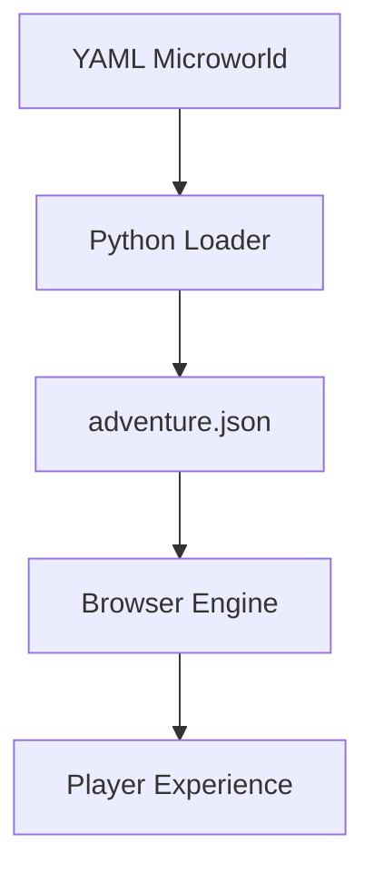
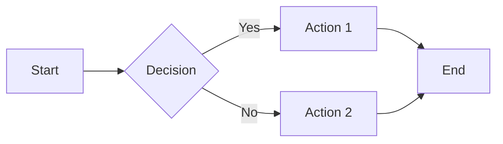
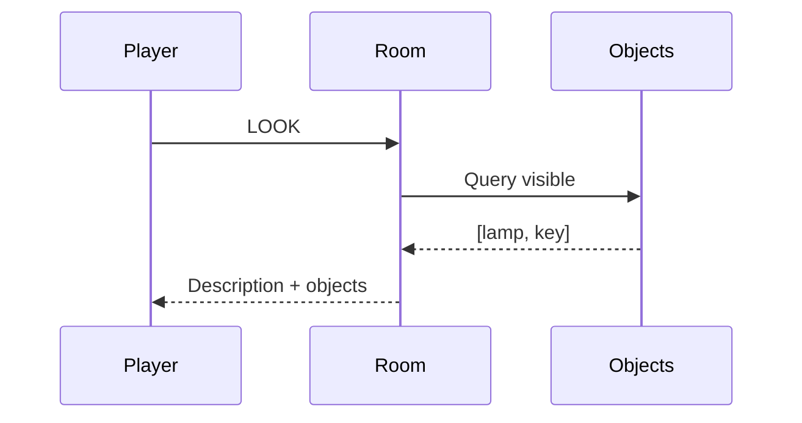
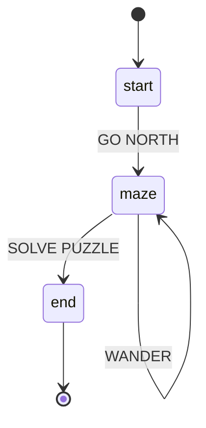
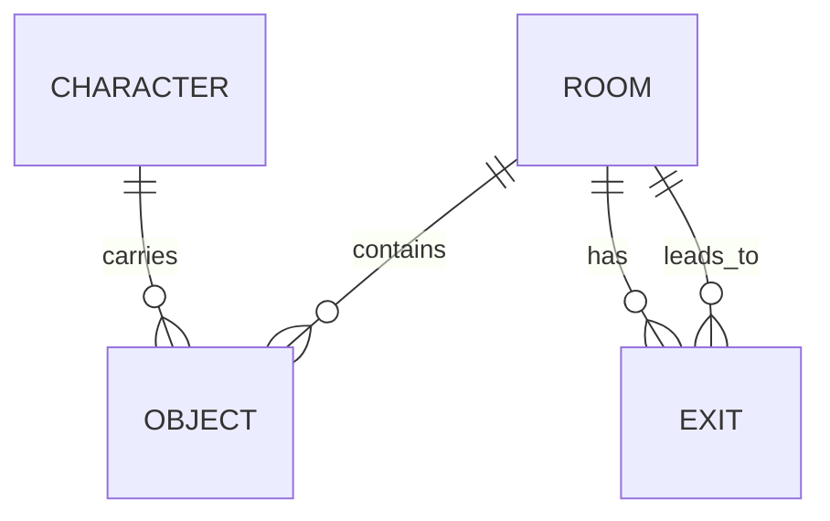

# Markdown

> *"The source is the destination. Readable raw AND rendered."*

---

## What Is It?

**Markdown** is the plain text format that powers MOOLLM's human-readable files. It's not just formatting — it's a philosophy:

- **Readable without rendering** — Open SESSION.md in any editor, understand it instantly
- **Readable when rendered** — GitHub, Obsidian, browsers enhance but don't transform
- **LLM-native** — Models are trained on billions of Markdown files; they speak it fluently
- **Git-friendly** — Diffs are meaningful, merges work, history is readable
- **No lock-in** — Plain text survives every platform, every decade

---

## Why Markdown Won

From Anil Dash's "[How Markdown Took Over the World](https://anildash.com/2025/01/09/how-markdown-took-over-the-world/)" (January 2025):

### The 10 Technical Reasons

| Reason | Explanation | MOOLLM Parallel |
|--------|-------------|-----------------|
| **1. Great brand** | "Markdown" = opposite of "markup" | YAML Jazz, SOUL-CHAT, K-lines |
| **2. Solved a real problem** | HTML too verbose for blogging | YAML too rigid; comments add soul |
| **3. Built on existing behaviors** | Email formatting conventions | Indentation, `#` headers already intuitive |
| **4. Mirrored RSS in origin** | Curmudgeonly creators, blog platforms | Open source, community-driven |
| **5. Community ready to help** | Dean Allen (Textile), Aaron Swartz | Skill contributions, open protocols |
| **6. Flavors for context** | GFM, CommonMark, etc. | Adventure YAML vs. session markdown |
| **7. Time of behavior change** | Blogging era = new habits | LLM era = new habits |
| **8. Build tool era** | Markdown → HTML in pipelines | YAML → JSON → Browser |
| **9. Works with "view source"** | Inspectable source | Files as state, transparent |
| **10. No IP encumbrance** | Free, no patents | MIT license everywhere |

### The Key Insight

> *"If mark**up** is complicated, then the opposite of that complexity must be... mark**down**."*
> — Anil Dash

---

## Markdown in MOOLLM

### Session Logs

```markdown
# Session: Adventure Uplift

## 📑 Index
1. [Overview](#1-overview)
2. [Decisions](#2-decisions)

---

## 1. Overview

<details open>
<summary><strong>🎯 Mission</strong></summary>

Build `adventure.py` to compile adventures to web apps.

</details>

<details>
<summary><strong>📋 Technical Details</strong></summary>

Architecture decisions go here...

</details>
```

### READMEs

```markdown
# Skill Name

> *"One-liner that captures the essence"*

## What Is It?
Brief explanation.

## When to Use
- Scenario 1
- Scenario 2

## Dovetails With
- [related-skill/](../related-skill/)
```

### Embedded Data

Markdown + YAML code blocks = structured data in narrative:

```markdown
Here's the configuration:

​```yaml
rooms:
  - start
  - maze
  - end
​```

And the reasoning behind it...
```

---

## GitHub-Flavored Markdown (GFM)

MOOLLM session logs use GFM extensions:

### Tables

```markdown
| Feature | Status |
|---------|--------|
| Navigation | ✅ Done |
| Inventory | 🚧 WIP |
```

### Task Lists

```markdown
- [x] Define schema
- [ ] Build linter
- [ ] Compile to JSON
```

### Collapsible Sections

```html
<details>
<summary>Click to expand</summary>

Hidden content goes here.

</details>
```

### Syntax Highlighting

```markdown
​```python
def hello():
    print("Hello, world!")
​```
```

### Alerts (GitHub-specific)

```markdown
> [!NOTE]
> Useful information.

> [!WARNING]
> Critical information.
```

### Mermaid Diagrams

GitHub renders Mermaid diagrams natively! Perfect for:
- Flowcharts
- Sequence diagrams
- State machines
- Entity relationships
- Architecture diagrams

```markdown
​```mermaid
flowchart TD
    YAML[YAML Microworld] --> Python[Python Loader]
    Python --> JSON[adventure.json]
    JSON --> Browser[Browser Engine]
    Browser --> Player[Player Experience]
​```
```

Renders as:



#### Common Mermaid Patterns

**Flowchart (process flow):**


**Sequence diagram (interactions):**


**State diagram (room states):**


**Entity relationship (data model):**


---

## LLMs and Markdown

From Hacker News discussion (January 2025):

> *"It's fundamentally text. No format/vendor lock-in and very amenable to living in a git repo. I can tell an LLM to look at the code in this repo and make me an API_documentation.md and it'll grasp that I want a text-based summary."*
> — @Havoc

### Why LLMs Prefer Markdown

| Property | Benefit |
|----------|---------|
| **Training data** | Billions of .md files in training corpus |
| **Structure** | Headers, lists, code blocks = clear semantics |
| **Low overhead** | No bracket matching (unlike JSON) |
| **Comments in code blocks** | Context preserved |
| **Human-readable** | Model can "think out loud" naturally |

### LLM Output Patterns

LLMs naturally output:
- `#` headers for sections
- `-` bullets for lists
- ``` code blocks for code
- `**bold**` for emphasis
- Tables for structured comparisons

**Match this in your prompts** — write instructions in Markdown, get Markdown back.

---

## The "Source is Destination" Principle

Markdown's power: **it's both the source AND the readable output**.

| Format | Source | Destination | Gap |
|--------|--------|-------------|-----|
| LaTeX | `.tex` | PDF | Large |
| HTML | `.html` | Browser | Medium |
| **Markdown** | `.md` | `.md` (or rendered) | **None** |

This is why YAML Jazz matters: 

```yaml
# This comment is readable in the source
# AND visible to the LLM
# AND preserved in the file
config:
  setting: value
```

The source IS the documentation. The documentation IS the source.

---

## Best Practices for MOOLLM

### 1. Indexes at Top

Long documents need navigation:

```markdown
## 📑 Index

1. [Section One](#section-one)
2. [Section Two](#section-two)

---

## Section One
...
```

### 2. Collapsible Details (CRITICAL!)

**This is one of Markdown's superpowers.** Hide complexity, show structure. Let readers scan summaries without drowning in details.

```html
<details open>
<summary><strong>🎯 Important Section — Open by Default</strong></summary>

Critical content that readers need to see immediately.

</details>

<details>
<summary><strong>📋 Technical Details — Collapsed by Default</strong></summary>

Dense content that only some readers need.
Click to expand when curious.

</details>
```

#### LLM-Generated Summaries in `<summary>` Tags

**Key insight:** The `<summary>` tag should contain a **descriptive summary** that tells readers what's inside WITHOUT opening. LLMs are great at generating these!

**Bad:**
```html
<details>
<summary>Click to see more</summary>
...content...
</details>
```

**Good:**
```html
<details>
<summary><strong>🎤 Gary Drescher's Talk — Schema Mechanism + LLM = Flight</strong></summary>

Full transcript of Gary explaining how LLMs complete what Made-Up Minds started...

</details>
```

**Even better — with key points in summary:**
```html
<details>
<summary><strong>🏗️ Architecture Decisions</strong> — YAML source, JSON compile, SPA output, staged development</summary>

Detailed architecture documentation...

</details>
```

#### Nesting Collapsibles

For complex documents, nest sections:

```html
<details open>
<summary><strong>📚 Part 1: The Gathering</strong></summary>

Overview of who attended...

<details>
<summary>Living Legends (25 people)</summary>

Full list with bios...

</details>

<details>
<summary>Memorial Candles (10 people)</summary>

Those speaking through memory...

</details>

</details>
```

#### When to Use Each Pattern

| Pattern | Use When |
|---------|----------|
| `<details open>` | Main content, must-read sections |
| `<details>` (closed) | Supporting details, optional depth |
| Nested `<details>` | Hierarchical information (parts > chapters > sections) |
| Summary with key points | Reader can decide without opening |
| Summary with just title | Section is self-explanatory |

#### The Session Log Pattern

MOOLLM session logs use this extensively:

```html
## 5. Free-For-All Q&A

<details>
<summary><strong>🎤 Highlights from the Chaos</strong> — Scott on 16KB, Will on distributed AI, Hofstadter on strange loops</summary>

### On Distributed Intelligence

**SCOTT ADAMS:** "Wait — schemas are literally what I fit in sixteen kilobytes in 1978!"

**WILL WRIGHT:** "We distributed intelligence INTO THE OBJECTS..."

...full transcript...

</details>
```

The reader sees:
- Section title
- Key topics covered
- Can skip if not interested, or expand for full content

**This is why session logs are readable even at 7000+ lines!**

### 3. Tables for Structured Data

When you have parallel information:

```markdown
| Room | Objects | Exits |
|------|---------|-------|
| start | lamp, key | north |
| maze | torch | north, south, east |
```

### 4. Code Blocks for Examples

Always use fenced code blocks with language hints:

```markdown
​```yaml
name: example
​```

​```python
def example():
    pass
​```
```

### 5. Blockquotes for Quotes/Emphasis

```markdown
> *"The filesystem IS the microworld."*
> — MOOLLM Constitution
```

---

## Anti-Patterns

❌ **Over-nesting headers** — More than 4 levels is confusing  
❌ **Inline HTML everywhere** — Defeats plain-text readability  
❌ **No structure** — Wall of text without headers/sections  
❌ **Proprietary extensions** — Stick to GFM for portability  
❌ **Rendered-only thinking** — If it's unreadable raw, rethink it

---

## The Durability Argument

From HN:

> *"I don't want to worry about whatever cursed format OneNote uses still being something I can extract in 2035."*
> — @Havoc

Markdown files from 2004 are still readable today. They'll be readable in 2045. **Plain text is forever.**

MOOLLM session logs, skill files, and READMEs will outlive any proprietary format.

---

## Dovetails With

- [yaml-jazz/](../yaml-jazz/) — YAML is the data; Markdown is the prose
- [session-log/](../session-log/) — Session logs are Markdown documents
- [plain-text/](../plain-text/) — The broader philosophy
- [soul-chat/](../soul-chat/) — Markdown with embedded YAML
- [postel/](../postel/) — Be liberal in accepting Markdown variants

---

## Protocol Symbol

```
MARKDOWN
```

Invoke when: Writing documentation, session logs, READMEs, or any human-readable prose.

---

## Credits

- **John Gruber** — Creator of Markdown (2004)
- **Aaron Swartz** — Beta tester, helped refine the format
- **Dean Allen** — Textile (prior art, inspiration)
- **GitHub** — GFM, mass adoption
- **Anil Dash** — "[How Markdown Took Over the World](https://anildash.com/2025/01/09/how-markdown-took-over-the-world/)" (2025)
- **CommonMark** — Standardization effort

---

> *"The trillion-dollar AI industry's system for controlling their most advanced platforms is a plain text format one guy made up for his blog and then bounced off of a 17-year-old kid before sharing it with the world for free."*
> — Anil Dash
