# Memory Palace

> *"The filesystem is the mind. Directories are rooms. Files are objects."*

The ancient method of loci, adapted for LLMs.

> [!TIP]
> **Place knowledge in locations. Navigate to remember.** The filesystem IS your memory palace.

---

## The Technique

Place knowledge in **locations**. Navigate to **remember**.

```mermaid
graph TD
    E[🚪 Entrance] --> W[🌳 West Wing]
    E --> N[⭐ North Tower]
    E --> S[📚 South Library]
    
    W --> WR1[yaml-jazz/]
    W --> WR2[bpip/]
    
    N --> NR1[gardener/]
    N --> NR2[archivist/]
    
    S --> SR1[protocols/]
    S --> SR2[examples/]
```



Each room contains:
- **Objects** (files) — artifacts to examine
- **Exits** (links) — doors to other rooms
- **Atmosphere** — the room's essence

---

## This IS the Room Skill

Memory Palace and [Room](../room/) are deeply connected:

| Memory Palace | Room Skill |
|---------------|------------|
| Location | Directory |
| Object | File |
| Traversal | Enter/Exit |
| Placement | Create file |
| Recall | Navigate to |

**Memory Palace** = Room + spatial mnemonic intent

---

## Palace Structure

```
palace/
├── ENTRY.md          # Front door (README)
├── MAP.yml           # Navigation overview
│
├── concepts/         # Wing: Ideas
│   ├── ROOM.yml
│   ├── yaml-jazz/
│   └── play-learn-lift/
│
├── characters/       # Wing: Personas
│   ├── ROOM.yml
│   ├── gardener/
│   └── archivist/
│
└── skills/           # Wing: Capabilities
    ├── ROOM.yml
    └── ...
```

---

## Placing Knowledge

To remember something:

1. **Choose a room** — where does this belong?
2. **Create a file** — the object to place
3. **Link it** — connect to related objects
4. **Walk there** — navigate to reinforce

```yaml
# palace/concepts/yaml-jazz/ROOM.yml
room:
  name: "YAML Jazz Chamber"
  contains:
    - "jazz-principles.md"    # Core ideas
    - "examples/"             # Sub-room of examples
  exits:
    parent: "../"
    related: "../play-learn-lift/"
  atmosphere: "improvisational, semantic"
```

---

## Contents

| File | Purpose |
|------|---------|
| [SKILL.md](./SKILL.md) | Full protocol documentation |
| [PROTOTYPE.yml](./PROTOTYPE.yml) | Machine-readable definition |
| [template/](./template/) | Palace templates |

---

## The Intertwingularity

Memory Palace is Room with **mnemonic intent**.

```mermaid
graph LR
    MP[🏛️ memory-palace] -->|IS-A| R[🚪 room]
    MP -->|narrative variant| AP[⚔️ adventure]
    MP -->|objects are| TC[🎴 trading-card]
    MP -->|rooms speak| SC[💬 soul-chat]
    
    R -->|+ mnemonic intent| MP
    AP -->|+ quest framing| R
```



---

## Dovetails With

### Sister Skills
| Skill | Relationship |
|-------|--------------|
| [room/](../room/) | Memory Palace IS Room + spatial mnemonic intent |
| [adventure-protocol/](../adventure-protocol/) | Adventure IS Room + narrative quest framing |
| [trading-card/](../trading-card/) | Objects placed in rooms can be cards |
| [soul-chat/](../soul-chat/) | Palace rooms can speak, guide visitors |
| [summarize/](../summarize/) | Compress palace knowledge for context |

### Protocol Symbols
| Symbol | Link |
|--------|------|
| `ROOM-AS-FUNCTION` | [PROTOCOLS.yml](../../PROTOCOLS.yml#ROOM-AS-FUNCTION) |
| `NESTED-ROOMS` | [PROTOCOLS.yml](../../PROTOCOLS.yml#NESTED-ROOMS) |
| `CONSTRUCTIONISM` | [PROTOCOLS.yml](../../PROTOCOLS.yml#CONSTRUCTIONISM) — Build to remember |

### Techniques
| Ancient | MOOLLM |
|---------|--------|
| Method of Loci | Navigate directories |
| Mental palace | Filesystem structure |
| Place objects | Create files |
| Walk the route | Traverse paths |

### Navigation
| Direction | Destination |
|-----------|-------------|
| ⬆️ Up | [skills/](../) |
| ⬆️⬆️ Root | [Project Root](../../) |
| 🚪 Sister | [room/](../room/) |
| ⚔️ Sister | [adventure-protocol/](../adventure-protocol/) |
