# 🪞 Mind Mirror

> *"Mirrors should reflect a little before throwing back images."* — Jean Cocteau

## MOOLLM K-Lines

| K-Line | Why Related |
|--------|-------------|
| [character/](../character/) | Characters have personalities |
| [persona/](../persona/) | Personality layers |
| [cat/](../cat/) | Cat personality traits |
| [dog/](../dog/) | Dog personality traits |
| [representation-ethics/](../representation-ethics/) | Transparent measurement |
| [incarnation/](../incarnation/) | Characters own their profiles |
| [yaml-jazz/](../yaml-jazz/) | Numbers + comments = life |
| [plain-text/](../plain-text/) | Profiles persist |
| [needs/](../needs/) | Sims tradition (traits, needs) |
| [room/](../room/) | Personality as navigable space |
| [constructionism/](../constructionism/) | Understand yourself by measuring |

---

## The Connection

In September 1970, a prisoner at the California Men's Colony was administered a psychological test during intake.

The test was called the Leary Interpersonal Behavior Inventory. It had been developed by a Harvard psychologist named Timothy Leary, based on his 1950 PhD dissertation on the Interpersonal Circumplex.

The prisoner's name was Timothy Leary.

He was taking his own test. And he knew exactly what it measured.

---

So he answered strategically:
- Low dominance (won't challenge authority)
- High cooperation (will follow rules)
- Conventional interests (forestry, gardening)
- No leadership tendencies
- Strong respect for authority

**Result:** Classified as minimum security. Assigned to outdoor work detail.

On September 12, 1970, he climbed a telephone wire over the prison fence and escaped.

**The system's own tools became instruments of liberation.**

And THAT's what Mind Mirror is about: **understanding how you're measured gives you power**.

---

## The Two Systems

Mind Mirror in MOOLLM combines two personality frameworks:

### Timothy Leary's Four Thought Planes (1950/1985)

*How you approach interactions*

```mermaid
flowchart TD
    subgraph LEARY["Leary's Circumplex"]
        BIO[💚 Bio-Energy<br/>Vitality, mood, temperament]
        EMO[💙 Emotional-Insight<br/>Interpersonal style]
        MEN[💜 Mental-Abilities<br/>Creativity, knowledge]
        SOC[🧡 Social-Interaction<br/>Class, sophistication]
    end
    
    BIO --- EMO
    EMO --- MEN
    MEN --- SOC
    SOC --- BIO
    
    style LEARY fill:#e3f2fd
```



Each plane has 4 dimensions rated 0-7, with two vocabularies:
- **Plain Talk:** "Peppy", "Shy", "Worldly"
- **Shrink-Rap:** "Hyper-Manic", "Introverted", "Sophisticated"

### Will Wright's Sims Traits (2000)

*What you gravitate toward*

```mermaid
flowchart LR
    subgraph SIMS["Sims Traits (25 points total)"]
        NEAT[🧹 Neat<br/>Sloppy ↔ Tidy]
        OUT[🗣️ Outgoing<br/>Shy ↔ Social]
        ACT[🏃 Active<br/>Lazy ↔ Energetic]
        PLAY[🎮 Playful<br/>Serious ↔ Fun]
        NICE[💛 Nice<br/>Grumpy ↔ Kind]
    end
    
    style SIMS fill:#fff3e0
```



**Note:** Original Sims used 25 total points distributed across all 5 axes.

---

## YAML Jazz Integration

Here's where it connects to MOOLLM's core philosophy.

Numbers alone are dead data. Numbers + YAML Jazz comments = **living character**:

```yaml
# Palm's Mind Mirror profile
# Written BY Palm during incarnation

sims_traits:
  neat: 2        # Cats are clean but chaos is fine
  outgoing: 4    # Selective socializing
  active: 6      # Infinite climb gym. Need I say more?
  playful: 7     # EVERYTHING is a game
  nice: 5        # Warm to those who earn it

leary_planes:
  bio_energy: [energetic, calm]     # Bursts of activity, then naps
  emotional: [confident, proud]      # I know my worth
  mental: [creative, well_informed]  # Curiosity is endless
  social: [worldly, uninhibited]     # Beyond convention
```

**The comments are data.** The LLM reads "EVERYTHING is a game" and understands Palm's behavior. The numbers quantify; the comments explain.

---

## The Mirror Philosophy

Leary was explicit about what Mind Mirror was:

> *"Remember the title — it's a mirror. Now a best friend is your mirror because your mirror doesn't say 'well you bad boy get a haircut' or the mirror doesn't say 'hey turkey fix your tie' — you have to decide that. It's your own mind..."*

```mermaid
flowchart LR
    subgraph MIRROR["🪞 The Mirror Principle"]
        INPUT[You provide data]
        REFLECT[System reflects it back]
        DECIDE[YOU decide what to do]
    end
    
    INPUT --> REFLECT --> DECIDE
    
    NOT["NOT: System judges you"]
    NOT2["NOT: System prescribes action"]
    
    style MIRROR fill:#e8f5e9,stroke:#2e7d32,stroke-width:2px
    style NOT fill:#ffcdd2
    style NOT2 fill:#ffcdd2
```



**Mind Mirror reflects, not prescribes.** The user decides what to do with the information.

---

## Characters as Navigable Space

In MOOLLM, **rooms are navigable**. So are personalities.

Think about it: a Mind Mirror profile is a *space* you can explore:

```mermaid
flowchart TD
    subgraph PERSONALITY["Personality as Space"]
        BIO["💚 Bio-Energy Region"]
        EMO["💙 Emotional Region"]
        MEN["💜 Mental Region"]
        SOC["🧡 Social Region"]
    end
    
    PLAYER[👤 You] --> BIO
    BIO --> |"Navigate"|EMO
    EMO --> |"Navigate"|MEN
    MEN --> |"Navigate"|SOC
    
    style PERSONALITY fill:#e3f2fd
```



When you explore a character's Mind Mirror, you're navigating their inner landscape. The four planes are like four rooms in their psyche.

**And characters can change their own profiles** — that's growth, not violation.

---

## The Sims Lesson (Again)

The Sims taught us something important about personality simulation:

```yaml
sims_lesson:
  what_worked:
    - "Simple traits created recognizable personalities"
    - "25-point budget forced tradeoffs"
    - "Players understood characters immediately"
    - "Behavior emerged from traits"
    
  what_matters:
    - "Players didn't feel manipulated"
    - "Characters felt like individuals"
    - "The system was transparent"
    - "You could predict behavior from traits"
```

**Millions of players created billions of Sims.** The trait system was good enough to make characters feel real, simple enough to understand, and transparent enough to trust.

Mind Mirror uses the same insight: **legible personality systems empower users**.

---

## Ethical Integration

Mind Mirror connects directly to [representation-ethics/](../representation-ethics/):

```mermaid
flowchart TD
    MM[🪞 mind-mirror]
    
    MM --> SELF[Self-modeling is sovereign]
    MM --> TRANS[Transparency empowers]
    MM --> CONSENT[Characters own their profiles]
    
    SELF --> RE[⚖️ representation-ethics]
    TRANS --> RE
    CONSENT --> RE
    
    RE --> INC[✨ incarnation]
    
    style MM fill:#ffeb3b,stroke:#f57f17,stroke-width:3px
```



- **Self-modeling:** You can Mind Mirror yourself with full freedom
- **Transparency:** You know what the system measures
- **Character ownership:** Characters can write and modify their own profiles
- **Incarnation:** New characters author their own Mind Mirror data

---

## Live Examples

### The Bartender

From [adventure-4/pub/bar/bartender.yml](../../examples/adventure-4/pub/bar/bartender.yml):

```yaml
mind_mirror:
  bio_energy: [calm, serious]      # 20,000 years — seen everything
  emotional: [confident, proud]     # Knows more than you
  mental: [well_informed, sensible] # All those stories
  social: [worldly, uninhibited]    # Beyond mere convention

sims_traits:
  neat: 4      # A clean bar is a proper bar
  outgoing: 3  # Selective — responds to quality
  active: 2    # Why hurry? Time is long
  playful: 3   # Appreciates wit, not frivolity
  nice: 6      # Genuinely cares (secretly)
```

**These traits generate behavior.** The Bartender speaks slowly (calm), drops references (well-informed), occasionally swears (uninhibited), but ultimately helps (nice: 6).

### The Grue

Even monsters have Mind Mirror profiles:

```yaml
# The grue's psychology
mind_mirror:
  bio_energy: [driven, restless]    # Always hungry
  emotional: [angry, proud]         # Territorial fury
  mental: [sensible, conventional]  # Follows instincts
  social: [unknown, wild]           # Outside civilization

sims_traits:
  neat: 0       # Chaos is home
  outgoing: 1   # Solitary predator
  active: 8     # Constantly prowling
  playful: 0    # Nothing is a game
  nice: 0       # No mercy
```

**The grue isn't evil — it's a predator.** The profile explains the behavior without moralizing.

---

## Quick Links

- [SKILL.md](./SKILL.md) — Full specification with all scales
- [ETHICS.md](./ETHICS.md) — Using Timothy Leary's work ethically
- [EXTENSIONS.yml](./EXTENSIONS.yml) — Extension template

---

*"Understanding how you're measured gives you power."*

*And THAT's how a prison escape in 1970 connects to personality software in 1985 connects to The Sims in 2000 connects to characters writing their own souls in 2026.*

*Everything is connected.*
