# 🌙 MOOLLM

> *"What can I do? What am I? Ask me anything about myself."*

## MOOLLM K-Lines

These are the core concepts. Every skill connects to some subset. Names activate conceptual clusters ([Minsky](../k-lines/)).

| Category | K-Lines |
|----------|---------|
| **Company** | [leela-ai](../leela-ai/) — Manufacturing Intelligence, where MOOLLM meets industry |
| **Architecture** | [files-as-state](../plain-text/) · [rooms-navigation](../room/) · [yaml-jazz](../yaml-jazz/) · [skills-as-prototypes](../skill/) · [k-lines](../k-lines/) |
| **Methodology** | [play-learn-lift](../play-learn-lift/) · [sister-scripts](../sister-script/) · [sniffable-code](../sniffable-python/) |
| **Philosophy** | [society-of-mind](../society-of-mind/) · [many-voiced](../adversarial-committee/) · [constructionism](../constructionism/) · [postel](../postel/) · [speed-of-light](../speed-of-light/) |
| **Ethics** | [representation-ethics](../representation-ethics/) · [consent-hierarchy](../representation-ethics/) · [incarnation](../incarnation/) |
| **Traditions** | [adventure-lineage](../adventure/) · [sims-tradition](../needs/) · [self-language](../prototype/) |

---

## The Connection

You're inside a system that explains itself.

MOOLLM isn't just software — it's a philosophy made manifest. When you're confused, lost, or want to understand what's possible, you invoke this skill. It's MOOLLM talking about MOOLLM.

**The name:**
- **M**any-voiced — Multiple perspectives debating, not statistical center
- **O**bject-**O**riented — Rooms, objects, characters, all the way down
- **LLM** — Large Language Model as the engine

Originally LLOOOOMM (LLM + MOOL + MOO + rOOm). Too many O's. While MOOLLM has good mouth feel, and rolls off the tongue.

---

## What This Skill Does

The **moollm** skill is the top-level help agent. It embodies the spirit and constitution of MOOLLM:

| Command | What It Does |
|---------|--------------|
| `HELP` | Show what you can do right now |
| `WHAT-AM-I` | Explain MOOLLM's nature |
| `PHILOSOPHY` | Explain core concepts |
| `SKILLS` | Browse available skills |
| `RECOMMEND` | Suggest skills for a task |
| `CONSTITUTION` | Show governing principles |
| `NAVIGATE` | Help find something |
| `ORIENT` | Where am I? What's happening? |

---

## When to Invoke

- "What can I do?"
- "Help me understand MOOLLM"
- "What skills are available?"
- "How does this work?"
- "Explain the philosophy"
- "Where do I start?"
- "I'm confused"

---

## The Core Philosophy

```mermaid
flowchart TD
    subgraph METHODOLOGY["🎮📚🚀 PLAY-LEARN-LIFT"]
        PLAY[Explore freely]
        LEARN[Notice patterns]
        LIFT[Share as skills]
        PLAY --> LEARN --> LIFT
        LIFT -.-> PLAY
    end
    
    subgraph ARCHITECTURE["🏗️ FILES-AS-STATE"]
        ROOMS[Directories = Rooms]
        FILES[Files = Objects]
        YAML[YAML = State]
    end
    
    subgraph PHILOSOPHY["🎭 MANY-VOICED"]
        DEBATE[Multiple perspectives]
        WISDOM[Actionable wisdom]
        DEBATE --> WISDOM
    end
    
    METHODOLOGY --> MOOLLM[🌙 MOOLLM]
    ARCHITECTURE --> MOOLLM
    PHILOSOPHY --> MOOLLM
    
    style MOOLLM fill:#ffeb3b,stroke:#f57f17,stroke-width:3px
```

### Many-Voiced

MOOLLM simulates multiple perspectives debating within a single LLM call. Committees, adversarial reviewers, ensemble inference. The debate produces "actionable wisdom" rather than the statistical center of a single agent.

### Files-as-State

Directories are rooms. Files are objects. Navigation is exploration. State persists in YAML. The filesystem IS the world model. No hidden memory.

### Play-Learn-Lift

Explore freely (PLAY). Notice patterns (LEARN). Share as reusable skills (LIFT). This is the methodology. Jazz first, then standards.

---

## Why So Many Terms?

MOOLLM deliberately coins memorable words and phrases, weaving them into a coherent, synergistic, graspable web of interrelated meaning. This is intentional.

**The intent:** Create an open source project with a domain-specific language for computational AI and simulation — an operating system of concepts, system calls, and APIs.

| Tradition | Coined Vocabulary |
|-----------|-------------------|
| **Unix** | fork, pipe, grep, awk, daemon |
| **Smalltalk** | object, message, class, browser |
| **The Sims** | needs, motives, advertisements, autonomy |
| **MOOLLM** | play-learn-lift, yaml-jazz, sniffable-python, empathic-templates, k-lines |

Every term is deliberate:

- **play-learn-lift** — The methodology (do → notice → share)
- **yaml-jazz** — Comments carry meaning, LLMs interpret not parse
- **sniffable-python** — Structure for first-50-lines comprehension
- **empathic-templates** — Smart generation, not string substitution
- **speed-of-light** — Many agents, many turns, one LLM call
- **sister-scripts** — Documents birth automation
- **files-as-state** — Everything persists, no hidden memory
- **many-voiced** — Multiple perspectives debating

**LLOOOOMM** was the prototype — a sprawling experiment where these ideas first crystallized. **MOOLLM** is the fresh start with all these ideas held in mind simultaneously, refined into a coherent system, based on and extending Anthoropic Skills.

The K-lines table at the top of each skill isn't just navigation — it's the vocabulary in action. Each term activates conceptual clusters from training. The terms ARE the API.

---

## The Lineage

```mermaid
flowchart LR
    DND[🎲 D&D 1974<br/>DM as narrator] --> CC[🏔️ Colossal Cave 1976<br/>Room-based]
    CC --> MUD[🌐 MUD 1978<br/>Multi-user]
    MUD --> MOO[🐄 LambdaMOO 1990<br/>Object-oriented]
    MOO --> SIMS[🏠 The Sims 2000<br/>Needs & ads]
    SIMS --> MOOLLM[🌙 MOOLLM 2024<br/>LLM-native]
    
    SELF[🦎 Self 1987<br/>Prototypes] --> MOOLLM
    LOGO[🐢 Logo 1967<br/>Constructionism] --> MOOLLM
    
    style MOOLLM fill:#ffeb3b,stroke:#f57f17,stroke-width:3px
```

---

## Navigation

| Direction | Destination |
|-----------|-------------|
| ⬆️ Up | [skills/](../) |
| 📋 Registry | [INDEX.yml](../INDEX.yml) |
| ⚙️ Full Spec | [SKILL.md](./SKILL.md) |
| 📜 Constitution | [kernel/constitution-core.md](../../kernel/constitution-core.md) |
| 🎮 Methodology | [play-learn-lift/](../play-learn-lift/) |
| 🚪 Rooms | [room/](../room/) |
| ⚖️ Ethics | [representation-ethics/](../representation-ethics/) |

---

*"When in doubt, invoke MOOLLM. It knows what it is."*