# Plan Then Execute

> **Frozen plans with human approval gates.**

Two-phase execution: plan in isolation, execute the frozen sequence.

> [!CAUTION]
> **Security first.** Tool outputs cannot alter the plan. Human approval required.

## Why This Exists

If tool outputs can alter the choice of later actions, injected instructions may redirect the agent toward malicious steps. This skill enforces:

1. **Plan phase** — Generate tool sequence before seeing untrusted data
2. **Approval gate** — Human reviews and approves
3. **Execution phase** — Run exactly that sequence

## Contents

| File | Purpose |
|------|---------|
| [SKILL.md](./SKILL.md) | Full protocol documentation |
| [PLAN.yml.tmpl](./PLAN.yml.tmpl) | Plan template |
| [EXECUTION_LOG.md.tmpl](./EXECUTION_LOG.md.tmpl) | Execution log template |

## Quick Example

```yaml
# PLAN.yml
plan:
  name: "Deploy to staging"
  status: approved  # Frozen after approval
  
  steps:
    - id: 1
      name: "Run tests"
      tool_call:
        tool: "terminal.run"
        args: { command: "npm test" }
      status: pending
```

## The Intertwingularity

Plan-then-execute is [planning](../planning/) with security guarantees.

```mermaid
graph LR
    PTE[📋 plan-then-execute] -->|frozen variant of| PL[🗂️ planning]
    PTE -->|logs to| SL[📜 session-log]
    PTE -->|can use| TC[🎴 card]
    
    SS[👯 sister-script] -->|produces| PTE
```



---

## Dovetails With

### Sister Skills
| Skill | Relationship |
|-------|--------------|
| [planning/](../planning/) | Flexible, evolving alternative |
| [session-log/](../session-log/) | Execution gets logged |
| [sister-script/](../sister-script/) | Scripts become plans |

### Protocol Symbols
| Symbol | Link |
|--------|------|
| `PLAN-EXECUTE` | [PROTOCOLS.yml](../../PROTOCOLS.yml#PLAN-EXECUTE) |
| `APPEND-ONLY` | [PROTOCOLS.yml](../../PROTOCOLS.yml#APPEND-ONLY) — Execution log |
| `WHY-REQUIRED` | [PROTOCOLS.yml](../../PROTOCOLS.yml#WHY-REQUIRED) — Every step explains intent |

### Navigation
| Direction | Destination |
|-----------|-------------|
| ⬆️ Up | [skills/](../) |
| ⬆️⬆️ Root | [Project Root](../../) |
| 🗂️ Sister | [planning/](../planning/) |
