# Planning

> *Structured task decomposition and tracking.*

Turn complex goals into actionable steps.

> [!TIP]
> **Plans here are living documents.** Unlike [plan-then-execute](../plan-then-execute/), these evolve as you learn.

tags: [moollm]
---

## What This Is

A flexible planning system for:
- Breaking down large tasks
- Tracking progress
- Adapting as you learn
- Documenting decisions

**Unlike [plan-then-execute/](../plan-then-execute/)**: Plans here are **living documents** that evolve.

tags: [moollm]
---

## Structure

```yaml
# PLAN.yml
plan:
  goal: "Implement authentication system"
  status: in_progress
  
  tasks:
    - id: 1
      name: "Design auth flow"
      status: done
      
    - id: 2
      name: "Implement login endpoint"
      status: in_progress
      subtasks:
        - "Create route handler"
        - "Add validation"
        - "Write tests"
        
    - id: 3
      name: "Add session management"
      status: blocked
      blocked_by: 2
```

tags: [moollm]
---

## Key Difference from plan-then-execute

| Planning | Plan-Then-Execute |
|----------|-------------------|
| Plans evolve | Plans are frozen |
| Flexible | Auditable |
| For exploration | For security |
| Adapts to findings | Requires approval gate |

Use **planning/** when you need to adapt.
Use **plan-then-execute/** when you need control.

tags: [moollm]
---

## Contents

| File | Purpose |
|------|---------|
| [SKILL.md](./SKILL.md) | Full protocol documentation |
| [PLAN.yml.tmpl](./PLAN.yml.tmpl) | Plan template |
| [PROGRESS.md.tmpl](./PROGRESS.md.tmpl) | Progress template |

tags: [moollm]
---

## The Intertwingularity

Planning is [play-learn-lift](../play-learn-lift/) applied to task decomposition.

```mermaid
graph LR
    PL[🗂️ planning] -->|LEARN stage of| PLL[🎮📚🚀 play-learn-lift]
    PL -->|frozen variant| PTE[📋 plan-then-execute]
    PL -->|thinking in| SP[📝 scratchpad]
    PL -->|logs to| SL[📜 session-log]
```



tags: [moollm]
---

## Dovetails With

### Sister Skills
| Skill | Relationship |
|-------|--------------|
| [plan-then-execute/](../plan-then-execute/) | Frozen, auditable plans |
| [play-learn-lift/](../play-learn-lift/) | Planning IS LEARN stage |
| [scratchpad/](../scratchpad/) | For freeform thinking |
| [session-log/](../session-log/) | Track planning progress |
| [roberts-rules/](../roberts-rules/) | **Structured deliberation** for planning decisions |
| [adversarial-committee/](../adversarial-committee/) | Multiple perspectives on plan viability |

### Protocol Symbols
| Symbol | Link |
|--------|------|
| `PLAY-LEARN-LIFT` | [PROTOCOLS.yml](../../PROTOCOLS.yml#PLAY-LEARN-LIFT) |

### Navigation
| Direction | Destination |
|-----------|-------------|
| ⬆️ Up | [skills/](../) |
| ⬆️⬆️ Root | [Project Root](../../) |
| 📋 Sister | [plan-then-execute/](../plan-then-execute/) |
| 🎮 Sister | [play-learn-lift/](../play-learn-lift/) |
