# PLAY-LEARN-LIFT Skill

> **"Start Playing. Keep Learning. Lift Others."**

The core MOOLLM methodology for exploration, understanding, and knowledge sharing.

---

## Purpose

Structure any learning or exploration task into three phases:
1. **PLAY** — Explore freely without fear
2. **LEARN** — Find patterns and build understanding
3. **LIFT** — Extract principles and share with others

---

## When to Use

- Starting a new project or codebase exploration
- Learning a new technology or domain
- Building documentation from experimentation
- Converting manual workflows into automation
- Teaching others what you've discovered

---

## Protocol

### Phase 1: PLAY 🎮

**Jump in and explore without fear.**

```yaml
play_checklist:
  mindset:
    - "No prerequisites required"
    - "Can't break anything permanently"
    - "Mistakes are learning opportunities"
    - "Fun comes first"
    
  actions:
    - "Try things randomly"
    - "Ask 'what if...' questions"
    - "Document observations (not conclusions)"
    - "Follow curiosity tangents"
    
  outputs:
    - "Raw observations in PLAY_LOG.md"
    - "Screenshots, snippets, notes"
    - "Questions that arise"
```

**Log format:**
```markdown
## PLAY Session: [timestamp]

### Tried
- [what you tried]

### Observed
- [what happened]

### Questions
- [what you wondered]
```

### Phase 2: LEARN 📚

**Understanding emerges through play.**

```yaml
learn_checklist:
  mindset:
    - "Patterns become visible"
    - "Connections make sense"
    - "Confidence builds naturally"
    
  actions:
    - "Review PLAY_LOG for patterns"
    - "Group related observations"
    - "Test hypotheses deliberately"
    - "Document working procedures"
    
  outputs:
    - "PATTERNS.yml (discovered patterns)"
    - "PROCEDURES.md (working workflows)"
    - "GOTCHAS.md (pitfalls to avoid)"
```

**Pattern format:**
```yaml
patterns:
  - name: "[pattern name]"
    trigger: "[when this happens]"
    response: "[do this]"
    confidence: "high|medium|low"
    evidence: "[link to PLAY_LOG entries]"
```

### Phase 3: LIFT 🚀

**Expertise means helping others play.**

```yaml
lift_checklist:
  mindset:
    - "Teaching solidifies learning"
    - "Sharing multiplies impact"
    - "Everyone rises together"
    
  actions:
    - "Extract reusable templates"
    - "Write tutorials from your journey"
    - "Create automation (sister scripts)"
    - "Mentor others through their PLAY phase"
    
  outputs:
    - "TEMPLATE.yml (reusable patterns)"
    - "TUTORIAL.md (teaching document)"
    - "SISTER_SCRIPT.* (automation)"
    - "SUMMARY.md (what you learned)"
```

---

## Core Files

| File | Purpose |
|------|---------|
| `CYCLE.yml` | Current cycle state and progress |
| `PLAY_LOG.md` | Raw observations from PLAY phase |
| `PATTERNS.yml` | Discovered patterns from LEARN phase |
| `PROCEDURES.md` | Working procedures (LEARN output) |
| `SUMMARY.md` | Final LIFT output for sharing |

---

## Commands

| Command | Action |
|---------|--------|
| `PLAY [topic]` | Start new PLAY phase |
| `OBSERVE [what]` | Log an observation |
| `QUESTION [what]` | Log a question |
| `LEARN` | Transition to LEARN phase |
| `PATTERN [name]` | Document a discovered pattern |
| `LIFT` | Transition to LIFT phase |
| `SHARE [summary]` | Create shareable output |

---

## The Cycle Continues

> *"Start with jazz, end with standards."*

```mermaid
flowchart LR
    P["🎮 PLAY"] --> L["📚 LEARN"]
    L --> LI["🚀 LIFT"]
    LI -->|inspire| P
```



After LIFT, you often discover new areas to PLAY in. The cycle continues. **Jazz** = free exploration (PLAY). **Standards** = both jazz classics everyone knows AND the reusable patterns you crystallize (LIFT).

---

## Philosophy

> **"Low floor, high ceiling, wide walls"**

- **Low floor**: Easy to start (no prerequisites)
- **High ceiling**: No limit to growth
- **Wide walls**: Many paths to explore

**Failure-friendly**: Mistakes are features, not bugs.
**Joy-driven**: If it's not fun, we're doing it wrong.

---

## Integration

- **→ SISTER-SCRIPT**: LIFT phase often produces automation
- **→ SUMMARIZE**: LIFT output needs context compression
- **→ MEMORY-PALACE**: Organized learning becomes navigable rooms
- **→ PLAN-THEN-EXECUTE**: Proven LEARN procedures become frozen plans

---

## Dovetails With

- **[../session-log/](../session-log/)** — PLAY captures everything
- **[../research-notebook/](../research-notebook/)** — LEARN structures findings
- **[../sister-script/](../sister-script/)** — LIFT automates patterns
- **[../summarize/](../summarize/)** — LIFT shares wisdom
- **[../scratchpad/](../scratchpad/)** — PLAY surface
- **[../../PROTOCOLS.yml](../../PROTOCOLS.yml)** — PLAY-LEARN-LIFT symbol
