# Play Learn Lift

> **Start Playing. Keep Learning. Lift Others.**

The three-stage journey from curiosity to mastery to teaching. The core MOOLLM methodology.

> [!TIP]
> **This IS the methodology.** Every other skill is an expression of `PLAY-LEARN-LIFT`. Start here.

---

## The Cycle

```mermaid
flowchart LR
    P["🎮 PLAY"] --> L["📚 LEARN"]
    L --> LI["🚀 LIFT"]
    LI -->|inspire| P
```



| Stage | Motto | What Happens |
|-------|-------|--------------|
| **🎮 PLAY** | Jump in! | No prerequisites, can't break anything, curiosity drives discovery |
| **📚 LEARN** | Patterns emerge | Connections make sense, confidence builds naturally, "I noticed..." |
| **🚀 LIFT** | Help others play | Teaching solidifies learning, sharing multiplies impact |

---

## Why This Matters

Most learning is backwards:
- ❌ Study first, then do
- ❌ Master before sharing
- ❌ Fear mistakes

PLAY-LEARN-LIFT inverts it:
- ✅ **Do first**, understand emerges
- ✅ **Share while learning**, teaching accelerates mastery
- ✅ **Mistakes are features**, not bugs

---

## Philosophy

> **"Low floor, high ceiling, wide walls"**
> — Seymour Papert / Mitch Resnick

| Principle | Meaning |
|-----------|---------|
| **Low floor** | Easy to start. No prerequisites. |
| **High ceiling** | No limit to growth. Experts stay engaged. |
| **Wide walls** | Many paths to explore. Your way is valid. |

### Failure-Friendly

You can't break MOOLLM. Files are inspectable. State is recoverable. Experiments are encouraged.

---

## Each Stage in Detail

### 🎮 PLAY

> *"What if I just..."*

- No prerequisites required
- Curiosity drives discovery
- Fun comes first
- "Oops" is learning data
- Everything is reversible (git, append-only logs)

**Capture everything**: Even dead ends teach something.

### 📚 LEARN

> *"I noticed you do this often..."*

- Patterns become visible through repetition
- Connections make sense
- Confidence builds naturally
- Knowledge deepens organically
- The "aha!" moments

**Document patterns**: Future-you will thank present-you.

### 🚀 LIFT

> *"Here's what I learned..."*

- Teaching solidifies understanding
- Sharing multiplies impact
- Create tutorials from your journey
- Community grows stronger
- Everyone rises together

**Share the journey**: The path matters, not just the destination.

---

## The Cycle Continues

> *"Start with jazz, end with standards."*

After LIFT, you discover new areas to PLAY in:

```
PLAY → LEARN → LIFT → (inspire) → PLAY → ...
```

The pun is deliberate: **jazz** is free exploration (PLAY), and **standards** are both jazz classics everyone knows AND the reusable patterns you crystallize (LIFT). The learning happens in between!

- Teaching reveals gaps in your own understanding
- Helping others sparks new questions
- The cycle accelerates with practice

---

## In Practice

### Solo

1. **PLAY**: Try something new, log what happens
2. **LEARN**: Review logs, find patterns, update notes
3. **LIFT**: Write a README, create a template, share with future-self

### With Others

1. **PLAY**: Pair explore, capture together
2. **LEARN**: Compare notes, synthesize insights
3. **LIFT**: Write shared docs, teach newcomers

---

## Related Skills

| Skill | Connection |
|-------|------------|
| [sister-script/](../sister-script/) | LIFT stage: automate proven patterns |
| [research-notebook/](../research-notebook/) | LEARN stage: structured capture |
| [session-log/](../session-log/) | PLAY stage: append-only exploration |
| [summarize/](../summarize/) | LEARN → LIFT: distill insights |

---

## Contents

| File | Purpose |
|------|---------|
| [SKILL.md](./SKILL.md) | Full methodology documentation |
| [CYCLE.yml.tmpl](./CYCLE.yml.tmpl) | Cycle template |
| [PLAY_LOG.md.tmpl](./PLAY_LOG.md.tmpl) | Play log template |

---

## Protocol Symbol

**PLAY-LEARN-LIFT** (alias: `PLL`)

```yaml
# PROTOCOLS.yml
PLAY-LEARN-LIFT:
  meaning: "Explore freely → find patterns → share wisdom"
  invoke_when: "Starting any new exploration, learning, or teaching"
  motto: "Start Playing. Keep Learning. Lift Others."
```

See: [PROTOCOLS.yml#PLAY-LEARN-LIFT](../../PROTOCOLS.yml)

---

## The Intertwingularity

PLL is the methodology. Other skills are its expressions.

```mermaid
graph TD
    PLL[🎮📚🚀 play-learn-lift] -->|PLAY captures| SL[📜 session-log]
    PLL -->|LEARN structures| RN[📓 research-notebook]
    PLL -->|LIFT automates| SS[👯 sister-script]
    PLL -->|LIFT shares| SUM[📝 summarize]
    
    AP[⚔️ adventure] -->|IS| PLAY
    DB[🔧 debugging] -->|IS| PLAY
    TC[🎴 card] -->|created via| LIFT
```



---

## Navigation

| Direction | Destination |
|-----------|-------------|
| ⬆️ Up | [skills/](../) |
| ⬆️⬆️ Root | [Project Root](../../) |
| 👯 Sister | [sister-script/](../sister-script/) |
| 📓 Sister | [research-notebook/](../research-notebook/) |
| 📜 Sister | [session-log/](../session-log/) |
| 📋 Symbols | [PROTOCOLS.yml](../../PROTOCOLS.yml) |

---

*Start playing. The rest follows.*
