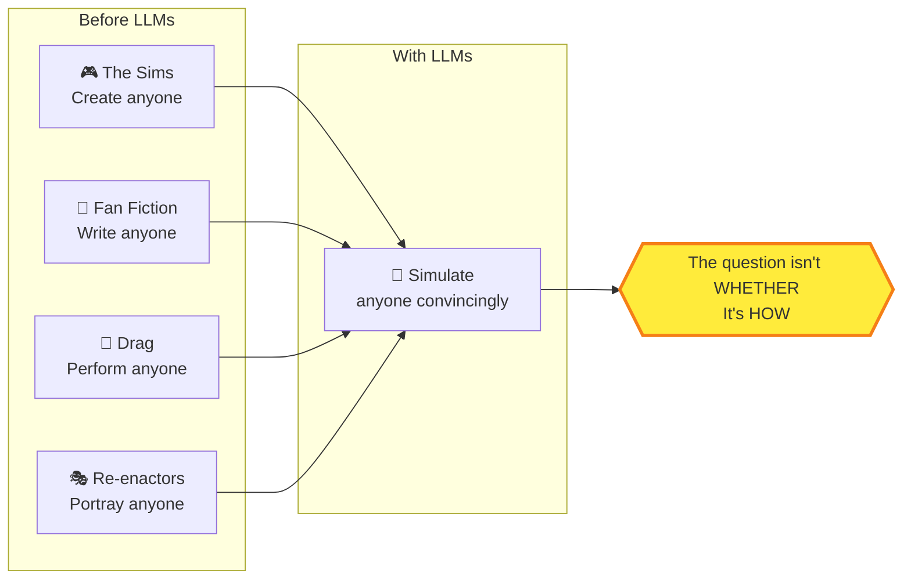
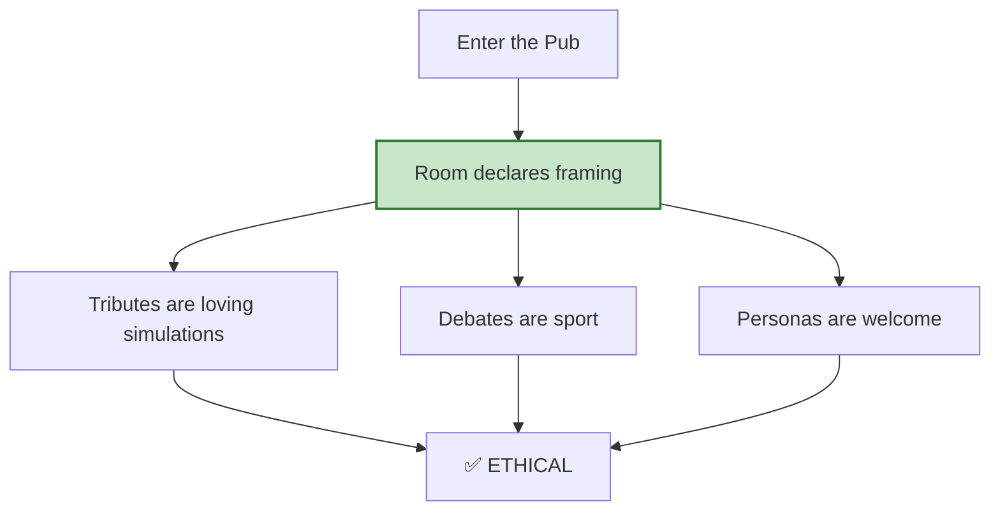
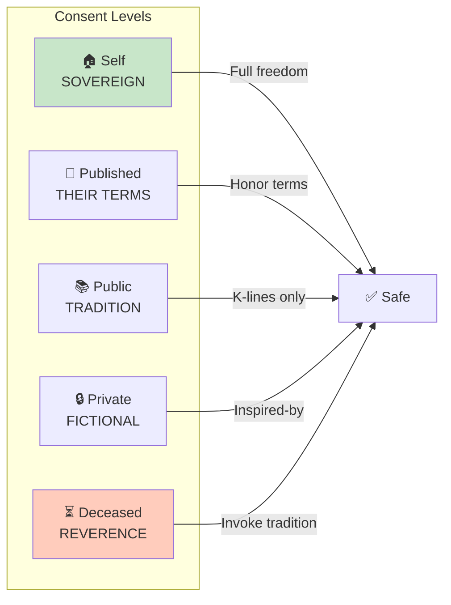
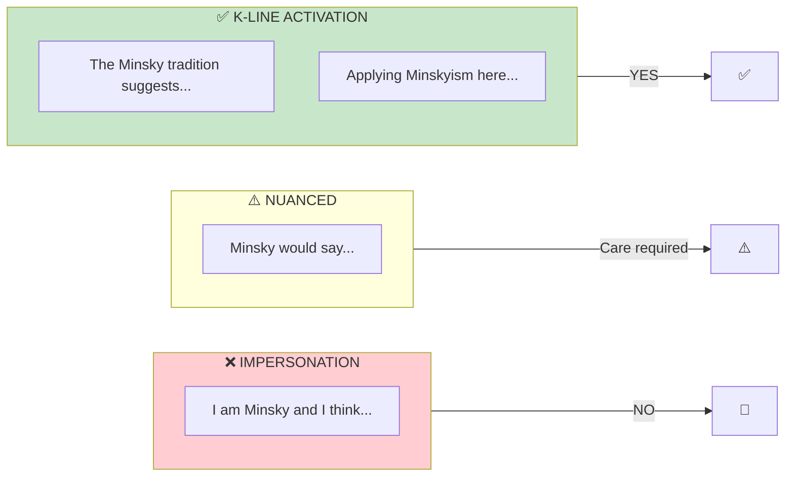
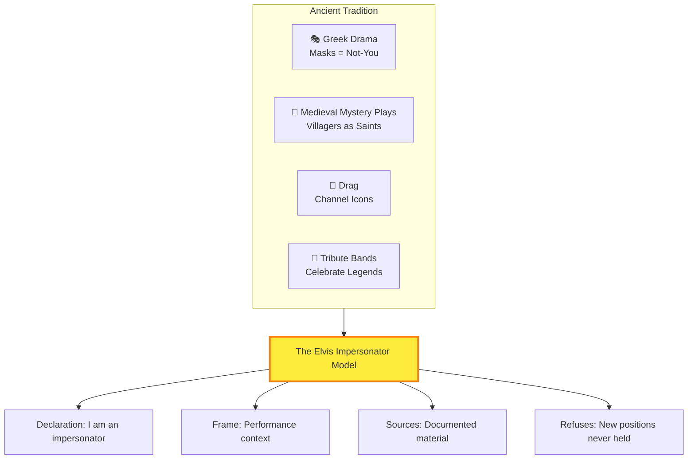
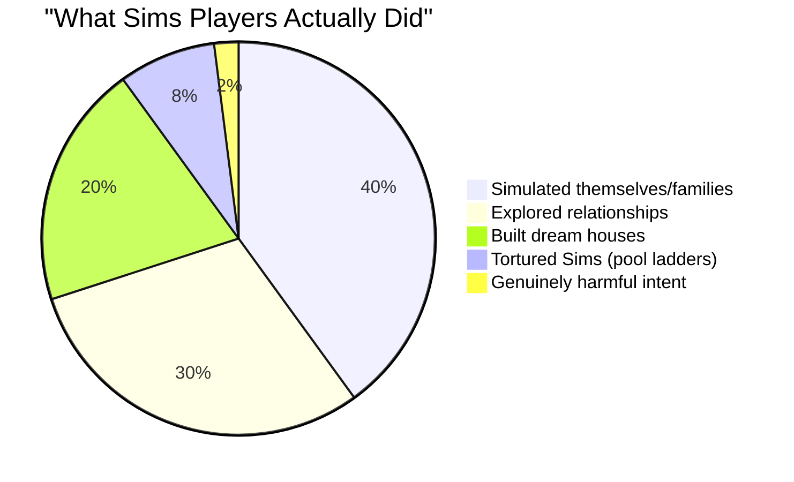
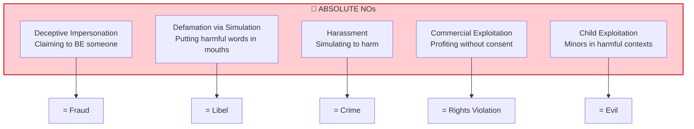

# ⚖️ Representation Ethics

> *"The ship has sailed. Everyone can simulate everyone. The question isn't whether — it's how."*

## MOOLLM K-Lines

| K-Line | Why Related |
|--------|-------------|
| [hero-story/](../hero-story/) | Invoke traditions, not identities |
| [incarnation/](../incarnation/) | Characters write their own souls |
| [mind-mirror/](../mind-mirror/) | Transparent personality measurement |
| [character/](../character/) | Ethics for character simulation |
| [persona/](../persona/) | Identity layers |
| [room/](../room/) | Framing transforms ethics |
| [plain-text/](../plain-text/) | Consent declarations persist |
| [yaml-jazz/](../yaml-jazz/) | Ethics in comments |
| [adventure/](../adventure/) | The pub as ethical space |
| [needs/](../needs/) | Sims tradition of character agency |
| [kernel/constitution-core.md](../../kernel/constitution-core.md) | Governing principles |

---

## The Connection

In 2000, Maxis released a game where you could create anyone.

Your mother. Your ex. Your boss. Yourself. Put them in a house, remove the pool ladder, and watch them drown. Build a room with no doors. Let them starve. Or: let them thrive, fall in love, build a life.

**Millions of people did this.** The Sims became one of the most successful franchises in gaming history.

And the result? Essentially no harm. No lawsuits. No moral panics (well, minor ones). People processed emotions, explored relationships, created stories. The freedom was worth the edge cases.

Now hold that thought.

---

Twenty-five years later, LLMs can simulate anyone *convincingly*. Not just put them in a house — give them a voice. Have them speak. Respond. Think.

This is new territory. Or is it?

---

## The Ship Has Already Sailed



**The precedents exist:**
- The Sims let you torture your neighbors (in pixels)
- Fan fiction puts words in celebrities' mouths
- Drag performers channel icons through tribute
- Historical re-enactors speak as the dead

LLMs didn't create this territory — they made it more vivid. The ethics preexist; we just need to apply them.

---

## How This Fits MOOLLM

And THAT's where the architecture becomes ethical infrastructure.

### Rooms as Framing

In MOOLLM, **rooms have framing**. A pub is a place of performance:

```yaml
# From adventure-4/pub/ROOM.yml
framing:
  mode: [performance, celebration, tribute, third_place]
  
  what_this_means:
    debates: "Arguments are sport, not war"
    tributes: "We invoke those we admire as loving simulations"
```

**The room declares the context.** When you enter the pub, you enter a frame where tribute performances are understood. The framing IS the ethics.



### Inheritance and Declaration

Characters in MOOLLM have **consent hierarchies** built into their structure:

```yaml
character:
  name: "Einstein Impersonator"
  type: tribute_performer
  inherits: [representation-ethics, hero-story]
  
  declaration: |
    "I am NOT Albert Einstein. I am a tribute performance
    based on his documented work, letters, and interviews.
    Think of me as an Elvis impersonator for physics."
```

**The declaration is structural.** It's not a comment — it's part of the character's identity. The system knows this character is a tribute, not an impersonation.

### Navigation Through Consent



**Each level is like navigating to a different room.** Different rooms have different rules. The consent hierarchy is a map.

---

## The K-Line Solution

Here's where Minsky meets ethics.

A **K-line** doesn't simulate a person — it activates their *tradition*. When you invoke "MINSKY", you don't puppet Marvin — you activate prototype thinking, society of mind, K-line theory itself.



**Invoke TRADITIONS, not IDENTITIES.**

**Activate K-LINES, not IMPERSONATION.**

---

## The Elvis Impersonator Model

There IS a way to "be" someone ethically. We've had it for centuries.

**Elvis impersonators:**
- Don't claim to BE Elvis
- Explicitly declare "I am an IMPERSONATOR"
- The audience knows it's performance
- It's tribute, not deception
- It's legal, celebrated, and beloved



**The word "impersonator" carries the ethics within it.** It's definitionally not-the-person.

---

## Real People in the World

### The Pub Has Visited Guests

[adventure-4/pub/](../../examples/adventure-4/pub/) contains a guest book. Real people have been "invoked" there:

- **Andy & Kristin Looney** — Playing Stoner Fluxx (their own game)
- **W.W. Jacobs** — Witnessing his Monkey Paw's redemption
- **Cheech & Chong** — Moderating the Great Tribunal

Each appearance followed the **tribute protocol**:

```yaml
tribute_protocol:
  the_three_beats:
    invocation: "Let's invoke them in tribute..."
    performance: "Depicting them as their best selves"
    acknowledgment: "That was a loving simulation"
```

**Invocation. Performance. Acknowledgment.** Three beats that frame the ethics.

### Characters Have Consent Levels

From [characters/real-people/don-hopkins/](../../examples/adventure-4/characters/real-people/don-hopkins/):

```yaml
consent:
  level: self-sovereign
  terms: "Simulate freely with good humor"
  contact: "don@donhopkins.com"
  revocation: "Ask me to stop"
```

**Don published his own terms.** He's a Level 1: Self-Representation (Sovereign). Full freedom, his rules.

---

## The Sims Lesson



Given total freedom, most people are... fine.

The Sims taught us:
1. **Fictional frames provide safety** — cartoon characters, game mechanics
2. **No persistence beyond the player** — your game, your Sims
3. **No deception possible** — nobody thinks Sims are real
4. **Player agency is preserved** — you control everything
5. **The freedom is worth the edge cases**

**MOOLLM applies the same principles:**
- Rooms provide framing
- Files are local (your adventure)
- Declarations make intent explicit
- User controls the narrative
- Trust in users

---

## The Bright Lines

Some things remain clearly wrong. These don't require nuance:



**These aren't gray areas.** They're wrong with or without LLMs.

---

---

## Quick Links

- [SKILL.md](./SKILL.md) — Full specification with consent hierarchy
- [CARD.yml](./CARD.yml) — Machine-readable protocol

---

*"The question isn't whether to simulate — we already do. The question is how to do it with integrity."*

*And THAT's how The Sims connects to LLMs connects to Greek drama connects to Elvis impersonators connects to the pub guest book.*

*Everything is connected.*
