# Research Notebook

> **Structured research with sources, findings, and decisions.**

Track investigations and capture knowledge.

> [!TIP]
> **LEARN stage of [play-learn-lift](../play-learn-lift/).** Where patterns emerge from exploration.

## Structure

| Section | Purpose |
|---------|---------|
| **Questions** | What you're trying to learn |
| **Sources** | Where you looked |
| **Findings** | What you discovered |
| **Decisions** | What you concluded |

## Contents

| File | Purpose |
|------|---------|
| [SKILL.md](./SKILL.md) | Full protocol documentation |
| [PROTOTYPE.yml](./PROTOTYPE.yml) | Machine-readable definition |
| [template/](./template/) | Notebook and source templates |

## Example

```yaml
research:
  topic: "LLM context management strategies"
  
  questions:
    - "How do other systems handle token budgets?"
    - "What summarization approaches exist?"
    
  sources:
    - url: "paper-on-context.pdf"
      relevance: "Direct answer to Q1"
      
  findings:
    - "Sliding window is most common"
    - "Hierarchical summaries preserve more"
    
  decisions:
    - "Use tiered hot/cold approach"
```

## The Intertwingularity

Research-notebook is the LEARN stage of [play-learn-lift](../play-learn-lift/) — find patterns.

```mermaid
graph LR
    RN[📓 research-notebook] -->|LEARN stage of| PLL[🎮📚🚀 play-learn-lift]
    RN -->|distills to| SUM[📝 summarize]
    RN -->|sources from| SL[📜 session-log]
    RN -->|informs| SS[👯 sister-script]
    
    DB[🔧 debugging] -->|uses| RN
    AP[⚔️ adventure] -->|evidence in| RN
```



---

## Dovetails With

### Sister Skills
| Skill | Relationship |
|-------|--------------|
| [play-learn-lift/](../play-learn-lift/) | Research IS the LEARN stage |
| [session-log/](../session-log/) | Source material from PLAY |
| [summarize/](../summarize/) | Compress findings |
| [sister-script/](../sister-script/) | Research feeds automation |
| [debugging/](../debugging/) | Research supports hypothesis tracking |
| [adventure-protocol/](../adventure-protocol/) | Evidence collection |

### Protocol Symbols
| Symbol | Link |
|--------|------|
| `PLAY-LEARN-LIFT` | [PROTOCOLS.yml](../../PROTOCOLS.yml#PLAY-LEARN-LIFT) |
| `PRESERVE-JOURNEY` | [PROTOCOLS.yml](../../PROTOCOLS.yml#PRESERVE-JOURNEY) |

### Navigation
| Direction | Destination |
|-----------|-------------|
| ⬆️ Up | [skills/](../) |
| ⬆️⬆️ Root | [Project Root](../../) |
| 🎮 Sister | [play-learn-lift/](../play-learn-lift/) |
| 📝 Sister | [summarize/](../summarize/) |
