# Room

> **Rooms are intertwingled navigable activation context maps. Entering = calling. Exiting = returning.**

Directories as cognitive spaces where [cards](../trading-card/) come to life.

> [!TIP]
> Rooms, [trading-cards](../trading-card/), and [soul-chat](../soul-chat/) form a triad. Master one, master all.

---

## The Metaphor


In MOOLLM:
- **Room** = Directory = Activation record = Stack frame
- **Enter** = cd = Push context = Call function
- **Exit** = cd .. = Pop context = Return
- **Cards in room** = Active task instances

---

## Room Anatomy

```
.agent/rooms/
  debug-session/           # A room
    ROOM.yml               # Room definition (identity)
    README.md              # Room's voice (soul-chat compatible)
    
    # Cards in play
    goblin-001.yml         # Git Goblin instance
    scribe-001.yml         # Session Scribe instance
    
    # Room state
    state/
      progress.yml
      findings.yml
```

---

## ROOM.yml Structure

```yaml
room:
  name: "Debug Session"
  purpose: "Hunt down the authentication bug"
  
  # What you need to know when entering
  context:
    - "Bug: Login fails with valid credentials"
    - "Suspected: Session cookie handling"
    
  # Cards currently in play
  cards_in_play:
    - instance: "goblin-001"
      card: "Git Goblin"
      goal: "Find when bug was introduced"
      
    - instance: "scribe-001"
      card: "Session Scribe"
      goal: "Log all findings"
      
  # Room's working set (what's in context when here)
  working_set:
    - "ROOM.yml"
    - "state/progress.yml"
    - "state/findings.yml"
    
  # Links to other rooms
  exits:
    parent: "../"
    related: "../feature-work/"
```

---

## Room as Memory Palace

Rooms aren't just workspaces — they're **memory locations**.

Place knowledge in rooms. Navigate to remember.

```
.agent/rooms/
  concepts/
    yaml-jazz/         # Everything about YAML Jazz
    play-learn-lift/   # The methodology lives here
    
  projects/
    moollm/            # Current project context
    
  characters/
    gardener/          # The Gardener's space
```

Walking through rooms = traversing knowledge.

---

## Room Navigation

| Action | What Happens |
|--------|--------------|
| **Enter** | Push room's working_set to context |
| **Exit** | Pop context, return to parent |
| **Look** | Read ROOM.yml and README.md |
| **Activate card** | Clone card template into room |
| **Complete card** | Card writes return_value, can be removed |

---

## Multi-Presence & Data Flow

**Cards can be active in multiple rooms at once.**

```
.agent/rooms/
  research/
    papert-001.yml     # Papert exploring microworlds
    
  writing/
    papert-002.yml     # Papert helping draft a paper
    
  debugging/
    papert-003.yml     # Papert thinking about the bug
```

Same card, three independent actors, different contexts.

### Data Flow Between Rooms

Actors can send data to each other:

```yaml
# In research/papert-001.yml
message_to:
  target: "../writing/papert-002.yml"
  content:
    insight: "Microworlds need low floors and high ceilings"
    
# In writing/papert-002.yml  
messages_received:
  - from: "../research/papert-001.yml"
    content: { insight: "..." }
    incorporated: true
```

### Why Multi-Presence?

| Pattern | Use Case |
|---------|----------|
| **Parallel exploration** | Same expertise, different angles |
| **Cross-pollination** | Ideas flow between contexts |
| **Distributed work** | One persona, many tasks |
| **Consensus building** | Multiple instances vote/synthesize |

---

## Speed of Light vs Carrier Pigeons

> [!WARNING]
> **Traditional multi-agent**: Each agent in isolation. One LLM call per agent. Communication by writing tokens on toilet paper in crayon and sending via carrier pigeon. **Slow. Expensive. Sad.**

> [!NOTE]
> **MOOLLM**: Simulate as many agents together as possible in ONE LLM call. Communication at the speed of light. Multiple simulation steps per iteration. Dozens of back-and-forth exchanges between many characters in ONE call.

```mermaid
flowchart LR
    subgraph traditional["TRADITIONAL (Carrier Pigeons)"]
        direction TB
        A1[Agent A: call #1] --> F1[write file]
        F1 --> W1[wait...]
        W1 --> B1[Agent B: call #2]
        B1 --> F2[read/write]
        F2 --> W2[wait...]
        W2 --> A2[Agent A: call #3]
    end
    
    subgraph moollm["MOOLLM (Speed of Light)"]
        direction TB
        L1["ONE LLM call"] --> S1[A step 1]
        S1 --> S2[B step 1]
        S2 --> S3[C step 1]
        S3 --> M1[A→B instant]
        M1 --> M2[B→C instant]
        M2 --> S4[A step 2]
        S4 --> S5[B step 2]
        S5 --> MORE[...many more]
    end
```



### The Insight

Inside one LLM call, everything happens at **speed of light**:
- No network latency
- No file I/O wait
- No context-switching overhead
- Agents share the same mental space

The LLM can simulate **dozens of interaction steps** in the time it takes traditional approaches to do ONE agent's turn.

### Multi-Step Simulation

```yaml
# In one LLM iteration:
simulation:
  - step: 1
    papert-001: "Microworlds need low floors"
    kay-001: "Yes! Like Smalltalk for children"
    ungar-001: "And no classes — prototypes only"
    
  - step: 2
    papert-001: 
      responds_to: kay-001
      says: "Exactly! Accessible entry, unlimited ceiling"
    ungar-001:
      responds_to: papert-001
      says: "Self took that further — slots, not classes"
      
  - step: 3
    synthesis:
      emerged: "Low floor + high ceiling + prototypes = MOOLLM"
```

Three characters, three steps, instant cross-talk — **ONE LLM call**.

Even multiple conversations in parallel in different rooms, sending messages back and forth to each other. There is no overhead for sending telepathic light speed messages! 

### This IS The Sims

```
The Sims: One frame, all Sims simulated, instant interaction
MOOLLM:   One call, all cards simulated, instant messaging
```

Instead of isolated agent prisons, we have a **shared microworld**.

---

## Contents

| File | Purpose |
|------|---------|
| [SKILL.md](./SKILL.md) | Full protocol documentation |
| [PROTOTYPE.yml](./PROTOTYPE.yml) | Machine-readable definition |
| [template/ROOM.yml.tmpl](./template/ROOM.yml.tmpl) | Template for new rooms |

---

## Connections & Doors

Rooms have **exits** — links to other rooms:

```yaml
exits:
  - name: "lobby"
    target: "../lobby/"
    description: "Back to the main entrance"
  - name: "archives"
    target: "./archives/"
    description: "Into the dusty archives"
    
outside: "../"  # Auto-link to parent (always exists)
```

Navigate with: `GO lobby`, `GO archives`, `EXIT` (to parent)

---

## Nested Rooms (Rooms in Rooms)

Directories within directories. **Rooms all the way down.**

```
palace/
  ROOM.yml           # The palace
  treasury/
    ROOM.yml         # Room inside the palace
    vault/
      ROOM.yml       # Room inside the treasury
```

- `outside` — automatically points to parent
- `nested` — automatically lists child rooms with `ROOM.yml`

---

## Portable Rooms (TARDIS, Bags of Holding)

Some rooms are **portable** — pick them up, carry them, deploy anywhere:

| Command | Action |
|---------|--------|
| `EMBARK` | Enter the portable room |
| `DISEMBARK` | Exit to container location |
| `PICKUP` | Put room in pocket |
| `DROP` | Place room here |
| `DRIVE` | Move room (and occupants) |

```yaml
room:
  name: "research-tent"
  portable: true
  location: "projects/moollm/"  # Currently deployed here
```

**Use cases:**
- Carry your workspace between projects
- Share a room by handing it to someone
- Archive a room by putting it in storage
- Deploy a debugging kit anywhere you need it

> Like LambdaMOO vehicles, you can enter a room, then the whole room moves!

---

## The Philosophy

> **Spatial navigation IS cognitive navigation.**

When you "enter" the debug-session room:
- Your context shifts to debugging
- Relevant cards are already in play
- The room's knowledge is loaded
- You know where the exits lead

When you "exit":
- Debug context pops
- You're back in the parent context
- The room persists for later return

---

## The Intertwingularity

```mermaid
graph LR
    R[🚪 room] <-->|cards live in| TC[🎴 trading-card]
    R -->|narrative frame| AP[⚔️ adventure]
    R -->|mnemonic frame| MP[🏛️ memory-palace]
    R -->|entities speak| SC[💬 soul-chat]
    R -->|tracks state| SL[📜 session-log]
    TC -->|activates in| R
```



---

## Dovetails With

### Sister Skills
| Skill | Relationship |
|-------|--------------|
| [trading-card/](../trading-card/) | Cards **live** in rooms. Activation creates instances. |
| [memory-palace/](../memory-palace/) | Memory Palace IS Room + mnemonic intent |
| [adventure-protocol/](../adventure-protocol/) | Adventure IS Room + narrative framing |
| [soul-chat/](../soul-chat/) | Rooms can **speak** and welcome visitors |
| [session-log/](../session-log/) | Track room entry/exit in audit trail |

### Protocol Symbols
| Symbol | Link |
|--------|------|
| `ROOM-AS-FUNCTION` | [PROTOCOLS.yml](../../PROTOCOLS.yml#ROOM-AS-FUNCTION) |
| `PORTABLE-ROOM` | [PROTOCOLS.yml](../../PROTOCOLS.yml#PORTABLE-ROOM) |
| `NESTED-ROOMS` | [PROTOCOLS.yml](../../PROTOCOLS.yml#NESTED-ROOMS) |
| `HYPERCARD-HIERARCHY` | [PROTOCOLS.yml](../../PROTOCOLS.yml#HYPERCARD-HIERARCHY) |
| `RETURN-STACK` | [PROTOCOLS.yml](../../PROTOCOLS.yml#RETURN-STACK) |
| `SPEED-OF-LIGHT` | [PROTOCOLS.yml](../../PROTOCOLS.yml#SPEED-OF-LIGHT) |

### Kernel
- [kernel/context-assembly-protocol.md](../../kernel/context-assembly-protocol.md) — How room working_set is assembled
- [schemas/agent-directory-schema.yml](../../schemas/agent-directory-schema.yml) — Where rooms live in `.agent/`

### Navigation
| Direction | Destination |
|-----------|-------------|
| ⬆️ Up | [skills/](../) |
| ⬆️⬆️ Root | [Project Root](../../) |
| 🎴 Sister | [trading-card/](../trading-card/) |
| 🏛️ Sister | [memory-palace/](../memory-palace/) |
