# Room

> **Rooms are intertwingled navigable activation context maps. Entering = calling. Exiting = returning.**

Directories as cognitive spaces where [cards](../card/) come to life.

> [!TIP]
> Rooms, [cards](../card/), and [soul-chat](../soul-chat/) form a triad. Master one, master all.

---

## The Metaphor

```mermaid
graph TD
    subgraph "Room = Activation Record"
        R[🚪 Room Directory]
        R --> L[Local State]
        R --> P[Parameters]
        R --> G[Goals]
        R --> C[Cards in Play]
    end
    
    E[Enter Room] -->|push context| R
    R -->|pop context| X[Exit Room]
```



In MOOLLM:
- **Room** = Directory = Activation record = Stack frame
- **Enter** = cd = Push context = Call function
- **Exit** = cd .. = Pop context = Return
- **Cards in room** = Active task instances

---

## Room Anatomy

```
.agent/rooms/
  debug-session/           # A room
    ROOM.yml               # Room definition (identity)
    README.md              # Room's voice (soul-chat compatible)
    
    # Cards in play
    goblin-001.yml         # Git Goblin instance
    scribe-001.yml         # Session Scribe instance
    
    # Room state
    state/
      progress.yml
      findings.yml
```

---

## ROOM.yml Structure

```yaml
room:
  name: "Debug Session"
  purpose: "Hunt down the authentication bug"
  
  # What you need to know when entering
  context:
    - "Bug: Login fails with valid credentials"
    - "Suspected: Session cookie handling"
    
  # Cards currently in play
  cards_in_play:
    - instance: "goblin-001"
      card: "Git Goblin"
      goal: "Find when bug was introduced"
      
    - instance: "scribe-001"
      card: "Session Scribe"
      goal: "Log all findings"
      
  # Room's working set (what's in context when here)
  working_set:
    - "ROOM.yml"
    - "state/progress.yml"
    - "state/findings.yml"
    
  # Links to other rooms
  exits:
    parent: "../"
    related: "../feature-work/"
    
  # Optional: position in 2D world-space
  world_position:
    x: 5
    y: 12
    
  # Optional: objects with positions in room-space
  objects:
    - name: "workbench"
      position: {x: 3, y: 7}
    - name: "door-north"
      position: {x: 5, y: 15}
```

---

## Spatial Coordinates

Rooms can exist in **world-space**. Objects can have positions in **room-space**.

```yaml
# World-space: where is this room in the world?
world_position:
  x: 5
  y: 12
  # Higher dimensions optional
  z: 0
  dimension: "material"
```

Navigation can use coordinates:
- `NORTH` from (5,12) → find room at (5,13)
- Or explicit named exits override coordinates

```yaml
# Room-space: where are objects within this room?
objects:
  - name: "workbench"
    position: {x: 3, y: 7}
  - name: "bookshelf"
    position: {x: 0, y: 10}
```

**Not all rooms need coordinates.** Abstract spaces (concepts, archives) can exist outside world-space.

---

## Vehicles: Portable Rooms That Move

A **vehicle** is a room you can embark, drive, and disembark.

```yaml
# vehicle-tent.yml
room:
  name: "Research Tent"
  is_vehicle: true
  world_position: {x: 5, y: 12}  # Changes when you drive
  
  occupants:
    - "the-researcher"
    - "assistant-sprite"
```

| Command | Effect |
|---------|--------|
| `EMBARK tent` | Enter the vehicle room |
| `DISEMBARK` | Exit to current world location |
| `DRIVE NORTH` | Move vehicle (and occupants) to (5,13) |

Vehicles have **their own internal coordinate systems**:
- **TARDIS** — bigger on the inside, its own room-space
- **Bouncy castle** — kids go in, bounce around in internal space
- **Logo turtle** — carries position + heading, draws on the floor

### Riding the Turtle

**RIDE the turtle.** Move around the room, draw on the floor, jump through doors:

```
> RIDE turtle
You mount the turtle. The world scrolls beneath you.

> FORWARD 100
The turtle moves forward. A red line appears on floor.svg.

> RIGHT 90
> FORWARD 50
You're near the door-north.

> ENTER door-north
You jump through the door INTO the next room.
The turtle comes with you.

> ZOOM OUT
You see the room graph — all connected spaces.
```

```yaml
# turtle.yml — a vehicle within room-space
turtle:
  position: {x: 100, y: 100}
  heading: 90  # degrees, 0 = north
  pen_down: true
  pen_color: "#e94560"
  rider: "the-explorer"  # You're on it!
```

| Command | Effect |
|---------|--------|
| `RIDE turtle` | Mount the turtle, move with it |
| `DISMOUNT` | Get off |
| `FORWARD 50` | Move forward, draw if pen down |
| `RIGHT 90` | Turn right |
| `ENTER door` | Jump through door to connected room |
| `INTO subroom` | Descend into nested sub-room |
| `ZOOM OUT` | See the room graph navigator |
| `LOOK` | Describe nearby objects and exits |

### Context-Aware Navigation

The turtle **describes your location** in terms of nearby objects and exits:

```
> LOOK
You are near [workbench] (2 units north).
Exits: [door-north] (5 units ahead), [window-east] (3 units right).
Objects: [toolbox] (at your feet), [blueprint.yml] (on workbench).

> FORWARD 2
*snap* You're at the workbench.
TIP: EXAMINE workbench | USE toolbox | READ blueprint.yml
```

### Snap Cursor & Pie Menus

When you approach an object, the cursor **snaps** to it and shows a **pie menu** of scored actions:

```
        EXAMINE (80)
           ╱
 REPAIR ──●── USE (95) ← default
           ╲
        TAKE (20)
```

**This IS The Sims interaction model:**
- Objects **advertise** their available actions
- Actions are **scored** based on context, needs, state
- High-scoring actions appear prominently
- Click center = default action (highest score)

```
┌────────────────────────────┐
│ 📍 workbench               │
├────────────────────────────┤
│ ● USE (95)  ← default      │
│   EXAMINE (80)             │
│   REPAIR (60)              │
│   TAKE (20)                │
├────────────────────────────┤
│ Contains: [toolbox]        │
│ Near: [door-north] 3 units │
└────────────────────────────┘
```

**Lineage:** Don Hopkins' [Pie Menus](https://en.wikipedia.org/wiki/Pie_menu) + Will Wright's [SimAntics](https://en.wikipedia.org/wiki/SimAntics) advertisements.

### Markup UI Links

In rendered HTML, objects become **clickable links**:

```html
<span class="room-object" data-actions="examine,use,take">
  <a href="#workbench">workbench</a>
  <span class="snap-tip">EXAMINE · USE · TAKE</span>
</span>

<a href="./door-north/" class="exit">🚪 door-north</a>
<a href="./blueprint.yml" class="object">📄 blueprint.yml</a>
```

---

## Cursor as Vehicle: Direct Manipulation

The cursor **carries tools** and applies them to the room floor:

```
> SELECT pen-tool
Cursor now carries: 🖊️ pen (red)

> CLICK workbench
*snap* Cursor at workbench. Pen ready.

> DRAG to door-north
Drawing line from workbench to door-north...
Line added to floor.svg
```

### Tools

| Tool | Icon | Action |
|------|------|--------|
| `pen` | 🖊️ | Draw lines on floor |
| `eraser` | 🧽 | Remove drawings |
| `selector` | 👆 | Pick up and move objects |
| `linker` | 🔗 | Draw connections between objects |
| `stamper` | 📌 | Place copies of cards |
| `highlighter` | 🖍️ | Mark regions |
| `annotator` | 🏷️ | Add text labels |

### Drag Operations

| Drag | Effect |
|------|--------|
| Object → empty space | MOVE object |
| Object → object | CONNECT or GIVE |
| Tool → object | APPLY tool |
| Card → room | PLAY card |
| Object → inventory | PICKUP |
| From inventory → room | DROP |

### SVG Interaction

The room renders as layered SVG:

```
floor.svg layers (back to front):
1. grid          — coordinate reference
2. floor         — background zones
3. trails        — turtle drawings
4. links         — connection lines
5. objects       — clickable shapes
6. annotations   — labels, highlights
7. cursor        — current tool position
```

```html
<!-- Clickable SVG elements -->
<rect class="object" onclick="SELECT" ondrag="MOVE"/>
<path class="trail" onclick="EDIT"/>
<text class="label" onclick="RENAME" ondrag="REPOSITION"/>
<line class="link" onclick="EDIT_LINK"/>
```

**Click** → select. **Double-click** → edit. **Right-click** → pie menu. **Drag** → move or apply.

Changes write back to `ROOM.yml` and `floor.svg`. The LLM reads the SVG to understand layout. **Direct manipulation all the way down.**

---

## Throwing Objects: Data Flow Programming

**Throw objects through exits.** They pile up on the other side. This is essential for data flow.

```
> THROW blueprint door-north
Throwing blueprint through door-north...
blueprint landed in assembly/inbox/
```

### Inbox / Outbox

Each room can have:

```
room/
  inbox/           # Objects thrown INTO this room land here
    task-001.yml
    task-002.yml
  outbox/          # Stage objects before throwing OUT
    result-001.yml
```

### Commands

| Command | Effect |
|---------|--------|
| `THROW obj exit` | Toss object through exit |
| `INBOX` | List waiting items |
| `NEXT` | Process next item (FIFO) |
| `PEEK` | Look without removing |
| `STAGE obj exit` | Add to outbox |
| `FLUSH` | Throw all staged objects |

### Rooms as Pipeline Stages

```
source/ ─────► process/ ─────► sink/
   │              │              
   │              ▼              
   │         validator/         
   │              │              
   │              ▼              
   └────────► errors/
```

Each room is a **processing node**. Exits are **edges**. Thrown objects are **messages**.

```yaml
# Document processing pipeline:
uploads/          # Raw files land here
  inbox/
    doc-001.pdf
    
parser/           # Extract text
  inbox/
  script: parse.py
  
analyzer/         # LLM analyzes  
  inbox/
  prompt: "Summarize and extract entities"
  
output/           # Final results collect here
  inbox/
    doc-001-summary.yml
```

**Processing loop:** `NEXT` → process → `STAGE` → `FLUSH` → repeat.

This is how MOOLLM does **Kilroy-style data flow**: rooms as nodes, files as messages, the filesystem as the network.

---

**Inspirations:**
- **Logo turtle** — Papert's original constructionist agent
- **Rocky's Boots (1982)** — ride around, wire logic circuits, go inside machines
- **Robot Odyssey (1984)** — navigate rooms, program robots, enter robots

The turtle draws on `floor.svg`. The room graph is `world-map.svg`. Edit while exploring. **Build to understand.**

---

## Inventories

Characters carry **inventories** — portable rooms always with them.

```yaml
# character/inventory/
sword.card
map.yml
torch.yml
notes/
  finding-001.md
```

| Command | Effect |
|---------|--------|
| `GET sword` | Pick up from room → inventory |
| `DROP map` | Put from inventory → room |
| `GIVE torch TO companion` | Transfer to another character |
| `USE torch` | Activate object in inventory |
| `INVENT` | List what you're carrying |

**Your inventory IS a pocket dimension** — a portable room that travels with you.

---

## Nested Containers: Objects Inside Objects

Objects can contain other objects, to arbitrary depth:

```
> PUT screwdriver IN toolbox
screwdriver is now inside toolbox

> PUT toolbox IN backpack
toolbox is now inside backpack

> OPEN backpack
backpack contains:
  - toolbox (3 items)
  - sandwich
  - map.yml
```

### Container Commands

| Command | Effect |
|---------|--------|
| `PUT obj IN container` | Place inside |
| `TAKE obj FROM container` | Remove from |
| `OPEN container` | List contents |
| `DUMP container` | Take everything out |

### Object Paths

Address nested objects with paths:

```
> EXAMINE backpack/toolbox/wrench
A well-worn wrench. Tag: favorite

> USE inventory/potions/healing
Using healing potion from inventory...

> TAKE ../chest/gold FROM here
Taking gold from chest...
```

Path syntax:
- `container/sub/item` — absolute within scope
- `./toolbox/wrench` — relative to current
- `../sibling/item` — parent's sibling
- `/room/absolute/path` — from room root

### Tags for Search and Reference

Label objects with tags:

```
> TAG wrench @favorite
> TAG sword @quest-item @weapon
> TAGS sword
sword: [@quest-item, @weapon]
```

**Special tags:**
- `@input` / `@output` / `@error` — data flow channels
- `@temp` — can be cleaned up
- `@important` — prioritized
- `@favorite` — user preference

### Search

Find objects by name, tag, or type:

```
> SEARCH backpack @tool
Found in backpack:
  toolbox/screwdriver [@tool]
  toolbox/wrench [@tool @favorite]

> SEARCH * "secret"
Found:
  room/desk/drawer/secret-note.yml
  inventory/secret-map.yml

> FIND @quest-item
Objects tagged @quest-item:
  chest/box/ring
  shelf/book/page/clue
```

Search descends recursively into containers.

---

## Room Graph Navigator

**ZOOM OUT** to see the whole world:

```
> ZOOM OUT
┌─────────────────────────────────────────┐
│  ROOM GRAPH: moollm-palace              │
├─────────────────────────────────────────┤
│                                         │
│    [kernel]────────[skills]             │
│       │               │                 │
│       │         ┌─────┼─────┐           │
│       │      [room] [card] [chat]       │
│       │         │                       │
│       │      [★ YOU ARE HERE]           │
│       │                                 │
│    [schemas]──────[designs]             │
│                                         │
└─────────────────────────────────────────┘

> CLICK skills
You zoom into skills/. Sub-rooms appear.

> LINK room TO card
Connection created. You can now JUMP directly.

> EDIT world-map.svg
The room graph opens in your editor.
```

| Command | Effect |
|---------|--------|
| `ZOOM OUT` | See room graph overview |
| `ZOOM IN room` | Enter selected room |
| `LINK a TO b` | Create connection between rooms |
| `UNLINK a FROM b` | Remove connection |
| `MOVE room TO (x,y)` | Reposition in world-space |
| `EDIT map` | Open world-map.svg in editor |

**Like Rocky's Boots:** Navigate the structure. Edit while exploring. Go inside sub-rooms. Wire up connections. The map IS the territory.

---

## Room as Memory Palace

Rooms aren't just workspaces — they're **memory locations**.

Place knowledge in rooms. Navigate to remember.

```
.agent/rooms/
  concepts/
    yaml-jazz/         # Everything about YAML Jazz
    play-learn-lift/   # The methodology lives here
    
  projects/
    moollm/            # Current project context
    
  characters/
    gardener/          # The Gardener's space
```

Walking through rooms = traversing knowledge.

---

## Room Navigation

| Action | What Happens |
|--------|--------------|
| **Enter** | Push room's working_set to context |
| **Exit** | Pop context, return to parent |
| **Look** | Read ROOM.yml and README.md |
| **Activate card** | Clone card template into room |
| **Complete card** | Card writes return_value, can be removed |

---

## Multi-Presence & Data Flow

**Cards can be active in multiple rooms at once.**

```
.agent/rooms/
  research/
    papert-001.yml     # Papert exploring microworlds
    
  writing/
    papert-002.yml     # Papert helping draft a paper
    
  debugging/
    papert-003.yml     # Papert thinking about the bug
```

Same card, three independent actors, different contexts.

### Data Flow Between Rooms

Actors can send data to each other:

```yaml
# In research/papert-001.yml
message_to:
  target: "../writing/papert-002.yml"
  content:
    insight: "Microworlds need low floors and high ceilings"
    
# In writing/papert-002.yml  
messages_received:
  - from: "../research/papert-001.yml"
    content: { insight: "..." }
    incorporated: true
```

### Why Multi-Presence?

| Pattern | Use Case |
|---------|----------|
| **Parallel exploration** | Same expertise, different angles |
| **Cross-pollination** | Ideas flow between contexts |
| **Distributed work** | One persona, many tasks |
| **Consensus building** | Multiple instances vote/synthesize |

---

## Speed of Light vs Carrier Pigeons

> [!WARNING]
> **Traditional multi-agent**: Each agent in isolation. One LLM call per agent. Communication by writing tokens on toilet paper in crayon and sending via carrier pigeon. **Slow. Expensive. Sad.**

> [!NOTE]
> **MOOLLM**: Simulate as many agents together as possible in ONE LLM call. Communication at the speed of light. Multiple simulation steps per iteration. Dozens of back-and-forth exchanges between many characters in ONE call.

```mermaid
flowchart LR
    subgraph traditional["TRADITIONAL (Carrier Pigeons)"]
        direction TB
        A1[Agent A: call #1] --> F1[write file]
        F1 --> W1[wait...]
        W1 --> B1[Agent B: call #2]
        B1 --> F2[read/write]
        F2 --> W2[wait...]
        W2 --> A2[Agent A: call #3]
    end
    
    subgraph moollm["MOOLLM (Speed of Light)"]
        direction TB
        L1["ONE LLM call"] --> S1[A step 1]
        S1 --> S2[B step 1]
        S2 --> S3[C step 1]
        S3 --> M1[A→B instant]
        M1 --> M2[B→C instant]
        M2 --> S4[A step 2]
        S4 --> S5[B step 2]
        S5 --> MORE[...many more]
    end
```



### The Insight

Inside one LLM call, everything happens at **speed of light**:
- No network latency
- No file I/O wait
- No context-switching overhead
- Agents share the same mental space

The LLM can simulate **dozens of interaction steps** in the time it takes traditional approaches to do ONE agent's turn.

### Multi-Step Simulation

```yaml
# In one LLM iteration:
simulation:
  - step: 1
    papert-001: "Microworlds need low floors"
    kay-001: "Yes! Like Smalltalk for children"
    ungar-001: "And no classes — prototypes only"
    
  - step: 2
    papert-001: 
      responds_to: kay-001
      says: "Exactly! Accessible entry, unlimited ceiling"
    ungar-001:
      responds_to: papert-001
      says: "Self took that further — slots, not classes"
      
  - step: 3
    synthesis:
      emerged: "Low floor + high ceiling + prototypes = MOOLLM"
```

Three characters, three steps, instant cross-talk — **ONE LLM call**.

Even multiple conversations in parallel in different rooms, sending messages back and forth to each other. There is no overhead for sending telepathic light speed messages! 

### This IS The Sims

```
The Sims: One frame, all Sims simulated, instant interaction
MOOLLM:   One call, all cards simulated, instant messaging
```

Instead of isolated agent prisons, we have a **shared microworld**.

---

## Contents

| File | Purpose |
|------|---------|
| [SKILL.md](./SKILL.md) | Full protocol documentation |
| [PROTOTYPE.yml](./PROTOTYPE.yml) | Machine-readable definition |
| [template/ROOM.yml.tmpl](./template/ROOM.yml.tmpl) | Template for new rooms |

---

## Connections & Doors

Rooms have **exits** — links to other rooms:

```yaml
exits:
  - name: "lobby"
    target: "../lobby/"
    description: "Back to the main entrance"
  - name: "archives"
    target: "./archives/"
    description: "Into the dusty archives"
    
outside: "../"  # Auto-link to parent (always exists)
```

Navigate with: `GO lobby`, `GO archives`, `EXIT` (to parent)

---

## Nested Rooms (Rooms in Rooms)

Directories within directories. **Rooms all the way down.**

```
palace/
  ROOM.yml           # The palace
  treasury/
    ROOM.yml         # Room inside the palace
    vault/
      ROOM.yml       # Room inside the treasury
```

- `outside` — automatically points to parent
- `nested` — automatically lists child rooms with `ROOM.yml`

---

## Portable Rooms

See [Vehicles: Portable Rooms That Move](#vehicles-portable-rooms-that-move) for the full model.

**Quick reference:**

| Command | Action |
|---------|--------|
| `EMBARK` | Enter the portable room |
| `DISEMBARK` | Exit to container location |
| `PICKUP` | Put room in pocket/inventory |
| `DROP` | Place room here |
| `DRIVE` | Move room (and occupants) |

**Use cases:** Carry workspace between projects, share by handing to colleague, archive by putting in storage, deploy debugging kit anywhere.

---

## The Philosophy

> **Spatial navigation IS cognitive navigation.**

When you "enter" the debug-session room:
- Your context shifts to debugging
- Relevant cards are already in play
- The room's knowledge is loaded
- You know where the exits lead

When you "exit":
- Debug context pops
- You're back in the parent context
- The room persists for later return

---

## The Intertwingularity

```mermaid
graph LR
    R[🚪 room] <-->|cards live in| TC[🎴 card]
    R -->|narrative frame| AP[⚔️ adventure]
    R -->|mnemonic frame| MP[🏛️ memory-palace]
    R -->|entities speak| SC[💬 soul-chat]
    R -->|tracks state| SL[📜 session-log]
    TC -->|activates in| R
```



---

## Dovetails With

### Sister Skills
| Skill | Relationship |
|-------|--------------|
| [card/](../card/) | Cards **live** in rooms. Activation creates instances. |
| [memory-palace/](../memory-palace/) | Memory Palace IS Room + mnemonic intent |
| [adventure/](../adventure/) | Adventure IS Room + narrative framing |
| [soul-chat/](../soul-chat/) | Rooms can **speak** and welcome visitors |
| [session-log/](../session-log/) | Track room entry/exit in audit trail |

### Protocol Symbols
| Symbol | Link |
|--------|------|
| `ROOM-AS-FUNCTION` | [PROTOCOLS.yml](../../PROTOCOLS.yml#ROOM-AS-FUNCTION) |
| `PORTABLE-ROOM` | [PROTOCOLS.yml](../../PROTOCOLS.yml#PORTABLE-ROOM) |
| `VEHICLE` | [PROTOCOLS.yml](../../PROTOCOLS.yml#VEHICLE) |
| `NESTED-ROOMS` | [PROTOCOLS.yml](../../PROTOCOLS.yml#NESTED-ROOMS) |
| `WORLD-SPACE` | [PROTOCOLS.yml](../../PROTOCOLS.yml#WORLD-SPACE) |
| `ROOM-SPACE` | [PROTOCOLS.yml](../../PROTOCOLS.yml#ROOM-SPACE) |
| `INVENTORY` | [PROTOCOLS.yml](../../PROTOCOLS.yml#INVENTORY) |
| `LOGO-TURTLE` | [PROTOCOLS.yml](../../PROTOCOLS.yml#LOGO-TURTLE) |
| `SNAP-CURSOR` | [PROTOCOLS.yml](../../PROTOCOLS.yml#SNAP-CURSOR) |
| `PIE-MENU` | [PROTOCOLS.yml](../../PROTOCOLS.yml#PIE-MENU) |
| `CURSOR-VEHICLE` | [PROTOCOLS.yml](../../PROTOCOLS.yml#CURSOR-VEHICLE) |
| `ROOM-FLOOR` | [PROTOCOLS.yml](../../PROTOCOLS.yml#ROOM-FLOOR) |
| `CONTAINER` | [PROTOCOLS.yml](../../PROTOCOLS.yml#CONTAINER) |
| `OBJECT-PATH` | [PROTOCOLS.yml](../../PROTOCOLS.yml#OBJECT-PATH) |
| `TAG` | [PROTOCOLS.yml](../../PROTOCOLS.yml#TAG) |
| `SEARCH` | [PROTOCOLS.yml](../../PROTOCOLS.yml#SEARCH) |
| `THROW` | [PROTOCOLS.yml](../../PROTOCOLS.yml#THROW) |
| `INBOX` | [PROTOCOLS.yml](../../PROTOCOLS.yml#INBOX) |
| `OUTBOX` | [PROTOCOLS.yml](../../PROTOCOLS.yml#OUTBOX) |
| `DATA-FLOW` | [PROTOCOLS.yml](../../PROTOCOLS.yml#DATA-FLOW) |
| `ADVERTISEMENT` | [PROTOCOLS.yml](../../PROTOCOLS.yml#ADVERTISEMENT) |
| `ROOM-GRAPH` | [PROTOCOLS.yml](../../PROTOCOLS.yml#ROOM-GRAPH) |
| `HYPERCARD-HIERARCHY` | [PROTOCOLS.yml](../../PROTOCOLS.yml#HYPERCARD-HIERARCHY) |
| `RETURN-STACK` | [PROTOCOLS.yml](../../PROTOCOLS.yml#RETURN-STACK) |
| `SPEED-OF-LIGHT` | [PROTOCOLS.yml](../../PROTOCOLS.yml#SPEED-OF-LIGHT) |

### Kernel
- [kernel/context-assembly-protocol.md](../../kernel/context-assembly-protocol.md) — How room working_set is assembled
- [schemas/agent-directory-schema.yml](../../schemas/agent-directory-schema.yml) — Where rooms live in `.agent/`

### Navigation
| Direction | Destination |
|-----------|-------------|
| ⬆️ Up | [skills/](../) |
| ⬆️⬆️ Root | [Project Root](../../) |
| 🎴 Sister | [card/](../card/) |
| 🏛️ Sister | [memory-palace/](../memory-palace/) |
