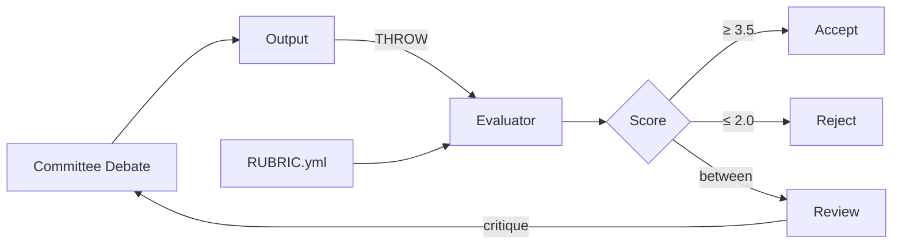

# Rubric

> *"What gets measured gets managed."*

Explicit criteria with weights translate qualitative debate into defensible scores.

## Rubric Structure

```yaml
rubric:
  id: client-evaluation-v1
  name: "Client Engagement Rubric"
  version: 1.0
  
  criteria:
    resource_efficiency:
      weight: 0.20
      scale: [1, 2, 3, 4, 5]
      description: "How well does this fit our current capacity?"
      anchors:
        5: "Perfect fit, no adjustments needed"
        4: "Good fit, minor adjustments"
        3: "Manageable, some reallocation"
        2: "Difficult, significant changes"
        1: "Would overwhelm current capacity"
        
    risk_level:
      weight: 0.30
      scale: [1, 2, 3, 4, 5]
      description: "What's the risk profile?"
      anchors:
        5: "Minimal risk, strong track record"
        4: "Low risk, minor concerns"
        3: "Moderate risk, manageable"
        2: "Elevated risk, needs mitigation"
        1: "High risk, major red flags"
        
    strategic_alignment:
      weight: 0.25
      scale: [1, 2, 3, 4, 5]
      description: "Does this advance our strategic goals?"
      anchors:
        5: "Core to our strategy"
        4: "Strongly aligned"
        3: "Compatible"
        2: "Tangential"
        1: "Misaligned"
        
    stakeholder_impact:
      weight: 0.25
      scale: [1, 2, 3, 4, 5]
      description: "How does this affect our stakeholders?"
      anchors:
        5: "Benefits all stakeholders"
        4: "Benefits most, neutral for others"
        3: "Mixed impact"
        2: "Some stakeholders harmed"
        1: "Significant negative impact"
        
  thresholds:
    accept: 3.5
    reject: 2.0
    review: [2.0, 3.5]  # Between reject and accept
```

## Scoring

```yaml
evaluation:
  rubric: client-evaluation-v1
  subject: "Client X Engagement"
  evaluator: independent  # No debate context
  
  scores:
    resource_efficiency:
      score: 4
      rationale: "Good capacity fit, minor timeline adjustment"
      
    risk_level:
      score: 2
      rationale: "Scope creep history is concerning"
      
    strategic_alignment:
      score: 4
      rationale: "Aligns with growth goals"
      
    stakeholder_impact:
      score: 3
      rationale: "Positive for team growth, stress for some"
      
  weighted_total: 3.15  # Below accept threshold
  
  recommendation: review
  
  critique: |
    Risk score of 2 dragging down overall.
    If risk can be mitigated (milestone billing, scope boundaries),
    score could reach 3.55 (accept).
    
    Suggestion: Revise proposal with explicit risk mitigation.
```

## Calculation

```
weighted_total = Σ (criterion_weight × criterion_score)

Example:
  resource_efficiency: 0.20 × 4 = 0.80
  risk_level:          0.30 × 2 = 0.60
  strategic_alignment: 0.25 × 4 = 1.00
  stakeholder_impact:  0.25 × 3 = 0.75
  
  total = 0.80 + 0.60 + 1.00 + 0.75 = 3.15
```

## Rubric Evolution

Rubrics improve over time:

```yaml
rubric_history:
  - version: 1.0
    date: "2025-06-01"
    note: "Initial version"
    
  - version: 1.1
    date: "2025-09-15"
    changes:
      - "Added 'stakeholder_impact' criterion"
      - "Reweighted risk from 0.35 to 0.30"
    reason: "Post-mortem showed we missed stakeholder effects"
    
  - version: 1.2
    date: "2026-01-05"
    changes:
      - "Refined risk anchors for scope creep"
    reason: "Client X evaluation revealed gap"
```

## Domain-Specific Rubrics

```yaml
# rubrics/code-review-rubric.yml
rubric:
  id: code-review-v1
  criteria:
    correctness: { weight: 0.30 }
    readability: { weight: 0.20 }
    maintainability: { weight: 0.20 }
    performance: { weight: 0.15 }
    test_coverage: { weight: 0.15 }

# rubrics/hiring-rubric.yml
rubric:
  id: hiring-v1
  criteria:
    technical_skills: { weight: 0.30 }
    collaboration: { weight: 0.25 }
    growth_potential: { weight: 0.20 }
    culture_add: { weight: 0.15 }
    communication: { weight: 0.10 }
```

## Commands

| Command | Action |
|---------|--------|
| `DEFINE RUBRIC [name]` | Create new rubric |
| `SCORE [subject] AGAINST [rubric]` | Evaluate against criteria |
| `COMPARE [a] [b] USING [rubric]` | Side-by-side evaluation |
| `REVISE RUBRIC [changes]` | Update rubric version |

## Integration


