# Scratchpad

> *Working memory for thinking out loud.*

The simplest skill. Just a place to write.

> [!TIP]
> **The PLAY surface.** Not everything needs structure. Sometimes just write.

---

## What This Is

A file where you can:
- Think through problems
- Draft before committing
- Store intermediate results
- Keep notes that don't belong elsewhere

No structure required. Just write.

---

## When to Use

- Exploring an idea before formalizing
- Working through a multi-step calculation
- Drafting text before placing it
- Temporary storage during complex tasks

---

## Structure

```
scratchpad/
├── SCRATCHPAD.md    # Main scratch area
└── archive/         # Old scratches (optional)
```

That's it. Minimal by design.

---

## Philosophy

> **"The simplest tool is often the most useful."**

Not everything needs structure. Sometimes you just need a place to write freely.

---

## Contents

| File | Purpose |
|------|---------|
| [SKILL.md](./SKILL.md) | Protocol documentation |
| [scratch.md.tmpl](./scratch.md.tmpl) | Scratchpad template |

---

## The Intertwingularity

Scratchpad is the PLAY stage — think freely before structuring.

```mermaid
graph LR
    SP[📝 scratchpad] -->|PLAY stage| PLL[🎮📚🚀 play-learn-lift]
    SP -->|structures into| PL[🗂️ planning]
    SP -->|structures into| RN[📓 research-notebook]
    
    PLL -->|freeform in| SP
```



---

## Dovetails With

### Sister Skills
| Skill | Relationship |
|-------|--------------|
| [play-learn-lift/](../play-learn-lift/) | Scratchpad IS the PLAY surface |
| [planning/](../planning/) | When you need structure |
| [research-notebook/](../research-notebook/) | For organized investigation |
| [session-log/](../session-log/) | Scratchpad is NOT logged (ephemeral) |

### Protocol Symbols
| Symbol | Link |
|--------|------|
| `PLAY-LEARN-LIFT` | [PROTOCOLS.yml](../../PROTOCOLS.yml#PLAY-LEARN-LIFT) |
| `IMPROVISE` | [PROTOCOLS.yml](../../PROTOCOLS.yml#IMPROVISE) — Write before structuring |

### Navigation
| Direction | Destination |
|-----------|-------------|
| ⬆️ Up | [skills/](../) |
| ⬆️⬆️ Root | [Project Root](../../) |
| 🗂️ Sister | [planning/](../planning/) |
| 📓 Sister | [research-notebook/](../research-notebook/) |
