# Self Repair

> **Missing state triggers repair, not failure.**

Checklist-based self-healing demons.

> [!IMPORTANT]
> **NEVER-CRASH** — The core principle. Repair instead of fail. Always.

## The Principle

When something's wrong:
1. **Detect** — Checklist finds missing/invalid state
2. **Repair** — Demon creates/fixes what's needed
3. **Log** — Document what was repaired
4. **Continue** — Never crash, always converge

## Contents

| File | Purpose |
|------|---------|
| [SKILL.md](./SKILL.md) | Full protocol documentation |
| [CHECKLIST.yml.tmpl](./CHECKLIST.yml.tmpl) | Checklist template |

## Repair Demons

| Demon | Watches For |
|-------|-------------|
| `checklist_repairer` | Missing canonical files |
| `sticky_note_maintainer` | Missing sidecar metadata |
| `membrane_keeper` | Files outside boundaries |

## The Intertwingularity

Self-repair is the immune system. It monitors everything.

```mermaid
graph LR
    SR[🔧 self-repair] -->|monitors| SL[📜 session-log]
    SR -->|monitors| WS[working-set.yml]
    SR -->|creates| HOT[hot.yml / cold.yml]
    SR -->|repairs| FILES[missing files]
    
    SR -->|part of| KERNEL[kernel/self-healing]
```

---

## Dovetails With

### Sister Skills
| Skill | Relationship |
|-------|--------------|
| [session-log/](../session-log/) | Self-repair monitors log integrity |
| [summarize/](../summarize/) | Triggered when context exceeds budget |
| [honest-forget/](../honest-forget/) | Graceful memory decay |

### Protocol Symbols
| Symbol | Link |
|--------|------|
| `NEVER-CRASH` | [PROTOCOLS.yml](../../PROTOCOLS.yml#NEVER-CRASH) |
| `REPAIR-DEMON` | [PROTOCOLS.yml](../../PROTOCOLS.yml#REPAIR-DEMON) |
| `ROBUST-FIRST` | [PROTOCOLS.yml](../../PROTOCOLS.yml#ROBUST-FIRST) |
| `BEST-EFFORT` | [PROTOCOLS.yml](../../PROTOCOLS.yml#BEST-EFFORT) |

### Kernel
- [kernel/self-healing-protocol.md](../../kernel/self-healing-protocol.md) — Full specification
- [schemas/agent-directory-schema.yml](../../schemas/agent-directory-schema.yml) — What gets repaired

### Navigation
| Direction | Destination |
|-----------|-------------|
| ⬆️ Up | [skills/](../) |
| ⬆️⬆️ Root | [Project Root](../../) |
| 📜 Sister | [session-log/](../session-log/) |