# Session Log

> **Human-readable markdown log with embedded YAML.**

Append-only audit trail that humans can actually read.

> [!IMPORTANT]
> **APPEND-ONLY.** Never modify, never delete. The audit trail is sacred.

## Format

Each entry is a markdown heading with an embedded YAML block:

```yaml
# Entry structure:
#
# ## 12:00:05 — Tool Call: fs.read
#
# Reading parser to understand recursive descent.
#
# ```yaml
# type: tool_call
# tool: fs.read
# args:
#   path: src/parser.ts
#   why: "Check implementation"  # Intent is explicit
# ```
```

See [session-log.md.tmpl](./session-log.md.tmpl) for full format.

## Why Markdown + YAML?

| Feature | Benefit |
|---------|---------|
| **Human readable** | Easy to scan and understand |
| **Machine parseable** | YAML blocks can be extracted |
| **Semantic comments** | YAML Jazz in action |
| **Append-only** | Naturally supports audit |

## Contents

| File | Purpose |
|------|---------|
| [SKILL.md](./SKILL.md) | Full protocol documentation |
| [SESSION.yml.tmpl](./SESSION.yml.tmpl) | Session template |
| [session-log.md.tmpl](./session-log.md.tmpl) | Log template |

## The Intertwingularity

Session-log is the PLAY stage of [play-learn-lift](../play-learn-lift/) — capture everything.

```mermaid
graph LR
    SL[📜 session-log] -->|PLAY stage of| PLL[🎮 play-learn-lift]
    SL -->|tracks| R[🚪 room]
    SL -->|tracks| TC[🎴 card]
    SL -->|monitored by| SR[🔧 self-repair]
    
    AP[⚔️ adventure] -->|LOG.md is| SL
    DB[🔧 debugging] -->|logs to| SL
```



---

## Dovetails With

### Sister Skills
| Skill | Relationship |
|-------|--------------|
| [play-learn-lift/](../play-learn-lift/) | Session-log is the PLAY capture stage |
| [summarize/](../summarize/) | Compress session-log when too long |
| [self-repair/](../self-repair/) | Monitors session-log integrity |
| [adventure/](../adventure/) | Adventure LOG.md is session-log variant |
| [debugging/](../debugging/) | Debug sessions log here |

### Protocol Symbols
| Symbol | Link |
|--------|------|
| `SESSION-LOG` | [PROTOCOLS.yml](../../PROTOCOLS.yml#SESSION-LOG) |
| `APPEND-ONLY` | [PROTOCOLS.yml](../../PROTOCOLS.yml#APPEND-ONLY) |
| `AUDIT-TRAIL` | [PROTOCOLS.yml](../../PROTOCOLS.yml#AUDIT-TRAIL) |

### Kernel
- [kernel/event-logging-protocol.md](../../kernel/event-logging-protocol.md) — Full specification
- [schemas/event-schema.yml](../../schemas/event-schema.yml) — YAML block schema

### Navigation
| Direction | Destination |
|-----------|-------------|
| ⬆️ Up | [skills/](../) |
| ⬆️⬆️ Root | [Project Root](../../) |
| 🎮 Sister | [play-learn-lift/](../play-learn-lift/) |