# Sister Script

> **Document-first development. Automate only what's proven.**

The document is the source of truth. Scripts are its children.

> [!TIP]
> **LIFT stage of [play-learn-lift](../play-learn-lift/).** Proven procedures become automation.

## The Pattern

```mermaid
graph TD
    D[📄 Document] -->|manual test| C[💻 Commands]
    C -->|document| P[📋 Procedure]
    P -->|automate| S[🤖 Sister Script]
    S -->|improve| D
```

1. Start with natural language (PLAY)
2. Add manual commands (PLAY/LEARN)  
3. Document working procedures (LEARN)
4. Generate automation (LIFT)

## Bidirectional Evolution

- Document → Script: Proven procedures become automated
- Script → Document: Automation insights improve docs

## Contents

| File | Purpose |
|------|---------|
| [SKILL.md](./SKILL.md) | Full methodology documentation |
| [PROTOTYPE.yml](./PROTOTYPE.yml) | Machine-readable definition |
| [template/](./template/) | Templates for sister relationships |

## The Intertwingularity

Sister-script is the LIFT stage of [play-learn-lift](../play-learn-lift/) — automate proven patterns.

```mermaid
graph LR
    SS[👯 sister-script] -->|LIFT stage of| PLL[🎮📚🚀 play-learn-lift]
    SS -->|automates| DOC[📄 documents]
    SS -->|produces| CODE[🤖 scripts]
    
    RN[📓 research-notebook] -->|feeds| SS
    SL[📜 session-log] -->|source for| SS
```

---

## Dovetails With

### Sister Skills
| Skill | Relationship |
|-------|--------------|
| [play-learn-lift/](../play-learn-lift/) | Sister-script IS the LIFT stage |
| [session-log/](../session-log/) | Source material for patterns |
| [research-notebook/](../research-notebook/) | Documented procedures |
| [plan-then-execute/](../plan-then-execute/) | Scripts can become plans |

### Protocol Symbols
| Symbol | Link |
|--------|------|
| `SISTER-SCRIPT` | [PROTOCOLS.yml](../../PROTOCOLS.yml#SISTER-SCRIPT) |
| `BUILD-COMMAND` | [PROTOCOLS.yml](../../PROTOCOLS.yml#BUILD-COMMAND) |
| `PLAY-LEARN-LIFT` | [PROTOCOLS.yml](../../PROTOCOLS.yml#PLAY-LEARN-LIFT) |

### Navigation
| Direction | Destination |
|-----------|-------------|
| ⬆️ Up | [skills/](../) |
| ⬆️⬆️ Root | [Project Root](../../) |
| 🎮 Sister | [play-learn-lift/](../play-learn-lift/) |
