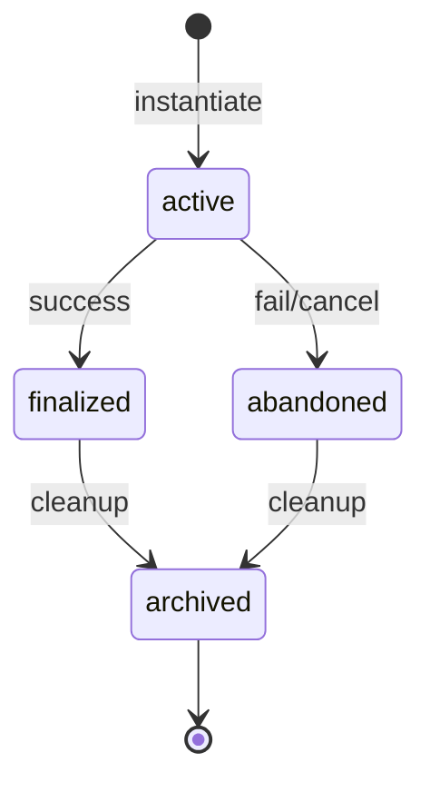

# Skill Instantiation Protocol (SIP)
## Running Skills as Activation Records

---

## 1. Overview

A skill is a **prototype** — a template for doing a specific type of work.
An instance is an **activation record** — a workspace for actually doing it.

```
Skill (prototype) → Instance (activation record) → Result
```

This mirrors function calls:
- Calling a function = instantiating a skill
- Local variables = instance files
- Return value = RESULT.md
- Stack frame = instance directory

---

## 2. Skill Prototype Structure

```
.skills/
  <skill-name>/
    SKILL.md              # Human-readable protocol description
    PROTOTYPE.yml         # Machine-readable metadata
    
    template/             # Copied to instance on instantiation
      TASK.yml.tmpl       # Task definition (template)
      CHECKLIST.md        # Steps to follow
      working-set.yml     # Initial context manifest
      overrides/          # Instance-specific files go here
      state/              # Runtime state
      
    examples/             # Usage examples
      simple/
      complex/
      
    tests/                # Validation
```

---

## 3. SKILL.md Format

```markdown
# Skill Name

## Purpose
One-paragraph description of what this skill does.

## When to Use
- Situation 1
- Situation 2

## Prerequisites
- Required tools
- Required other skills

## Protocol

### Step 1: Initialize
Do X...

### Step 2: Execute  
Do Y...

### Step 3: Finalize
Do Z...

## Inputs
- TASK.yml: Task specification

## Outputs
- RESULT.md: What was accomplished
- RETURN.md: Compact output for parent context

## Examples
See examples/ directory.

## Tips
- Tip 1
- Tip 2
```

---

## 4. PROTOTYPE.yml Format

```yaml
# PROTOTYPE.yml
name: "skill-name"
description: "One-line description"

# NO VERSIONS — there is only one self-consistent universe.
# Git provides history if you need archaeology.

author: "creator"
created: "2025-12-30"

tier: 1  # 0=prompt, 1=file, 2=search, 3=exec, 4=external

tools_required:
  - fs.read
  - fs.write
  - search.vector  # if tier >= 2

dependencies:
  skills: []       # Other skills this requires
  
tags:
  - "category"
  - "type"

instantiation:
  template_dir: "template/"
  task_template: "TASK.yml.tmpl"
  
outputs:
  result: "RESULT.md"
  return: "RETURN.md"
```

---

## 5. Instantiation Process

### Step 1: Create Instance Directory

```
.agent/sessions/<session-id>/instances/<skill>-NNNN/
```

Naming convention:
- `<skill>` = prototype name
- `NNNN` = sequence number (0001, 0002, ...)

### Step 2: Copy Template

```yaml
# Copy everything from template/
copy:
  from: ".skills/<skill>/template/"
  to: ".agent/sessions/.../instances/<skill>-NNNN/"
```

### Step 3: Render Templates

Files ending in `.tmpl` are templates with placeholders:

```yaml
# TASK.yml.tmpl
task:
  name: "{{task_name}}"
  description: "{{description}}"
  created: "{{timestamp}}"
  parameters:
    # ...
```

Render to concrete files:
```yaml
# TASK.yml (rendered)
task:
  name: "Analyze user data"
  description: "Find patterns in the dataset"
  created: "2025-12-30T12:30:00Z"
  parameters:
    # ...
```

### Step 4: Write Instance Metadata

```yaml
# INSTANCE.yml
instance_id: "data-analysis-0003"
prototype:
  name: "data-analysis"
  path: ".skills/data-analysis"
# NO VERSIONS — there is only one self-consistent universe
  
created: "2025-12-30T12:30:00Z"
status: "active"  # active | finalized | abandoned | archived

parent_instance: null  # or path to parent if nested
```

### Step 5: Write Prototypes Reference

```yaml
# PROTOTYPES.yml (for DOP compatibility)
prototypes:
  - path: ".skills/data-analysis"
    # NO VERSIONS — git provides history
resolution:
  strategy: "first-match-wins"
```

### Step 6: Log Instantiation

```jsonl
{"type":"skill_instantiate","skill":"data-analysis","version":"0.1.0","instance":"data-analysis-0003","timestamp":"..."}
```

---

## 6. Instance Lifecycle



### Status Transitions

| From | To | Trigger |
|------|----|---------|
| active | finalized | Task completed successfully |
| active | abandoned | Task failed or cancelled |
| finalized | archived | Manual or automatic cleanup |
| abandoned | archived | Manual or automatic cleanup |

---

## 7. Finalization

When the skill completes successfully:

### Write RESULT.md

```markdown
# Result: Data Analysis

## Summary
Successfully analyzed the user dataset.

## Findings
1. 10,432 records processed
2. 15% missing email values
3. Revenue peaked in Q3

## Artifacts Produced
- `artifacts/analysis.json`
- `artifacts/chart.png`

## Decisions Made
- Used median imputation for missing values
- Excluded records before 2023

## Time Spent
- Started: 2025-12-30T12:30:00Z
- Finished: 2025-12-30T12:45:00Z
- Duration: 15 minutes
```

### Write RETURN.md

Compact output for parent context:

```markdown
# Return: Data Analysis

10,432 records analyzed. Key finding: 15% missing emails, Q3 revenue peak.

Artifacts: `analysis.json`, `chart.png`
```

### Update INSTANCE.yml

```yaml
status: "finalized"
finalized_at: "2025-12-30T12:45:00Z"
```

### Log Finalization

```jsonl
{"type":"skill_finalize","instance":"data-analysis-0003","status":"finalized","duration_ms":900000,"timestamp":"..."}
```

---

## 8. Nested Instances (Sub-calls)

Instances can spawn sub-instances:

```
instances/
  main-task-0001/
    INSTANCE.yml
    subcalls/
      helper-0001/     # Child instance
        INSTANCE.yml
        RETURN.md      # Parent reads this
      helper-0002/
```

### Parent-Child Communication

1. Parent instantiates child skill
2. Child runs independently
3. Child writes RETURN.md
4. Parent reads RETURN.md
5. Parent continues

```yaml
# In parent's INSTANCE.yml
children:
  - instance_id: "helper-0001"
    skill: "data-helper"
    status: "finalized"
    return_path: "subcalls/helper-0001/RETURN.md"
```

---

## 9. Abandonment

When a skill fails or is cancelled:

```yaml
# INSTANCE.yml
status: "abandoned"
abandoned_at: "2025-12-30T12:40:00Z"
reason: "User cancelled"
```

Still write RESULT.md (as a postmortem):

```markdown
# Result: Data Analysis (ABANDONED)

## What Happened
Task cancelled by user at step 3 (analysis phase).

## Progress Made
- Data loaded successfully
- Preprocessing complete
- Analysis started but not finished

## State Preserved
- `state/partial_results.json` contains progress

## Lessons
- Dataset larger than expected
- Should have chunked the analysis
```

---

## 10. Garbage Collection

Old instances can be cleaned up:

```yaml
gc_policy:
  finalized:
    keep_result: true
    keep_return: true
    delete_artifacts_after: "7d"
    delete_instance_after: "30d"
    
  abandoned:
    keep_result: true
    delete_artifacts_after: "1d"
    delete_instance_after: "7d"
```

Always keep:
- RESULT.md (for history)
- RETURN.md (for integration)
- INSTANCE.yml (for metadata)

---

## 11. Skill Registry

```yaml
# .skills/INDEX.yml
skills:
  - name: "data-analysis"
    path: ".skills/data-analysis"
    description: "Analyze datasets and produce insights"
    tier: 2
    
  - name: "code-review"
    path: ".skills/code-review"
    description: "Review code for quality and issues"
    # NO VERSIONS — the current state IS the state
    tier: 1
```

---

## 12. Dovetails With

- **Delegation Object Protocol (DOP)**: Skills can delegate
- **Constitution**: Skills follow constitution rules
- **Memory Management**: Instances affect working set
- **Event Logging**: Skill events logged
- **MOOLLM Rooms**: Rooms can instantiate skills
- **MOOLLM Trading Cards**: Cards can invoke skills

---

*Skills are prototypes.*
*Instances are activation records.*
*The filesystem is the call stack.*
