# 🐍 Sniffable Python

> *"You're looking at the first 50 lines of a Python script. But what you're really looking at is the answer to a question nobody thought to ask — until now."*

## MOOLLM K-Lines

| K-Line | Why Related |
|--------|-------------|
| [moollm/](../moollm/) | Core MOOLLM principle |
| [sister-script/](../sister-script/) | Sniffable Python IS the sister-script format |
| [play-learn-lift/](../play-learn-lift/) | LIFT produces sniffable automation |
| [yaml-jazz/](../yaml-jazz/) | Comments carry meaning (applied to Python) |
| [plain-text/](../plain-text/) | Scripts are first-class objects |
| [postel/](../postel/) | Liberal input, conservative output |
| [adventure/](../adventure/) | Linter feedback loop in action |
| [debugging/](../debugging/) | Sniffable code aids debugging |

---

## The Connection

In January 2000, Steve Jobs stood on stage at Macworld and said something strange about buttons.

> *"We made the buttons on the screen look so good you'll want to lick them."*

He was unveiling Aqua, the interface for Mac OS X. Those translucent droplets, those candy-colored icons — Jobs understood that interfaces aren't just functional. They're **invitations**. The visual quality signals that someone cared, that this is worth exploring.

Now hold that thought.

---

Meanwhile, in the dark corners of the internet, a different philosophy was taking hold.

**Perl.**

Larry Wall's "practical extraction and report language" had become the duct tape of the early web. But Perl had a philosophy too: TMTOWTDI. "There's More Than One Way To Do It." And boy, did people find ways. Sigils everywhere. `$_` as an implicit variable. Regular expressions that looked like line noise. One-liners so dense they could collapse into singularities.

```perl
@_ = map { tr/a-z/n-za-m/r } @ARGV; print "@_\n";
```

*Beautiful*, thought the Perl hackers.

*What is that*, thought everyone else.

---

And THAT brings us to the present.

Every few months, someone invents a new programming language "optimized for LLMs." Dense symbols. Compressed syntax. Fewer tokens means more fits in context, right?

But here's the thing they miss.

**The LLM already knows Python.**

Not just knows it — has consumed **billions** of lines of it. Stack Overflow discussions. GitHub repos. Documentation. Tutorials. The model has internalized Python the way you've internalized English. Zero tokens to teach it.

A novel syntax? The LLM has never seen it. You'd need to stuff the manual, the tutorials, the examples, the compiler source — into every single prompt. And prompting is not training. LLMs have no memory. You pay that documentation cost **every single time**.

The Perl philosophy of dense, clever syntax was the wrong optimization in 1998. It's an even worse optimization when your reader is a statistical model trained on readable code.

---

So what's the right optimization?

**Structure.**

Not new syntax. Structured *existing* syntax.

And THAT's where Steve Jobs' buttons become relevant.

You see, programming languages are user interfaces. The users are humans... *and now LLMs*. Jobs understood that visual design signals quality — it draws you in, it says "this is worth exploring." 

What's the equivalent for code?

**The first 50 lines.**

If an LLM can read your header — the docstring, the imports, the CLI structure — and understand what your tool does, what commands it offers, what arguments it takes... you've created **lickable code**.

Well, sniffable code. Let's not make it weird.

---

## The Pattern

```python
#!/usr/bin/env python3
"""adventure-lint: Validate adventure world consistency.

Scans adventure directories for ROOM.yml, objects, and characters.
Reports errors, warnings, and suggestions.

Usage:
    python adventure-lint.py lint examples/adventure-4/
    python adventure-lint.py check pub/ROOM.yml
"""

import argparse
from pathlib import Path
import yaml

REQUIRED_FIELDS = ["name", "description", "exits"]  # rooms need these
MAX_EXIT_DEPTH = 10  # prevent infinite loops

def main():
    """CLI structure — sniff this to understand the tool."""
    parser = argparse.ArgumentParser(
        description=__doc__.split('\n')[0],
        formatter_class=argparse.RawDescriptionHelpFormatter
    )
    subparsers = parser.add_subparsers(dest="command", required=True)
    
    # lint command
    lint_parser = subparsers.add_parser("lint", help="Lint entire adventure")
    lint_parser.add_argument("adventure_path", type=Path)
    lint_parser.add_argument("--output", "-o", type=Path, default="LINTER.yml")
    lint_parser.add_argument("--fix", action="store_true", help="Auto-fix issues")
    
    # check command
    check_parser = subparsers.add_parser("check", help="Check single file")
    check_parser.add_argument("file", type=Path)
    
    args = parser.parse_args()
    _dispatch(args)

# Implementation below — the LLM doesn't need to read past here
```

The LLM reads `main()` and knows everything:
- Two commands: `lint` and `check`
- `lint` takes a path, outputs to LINTER.yml, can auto-fix
- `check` validates a single file

**One sniff. Full comprehension.** No spelunking through 500 lines of implementation.

---

## The Feedback Loop

But here's where it gets really interesting.

In [adventure-4/](../../examples/adventure-4/), there's a complete world — rooms, objects, characters, a pub with a stage and an arcade and a cat cave that's bigger on the inside. The world is defined in YAML files. Lots of them.

How do you know if it's consistent? If exits go somewhere? If rooms have the required fields?

**You build a linter.** A sniffable Python script.

The LLM sniffs the linter's header → understands the CLI → runs it → reads the output:

```yaml
# LINTER.yml
summary:
  rooms_found: 36
  objects_found: 37
  errors: 8
  warnings: 36
```

Then fixes the errors. And runs the linter again.

```mermaid
flowchart TD
    GEN[🎨 LLM generates content] --> LINT[🔍 Linter validates]
    LINT --> OUTPUT[📄 LINTER.yml]
    OUTPUT --> READ[🧠 LLM reads output]
    READ --> FIX[🔧 LLM fixes issues]
    FIX --> GEN
    
    style GEN fill:#e8f5e9
    style OUTPUT fill:#fff3e0
    style FIX fill:#e3f2fd
```



**Python for precision. LLM for poetry.**

The linter handles the boring stuff — checking if exits resolve, if required fields exist. The LLM handles the creative stuff — writing atmospheric descriptions, giving characters personality, making the pub feel like somewhere you'd actually want to drink,
generating python and javascript code for the runtime simulation engines (so you can play in a web browser without an llm).

And THAT's what sniffable Python makes possible. The LLM can understand the tool by reading it. Can use the tool by invoking it. Can interpret the output by parsing it.

No new syntax required. Just structure.

---

## The Connections

Now here's where James Burke would start walking faster and gesturing at unexpected things.

Remember PLAY-LEARN-LIFT? The methodology?

- **PLAY:** You mess around. Try things. Log what works.
- **LEARN:** Patterns emerge. You document procedures.
- **LIFT:** You automate. Generate scripts.

What format should those scripts take?

**Sniffable Python.**

Because the LIFT stage isn't just for you. It's for future-you. For your team. For *the LLM that's going to use your tools*.

```mermaid
flowchart LR
    subgraph PLAY["🎮 PLAY"]
        P1[Try things] --> P2[session-log.md]
    end
    
    subgraph LEARN["📚 LEARN"]
        L1[Document patterns] --> L2[PROCEDURE.md]
    end
    
    subgraph LIFT["🚀 LIFT"]
        LI1[Automate] --> LI2[sister-script.py]
        LI2 --> LI3[SNIFFABLE PYTHON]
    end
    
    PLAY --> LEARN --> LIFT
    
    LI3 --> SNIFF[🐍 LLM sniffs it]
    SNIFF --> USE[⚡ LLM uses it]
    USE --> IMPROVE[✨ LLM improves it]
    IMPROVE -.-> PLAY
    
    style PLAY fill:#c8e6c9
    style LEARN fill:#bbdefb
    style LIFT fill:#ffccbc
```



---

And the [skill/](../skill/) skill — the meta-skill that explains how skills work?

It says skills are **factories**. They generate instances. And when a skill generates a CLI tool, that tool should be sniffable. Because skills teach LLMs how to build things, and LLMs need to understand the tools they create.

---

And [yaml-jazz/](../yaml-jazz/) — the principle that comments carry meaning?

It applies to Python too. Those inline comments next to constants? The LLM reads them.

```python
TIMEOUT = 30  # generous — API flaky on Mondays
```

That's not documentation for humans. Well, it is. But it's *also* context for the model. The comment is data.

---

And the [adventure/](../adventure/) skill — the text adventure framework?

It needs a linter. That linter needs to be sniffable. The feedback loop needs to work. And now you see how adventure-4 grew 36 rooms and 37 objects and characters with opinions about cheese — because the LLM could generate content, validate it, fix it, and iterate.

---

## Everything Connects

```mermaid
flowchart TD
    CONST[🏗️ constructionism<br/>build to learn]
    
    CONST --> PLL
    CONST --> SNIFF
    CONST --> YAML
    
    PLL[🎮📚🚀 play-learn-lift] <--> SNIFF[🐍 SNIFFABLE PYTHON]
    SNIFF <--> YAML[🎷 yaml-jazz<br/>comments as data]
    
    PLL --> SS[👯 sister-script]
    SNIFF --> SKILL[🏭 skill<br/>factory]
    SNIFF --> ADV[🎲 adventure<br/>linter feedback]
    
    style SNIFF fill:#ffeb3b,stroke:#f57f17,stroke-width:3px
    style CONST fill:#e1bee7
    style PLL fill:#c8e6c9
    style YAML fill:#bbdefb
    style SS fill:#ffe0b2
    style SKILL fill:#f8bbd9
    style ADV fill:#b2dfdb
```



Steve Jobs made buttons you wanted to lick ("lickable pixels").

We make code you can sniff ("sniffable python").

Perl made syntax a badge of honor. We make structure a source of truth.

Novel syntax compresses the wrong thing. Sniffable code structures the right thing.

And THAT's how Steve Job's comment about pixels in 2000 connects to a linter output in 2026 connects to a pub in a text adventure that has a cat cave that's bigger on the inside.

*Everything is connected.*

---

## Live Examples

See the pattern in the wild:

| Object | Location | What Makes It Sniffable |
|--------|----------|------------------------|
| **TomTomagotchi** | [kitchen/tomtomagotchi.yml](../../examples/adventure-4/kitchen/tomtomagotchi.yml) | Every ability has usage examples |
| **The Pub** | [pub/ROOM.yml](../../examples/adventure-4/pub/ROOM.yml) | Framing protocol in comments |
| **Linter Output** | [LINTER.yml](../../examples/adventure-4/LINTER.yml) | Structured for LLM consumption |

---

## Quick Links

- [SKILL.md](./SKILL.md) — Full specification
- [CARD.yml](./CARD.yml) — Machine-readable interface
- [TEMPLATE.py.tmpl](./TEMPLATE.py.tmpl) — Starter template

---

*"The LLM doesn't need fewer tokens of unfamiliar syntax. It needs familiar syntax, structured for fast comprehension."*

*Good code doesn't just avoid bad smells — it has a bouquet that invites exploration.*

*And THAT's the connection.*
