# Soul Chat

> **"Everything is alive. Everything can speak."**

"YAML Jazz" and "Markup With Typed Code Blocks" dialogues between characters, objects, rooms, documents, concepts—anything with a soul.

> [!TIP]
> **Give anything a voice.** Characters, concepts, documents, rooms — if it exists, it can speak.

## What This Is

A skill for creating conversations where the **structure carries meaning** beyond the words. Not just characters talking—documents can talk to documents, rooms can welcome visitors, concepts can explain themselves.

**Prefer Markdown format** — more human readable, can embed any typed code block:

```markdown
## The Gardener

I've been tending these patterns for a while now.

```yaml
observation:
  pattern: "Files cluster by prefix"
  confidence: high
  # This YAML block is data I'm sharing
```

What do you think, Archivist?

## The Archivist

Fascinating! Let me add some context:

```json
{"related_patterns": ["big-endian", "prefix-ownership"]}
```
```

## Contents

| File | Purpose |
|------|---------|
| [SKILL.md](./SKILL.md) | Full protocol documentation |
| [PROTOTYPE.yml](./PROTOTYPE.yml) | Machine-readable skill definition |
| [template/](./template/) | Templates for creating new chats |

## Quick Start

Chats live **OUTSIDE** this directory (per [ABOUT-NOT-INSIDE](../../PROTOCOLS.yml)).

**Use Markdown format** — `.md` not `.yml`:

```markdown
# yaml-jazz-symposium.md

A conversation about the nature of YAML Jazz.

---

## YAML-JAZZ (concept)

I am the principle that comments carry meaning.
Structure is semantic, not just syntactic.

```yaml
# See? This comment IS semantic.
example:
  field: value
  # This explains why field exists
```

## A Skeptic (character)

But parsers strip comments!

## YAML-JAZZ

LLMs read comments. Humans read comments.
The parser is not the only reader.
```

## Entity Types

| Type | Voice | Example |
|------|-------|---------|
| `character` | First person, personality | The Gardener |
| `document` | "I contain..." | README.md |
| `room` | "I hold..." | skills/ |
| `object` | "I do..." | fs.read tool |
| `concept` | "I am the principle..." | YAML-JAZZ |
| `bot` | "I watch for..." | repair-demon |

## The Intertwingularity

Everything speaks. Everything is connected.

```mermaid
graph LR
    SC[💬 soul-chat] -->|voices| TC[🎴 trading-card]
    SC -->|voices| R[🚪 room]
    SC -->|voices| DOC[📄 documents]
    SC -->|voices| CON[💡 concepts]
    
    TC -->|has voice via| SC
    R -->|welcomes via| SC
```



---

## Dovetails With

### Sister Skills
| Skill | Relationship |
|-------|--------------|
| [trading-card/](../trading-card/) | Cards **speak** through soul-chat. Hero-kliks have voice. |
| [room/](../room/) | Rooms can **welcome visitors**, have personality |
| [memory-palace/](../memory-palace/) | Rooms in palace can speak, guide navigation |
| [adventure-protocol/](../adventure-protocol/) | NPCs and environments speak |

### Protocol Symbols
| Symbol | Link |
|--------|------|
| `SOUL-CHAT` | [PROTOCOLS.yml](../../PROTOCOLS.yml#SOUL-CHAT) |
| `YAML-JAZZ` | [PROTOCOLS.yml](../../PROTOCOLS.yml#YAML-JAZZ) — Comments carry meaning |
| `ABOUT-NOT-INSIDE` | [PROTOCOLS.yml](../../PROTOCOLS.yml#ABOUT-NOT-INSIDE) — Chat files live outside |
| `BIG-ENDIAN` | [PROTOCOLS.yml](../../PROTOCOLS.yml#BIG-ENDIAN) — Naming conventions |

### Kernel
- [kernel/NAMING.yml](../../kernel/NAMING.yml) — How to name chat files

### Navigation
| Direction | Destination |
|-----------|-------------|
| ⬆️ Up | [skills/](../) |
| ⬆️⬆️ Root | [Project Root](../../) |
| 🎴 Sister | [trading-card/](../trading-card/) |
| 🚪 Sister | [room/](../room/) |
