# Summarize

> **Compress without losing truth. Backlink to sources.**

Context compression for memory management.

> [!IMPORTANT]
> **Always backlink.** Every summary points to its source. Never orphan knowledge.

## The Goal

When files are too large for context:
1. **Summarize** — Extract key information
2. **Backlink** — Point to original source
3. **Prioritize** — Hot/cold hints for what matters
4. **Preserve** — Never delete, just compress

## Contents

| File | Purpose |
|------|---------|
| [SKILL.md](./SKILL.md) | Full protocol documentation |
| [SUMMARIES.yml.tmpl](./SUMMARIES.yml.tmpl) | Summary template |

## Example

```yaml
summary:
  source: "designs/original-design.md"
  created: "2025-12-30"
  
  key_points:
    - "Files are state, no hidden memory"
    - "YAML comments carry meaning"
    
  backlink: "../designs/original-design.md"
  full_context_needed_for:
    - "Implementation details"
    - "Edge cases"
```

## The Intertwingularity

Summarize enables the LIFT stage — compress wisdom for sharing.

```mermaid
graph LR
    SUM[📝 summarize] -->|compresses| SL[📜 session-log]
    SUM -->|compresses| RN[📓 research-notebook]
    SUM -->|enables| HF[🌫️ honest-forget]
    SUM -->|part of| PLL[🎮📚🚀 play-learn-lift LIFT]
    
    SR[🔧 self-repair] -->|triggers| SUM
```



---

## Dovetails With

### Sister Skills
| Skill | Relationship |
|-------|--------------|
| [play-learn-lift/](../play-learn-lift/) | Summarize IS LIFT — share wisdom |
| [honest-forget/](../honest-forget/) | Summarize before forgetting |
| [session-log/](../session-log/) | Source material to compress |
| [research-notebook/](../research-notebook/) | Findings to distill |
| [self-repair/](../self-repair/) | Triggers when context exceeds budget |
| [memory-palace/](../memory-palace/) | Place summaries in palace rooms |

### Protocol Symbols
| Symbol | Link |
|--------|------|
| `SUMMARIZE` | [PROTOCOLS.yml](../../PROTOCOLS.yml#SUMMARIZE) |
| `HONEST-FORGET` | [PROTOCOLS.yml](../../PROTOCOLS.yml#HONEST-FORGET) |
| `HOT-COLD` | [PROTOCOLS.yml](../../PROTOCOLS.yml#HOT-COLD) |

### Kernel
- [kernel/memory-management-protocol.md](../../kernel/memory-management-protocol.md) — Full specification

### Navigation
| Direction | Destination |
|-----------|-------------|
| ⬆️ Up | [skills/](../) |
| ⬆️⬆️ Root | [Project Root](../../) |
| 🌫️ Sister | [honest-forget/](../honest-forget/) |
| 🎮 Sister | [play-learn-lift/](../play-learn-lift/) |
